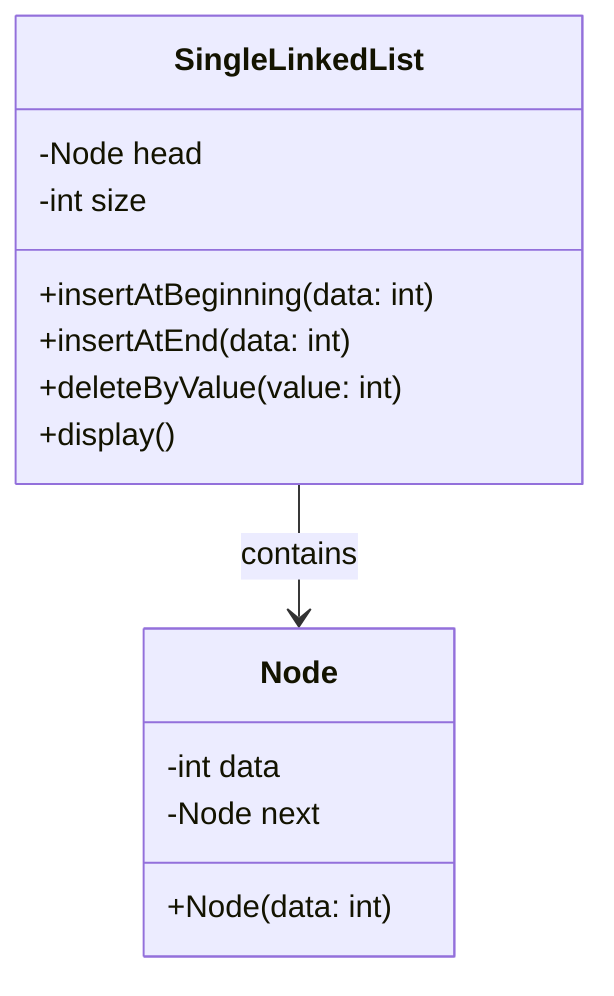
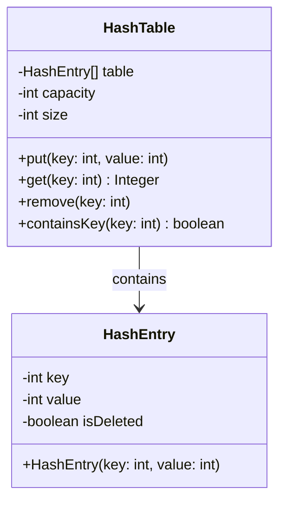

# Analisis dan Evaluasi Modul Struktur Data OOP

Dokumen ini berisi analisis komprehensif terhadap modul-modul pembelajaran Struktur Data dan OOP.

## Daftar Modul yang Dianalisis

| No | Modul | Topik |
|----|-------|-------|
| 01 | module-01.md | Paradigma Pemrograman |
| 02 | module-02.md | Pengenalan Java |
| 03 | module-03.md | Konsep Dasar OOP |
| 04 | module-04.md | Konsep Lanjutan OOP |
| 05 | module-05.md | Class Diagram |
| 06 | module-06.md | Analisis Kompleksitas Struktur Data |
| 07 | module-07.md | Linked List dan Variasinya |
| 08 | module-08.md | Stack dan Queue |
| 09 | module-09.md | Hashing dan Map |

---

## Kelebihan yang Sudah Ada

### 1. Struktur Modul Konsisten
- Setiap modul memiliki daftar isi yang jelas
- Urutan: Teori → Kode → Output → Latihan
- Memudahkan pembaca mengikuti alur pembelajaran

### 2. Pendekatan Dual (Dengan dan Tanpa OOP)
- Setiap struktur data dijelaskan dengan dua pendekatan
- Membantu memahami perbedaan paradigma prosedural vs OOP
- Cocok untuk pembelajaran bertahap

### 3. Kode Lengkap dengan Output
- Setiap contoh kode disertai expected output
- Memudahkan verifikasi hasil eksekusi
- Membantu debugging jika ada masalah

### 4. Visualisasi ASCII Art
- Diagram struktur data menggunakan ASCII
- Tidak memerlukan tools tambahan untuk melihat
- Cocok untuk dokumentasi text-based

### 5. Tabel Kompleksitas
- Setiap modul struktur data memiliki tabel Big O
- Memudahkan perbandingan performa
- Membantu memilih struktur data yang tepat

### 6. Latihan Hands-On
- Setiap modul memiliki latihan praktikum
- Tugas bervariasi dari implementasi hingga problem solving
- Mendorong pembelajaran aktif

---

## Kekurangan dan Area Perbaikan

### 1. Inkonsistensi Bahasa

**Masalah:**
| Modul | Section Header |
|-------|----------------|
| 00-01 | List of Contents (Inggris) |
| 02-03 | List of Contents (Inggris) |
| 04 | Table of Contents (Inggris) |
| 05-08 | Daftar Isi (Indonesia) |

**Saran:**
- Konsistenkan ke satu bahasa (rekomendasi: Bahasa Indonesia)
- Atau gunakan format bilingual yang seragam di semua modul
- Contoh: "Daftar Isi / Table of Contents"

---

### 2. Source Code Tidak Terpisah

**Masalah:**
- Modul 06-09 hanya memiliki kode di dalam file markdown
- Tidak ada file `.java` terpisah di folder `java/`
- Sulit untuk langsung menjalankan dan bereksperimen

**Saran:**
Buat struktur folder yang konsisten:
```
java/
├── 1-oop-car/
│   └── src/
├── 2-linkedlist/
│   └── src/
├── 3-linkedlist-B/
│   └── src/
├── 4-complexity/           <- Perlu dibuat (Module 06)
│   └── src/
├── 5-linkedlist-variants/  <- Perlu dibuat (Module 07)
│   └── src/
├── 6-stack-queue/          <- Perlu dibuat (Module 08)
│   └── src/
│       ├── StackNoOOP.java
│       ├── StackOOP.java
│       ├── QueueNoOOP.java
│       ├── QueueOOP.java
│       └── ...
└── 7-hashing/              <- Perlu dibuat (Module 09)
    └── src/
        ├── HashTableNoOOP.java
        ├── HashTableOOP.java
        ├── HashMapDemo.java
        └── ...
```

---

### 3. Tidak Ada Class Diagram untuk Struktur Data

**Masalah:**
- Module 05 mengajarkan Class Diagram dengan baik
- Tetapi modul 07-09 tidak menerapkan Class Diagram
- Inkonsistensi antara teori dan praktik

**Saran:**
Tambahkan class diagram Mermaid untuk setiap struktur data:





---

### 4. Kurang Penjelasan "Kapan Menggunakan"

**Masalah:**
- Modul fokus pada "bagaimana" implementasi
- Kurang penjelasan "kapan" dan "mengapa" memilih struktur data tertentu
- Pembaca mungkin bingung memilih struktur data yang tepat

**Saran:**
Tambahkan section di setiap modul:

#### Contoh untuk Modul Linked List:
```markdown
## Kapan Menggunakan Linked List?

| Situasi | Rekomendasi | Alasan |
|---------|-------------|--------|
| Sering insert/delete di awal | Single Linked List | O(1) untuk operasi di head |
| Perlu traversal dua arah | Double Linked List | Ada pointer prev dan next |
| Playlist musik dengan repeat | Circular Linked List | Otomatis kembali ke awal |
| Perlu akses random by index | Array | Linked List O(n) untuk akses |
```

#### Contoh untuk Modul Hashing:
```markdown
## Kapan Menggunakan Hash Table?

| Situasi | Rekomendasi | Alasan |
|---------|-------------|--------|
| Lookup cepat by key | Hash Table | O(1) average |
| Data perlu terurut | TreeMap | Hash Table tidak terurut |
| Memory sangat terbatas | Array | Hash Table butuh extra memory |
| Banyak collision expected | Chaining | Lebih stabil dari Open Addressing |
```

---

### 5. Tidak Ada Hubungan dengan Java Collections Framework

**Masalah:**
- Modul mengajarkan implementasi manual
- Tidak menghubungkan dengan library bawaan Java
- Pembaca tidak tahu kapan pakai implementasi sendiri vs library

**Saran:**
Tambahkan section perbandingan:

```markdown
## Perbandingan dengan Java Collections

| Implementasi Manual | Java Built-in | Kapan Pakai Manual |
|---------------------|---------------|-------------------|
| MyStack | java.util.Stack / Deque | Pembelajaran, kustomisasi |
| MyQueue | java.util.Queue / LinkedList | Pembelajaran |
| MyLinkedList | java.util.LinkedList | Pembelajaran |
| MyHashMap | java.util.HashMap | Pembelajaran, interview |
| MyHashSet | java.util.HashSet | Pembelajaran |

### Contoh Penggunaan Java Collections
```java
import java.util.*;

// Stack menggunakan Deque (recommended)
Deque<Integer> stack = new ArrayDeque<>();
stack.push(10);
stack.pop();

// Queue menggunakan LinkedList
Queue<String> queue = new LinkedList<>();
queue.offer("First");
queue.poll();

// HashMap
Map<String, Integer> map = new HashMap<>();
map.put("key", 100);
map.get("key");
```
```

---

### 6. Exception Handling Tidak Proper

**Masalah:**
- Kode menggunakan `return -1` atau `System.out.println` untuk error
- Tidak menggunakan exception handling yang benar
- Tidak sesuai best practice Java

**Contoh Masalah:**
```java
// Kode saat ini
public int pop() {
    if (isEmpty()) {
        System.out.println("Stack kosong!");
        return -1;  // Magic number, bisa salah interpretasi
    }
    return stack[top--];
}
```

**Saran Perbaikan:**
```java
// Custom exception
class StackUnderflowException extends RuntimeException {
    public StackUnderflowException(String message) {
        super(message);
    }
}

// Kode yang lebih baik
public int pop() {
    if (isEmpty()) {
        throw new StackUnderflowException("Cannot pop from empty stack");
    }
    return stack[top--];
}

// Penggunaan
try {
    int value = stack.pop();
} catch (StackUnderflowException e) {
    System.out.println("Error: " + e.getMessage());
}
```

---

### 7. Tidak Ada Unit Testing

**Masalah:**
- Tidak ada contoh unit testing
- Pembaca tidak belajar cara testing yang benar
- Tidak sesuai dengan praktik industri

**Saran:**
Tambahkan section Unit Testing di setiap modul:

```java
import org.junit.jupiter.api.Test;
import org.junit.jupiter.api.BeforeEach;
import static org.junit.jupiter.api.Assertions.*;

class StackTest {
    private Stack stack;

    @BeforeEach
    void setUp() {
        stack = new Stack(5);
    }

    @Test
    void testPushAndPop() {
        stack.push(10);
        stack.push(20);

        assertEquals(20, stack.pop());
        assertEquals(10, stack.pop());
    }

    @Test
    void testIsEmpty() {
        assertTrue(stack.isEmpty());
        stack.push(10);
        assertFalse(stack.isEmpty());
    }

    @Test
    void testPopEmptyStack() {
        assertThrows(StackUnderflowException.class, () -> {
            stack.pop();
        });
    }

    @Test
    void testPeek() {
        stack.push(10);
        stack.push(20);

        assertEquals(20, stack.peek());
        assertEquals(2, stack.size()); // peek tidak menghapus
    }
}
```

---

### 8. Materi yang Belum Tercakup

**Topik Penting yang Belum Ada:**

| Topik | Prioritas | Keterangan |
|-------|-----------|------------|
| **Tree** (Binary Tree, BST) | Tinggi | Fundamental untuk banyak algoritma |
| **AVL Tree / Red-Black Tree** | Sedang | Self-balancing tree |
| **Heap** | Tinggi | Priority Queue implementation |
| **Graph** (BFS, DFS) | Tinggi | Banyak aplikasi real-world |
| **Sorting Algorithms** | Tinggi | Bubble, Selection, Insertion, Merge, Quick |
| **Searching Algorithms** | Sedang | Linear, Binary (sebagian sudah di module 06) |
| **Recursion** | Tinggi | Konsep fundamental |
| **Dynamic Programming** | Sedang | Problem solving lanjutan |
| **Trie** | Rendah | String processing |

**Saran Urutan Modul Tambahan:**
1. Module 10: Recursion
2. Module 11: Sorting Algorithms
3. Module 12: Tree dan Binary Search Tree
4. Module 13: Heap dan Priority Queue
5. Module 14: Graph dan Traversal
6. Module 15: AVL Tree (opsional)

---

### 9. README di Folder Java Tidak Informatif

**Masalah:**
- Semua README.md di folder `java/*` hanya berisi template VS Code default
- Tidak ada informasi tentang isi folder
- Tidak ada instruksi cara menjalankan

**Isi README Saat Ini:**
```markdown
## Getting Started
Welcome to the VS Code Java world...
```

**Saran Perbaikan:**
```markdown
# Module 07: Linked List

## Deskripsi
Implementasi berbagai jenis Linked List dalam Java.

## Struktur File
| File | Deskripsi |
|------|-----------|
| SingleLinkedListNoOOP.java | Single Linked List tanpa OOP |
| SingleLinkedList.java | Single Linked List dengan OOP |
| DoubleLinkedList.java | Double Linked List |
| CircularLinkedList.java | Circular Linked List |

## Cara Menjalankan
1. Buka folder di VS Code
2. Pilih file yang ingin dijalankan
3. Klik tombol "Run" atau tekan `F5`

## Prasyarat
- Java JDK 11 atau lebih baru
- VS Code dengan Extension Pack for Java

## Referensi
- [Module 07: Linked List](../../module-07.md)
```

---

### 10. Latihan Tidak Bertingkat

**Masalah:**
- Latihan langsung ke level menengah/sulit
- Tidak ada gradasi kesulitan
- Bisa membuat pemula frustasi

**Saran:**
Buat latihan bertingkat:

```markdown
## Latihan

### Level Easy
1. Implementasikan method `getSize()` untuk menghitung jumlah node
2. Implementasikan method `contains(value)` untuk cek apakah nilai ada
3. Implementasikan method `getFirst()` dan `getLast()`

### Level Medium
4. Implementasikan method `insertAtPosition(data, position)`
5. Implementasikan method `reverse()` untuk membalik list
6. Implementasikan method `getNthFromEnd(n)` untuk mendapat node ke-n dari belakang

### Level Hard
7. Detect cycle dalam linked list (Floyd's Algorithm)
8. Merge dua sorted linked list menjadi satu sorted list
9. Implementasikan LRU Cache menggunakan HashMap + Double Linked List

### Challenge
10. Implementasikan Skip List dengan O(log n) search
```

---

## Ringkasan Prioritas Perbaikan

| Prioritas | Item | Effort | Impact | Status |
|-----------|------|--------|--------|--------|
| **Tinggi** | Tambah modul Tree, Graph, Sorting | Tinggi | Tinggi | Belum |
| **Tinggi** | Konsistensi bahasa seluruh modul | Rendah | Sedang | **Selesai** |
| **Tinggi** | Buat file .java terpisah untuk modul 06-09 | Sedang | Tinggi | Belum |
| **Tinggi** | Reorganisasi urutan modul (dimulai dari Module 01) | Rendah | Tinggi | **Selesai** |
| **Tinggi** | Lengkapi konten Module 01 (Paradigma Pemrograman) | Sedang | Sedang | **Selesai** |
| **Sedang** | Tambah Class Diagram UML di setiap modul | Sedang | Sedang | **Selesai** |
| **Sedang** | Tambah section "Kapan Menggunakan" | Rendah | Tinggi | **Selesai** |
| **Sedang** | Hubungkan dengan Java Collections | Rendah | Sedang | **Selesai** |
| **Sedang** | Perbaiki README di folder java | Rendah | Sedang | Belum |
| **Rendah** | Tambah Unit Testing | Sedang | Sedang | Belum |
| **Rendah** | Perbaiki Exception Handling | Sedang | Rendah | Belum |
| **Rendah** | Buat latihan bertingkat | Rendah | Sedang | Belum |

---

## Rekomendasi Langkah Selanjutnya

### Fase 1: Quick Wins (1-2 hari)
1. ~~Konsistenkan bahasa di semua modul~~ **SELESAI**
2. Perbaiki README di folder java
3. ~~Tambahkan section "Kapan Menggunakan" di modul yang ada~~ **SELESAI**
4. ~~Reorganisasi urutan modul (dimulai dari Module 01)~~ **SELESAI**
5. ~~Lengkapi konten Module 01 (Paradigma Pemrograman)~~ **SELESAI**

### Fase 2: Konten Tambahan (1-2 minggu)
1. Buat file .java terpisah untuk modul 06-09
2. ~~Tambah Class Diagram di setiap modul struktur data~~ **SELESAI**
3. ~~Tambah perbandingan dengan Java Collections~~ **SELESAI**

### Fase 3: Modul Baru (2-4 minggu)
1. Buat Module 10: Recursion
2. Buat Module 11: Sorting Algorithms
3. Buat Module 12: Tree dan BST
4. Buat Module 13: Heap
5. Buat Module 14: Graph

### Fase 4: Polish (1 minggu)
1. Tambah Unit Testing examples
2. Perbaiki Exception Handling di semua kode
3. Buat latihan bertingkat (Easy/Medium/Hard)

---

*Dokumen ini dibuat pada: April 2026*
*Terakhir diperbarui: April 2026*
