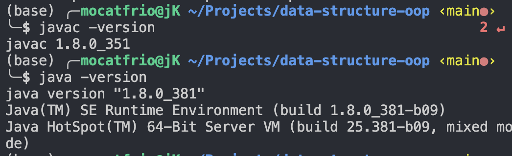
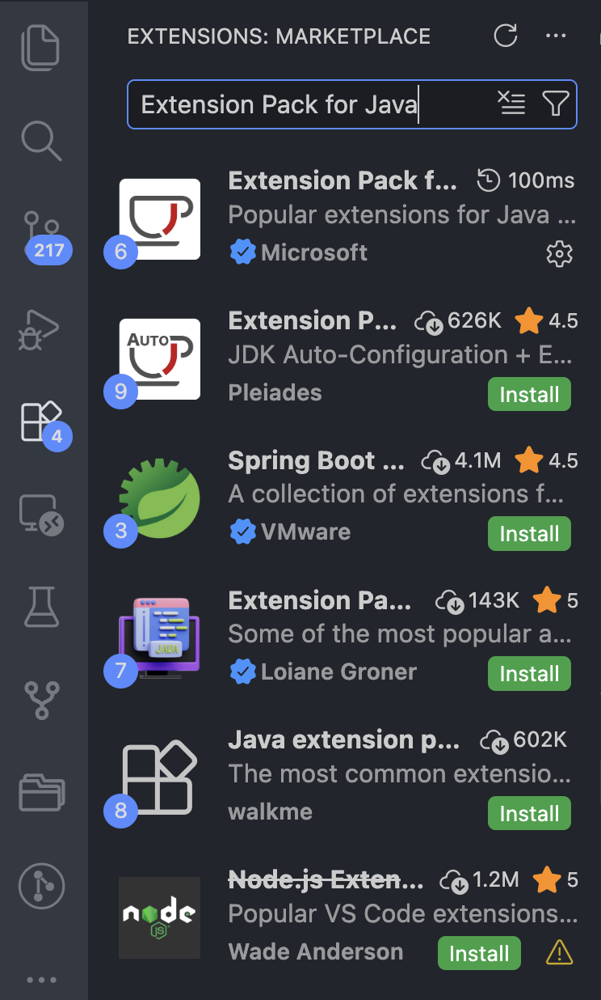
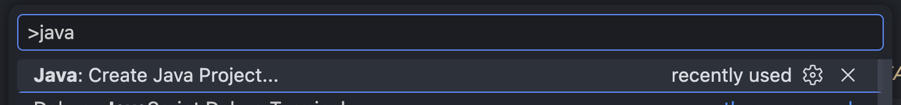
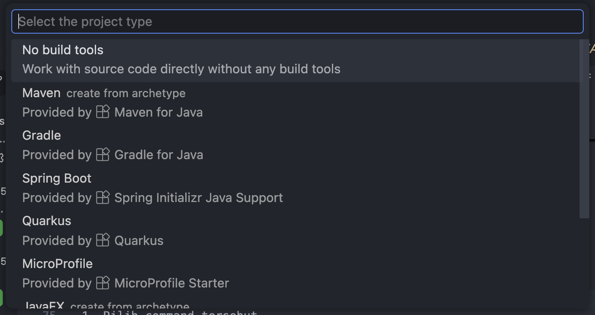
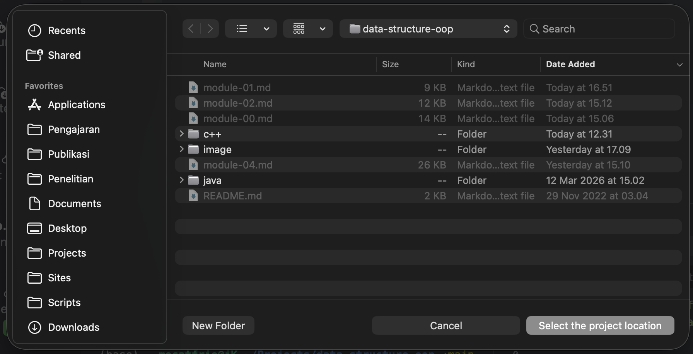
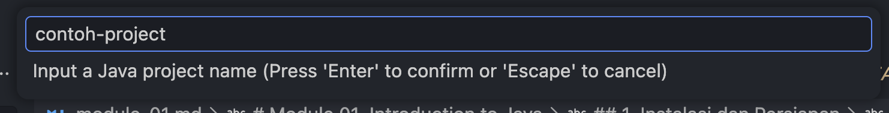
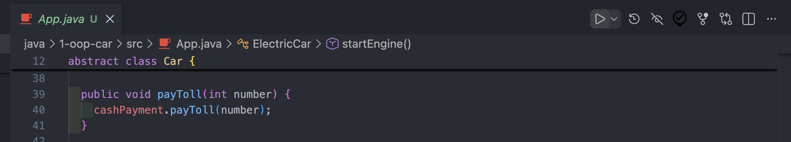
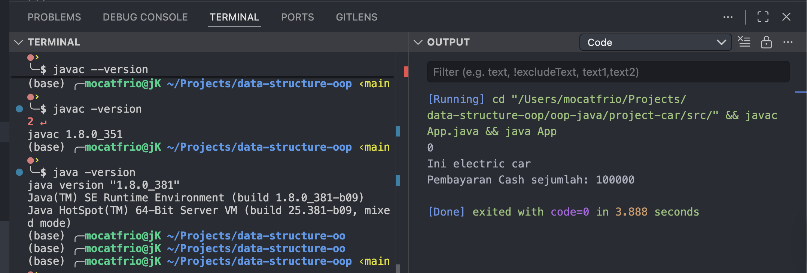
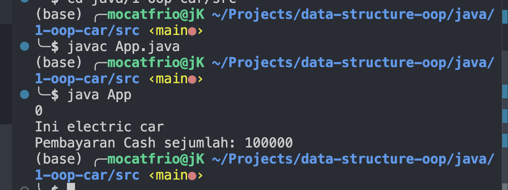
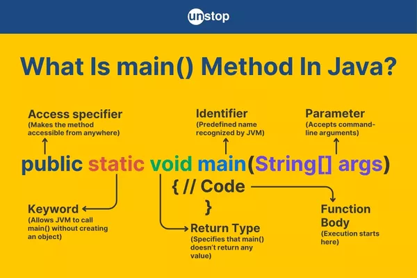

# Module 01. Introduction to Java

## List of Contents

  - [1. Instalasi dan Persiapan](#1-instalasi-dan-persiapan)
    - [1.1 Install Visual Studio Code](#11-install-visual-studio-code)
    - [1.2 Install Java JDK](#12-install-java-jdk)
    - [1.3 Install extension Java di VS Code](#13-install-extension-java-di-vs-code)
    - [1.4 Cara membuat project Java di VS Code](#14-cara-membuat-project-java-di-vs-code)
    - [1.5 Cara run program Java](#15-cara-run-program-java)
    - [1.6 Troubleshooting singkat](#16-troubleshooting-singkat)
  - [2. Struktur Kode](#2-struktur-kode)
    - [2.1 `public class App`](#21-public-class-app)
    - [2.2 `{ }` (Curly Braces)](#22---curly-braces)
    - [2.3 `public static void main(String[] args)`](#23-public-static-void-mainstring-args)
    - [2.4 Statement di Dalam `main()`](#24-statement-di-dalam-main)
    - [2.5 Tanda Titik Koma `;`](#25-tanda-titik-koma-)
  - [3. Struktur Java untuk Multi-Class](#3-struktur-java-untuk-multi-class)


## 1. Instalasi dan Persiapan

Sebelum masuk ke modul selanjutnya, kita perlu melakukan beberapa persiapan:

1. Install **Visual Studio Code**
2. Install **Java JDK**
2. Install **extension Java di Visual Studio Code**
4. Membuat project Java
5. Menjalankan program Java

VS Code membutuhkan **JDK** agar bisa menjalankan Java, dan dukungan Java di VS Code umumnya dipasang lewat **Extension Pack for Java**. Extension pack ini mendukung Java **1.8 ke atas**. 

### 1.1 Install Visual Studio Code 

Install VS Code dari situs resmi Visual Studio Code terlebih dahulu.
Ikuti panduan instalasi VS Code [disini](https://code.visualstudio.com/docs/setup/setup-overview)

### 1.2 Install Java JDK

**JDK (Java Development Kit)** adalah paket yang dibutuhkan untuk membuat dan menjalankan aplikasi Java. VS Code juga memerlukan JDK agar fitur Java bisa bekerja.

Ikuti panduan instalasi Java JDK [disini](https://code.visualstudio.com/docs/languages/java)

Setelah install selesai, Cek apakah JDK berhasil terpasang. Buka terminal atau command prompt lalu jalankan:

```bash
java -version
javac -version
```

Kalau berhasil, akan muncul versi Java dan compiler `javac`.




### 1.3 Install extension Java di VS Code

Extension yang perlu diinstall:

1. **Extension Pack for Java** dari Microsoft
2. **Code Runner** (opsional)

Cara install extension:

1. Buka **Extensions**
   
   

2. Cari extension
3. Klik **Install** pada extension yang dipilih 

### 1.4 Cara membuat project Java di VS Code

VS Code menyediakan command **Java: Create Java Project**. Setelah command dipilih, Anda akan diminta menentukan lokasi, nama project, dan bahkan bisa memilih build tool.

Langkah:

1. Buka VS Code
2. Tekan `Ctrl + Shift + P` (Windows) / `Cmd + Shift + P` (MacOS)
3. Pastikan sudah ada tanda `>`
4. Ketik: `Java: Create Java Project` dan klik
    
   
5. Pilih No Build Tools
    

7. Pilih lokasi project
   

8. Masukkan nama project
   

9. Enter

Maka akan terbuka suatu windows visual studio code baru yang berisi struktur folder:

```text
belajar-java/
└── bin/
└── lib/
└── src/
    └── Main.java
```

Isi file `Main.java`:

```java
public class Main {
  public static void main(String[] args) {
    System.out.println("Hello World");
  }
}
```

### 1.5 Cara run program Java

Di Visual Studio Code, kita bisa langsung run dengan cara: 

1. Buka file `Main.java`
2. Klik **Run Code** di pojok kanan atas
   

Output: (Perhatikan window Output kanan)



Kalau ingin menjalankan manual lewat terminal:

1. Compile
    ```bash
    javac App.java
    ```
2. Run 
    ```bash
    java App
    ```
Output: 




### 1.6 Troubleshooting singkat

1. `java` atau `javac` tidak dikenali

    Penyebab:

    * JDK belum terinstall
    * PATH belum terbaca

    Solusi:

    * restart visual studio code
    * cek ulang instalasi JDK
    * pastikan `java -version` dan `javac -version` berjalan

2. VS Code tidak mendeteksi Java

    Solusi:

    * pastikan JDK sudah terpasang
    * install **Extension Pack for Java**


## 2. Struktur Kode
Struktur kode Java umumnya dimulai dari **class utama** yang berisi method `main()`. Method `main()` adalah titik awal program dijalankan.

Berikut contoh struktur paling dasar:

```java
public class App {
  public static void main(String[] args) {
    System.out.println("Hello World");
  }
}
```



### 2.1 `public class App`

Bagian ini adalah deklarasi class.

```java
public class App
```

Penjelasan:

* `public` = access modifier, artinya class bisa diakses dari luar
* `class` = keyword untuk membuat class
* `App` = nama class

Dalam Java, nama file biasanya harus sama dengan nama class public-nya.
Jadi jika class bernama `App`, maka nama file biasanya:

```java
App.java
```


### 2.2 `{ }` (Curly Braces)

Kurung kurawal digunakan untuk membungkus blok kode.

Contoh:

```java
public class App {
  public static void main(String[] args) {
    System.out.println("Hello World");
  }
}
```

Penjelasan:

* kurung kurawal pertama membungkus isi class
* kurung kurawal kedua membungkus isi method `main`


### 2.3 `public static void main(String[] args)`

Ini adalah method utama yang pertama kali dijalankan saat program dimulai.

```java
public static void main(String[] args)
```

Penjelasan per bagian:

* `public`: Method bisa diakses dari luar class.
* `static`: Method bisa dipanggil tanpa membuat object dari class.
* `void`: Method ini tidak mengembalikan nilai.
* `main`: Nama method khusus yang dikenali Java sebagai **titik masuk program.**
* `String[] args`: Parameter untuk menerima argument dari command line.

    Contoh jika program dijalankan dengan input:

    ```bash
    java App halo dunia
    ```

    Maka:

    * `args[0] = "halo"`
    * `args[1] = "dunia"`


### 2.4 Statement di Dalam `main()`

Semua perintah yang ingin dijalankan biasanya ditulis di dalam method `main()`.

Contoh:

```java
System.out.println("Hello World");
```

Ini adalah statement untuk menampilkan teks ke console.

* `System` = class bawaan Java
* `out` = output standard
* `println()` = method untuk mencetak teks lalu pindah baris

Output:

```text
Hello World
```


### 2.5 Tanda Titik Koma `;`

Di Java, hampir setiap statement diakhiri dengan titik koma.

Contoh:

```java
System.out.println("Hello World");
```

Titik koma menandakan bahwa satu perintah sudah selesai.


## 3. Struktur Java untuk Multi-Class

Sebagai pemula, biasanya kita menulis lebih dari satu Class, Interface, dll dalam satu file Java. Struktur penulisannya seperti ini:

```java
public class NamaUtama {
  public static void main(String[] args) {
    // program dijalankan dari sini
  }
}

class ClassKedua {
  // property
  // constructor
  // method
}

class ClassKetiga {
  // property
  // constructor
  // method
}
```

Contoh:

```java
public class App {
  public static void main(String[] args) {
    Person p = new Person("Andi");
    p.sayHello();

    Car c = new Car("Honda");
    c.showBrand();
  }
}

class Person {
  String name;

  Person(String name) {
    this.name = name;
  }

  void sayHello() {
    System.out.println("Halo, nama saya " + name);
  }
}

class Car {
  String brand;

  Car(String brand) {
    this.brand = brand;
  }

  void showBrand() {
    System.out.println("Brand mobil: " + brand);
  }
}
```