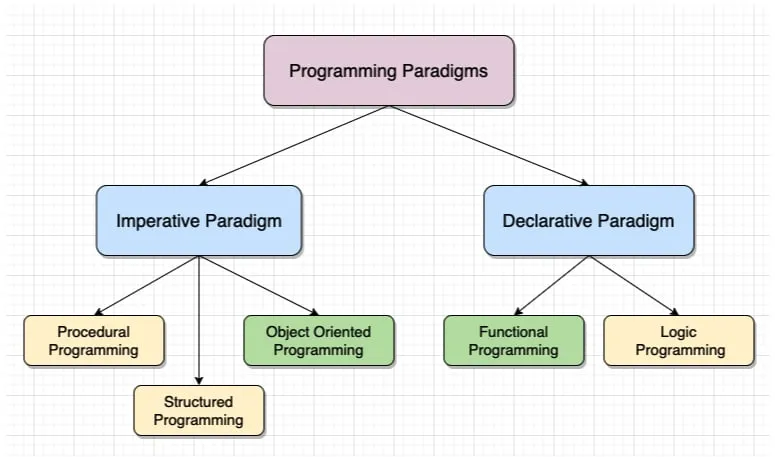
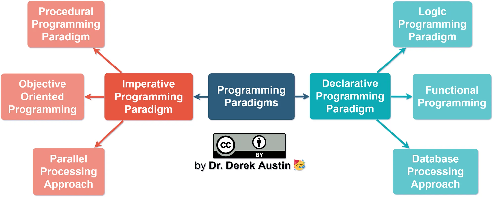
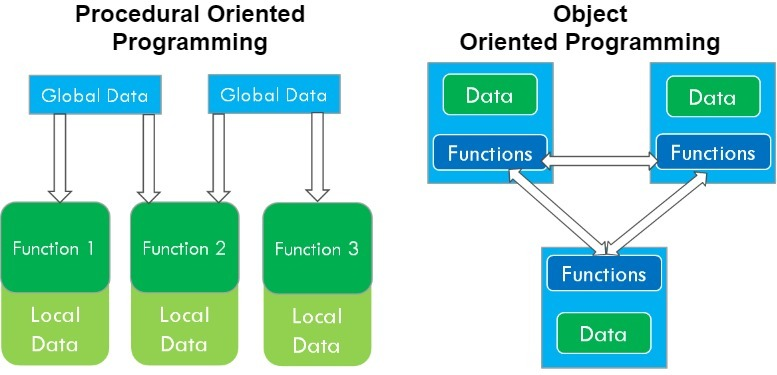

# Module 01: Paradigma Pemrograman

## Daftar Isi

- [Apa itu Paradigma Pemrograman?](#apa-itu-paradigma-pemrograman)
- [Pemrograman Deklaratif dan Imperatif](#pemrograman-deklaratif-dan-imperatif)
- [Studi Kasus](#studi-kasus)
  - [1. Pemrograman Prosedural](#1-pemrograman-prosedural)
  - [2. Pemrograman Berorientasi Objek](#2-pemrograman-berorientasi-objek)
  - [3. Pemrograman Fungsional](#3-pemrograman-fungsional)
- [Paradigma Pemrograman Lainnya](#paradigma-pemrograman-lainnya)

## Apa itu Paradigma Pemrograman?

Before going into the content, please read this article first: https://medium.com/@Ariobarxan/what-is-a-programming-paradigm-ec6c5879952b

<p align="center">
  
</p>

Paradigma pemrograman adalah suatu pendekatan atau cara berpikir dalam menulis kode program komputer. Hal ini mencakup aturan, konsep, dan pola desain yang mengarahkan proses pengembangan perangkat lunak.

Setiap paradigma pemrograman memiliki **karakteristik uniknya sendiri**, dan mempengaruhi bagaimana suatu program dikonstruksi, diorganisir, dan berinteraksi dengan data. Beberapa paradigma pemrograman yang umum termasuk:

1. Imperatif
2. Deklaratif
3. Fungsional
4. Orientasi Objek (OOP)
5. Berbasis Logika
6. Pemrograman Logika
7. Pemrograman Berbasis Aturan (Rule-Based)
8. Berorientasi Pemrosesan Acara (Event-Driven)
9. Berbasis Agen (Agent-Based)
10. Berbasis Komponen
11. Berorientasi Layanan (Service-Oriented)
12. Berbasis Aturan (Rule-Based)
13. Berbasis Aliran Data (Dataflow)
14. Berbasis Masalah (Problem-Solving)

## Pemrograman Deklaratif dan Imperatif

<p align="center">
  
</p>

Pada dasarnya, paradigma pemrograman ada 2, yaitu:

1. **Paradigma Imperatif**

   * **Fokus pada Langkah-Langkah**: Menekankan pada "cara" melakukan sesuatu. Programmer memberikan instruksi langkah demi langkah kepada komputer untuk mengeksekusi tugas tertentu
   * **Perubahan Keadaan**: Seringkali terdapat perubahan keadaan variabel atau struktur data selama eksekusi program.
   * **Bahasa Imperatif**: C, C++, Java, Python (meskipun Python bersifat multi-paradigma, namun mendukung pendekatan imperatif).
   * **Contoh**: Dalam C++, Anda akan menulis loop untuk iterasi melalui sebuah array dan melakukan operasi pada setiap elemen.
     ```C++
     #include <iostream>
     #include <vector>
     using namespace std;

     int main() {
         vector<int> angka = {10, 20, 30, 40};
         int total = 0;

         for (int nilai : angka) {
             total += nilai;
         }

         cout << total << endl;

         return 0;
     }
     ```
2. **Paradigma Deklaratif**

   * **Fokus pada Hasil Akhir**: Lebih menekankan pada "apa" yang ingin dicapai atau dihitung, tanpa memikirkan langkah-langkah detail untuk mencapai itu.
   * **Tidak Ada Perubahan Keadaan**: Menghindari perubahan keadaan selama eksekusi. Fungsi atau aturan beroperasi pada data yang tidak berubah.
   * **Bahasa Deklaratif**: SQL (Structured Query Language) untuk manipulasi database, Prolog untuk pemrograman logika, Haskell dan Lisp untuk pemrograman fungsional.
   * **Contoh**: Dalam SQL, Anda hanya memberi tahu database apa yang Anda inginkan (misalnya, SELECT data dari tabel), dan database akan menentukan sendiri cara untuk mengambilnya.
     ```sql
     SELECT * FROM nama_tabel WHERE kondisi = 'nilai';
     ```

## Studi Kasus

Seorang dosen ingin mengembangkan **sistem manajemen tugas** untuk  memasukkan nilai tugas mahasiswa dan menghitung nilai akhir mahasiswa di setiap mata kuliah.

**Imperatif**

```
1. Memasukkan jumlah mahasiswa
2. Memasukkan nama-nama mahasiswa
2. Untuk setiap nama mahasiswa, memasukkan nilai Tugas
3. Untuk setiap nama mahasiswa, memasukkan nilai Quiz 
4. Untuk setiap nama mahasiswa, memasukkan nilai UTS
5. Untuk setiap nama mahasiswa, memasukkan nilai UAS
6. Untuk setiap nama mahasiswa, memasukkan nilai Praktikum
7. Untuk setiap nama mahasiswa, menghitung nilai akhir dengan menambah semua nilai berdasarkan prosentasenya
8. Menampilkan nama mahasiswa dan nilai akhir
```

**Deklaratif**

```
Diberikan nilai Tugas, Quiz, UTS, UAS, dan Praktikum, hitunglah nilai akhir setiap mahasiswa.
```

Berikut adalah cara penyelesaian studi kasus ini menggunakan berbagai paradigma pemrograman:

### 1. Pemrograman Prosedural

Pemrograman prosedural berfokus pada penyelesaian masalah berbasis **prosedur**. Program terdiri dari serangkaian langkah demi langkah untuk menyelesaikan masalah. Selain itu, pendekatan ini juga menekankan penggunaan kembali kode melalui penggunaan fungsi. Contoh bahasa pemrograman: C dan Pascal. 

Berikut adalah contoh pemrograman prosedural menggunakan bahasa C.

```c
#include <stdio.h>
#include <stdlib.h>

// Fungsi untuk mendapatkan score mhs
float *get_scores() {
    int jumlah_nilai = 10; 
    float *nilai = malloc(sizeof(float) * jumlah_nilai); // Mengalokasikan memori untuk array nilai

    for (int i = 0; i < jumlah_nilai; i++) {
        scanf("%f", &nilai[i]);
    }

    return nilai;
}

// Fungsi untuk menghitung score mhs
float calculate_score(float *nilai_mhs) { 
    return (nilai_mhs[0] * 0.10) + (nilai_mhs[1] * 0.10) + (nilai_mhs[2] * 0.20) + (nilai_mhs[3] * 0.20) + (nilai_mhs[4] * 0.30); 
}

int main() {
    int jumlah_mhs = 5;
    char nama_mhs[jumlah_mhs][20] = {"Rara", "Budi", "Eka", "Pratiwi", "Agung"};
    float *nilai_mhs[jumlah_mhs];
    float nilai_akhir_mhs[jumlah_mhs];

    // 1. Memasukkan nilai mahasiswa
    for (int i = 0; i < jumlah_mhs; i++) {
        nilai_mhs[i] = get_scores(); 
    }

    // 2. Menghitung score nilai mahasiswa
    for (int i = 0; i < jumlah_mhs; i++) {
        nilai_akhir_mhs[i] = calculate_score(nilai_mhs[i]);
    }

    // 3. Print nilai akhir mahasiswa
    for (int i = 0; i < jumlah_mhs; i++) {
        printf("%s => %.2f\n", nama_mhs[i], nilai_akhir_mhs[i]);
    }

    return 0;
}
```

<p align="center">
  
</p>

### 2. Pemrograman Berorientasi Objek

Pemrograman Berorientasi Objek (OOP) berfokus pada penyelesaian masalah menggunakan konsep **objek**, yang merupakan instansi dari kelas. Paradigma ini mangatur kode ke dalam objek-objek yang menggabungkan data dan perilaku. OOP memungkinkan penerapan konsep-konsep seperti pewarisan, polimorfisme, dan enkapsulasi. Bahasa pemrograman populer seperti Java, C++, dan Python adalah contoh dari bahasa yang mendukung paradigma OOP.

Berikut ini contoh OOP dalam bahasa pemrograman C dan C++. 

```c
#include <stdio.h>
#include <stdlib.h>

// Implementasi "Objek" dalam bahasa C menggunakan tipedata "Struct"
typedef struct {
    char nama[20];
    float *nilai;
    float nilai_akhir;
} Mahasiswa;

// Fungsi untuk mendapatkan score mhs
float *get_scores() {
    int jumlah_nilai = 10;
    float *nilai = malloc(sizeof(float) * jumlah_nilai);

    for (int i = 0; i < jumlah_nilai; i++) {
        scanf("%f", &nilai[i]);
    }

    return nilai;
}

// Fungsi untuk menghitung score mhs
void calculate_score(Mahasiswa *mhs) {
    mhs->nilai_akhir = (mhs->nilai[0] * 0.10) + (mhs->nilai[1] * 0.10) + (mhs->nilai[2] * 0.20) + (mhs->nilai[3] * 0.20) + (mhs->nilai[4] * 0.30);
}

int main() {
    int jumlah_mhs = 5;

    // Array objek Mahasiswa
    Mahasiswa mahasiswas[jumlah_mhs] = {
        {"Rara", NULL, 0},
        {"Budi", NULL, 0},
        {"Eka", NULL, 0},
        {"Pratiwi", NULL, 0},
        {"Agung", NULL, 0}
    };

    // Memasukkan nilai mahasiswa
    for (int i = 0; i < jumlah_mhs; i++) {
        mahasiswas[i].nilai = get_scores();
        calculate_score(&mahasiswas[i]);
    }

    // Print nilai akhir mahasiswa
    for (int i = 0; i < jumlah_mhs; i++) {
        printf("%s => %.2f\n", mahasiswas[i].nama, mahasiswas[i].nilai_akhir);
    }

    return 0;
}
```

Namun, cara tersebut bukan OOP yang sebenarnya, karena bahasa pemrograman C tidak mendukung paradigma OOP. Berikut adalah implementasi OOP menggunakan C++.

```c++
#include <iostream>
using namespace std;

// Implementasi "Objek" dalam bahasa C++ menggunakan "Class"
class Mahasiswa {
private:
    string nama;
    float *nilai;
    float nilai_akhir;

public:
    // Konstruktor
    Mahasiswa(string name) : nama(name), nilai(nullptr), nilai_akhir(0) {}

    // Destruktor
    ~Mahasiswa() {
        delete[] nilai;
    }

    // Fungsi untuk mendapatkan score mhs
    void get_scores() {
        int jumlah_nilai = 10;
        nilai = new float[jumlah_nilai];

        for (int i = 0; i < jumlah_nilai; i++) {
            cout << "Masukkan nilai ke-" << (i+1) << ": ";
            cin >> nilai[i];
        }
    }
  
    // Fungsi untuk menghitung score mhs
    void calculate_score() {
        nilai_akhir = (nilai[0] * 0.10) + (nilai[1] * 0.10) + (nilai[2] * 0.20) + (nilai[3] * 0.20) + (nilai[4] * 0.30);
    }

    // Fungsi untuk menampilkan score mhs
    void display_result() {
        cout << nama << " => " << nilai_akhir << endl;
    }
};

int main() {
    int jumlah_mhs = 5;
    Mahasiswa mahasiswas[jumlah_mhs] = {"Rara", "Budi", "Eka", "Pratiwi", "Agung"};

    // Memasukkan nilai dan menghitung nilai akhir
    for (int i = 0; i < jumlah_mhs; i++) {
        mahasiswas[i].get_scores();
        mahasiswas[i].calculate_score();
    }

    // Menampilkan nilai akhir
    for (int i = 0; i < jumlah_mhs; i++) {
        mahasiswas[i].display_result();
    }

    return 0;
}
```

### 3. Pemrograman Fungsional

Pemrograman Fungsional berfokus pada **immutability** (tidak mengubah data yang sebelumnya), penggunaan fungsi murni, dan fungsi tingkat tinggi.

Contoh bahasa pemrograman: Haskell, Lisp, dan Erlang

Berikut adalah contoh implementasi pemrograman fungsional menggunakan C++.

```c++
#include <iostream>
#include <string>
using namespace std;
 
// Fungsi untuk mendapatkan score mhs
void get_scores(float *nilai) {
    int jumlah_nilai = 10;

    for (int i = 0; i < jumlah_nilai; i++) {
        cout << "Masukkan nilai ke-" << (i+1) << ": ";
        cin >> nilai[i];
    }
}

// Fungsi untuk menghitung score mhs
float calculate_score(float *nilai) {
    float nilai_akhir = (nilai[0] * 0.10) + (nilai[1] * 0.10) + (nilai[2] * 0.20) + (nilai[3] * 0.20) + (nilai[4] * 0.30);
    return nilai_akhir;
}

// Fungsi untuk menampilkan score mhs
void display_result(string nama, float nilai_akhir) {
    cout << nama << " => " << nilai_akhir << endl;
}

int main() {
    int jumlah_mhs = 5;
    string nama_mhs[jumlah_mhs] = {"Rara", "Budi", "Eka", "Pratiwi", "Agung"};
    float nilai_mhs[jumlah_mhs][10]; // Array untuk menyimpan nilai mahasiswa

    // Memasukkan nilai dan menghitung nilai akhir
    for (int i = 0; i < jumlah_mhs; i++) {
        get_scores(nilai_mhs[i]);
        float nilai_akhir = calculate_score(nilai_mhs[i]);
        display_result(nama_mhs[i], nilai_akhir);
    }

    return 0;
}
```

## Paradigma Pemrograman Lainnya

Untuk ke depannya akan ada lebih banyak paradigma pemrograman lainnya, misalnya **Event-Driven Programming**, yang berfokus pada konsep "Event" dan "Event handlers". Biasanya banyak digunakan pada pemrograman asynchronous. JavaScript adalah bahasa yang mendukung Event-Driven Programming.

Contoh simple:

```html
<!DOCTYPE html>
<html>
<head>
    <title>Contoh Event-Driven Programming</title>
</head>
<body>

<button id="tombol">Tekan Saya</button>

<script>
    // Event listener ke tombol
    document.getElementById('tombol').addEventListener('click', function() {
        alert('Tombol telah ditekan!');
    });
</script>

</body>
</html>
```

Ketika tombol "Tekan Saya" ditekan, program akan merespons dengan menampilkan pesan "Tombol telah ditekan!" dalam sebuah jendela pop-up. Inilah yang disebut Event-Driven, dimana sebuah fungsi akan dijalankan jika ada "Event" yang sedang berlangsung.

Selain **Event-Driven Programming**, terdapat berbagai paradigma pemrograman yang dapat digunakan dalam pengembangan web, termasuk:

1. **Component-Based Programming**: Paradigma ini fokus pada pembangunan aplikasi web dengan menggunakan komponen-komponen yang dapat digunakan ulang. Beberapa kerangka kerja seperti React dan Vue.js mengadopsi pendekatan ini.
2. **Functional Programming**: Beberapa bahasa pemrograman fungsional seperti Haskell dapat digunakan dalam pengembangan web
3. **Object-Oriented Programming**: Beberapa bahasa seperti Java dan JavaScript (yang memiliki fitur OOP) digunakan dalam pengembangan web
4. **Declarative Programming**: Contohnya adalah SQL, yang digunakan untuk mengakses dan mengelola database dalam pengembangan web.

---

## Perbandingan Paradigma Pemrograman

| Aspek | Prosedural | OOP | Fungsional |
|-------|------------|-----|------------|
| **Fokus Utama** | Prosedur/Fungsi | Objek dan Class | Fungsi Murni |
| **Struktur Data** | Terpisah dari fungsi | Terintegrasi dalam objek | Immutable |
| **State Management** | Global/Local variables | Encapsulated dalam objek | Tidak ada state (stateless) |
| **Reusability** | Melalui fungsi | Melalui inheritance/composition | Melalui higher-order functions |
| **Side Effects** | Umum terjadi | Dikontrol melalui encapsulation | Dihindari (pure functions) |
| **Contoh Bahasa** | C, Pascal, BASIC | Java, C++, Python | Haskell, Lisp, Erlang |
| **Cocok Untuk** | Script sederhana, sistem | Aplikasi besar, game, enterprise | Data processing, concurrent programming |

### Kapan Menggunakan Paradigma Tertentu?

| Situasi | Rekomendasi | Alasan |
|---------|-------------|--------|
| Aplikasi enterprise berskala besar | OOP | Modular, maintainable, team collaboration |
| Script otomasi sederhana | Prosedural | Cepat, straightforward |
| Data processing & transformasi | Fungsional | Immutable, predictable, parallelizable |
| Game development | OOP | Entity management, inheritance untuk karakter |
| Web frontend modern | Component-Based + Fungsional | React/Vue menggunakan komponen + hooks |
| Backend API | OOP atau Fungsional | Bergantung pada kompleksitas dan tim |
| Embedded systems | Prosedural | Kontrol memori langsung, efisien |

---

## Multi-Paradigm Programming

Banyak bahasa pemrograman modern mendukung **multi-paradigma**, artinya programmer dapat memilih atau menggabungkan paradigma sesuai kebutuhan.

### Contoh: Java sebagai Bahasa Multi-Paradigma

Java pada awalnya dirancang untuk OOP, tetapi sejak Java 8+, Java mendukung pemrograman fungsional melalui **Lambda Expressions** dan **Stream API**.

```java
import java.util.Arrays;
import java.util.List;

public class MultiParadigmDemo {
    public static void main(String[] args) {
        List<String> namaMahasiswa = Arrays.asList("Rara", "Budi", "Eka", "Pratiwi", "Agung");

        // Pendekatan Imperatif (tradisional)
        System.out.println("=== Pendekatan Imperatif ===");
        for (int i = 0; i < namaMahasiswa.size(); i++) {
            System.out.println(namaMahasiswa.get(i).toUpperCase());
        }

        // Pendekatan OOP (enhanced for-loop)
        System.out.println("\n=== Pendekatan OOP ===");
        for (String nama : namaMahasiswa) {
            System.out.println(nama.toUpperCase());
        }

        // Pendekatan Fungsional (Stream API + Lambda)
        System.out.println("\n=== Pendekatan Fungsional ===");
        namaMahasiswa.stream()
                     .map(String::toUpperCase)
                     .forEach(System.out::println);

        // Contoh filter dan transformasi fungsional
        System.out.println("\n=== Filter nama yang dimulai dengan huruf vokal ===");
        namaMahasiswa.stream()
                     .filter(nama -> "AEIOUaeiou".indexOf(nama.charAt(0)) != -1)
                     .map(String::toUpperCase)
                     .forEach(System.out::println);
    }
}
```

**Output:**
```
=== Pendekatan Imperatif ===
RARA
BUDI
EKA
PRATIWI
AGUNG

=== Pendekatan OOP ===
RARA
BUDI
EKA
PRATIWI
AGUNG

=== Pendekatan Fungsional ===
RARA
BUDI
EKA
PRATIWI
AGUNG

=== Filter nama yang dimulai dengan huruf vokal ===
EKA
AGUNG
```

### Contoh: Python sebagai Bahasa Multi-Paradigma

Python mendukung prosedural, OOP, dan fungsional secara native.

```python
# Data mahasiswa
mahasiswa = [
    {"nama": "Rara", "nilai": [80, 85, 90, 88, 92]},
    {"nama": "Budi", "nilai": [75, 70, 78, 80, 82]},
    {"nama": "Eka", "nilai": [90, 92, 95, 88, 94]},
]

# 1. Pendekatan Prosedural
def hitung_rata_rata_prosedural(data):
    hasil = []
    for mhs in data:
        total = 0
        for n in mhs["nilai"]:
            total += n
        rata_rata = total / len(mhs["nilai"])
        hasil.append({"nama": mhs["nama"], "rata_rata": rata_rata})
    return hasil

# 2. Pendekatan OOP
class Mahasiswa:
    def __init__(self, nama, nilai):
        self.nama = nama
        self.nilai = nilai

    def rata_rata(self):
        return sum(self.nilai) / len(self.nilai)

# 3. Pendekatan Fungsional
from functools import reduce

def hitung_rata_rata_fungsional(data):
    return list(map(
        lambda mhs: {
            "nama": mhs["nama"],
            "rata_rata": reduce(lambda a, b: a + b, mhs["nilai"]) / len(mhs["nilai"])
        },
        data
    ))

# Atau lebih Pythonic dengan list comprehension
def hitung_rata_rata_pythonic(data):
    return [{"nama": m["nama"], "rata_rata": sum(m["nilai"]) / len(m["nilai"])} for m in data]
```

---

## Kesimpulan

1. **Paradigma pemrograman** adalah cara berpikir dalam menulis kode, bukan fitur bahasa pemrograman tertentu.

2. **Tidak ada paradigma yang "terbaik"** - setiap paradigma memiliki kelebihan dan kekurangan tergantung konteks.

3. **Bahasa modern bersifat multi-paradigma** - programmer dapat memilih atau menggabungkan paradigma sesuai kebutuhan.

4. **Memahami berbagai paradigma** membantu programmer:
   - Memilih pendekatan yang tepat untuk masalah tertentu
   - Menulis kode yang lebih bersih dan maintainable
   - Berkolaborasi dengan tim yang menggunakan berbagai bahasa

5. **Rekomendasi pembelajaran:**
   - Mulai dengan **prosedural** untuk memahami dasar algoritma
   - Pelajari **OOP** untuk aplikasi berskala besar
   - Eksplorasi **fungsional** untuk data processing dan concurrent programming

---

## Latihan Praktikum 01

### Latihan 1: Identifikasi Paradigma

Untuk setiap kode berikut, identifikasi paradigma pemrograman yang digunakan dan jelaskan alasannya:

**Kode A:**
```java
int total = 0;
for (int i = 0; i < arr.length; i++) {
    total += arr[i];
}
```

**Kode B:**
```java
List<Integer> hasil = numbers.stream()
                             .filter(n -> n > 10)
                             .map(n -> n * 2)
                             .collect(Collectors.toList());
```

**Kode C:**
```java
class Kalkulator {
    private int hasil;

    public void tambah(int angka) {
        this.hasil += angka;
    }

    public int getHasil() {
        return this.hasil;
    }
}
```

### Latihan 2: Konversi Paradigma

Diberikan kode prosedural berikut:

```c
int cari_maksimum(int arr[], int n) {
    int max = arr[0];
    for (int i = 1; i < n; i++) {
        if (arr[i] > max) {
            max = arr[i];
        }
    }
    return max;
}
```

Konversikan kode di atas ke:
1. Pendekatan OOP menggunakan Java (buat class `ArrayHelper` dengan method `cariMaksimum`)
2. Pendekatan Fungsional menggunakan Java Stream API

### Latihan 3: Studi Kasus - Sistem Perpustakaan

Buatlah desain sistem perpustakaan sederhana yang dapat:
- Menambah buku baru
- Meminjam buku
- Mengembalikan buku
- Mencari buku berdasarkan judul

Implementasikan dengan 2 pendekatan:
1. **Prosedural** menggunakan C atau Java (tanpa class)
2. **OOP** menggunakan Java (dengan class `Buku`, `Anggota`, `Perpustakaan`)

### Latihan 4: Analisis Kelebihan dan Kekurangan

Berdasarkan studi kasus sistem nilai mahasiswa di modul ini, analisis:
1. Apa kelebihan menggunakan OOP dibandingkan prosedural?
2. Kapan sebaiknya menggunakan pendekatan prosedural?
3. Bagaimana pendekatan fungsional dapat membantu dalam memproses data nilai?

### Latihan 5: Multi-Paradigma

Buatlah program Java yang menggabungkan OOP dan Fungsional untuk:
1. Membuat class `Produk` dengan atribut `nama`, `harga`, dan `stok`
2. Membuat list berisi 5 objek `Produk`
3. Menggunakan Stream API untuk:
   - Filter produk dengan harga > 50000
   - Urutkan berdasarkan harga (ascending)
   - Tampilkan nama produk yang memenuhi kriteria

---

## Referensi

1. Sebesta, R. W. (2016). *Concepts of Programming Languages* (11th ed.). Pearson.
2. Van Roy, P., & Haridi, S. (2004). *Concepts, Techniques, and Models of Computer Programming*. MIT Press.
3. [Programming Paradigms - GeeksforGeeks](https://www.geeksforgeeks.org/introduction-of-programming-paradigms/)
4. [What is a Programming Paradigm? - Medium](https://medium.com/@Ariobarxan/what-is-a-programming-paradigm-ec6c5879952b)
