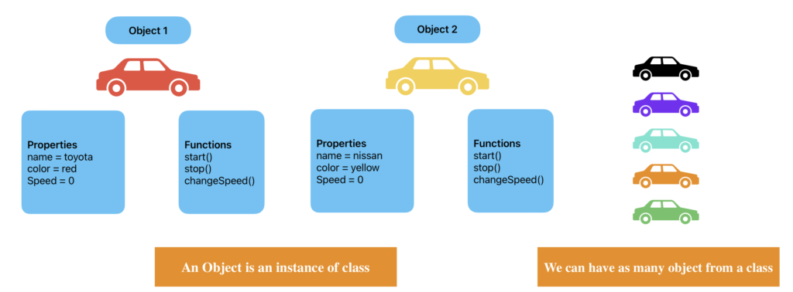
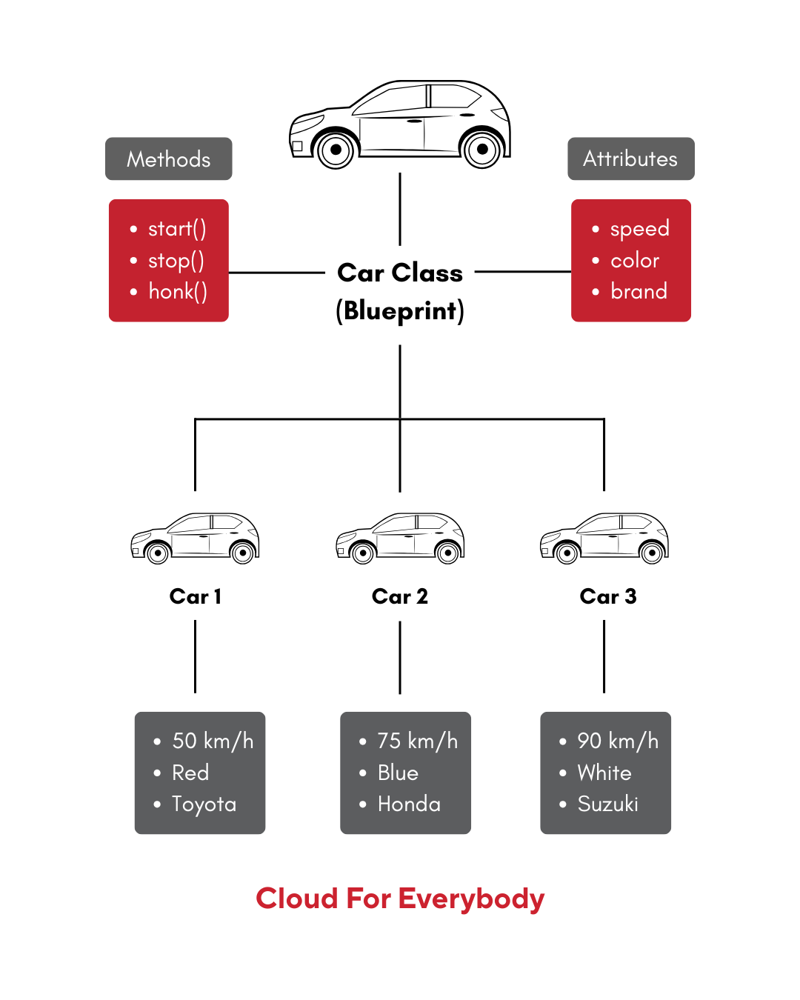
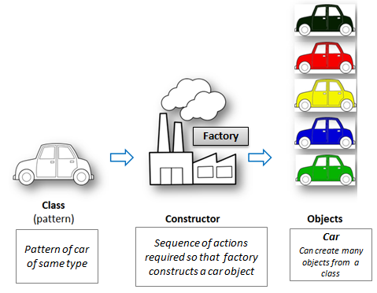
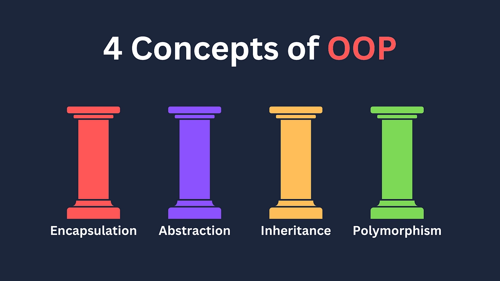
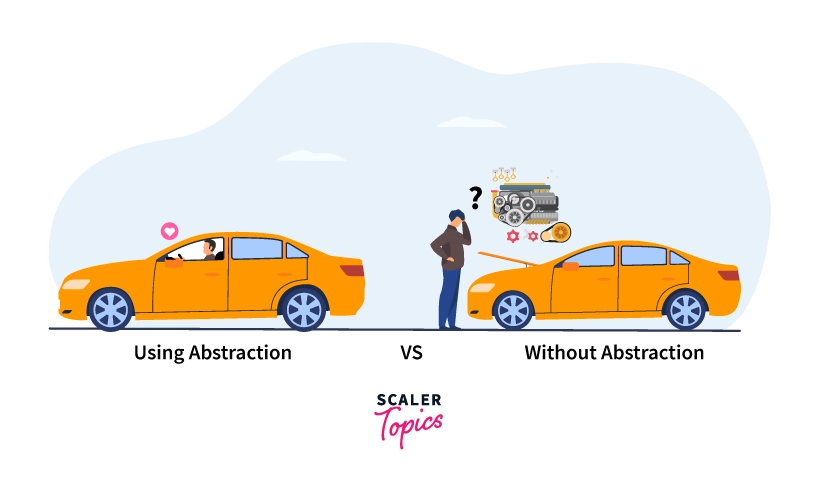
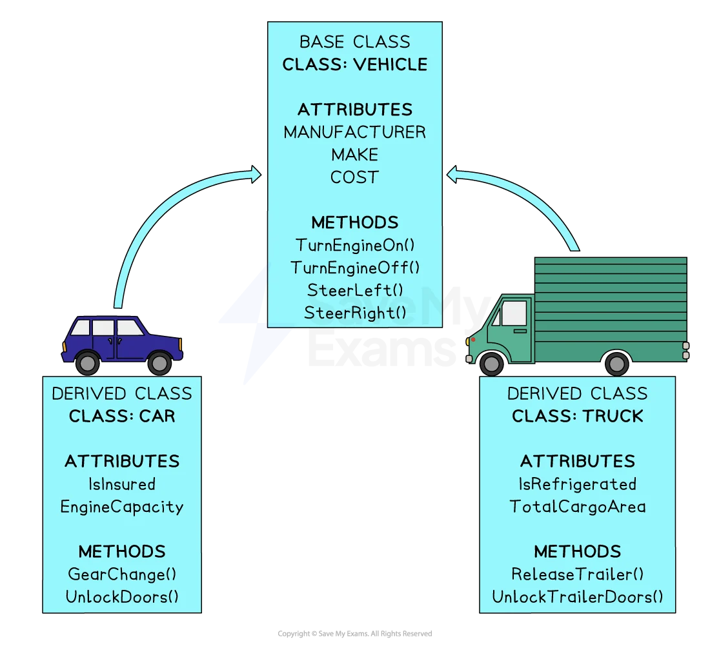
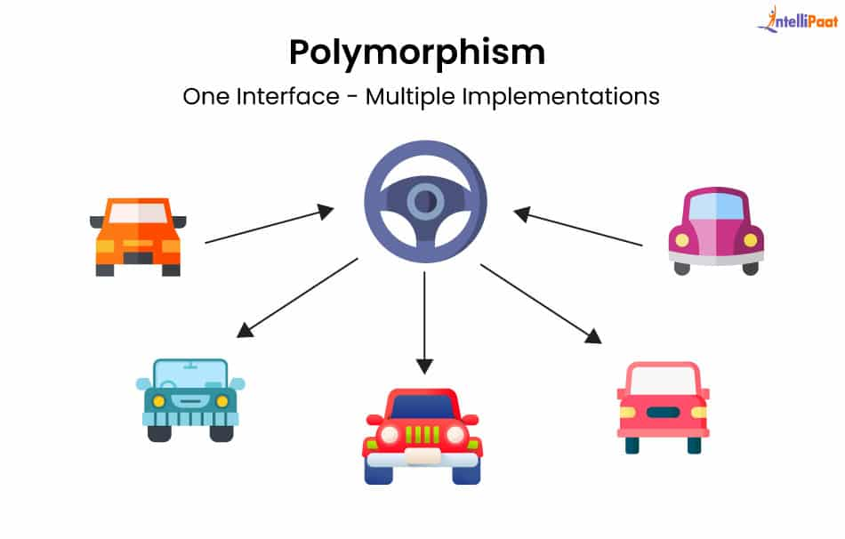
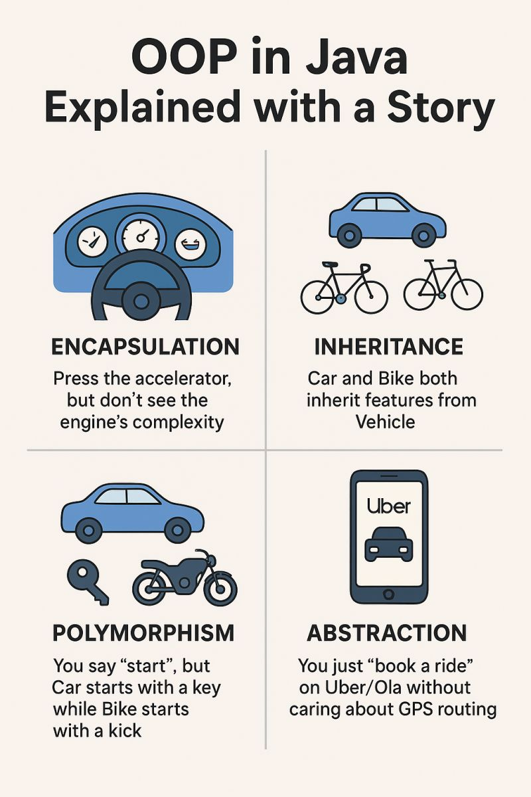
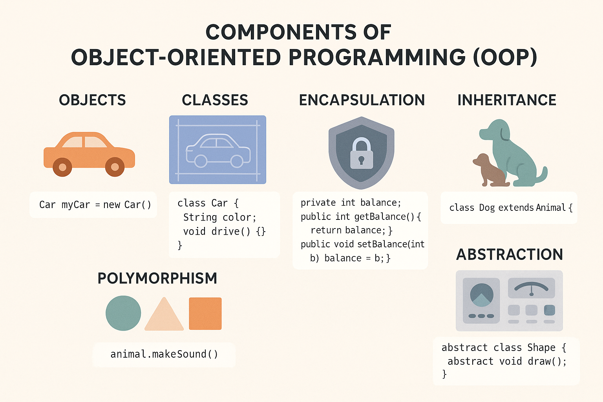

# Module 02. Basic Concepts of OOP

Object-Oriented Programming (OOP) adalah cara menulis program dengan memodelkan **objek** seperti di dunia nyata.

Berikut adalah contoh kode yang digunakan dalam modul ini:
[App.java](java/1-oop-car/src/App.java)

## List of Contents

  - [1. Class dan Object](#1-class-dan-object)
    - [1.1 Class](#11-class)
    - [1.2 Object](#12-object)
  - [2. Attributes dan Method](#2-attributes-dan-method)
    - [2.1 Attributes](#21-attributes)
    - [2.2 Method](#22-method)
  - [3. Constructor](#3-constructor)
    - [3.1 Default Constructor](#31-default-constructor)
    - [3.2 Parameterized Constructor](#32-parameterized-constructor)
    - [3.3 Constructor Overloading](#33-constructor-overloading)
    - [3.4 Copy Constructor](#34-copy-constructor)
    - [3.5 Private Constructor](#35-private-constructor)
    - [3.6 Constructor pada Inheritance](#36-constructor-pada-inheritance)
  - [4. Four Concepts of OOP](#4-four-concepts-of-oop)
    - [4.1 Abstraction](#41-abstraction)
      - [Interface juga bagian dari abstraction](#interface-juga-bagian-dari-abstraction)
    - [4.2 Inheritance](#42-inheritance)
    - [4.3 Polymorphism](#43-polymorphism)
    - [4.4 Encapsulation](#44-encapsulation)
  - [Kesimpulan](#kesimpulan)


## 1. Class dan Object



### 1.1 Class

**Class** adalah blueprint atau cetakan untuk membuat object.

Pada kode ini:

```java
abstract class Car {
  protected String brand;
  protected String type;
  protected String color;
  private int speed;
}
```

`Car` adalah class yang mendefinisikan data dan perilaku dasar dari sebuah mobil.

Class lain juga ada, misalnya:

* `ElectricCar`
* `CashPayment`

### 1.2 Object

**Object** adalah hasil nyata dari class.

Contoh pada `main()`:

```java
ElectricCar myCar = new ElectricCar("Honda", "Brio", "Kuning", 0);
```

`myCar` adalah object dari class `ElectricCar`.

Artinya object `myCar` punya data:

* `brand = "Honda"`
* `type = "Brio"`
* `color = "Kuning"`
* `speed = 0`

Lalu object ini bisa menjalankan method seperti:

```java
myCar.getSpeed();
myCar.startEngine();
myCar.payToll(100000);
```

## 2. Attributes dan Method



### 2.1 Attributes

**Atribut** adalah sifat-sifat yang dimiliki object.

Pada class `Car`:

```java
protected String brand;
protected String type;
protected String color;
private int speed;
protected CashPayment cashPayment = new CashPayment();
```

Penjelasan:

* `brand` → merek mobil
* `type` → tipe mobil
* `color` → warna mobil
* `speed` → kecepatan mobil
* `cashPayment` → object untuk proses pembayaran tol

### 2.2 Method

**Method** adalah aksi atau perilaku yang bisa dilakukan object.

Contoh method pada `Car`:

```java
public int getSpeed() {
  return speed;
}

public void setSpeed(int speedNew) {
  this.speed = speedNew;
}

public void payToll(int number) {
  cashPayment.payToll(number);
}
```

Contoh method pada `ElectricCar`:

```java
void startEngine() {
  System.out.println("Ini electric car");
}
```

## 3. Constructor

Constructor adalah method khusus yang otomatis dipanggil saat object dibuat. Fungsi utamanya adalah untuk **menginisialisasi nilai awal** dari object.



Ciri-ciri constructor:

- Nama constructor harus sama dengan nama class
- Tidak memiliki return type
- Dipanggil saat object dibuat dengan keyword `new`

Contoh sederhana:

```java
Car myCar = new Car();
```

Saat baris di atas dijalankan, constructor `Car()` akan dipanggil.

Secara garis besar, ada 2 jenis constructor, yaitu:

1. Default Constructor
2. Parameterized Constructor

Dalam implementasinya, berkembang jadi beberapa jenis, yaitu:

1. Overloading Constructor
2. Copy Constructor
3. Private Constructor
4. Constructor pada Inheritance

### 3.1 Default Constructor

**Default constructor** adalah constructor tanpa parameter. Constructor ini cocok digunakan ketika object ingin langsung punya nilai awal default tanpa harus mengisi data dari luar.

Contoh:

```java
class Car {
  String brand;

  Car() {
    brand = "Honda";
  }
}
```

Pemakaian di Main:

```java
Car myCar = new Car();
System.out.println(myCar.brand);
```

Output:

```java
Honda
```

### 3.2 Parameterized Constructor

**Parameterized constructor** adalah constructor yang memiliki parameter. Constructor ini dipakai ketika nilai object ingin diisi langsung saat object dibuat.

Contoh:

```java
class Car {
    String brand;
    String type;
    String color;
    int speed;

    public Car(String brand, String type, String color, int speed) {
        this.brand = brand;
        this.type = type;
        this.color = color;
        this.speed = speed;
    }
}
```

Pemakaian di Main:

```java
Car myCar = new Car("Honda", "Brio", "Merah", 100);
System.out.println(myCar.brand);
System.out.println(myCar.color);
```

Output:

```java
Honda
Merah
```

### 3.3 Constructor Overloading

**Constructor overloading** adalah satu class memiliki lebih dari satu constructor, tetapi dengan parameter yang berbeda. Dengan overloading, object bisa dibuat dengan beberapa cara sesuai kebutuhan.

Misalnya:

* tanpa parameter
* dengan 1 parameter
* dengan 2 parameter

Contoh:

```java
class Car {
  String brand;
  String color;

  Car() {
    brand = "Default Brand";
    color = "Hitam";
  }

  Car(String brand) {
    this.brand = brand;
    this.color = "Putih";
  }

  Car(String brand, String color) {
    this.brand = brand;
    this.color = color;
  }
}
```

Pemakaian:

```java
Car car1 = new Car();
Car car2 = new Car("Honda");
Car car3 = new Car("Suzuki", "Biru");
```

### 3.4 Copy Constructor

Di Java, **copy constructor** adalah constructor yang menerima object sejenis lalu menyalin nilainya ke object baru. Constructor ini berguna untuk membuat object baru berdasarkan object yang sudah ada.

Contoh:

```java
class Car {
  String brand;
  String color;

  Car(String brand, String color) {
    this.brand = brand;
    this.color = color;
  }

  Car(Car other) {
    this.brand = other.brand;
    this.color = other.color;
  }
}
```

Pemakaian:

```java
Car car1 = new Car("Honda", "Kuning");
Car car2 = new Car(car1);

System.out.println(car2.brand);
System.out.println(car2.color);
```

Output:

```java
Honda
Kuning
```

### 3.5 Private Constructor

**Private constructor** adalah constructor yang dibuat dengan access modifier `private`.

Contoh:

```java
class Database {
  private Database() {
    System.out.println("Constructor dipanggil");
  }
}
```

Constructor ini tidak bisa dipanggil dari luar class. Biasanya digunakan untuk:

* pattern **Singleton**
* mencegah object dibuat sembarangan
* class utility

Contoh Singleton sederhana:

```java
class Database {
  private static Database instance;

  private Database() {}

  public static Database getInstance() {
    if (instance == null) {
      instance = new Database();
    }
    return instance;
  }
}
```

Pemakaian:

```java
Database db = Database.getInstance();
```

### 3.6 Constructor pada Inheritance

Dalam pewarisan, constructor parent bisa dipanggil menggunakan `super()`.

Contoh:

```java
class Car {
    String brand;
    String type;
    String color;
    int speed;

    public Car(String brand, String type, String color, int speed) {
        this.brand = brand;
        this.type = type;
        this.color = color;
        this.speed = speed;
    }
}

class ElectricCar extends Car {
    public ElectricCar(String brand, String type, String color, int speed) {
        super(brand, type, color, speed);
    }
}
```

Kata kunci `super(...)` digunakan untuk memanggil constructor milik parent class, yaitu `Car`.

Saat kode ini dijalankan:

```java
ElectricCar myCar = new ElectricCar("Honda", "Brio", "Kuning", 0);
```

Maka constructor `ElectricCar` dipanggil, lalu meneruskan data ke constructor `Car`.

## 4. Four Concepts of OOP

4 pilar utama Pemrograman Berorientasi Objek (OOP) adalah

1. Enkapsulasi
2. Pewarisan (Inheritance)
3. Polimorfisme, dan
4. Abstraksi

Pilar-pilar ini berfungsi untuk meningkatkan modularitas, keamanan, dan reusabilitas kode, membuat perangkat lunak lebih mudah dikelola serta dikembangkan.



### 4.1 Abstraction

**Abstraction** adalah menyembunyikan detail implementasi dan hanya menampilkan hal penting.



Pada kode ini, abstraction terlihat dari:

```java
abstract class Car {
  abstract void startEngine();
}
```

Class `Car` hanya mengatakan bahwa setiap mobil harus punya method `startEngine()`,
tetapi **cara menyalakan mesin** tidak dijelaskan di `Car`.

Implementasinya diberikan di class turunan:

```java
@Override
void startEngine() {
  System.out.println("Ini electric car");
}
```

Jadi:

* `Car` mendefinisikan konsep umum mobil
* `ElectricCar` mengisi detail implementasinya

#### Interface juga bagian dari abstraction

Pada kode ini juga ada:

```java
interface TollPayment {
  void payToll(int number);
}
```

Interface `TollPayment` hanya menentukan aturan bahwa class yang mengimplementasikannya harus punya method `payToll(int number)`.

### 4.2 Inheritance

**Inheritance** adalah pewarisan, yaitu class anak mewarisi atribut dan method dari class induk.



Contoh:

```java
class ElectricCar extends Car {
```

`ElectricCar` mewarisi isi dari `Car`, seperti:

* `brand`
* `type`
* `color`
* `getSpeed()`
* `setSpeed()`
* `payToll()`

Karena itu object `myCar` bisa langsung memakai:

```java
myCar.getSpeed();
myCar.payToll(100000);
```

padahal method tersebut didefinisikan di class `Car`.

Keuntungan inheritance:

* kode lebih rapi
* bisa digunakan ulang
* tidak perlu menulis ulang fitur yang sama

### 4.3 Polymorphism

**Polymorphism** berarti "satu bentuk, banyak perilaku".



Dalam OOP, method yang sama bisa punya implementasi berbeda pada class yang berbeda.

Contoh pada method abstract:

```java
abstract void startEngine();
```

Lalu di `ElectricCar` di-override menjadi:

```java
@Override
void startEngine() {
  System.out.println("Ini electric car");
}
```

Kalau nanti ada class lain, misalnya `GasCar`, maka method `startEngine()` bisa diisi berbeda, misalnya:

```java
@Override
void startEngine() {
  System.out.println("Mesin bensin dinyalakan");
}
```

Artinya:

* nama method sama → `startEngine()`
* perilaku bisa berbeda tergantung jenis object

Contoh lain polymorphism juga terlihat pada interface:

```java
interface TollPayment {
  void payToll(int number);
}
```

Lalu class:

```java
class CashPayment implements TollPayment {
  @Override
  public void payToll(int number) {
    System.out.println("Pembayaran Cash sejumlah: " + number);
  }
}
```

Kalau nanti ada `DebitPayment` atau `EWaletPayment`, semua bisa punya method `payToll()` dengan cara pembayaran berbeda.

### 4.4 Encapsulation

**Encapsulation** adalah membungkus data dan mengontrol akses terhadap data tersebut.



Contoh paling jelas ada pada property `speed`:

```java
private int speed;
```

Karena `speed` bersifat `private`, property ini **tidak bisa diakses langsung dari luar class**.

Aksesnya harus lewat method:

```java
public int getSpeed() {
  return speed;
}

public void setSpeed(int speedNew) {
  this.speed = speedNew;
}
```

Jadi daripada langsung menulis:

```java
myCar.speed = 100; // tidak bisa, karena private
```

kita harus menggunakan:

```java
myCar.setSpeed(100);
System.out.println(myCar.getSpeed());
```

Keuntungan encapsulation:

* data lebih aman
* akses bisa dikontrol
* mencegah perubahan sembarangan dari luar class

## Kesimpulan


