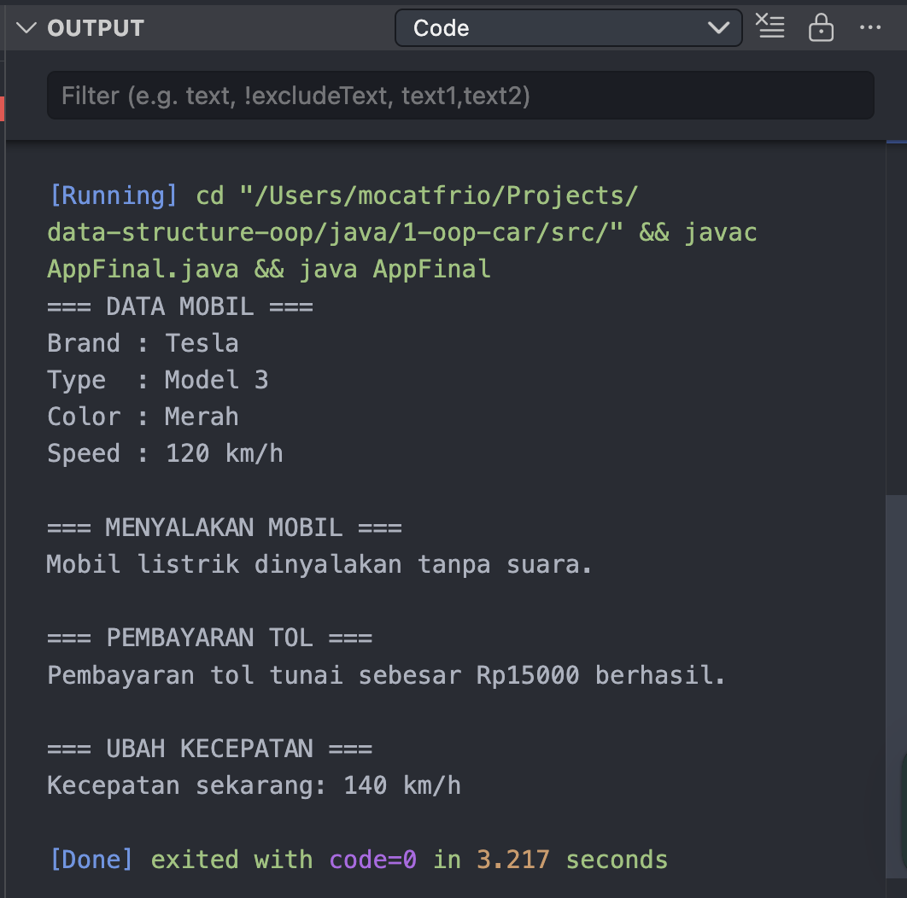
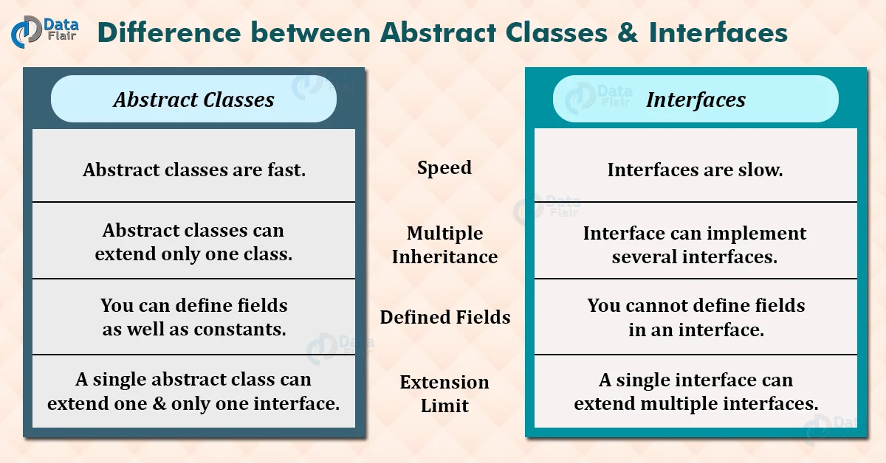

# Module 03. Advanced Concept of OOP

Modul ini membahas konsep OOP tingkat lanjut dengan melanjutkan studi kasus dari modul sebelumnya. Berikut adalah contoh kode yang digunakan dalam modul ini:
[AppFinal.java](java/1-oop-car/src/AppFinal.java)

```java
abstract class Car {
  protected String brand;
  protected String type;
  protected String color;
  private int speed;
  protected TollPayment tollPayment;

  public Car() {
  }

  public Car(String brand, String type, String color, int speed, TollPayment tollPayment) {
    this.brand = brand;
    this.type = type;
    this.color = color;
    this.speed = speed;
    this.tollPayment = tollPayment;
  }

  public abstract void startEngine();

  public int getSpeed() {
    return speed;
  }

  public void setSpeed(int speed) {
    this.speed = speed;
  }

  public void payToll(int amount) {
    if (tollPayment != null) {
      tollPayment.payToll(amount);
    } else {
      System.out.println("Metode pembayaran tol belum tersedia.");
    }
  }

  public void showCarInfo() {
    System.out.println("Brand : " + brand);
    System.out.println("Type  : " + type);
    System.out.println("Color : " + color);
    System.out.println("Speed : " + speed + " km/h");
  }
}

interface TollPayment {
  void payToll(int amount);
}

class CashPayment implements TollPayment {
  @Override
  public void payToll(int amount) {
    System.out.println("Pembayaran tol tunai sebesar Rp" + amount + " berhasil.");
  }
}

class ElectricCar extends Car {
  public ElectricCar(String brand, String type, String color, int speed, TollPayment tollPayment) {
    super(brand, type, color, speed, tollPayment);
  }

  @Override
  public void startEngine() {
    System.out.println("Mobil listrik dinyalakan tanpa suara.");
  }
}

public class AppFinal {
  public static void main(String[] args) {
    TollPayment payment = new CashPayment();

    ElectricCar car = new ElectricCar(
        "Tesla",
        "Model 3",
        "Merah",
        120,
        payment);

    System.out.println("=== DATA MOBIL ===");
    car.showCarInfo();

    System.out.println("\n=== MENYALAKAN MOBIL ===");
    car.startEngine();

    System.out.println("\n=== PEMBAYARAN TOL ===");
    car.payToll(15000);

    System.out.println("\n=== UBAH KECEPATAN ===");
    car.setSpeed(140);
    System.out.println("Kecepatan sekarang: " + car.getSpeed() + " km/h");
  }
}
```



## List of Contents

  - [1. Abstract Class](#1-abstract-class)
    - [1.1 Abstract Class vs Class biasa sebagai Parent](#11-abstract-class-vs-class-biasa-sebagai-parent)
    - [1.2 Abstract Method](#12-abstract-method)
  - [2. Interface](#2-interface)
    - [2.1 Implementasi Interface](#21-implementasi-interface)
  - [3. Inheritance](#3-inheritance)
    - [3.1 Constructor Inheritance](#31-constructor-inheritance)
  - [4. Polymorphism](#4-polymorphism)
    - [4.1 Polymorphism pada Abstract Method](#41-polymorphism-pada-abstract-method)
    - [4.2 Polymorphism pada Interface](#42-polymorphism-pada-interface)
  - [5. Encapsulation](#5-encapsulation)
  - [6. Composition](#6-composition)
  - [7. Dependency Injection Sederhana](#7-dependency-injection-sederhana)
  - [8. Loose Coupling](#8-loose-coupling)
  - [9. Method Overriding](#9-method-overriding)
  - [10. Constructor Overloading](#10-constructor-overloading)
  - [11. Null Handling Sederhana](#11-null-handling-sederhana)
  - [12. Access Modifier](#12-access-modifier)
    - [12.1 `private`](#121-private)
    - [12.2 `protected`](#122-protected)
    - [12.3 `public`](#123-public)


## 1. Abstract Class

**Abstract class** adalah class yang tidak ditujukan untuk dibuat object secara langsung, tetapi digunakan sebagai class dasar untuk diturunkan.

Pada kode:

```java
abstract class Car {
```

Artinya `Car` adalah class abstrak.

Kita **tidak bisa** membuat object seperti ini:

```java
Car car = new Car(); // tidak bisa
```

Karena `Car` adalah abstract class.

Abstract Class `Car` digunakan sebagai blueprint umum untuk semua jenis mobil.
Setiap mobil pasti punya:

* brand
* type
* color
* speed
* method menyalakan mesin

Tetapi cara menyalakan mesin bisa berbeda-beda tergantung jenis mobil.

### 1.1 Abstract Class vs Class biasa sebagai Parent

Kita bisa saja pakai **class biasa**, tapi `abstract class` lebih cocok kalau class tersebut masih terlalu umum.

Contoh: 
`Car` adalah konsep umum.  
Yang biasanya dibuat object adalah:
  - `ElectricCar`
  - `GasCar`
  - `HybridCar`

Kita menggunakan **Abstract Class**, jika:

* `Car` hanya menjadi **template / blueprint**
* `Car` **tidak bisa dibuat object langsung**
* subclass seperti `ElectricCar` **wajib** mengisi method penting, misalnya `startEngine()`

Kalau semua perilaku sudah sama dan class boleh langsung dibuat object, maka kita menggunakan **class biasa** saja sudah cukup.


### 1.2 Abstract Method

Di dalam abstract class ada abstract method:

```java
public abstract void startEngine();
```

Method abstrak adalah method yang:

* Hanya memiliki deklarasi
* Tidak memiliki isi
* **Wajib diimplementasikan oleh class turunan**

Artinya setiap jenis mobil harus menentukan sendiri cara `startEngine()`.

Abstract method juga biasanya ada di dalam **interface**.

## 2. Interface

**Interface** adalah kontrak yang berisi method yang harus diimplementasikan oleh class yang menggunakannya.



Pada kode:

```java
interface TollPayment {
  void payToll(int amount);
}
```

Interface `TollPayment` menyatakan bahwa semua class yang mengimplementasikannya harus punya method:

```java
void payToll(int amount)
```

### 2.1 Implementasi Interface

Class `CashPayment` mengimplementasikan interface tersebut:

```java
class CashPayment implements TollPayment {
  @Override
  public void payToll(int amount) {
    System.out.println("Pembayaran tol tunai sebesar Rp" + amount + " berhasil.");
  }
}
```

Artinya `CashPayment` memenuhi kontrak `TollPayment`.

Interface cocok digunakan saat kita ingin membuat **aturan umum** untuk banyak kemungkinan implementasi.

Contoh lain yang bisa ditambahkan:

```java
class EmoneyPayment implements TollPayment {
  @Override
  public void payToll(int amount) {
    System.out.println("Pembayaran tol e-money sebesar Rp" + amount + " berhasil.");
  }
}

class QRISPayment implements TollPayment {
  @Override
  public void payToll(int amount) {
    System.out.println("Pembayaran tol dengan QRIS sebesar Rp" + amount + " berhasil.");
  }
}
```

Jadi satu interface bisa punya banyak implementasi.

## 3. Inheritance

**Inheritance** adalah pewarisan sifat dari parent class ke child class.

Pada kode:

```java
class ElectricCar extends Car {
```

Artinya `ElectricCar` mewarisi atribut dan method dari `Car`.

Jadi `ElectricCar` otomatis memiliki:

* `brand`
* `type`
* `color`
* `getSpeed()`
* `setSpeed()`
* `payToll()`
* `showCarInfo()`

### 3.1 Constructor Inheritance

Constructor pada `ElectricCar` memanggil constructor parent dengan `super(...)`.

```java
public ElectricCar(String brand, String type, String color, int speed, TollPayment tollPayment) {
  super(brand, type, color, speed, tollPayment);
}
```

Kata kunci `super` digunakan untuk meneruskan nilai ke constructor milik parent classnya, yaitu `Car`.

## 4. Polymorphism

**Polymorphism** berarti satu bentuk dapat memiliki banyak perilaku.

Pada kode ini, polymorphism muncul dalam dua bentuk utama.

### 4.1 Polymorphism pada Abstract Method

Method:

```java
public abstract void startEngine();
```

diimplementasikan berbeda oleh `ElectricCar`:

```java
@Override
public void startEngine() {
  System.out.println("Mobil listrik dinyalakan tanpa suara.");
}
```

Kalau nanti ada class lain:

```java
class GasCar extends Car {
  public GasCar(String brand, String type, String color, int speed, TollPayment tollPayment) {
    super(brand, type, color, speed, tollPayment);
  }

  @Override
  public void startEngine() {
    System.out.println("Mobil bensin dinyalakan dengan suara mesin.");
  }
}
```

Method `startEngine()` tetap sama, tetapi perilakunya berbeda.


### 4.2 Polymorphism pada Interface

Di `main()`:

```java
TollPayment payment = new CashPayment();
```

Variabel `payment` bertipe interface `TollPayment`, tetapi object yang diberikan adalah `CashPayment`.

Ini artinya program fokus pada **kontrak**, bukan pada implementasi detail.

Kalau suatu saat diganti menjadi:

```java
TollPayment payment = new EmoneyPayment();
```

maka kode `Car` tidak perlu diubah.

## 5. Encapsulation

**Encapsulation** adalah membungkus data dan membatasi akses langsung ke data tersebut.

Pada class `Car`, atribut `speed` dibuat `private`:

```java
private int speed;
```

Artinya `speed` tidak bisa diakses langsung dari luar class.

Akses dilakukan melalui getter dan setter:

```java
public int getSpeed() {
  return speed;
}

public void setSpeed(int speed) {
  this.speed = speed;
}
```

Dengan encapsulation:

* Data lebih aman
* Perubahan nilai bisa dikontrol
* Mencegah manipulasi langsung dari luar class

Contoh pengembangan yang lebih baik:

```java
public void setSpeed(int speed) {
  if (speed >= 0) {
    this.speed = speed;
  } else {
    System.out.println("Kecepatan tidak boleh negatif.");
  }
}
```

Dengan begitu, object tidak akan menerima nilai kecepatan yang tidak valid.


## 6. Composition

**Composition** adalah hubungan “has-a”, yaitu sebuah object memiliki object lain sebagai bagian dari dirinya.

Pada class `Car`:

```java
protected TollPayment tollPayment;
```

Artinya mobil **memiliki** metode pembayaran tol.

Ini menunjukkan bahwa `Car` tidak menangani pembayaran sendiri, tetapi menggunakan object lain untuk tugas tersebut.

Hubungan ini disebut composition karena:

* `Car` memiliki referensi ke object `TollPayment`
* `TollPayment` menjadi bagian dari perilaku `Car`

Dibanding menulis logika pembayaran langsung di `Car`, composition memberi keuntungan:

* Lebih fleksibel
* Lebih mudah mengganti strategi pembayaran
* Kode lebih modular
* Class lebih fokus pada tanggung jawab utamanya

## 7. Dependency Injection Sederhana

**Dependency Injection** adalah teknik memberikan dependency dari luar class, bukan membuatnya sendiri di dalam class.

Pada constructor `Car`:

```java
public Car(String brand, String type, String color, int speed, TollPayment tollPayment) {
  this.brand = brand;
  this.type = type;
  this.color = color;
  this.speed = speed;
  this.tollPayment = tollPayment;
}
```

`TollPayment` diberikan dari luar, bukan dibuat langsung di dalam `Car`.

Di `main()`:

```java
TollPayment payment = new CashPayment();
```

Lalu dimasukkan ke object mobil:

```java
ElectricCar car = new ElectricCar("Tesla", "Model 3", "Merah", 120, payment);
```

Dengan pendekatan ini:

* Object `Car` tidak tergantung langsung pada `CashPayment`
* Lebih mudah mengganti implementasi
* Lebih mudah diuji
* Kode menjadi lebih longgar keterikatannya

Kalau `Car` langsung membuat object seperti ini:

```java
tollPayment = new CashPayment();
```

maka class `Car` akan terlalu bergantung pada satu jenis pembayaran saja.

## 8. Loose Coupling

**Loose coupling** berarti hubungan antar class dibuat longgar agar perubahan pada satu class tidak banyak memengaruhi class lain. Pada kode ini, `Car` tidak tergantung pada `CashPayment`, tetapi tergantung pada interface:

```java
protected TollPayment tollPayment;
```

Ini lebih baik daripada:

```java
protected CashPayment tollPayment;
```

Karena jika memakai interface:

* Implementasi bisa diganti
* Class lebih fleksibel
* Lebih mudah dimaintenance

## 9. Method Overriding

**Method overriding** adalah ketika child class menulis ulang method dari parent class dengan signature yang sama.

Contohnya:

```java
@Override
public void startEngine() {
  System.out.println("Mobil listrik dinyalakan tanpa suara.");
}
```

Method ini menimpa method abstrak dari parent `Car`.

`@Override` digunakan untuk memberi tahu compiler bahwa method ini memang override dari parent.

## 10. Constructor Overloading

Pada class `Car` ada dua constructor:

```java
public Car() {
}
```

dan

```java
public Car(String brand, String type, String color, int speed, TollPayment tollPayment) {
  this.brand = brand;
  this.type = type;
  this.color = color;
  this.speed = speed;
  this.tollPayment = tollPayment;
}
```

Ini disebut **constructor overloading** karena satu class memiliki lebih dari satu constructor dengan parameter berbeda. Tujuannya adalah:

* Memberi fleksibilitas saat membuat object
* Object bisa dibuat kosong terlebih dahulu
* Atau langsung diisi semua nilainya

## 11. Null Handling Sederhana

Pada method `payToll()`:

```java
public void payToll(int amount) {
  if (tollPayment != null) {
    tollPayment.payToll(amount);
  } else {
    System.out.println("Metode pembayaran tol belum tersedia.");
  }
}
```

Ini menunjukkan pemeriksaan `null` sebelum method dipanggil. Tujuannya:

* Mencegah error `NullPointerException`
* Memberikan pesan yang lebih aman ke pengguna

Ini adalah praktik dasar penting dalam Java saat bekerja dengan object reference.

## 12. Access Modifier

Kode ini juga menunjukkan penggunaan beberapa access modifier.

### 12.1 `private`

```java
private int speed;
```

Hanya bisa diakses dari dalam class `Car`.

### 12.2 `protected`

```java
protected String brand;
protected String type;
protected String color;
protected TollPayment tollPayment;
```

Bisa diakses oleh class turunan seperti `ElectricCar`.

### 12.3 `public`

Digunakan pada constructor dan method yang ingin diakses dari luar class.

Contoh:

```java
public int getSpeed()
public void setSpeed(int speed)
public void payToll(int amount)
```
