# Module 04. Class Diagrams

> "In software engineering, a class diagram in the Unified Modeling Language (UML) is a type of static structure diagram that describes the structure of a system by showing the system's classes, their attributes, operations (or methods), and the relationships among objects."
>
> -Wikipedia

**Class Diagram** adalah salah satu jenis diagram dalam **UML (Unified Modeling Language)** yang digunakan untuk menggambarkan struktur statis suatu sistem. Diagram ini menunjukkan:

- **Kelas (class)**
- **Atribut**
- **Metode / operasi**
- **Hubungan antar kelas**

Class diagram banyak digunakan dalam pemodelan sistem berorientasi objek karena membantu menggambarkan bagaimana bagian-bagian sistem saling berhubungan. Fungsi dari class diagram:

- Merancang struktur sistem
- Memvisualisasikan hubungan antar objek
- Menjadi dasar pembuatan kode program
- Mempermudah komunikasi antara analis, desainer, dan programmer
- Mendokumentasikan sistem

Ada beberapa tools yang dapat kita gunakan untuk membuat Class Diagram:

- [Mermaid.ai](https://mermaid.ai/open-source/syntax/classDiagram.html)
- StarUML
- Draw.io

Berikut adalah contoh kode yang digunakan dalam modul ini:
[App.java](java/1-oop-car/src/App.java)

## 1. Kelas (Class)

**Class** adalah blueprint atau cetakan dari objek. UML menyediakan mekanisme untuk merepresentasikan anggota kelas, seperti atribut dan metode, serta informasi tambahan tentangnya.

Satu kelas dalam diagram berisi tiga bagian:

* **Bagian atas berisi Nama Kelas**. Dicetak tebal dan rata tengah, dan huruf pertamanya dikapitalisasi. Ini juga dapat berisi teks anotasi opsional yang mendeskripsikan sifat kelas.
* **Bagian tengah berisi Atribut Kelas**. Rata kiri dan huruf pertamanya adalah huruf kecil.
* **Bagian bawah berisi Metode yang dapat dieksekusi Kelas**. Rata kiri dan huruf pertamanya juga huruf kecil.

Contoh:

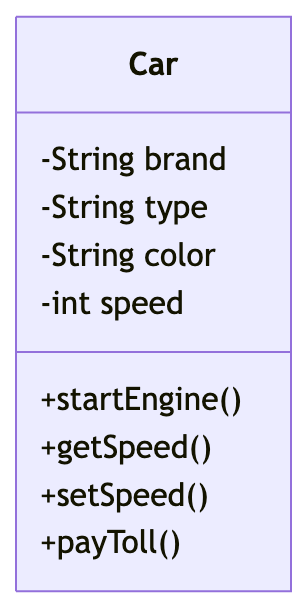

Dalam Mermaid, ada dua cara untuk mendefinisikan sebuah kelas:

1. Secara eksplisit menggunakan kata kunci **class** seperti `class Car` yang akan mendefinisikan kelas Car.
2. Secara implisit melalui **relasi (relationship)** yang mendefinisikan dua kelas sekaligus beserta relasi. Misalnya, `Car <|-- HybridCar`.

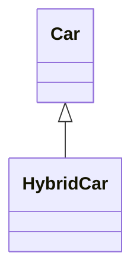

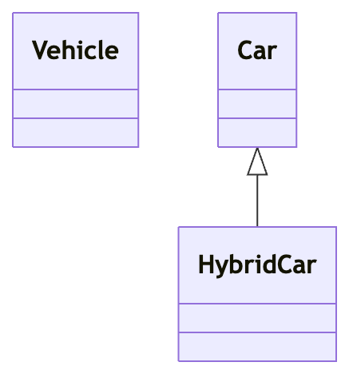

### A. Konvensi Penamaan Kelas dalam Java

Dalam bahasa pemrograman Java, penamaan kelas mengikuti konvensi yang sangat baku agar kode tetap rapi, konsisten, dan mudah dipahami oleh sesama *developer*.

Berikut adalah aturan utama untuk konvensi penamaan kelas di Java:

* **PascalCase (UpperCamelCase):** Huruf pertama dari nama kelas harus **selalu diawali dengan huruf kapital**. Jika nama kelas terdiri dari beberapa kata, huruf pertama dari setiap kata berikutnya juga harus dikapitalisasi, tanpa ada spasi di antaranya.
* **Kata Benda (Noun):** Karena sebuah kelas pada dasarnya merepresentasikan sebuah objek atau entitas, gunakan kata benda atau frasa kata benda yang deskriptif.
* **Deskriptif dan Jelas:** Nama kelas harus dengan jelas mendeskripsikan tujuan atau apa yang diwakilinya. Usahakan menggunakan nama yang utuh dan hindari singkatan yang tidak umum (kecuali singkatan standar seperti URL, XML, atau HTML).
* **Hindari Karakter Khusus:** Meskipun Java secara teknis mengizinkan karakter seperti *underscore* (`_`) atau tanda dolar (`$`), penggunaannya **sangat tidak disarankan** untuk nama kelas. Selain itu, Anda tidak boleh menggunakan karakter spasi.

Contoh Penerapan:

* `Mahasiswa`
* `RekeningBank`
* `mahasiswa` ❌ (Diawali huruf kecil, ini adalah gaya penamaan untuk variabel atau objek).
* `rekening_bank` ❌ (Menggunakan *snake_case*, yang mana tidak umum untuk penamaan di Java).
* `HitungTotal` ❌ (Ini adalah frasa kata kerja, sehingga lebih cocok untuk nama *method*/fungsi).
* `DataMhs` ❌ (Penggunaan singkatan yang bisa menimbulkan ambiguitas).

---

## 2. Atribut dan Metode dalam Kelas

UML menyediakan mekanisme untuk merepresentasikan anggota kelas seperti atribut dan metode, serta informasi tambahan tentangnya. Dalam class diagram UML, atribut biasanya ditulis dengan format:

```text
visibilitas namaAtribut : TipeData
```

Contoh:

```text
+brand : String
-year : int
#price : double
```

Sedangkan metode ditulis dengan format:

```text
visibilitas namaMethod(parameter: TipeData) TipeKembalian
```

Contoh:

```text
#login()
+getName() String
+setName(name: String) void
+calculateTotal(price: double, qty: int) double
-withdraw(amount: double) boolean
```

Mermaid membedakan antara atribut dan fungsi/metode berdasarkan ada atau tidaknya **tanda kurung** `()`. Untuk mendefinisikan seluruh anggota kelas, kita menggunakan kurung kurawal **{}**.

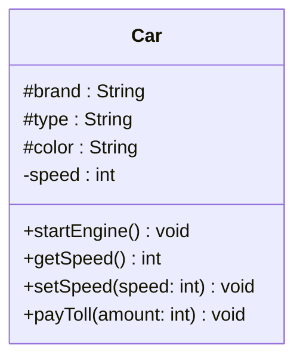

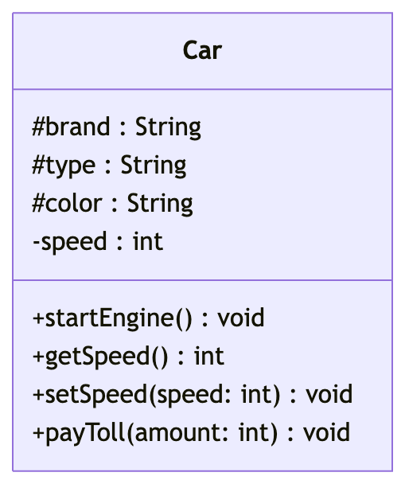

### A. Konvensi Penamaan Method

**Method** digunakan untuk melakukan suatu tindakan, sehingga penamaannya harus merepresentasikan tindakan tersebut.

* **lowerCamelCase:** Huruf pertama harus diawali dengan **huruf kecil**. Jika nama *method* terdiri dari beberapa kata, huruf pertama dari kata kedua dan seterusnya harus dikapitalisasi.
* **Kata Kerja (Verb):** Karena *method* melakukan aksi, gunakan kata kerja atau frasa kata kerja.
* **Pasangan yang Logis:** Untuk *method* yang memanipulasi data, gunakan awalan standar seperti `get` (mengambil nilai), `set` (mengubah nilai), atau `is` (untuk mengecek nilai *boolean*).

Contoh Penerapan:

* `hitungTotal()`
* `getDataMahasiswa()`
* `isMahasiswaAktif()`
* `HitungTotal()` ❌ (Diawali huruf kapital, menyerupai nama kelas).
* `hitung_total()` ❌ (Menggunakan *snake_case*).
* `dataMahasiswa()` ❌ (Kata benda, tidak mencerminkan tindakan/aksi).

### B. Konvensi Penamaan Atribut

**Atribut / Variabel** menyimpan status atau data.

* **lowerCamelCase:** Sama seperti *method*, nama variabel harus diawali dengan **huruf kecil**, dan kata berikutnya diawali dengan huruf kapital.
* **Kata Benda (Noun):** Nama variabel harus mendeskripsikan data apa yang disimpannya.
* **Hindari Karakter Khusus:** Jangan menggunakan karakter khusus (seperti `_` atau `$`) di awal nama variabel.
* **Nama yang Deskriptif dan Bermakna:** Hindari penggunaan variabel satu huruf (seperti `x`, `y`, `a`, `b`) kecuali sebagai variabel *counter* sementara di dalam perulangan (*loop*).

Contoh Penerapan:

* `jumlahMahasiswa`
* `hargaTotal`
* `i`, `j`, `k` (Hanya dapat diterima untuk indeks perulangan `for`)
* `JumlahMahasiswa` ❌ (Diawali huruf kapital).
* `jmlhMhs` ❌ (Singkatan yang sulit dibaca/diucapkan).
* `variabel1` ❌ (Tidak mendeskripsikan data yang disimpan).

### C. Return Type (Tipe Kembalian)

| Return Type  | Keterangan                                     | Contoh                                 |
| ------------ | ---------------------------------------------- | -------------------------------------- |
| `void`     | Method tidak mengembalikan nilai               | `+setName(name: String) void`        |
| `String`   | Mengembalikan teks                             | `+getName() String`                  |
| `int`      | Mengembalikan bilangan bulat                   | `+getAge() int`                      |
| `double`   | Mengembalikan bilangan desimal                 | `+getPrice() double`                 |
| `boolean`  | Mengembalikan nilai benar atau salah           | `+isActive() boolean`                |
| `char`     | Mengembalikan satu karakter                    | `+getGrade() char`                   |
| `float`    | Mengembalikan bilangan desimal presisi tunggal | `+getScore() float`                  |
| `long`     | Mengembalikan bilangan bulat besar             | `+getPopulation() long`              |
| `Object`   | Mengembalikan objek umum                       | `+getData() Object`                  |
| `Class`    | Mengembalikan objek dari class tertentu        | `+getCustomer() Customer`            |
| `Array`    | Mengembalikan array                            | `+getScores() int[]`                 |
| `List<T>`  | Mengembalikan daftar data                      | `+getStudents() List~Student~`       |
| `Set<T>`   | Mengembalikan kumpulan data unik               | `+getTags() Set~String~`             |
| `Map<K,V>` | Mengembalikan pasangan key-value               | `+getSettings() Map~String,Integer~` |

### D. Visibilitas

| Simbol | Akses            | Penjelasan                                                                  |
| ------ | ---------------- | --------------------------------------------------------------------------- |
| `+`  | Public           | Dapat diakses dari mana saja, baik dari dalam class maupun dari class lain. |
| `-`  | Private          | Hanya dapat diakses dari dalam class itu sendiri.                           |
| `#`  | Protected        | Dapat diakses dari dalam class itu sendiri dan dari class turunan.          |
| `~`  | Package/Internal | Dapat diakses oleh class lain yang masih berada dalam package yang sama.    |

### D. Classifiers

Kita juga dapat menyertakan **classifiers** tambahan ke definisi metode atau atribut dengan menambahkan notasi berikut ke bagian **akhir** metode atau atribut, yaitu: setelah `()` atau setelah return type:

| Simbol                                                                                               | Keterangan         | Contoh                                                       |
| ---------------------------------------------------------------------------------------------------- | ------------------ | ------------------------------------------------------------ |
| `*`                                                                                                | Abstrak (Abstract) | `someAbstractMethod()*` atau `someAbstractMethod() int*` |
| `$`    | Statis (Static) pada method | `someStaticMethod()$` atau `someStaticMethod() String$` |                    |                                                              |
| `$`    | Statis (Static) pada field  | `CONSTANT_FIELD: String$`                                 |                    |                                                              |

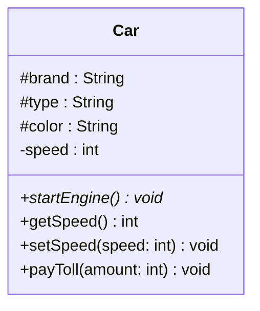

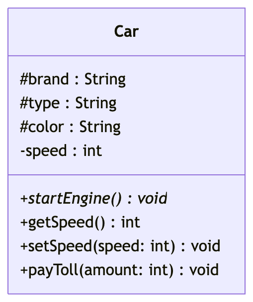

### E. Constructor

**Constructor** adalah method khusus yang digunakan untuk membuat atau menginisialisasi objek dari sebuah class. Constructor **tidak wajib** ditampilkan dalam class diagram.

Constructor perlu ditampilkan jika:

- penting untuk menunjukkan cara objek dibuat
- **class memiliki lebih dari satu constructor**
- diagram digunakan sampai tahap implementasi
- parameter constructor perlu dijelaskan

Constructor tidak perlu ditampilkan jika:

- diagram masih bersifat konsep atau analisis
- fokus diagram adalah struktur class dan hubungan antar class
- constructor tidak memberi informasi tambahan yang penting

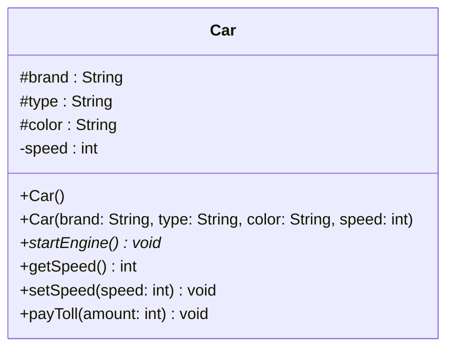

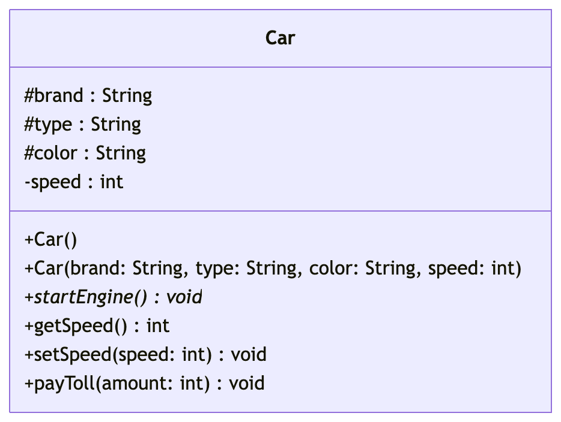

### F. Konvensi Penamaan Konstanta

**Konstanta** adalah variabel yang nilainya tetap dan tidak dapat diubah (dideklarasikan dengan *keyword* `static final`).

Konvensi Penamaan:

* **UPPER_SNAKE_CASE:** Semua huruf harus **KAPITAL**.
* **Underscore (`_`):** Jika terdiri dari beberapa kata, pisahkan setiap kata menggunakan karakter garis bawah (*underscore*).

Contoh Penerapan:

* `MAKSIMUM_KAPASITAS`
* `NILAI_PI`
* `STATUS_AKTIF`
* `MaksimumKapasitas` ❌ (Menggunakan PascalCase).
* `maksimum_kapasitas` ❌ (Huruf kecil semua).

Pada Mermaid, tambahkan `$` di akhir tipe data (lihat bagian [Classifiers](#d-classifiers))

---

## 3. Relasi antar Kelas

**Relasi** (*Relationship*) adalah istilah umum yang mencakup jenis koneksi logis tertentu yang ditemukan pada diagram kelas dan objek.

```
[kelasA][Panah][KelasB]

```

Ada delapan jenis relasi berbeda yang didefinisikan untuk kelas di bawah UML yang saat ini didukung oleh Mermaid:

| Type     | Description   |
| -------- | ------------- |
| `<\|--` | Inheritance   |
| `*--`  | Composition   |
| `o--`  | Aggregation   |
| `-->`  | Association   |
| `--`   | Link (Solid)  |
| `..>`  | Dependency    |
| `..\|>` | Realization   |
| `..`   | Link (Dashed) |

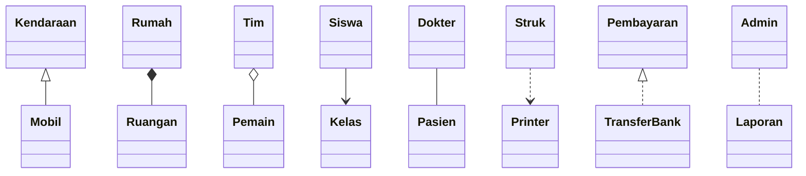

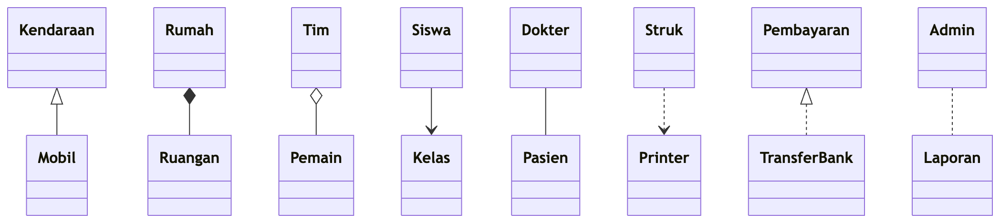

| Jenis Relationship | Penjelasan                                                                            |
| ------------------ | ------------------------------------------------------------------------------------- |
| Inheritance        | Kelas anak mewarisi sifat dari kelas induk.                                           |
| Composition        | Satu objek terdiri dari objek lain, dan bagian itu ikut hilang jika induknya dihapus. |
| Aggregation        | Satu objek memiliki objek lain, tetapi objek itu masih bisa berdiri sendiri.          |
| Association        | Dua kelas saling berhubungan atau saling menggunakan.                                 |
| Link (Solid)       | Hubungan umum antar kelas.                                                            |
| Dependency         | Satu kelas bergantung pada kelas lain.                                                |
| Realization        | Kelas menerapkan interface.                                                           |
| Link (Dashed)      | Hubungan umum tidak langsung antar kelas.                                             |

Kita dapat menambahkan label untuk menggambarkan sifat relasi antara dua kelas. Selain itu, mata panah dapat digunakan dalam arah yang berlawanan juga.

```
[kelasA][Panah][KelasB]: TeksLabel

```

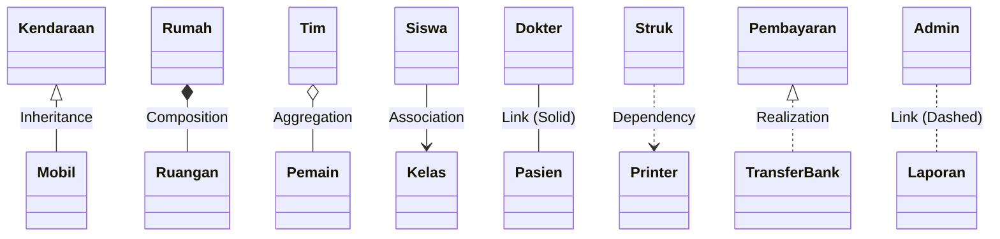

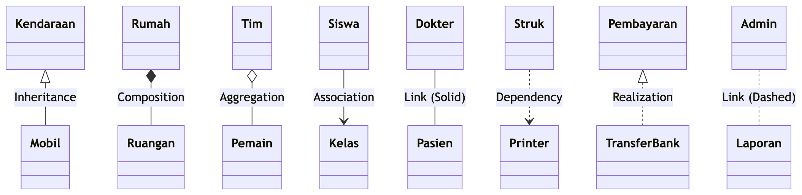

Jika kita hubungkan dengan studi kasus mobil, maka diagram kelasnya adalah sebagai berikut:

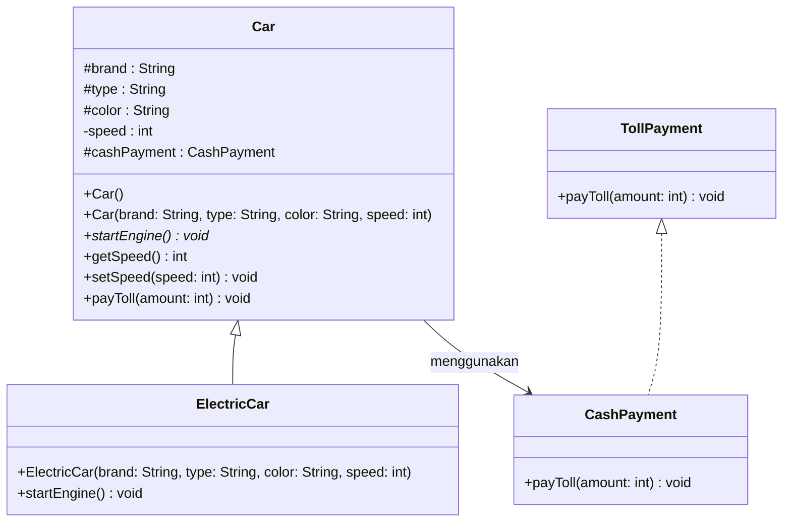


Mengapa relasi antara Car dan CashPayment adalah **association**?

- Walaupun di Java, hubungan Car dan CashPayment tampak seperti **composition** karena satu objek menyimpan objek lain sebagai atribut, di UML belum tentu itu composition. Kita perlu melihat dari konteks objeknya.
- Dalam case ini, hubungan Car dan CashPayment adalah asosiasi, karena CashPayment bukan bagian penyusun Car. CashPayment hanyalah cara bayar yang digunakan mobil atau pemiliknya.

| Jenis Relasi | Definisi                                      | Kepemilikan                  | Ketergantungan Objek                               | Contoh                 |
| ------------ | --------------------------------------------- | ---------------------------- | -------------------------------------------------- | ---------------------- |
| Association  | Dua kelas saling berhubungan                  | Tidak menandakan kepemilikan | Objek bisa berdiri sendiri                         | `Customer --> Order` |
| Aggregation  | Satu objek memiliki objek lain                | Kepemilikan lemah            | Objek bagian tetap bisa ada walau induknya dihapus | `Team o-- Player`    |
| Composition  | Satu objek terdiri dari bagian-bagian penting | Kepemilikan kuat             | Objek bagian ikut hilang jika induknya dihapus     | `House *-- Room`     |

### A. Relasi Dua Arah

Relasi dua arah adalah hubungan antara dua kelas yang **saling terhubung dan saling mengetahui**. Relasi ini digunakan ketika hubungan penting dilihat dari **kedua sisi**.

Contoh case:

- **Mahasiswa** mengetahui **MataKuliah**
- **MataKuliah** mengetahui **Mahasiswa**

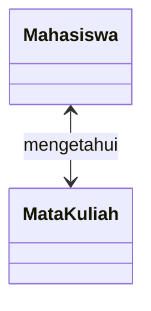

Sedangkan jika relasi satu arah, hubungan antara dua kelas yang **hanya diketahui oleh satu sisi saja**. Relasi ini digunakan ketika hanya satu kelas yang perlu berhubungan langsung dengan kelas lain.

Contoh case:

- **Kasir** mencetak **Struk**

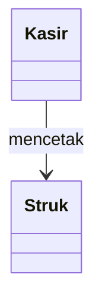

| Aspek         | Relasi Satu Arah                           | Relasi Dua Arah                             |
| ------------- | ------------------------------------------ | ------------------------------------------- |
| Arah hubungan | Hanya satu sisi                            | Kedua sisi                                  |
| Referensi     | Satu kelas mengetahui kelas lain           | Kedua kelas saling mengetahui               |
| Kompleksitas  | Lebih sederhana                            | Lebih kompleks                              |
| Penggunaan    | Jika hubungan cukup dilihat dari satu sisi | Jika hubungan penting dilihat dari dua sisi |

---

## 4. Kardinalitas pada Relasi (Cardinality)

**Multiplisitas atau kardinalitas** dalam diagram kelas menunjukkan jumlah instansiasi objek dari satu kelas yang dapat dihubungkan dengan instansiasi objek dari kelas lainnya. Notasi kardinalitas ditempatkan di dekat akhir dari suatu relasi.

| Kardinalitas | Arti                            |
| ------------ | ------------------------------- |
| `1`        | Hanya 1                         |
| `0..1`     | Nol atau satu                   |
| `1..*`     | Satu atau lebih                 |
| `*`        | Banyak (many)                   |
| `n`        | Sebanyak n, dengan `n > 1`    |
| `0..n`     | Nol hingga n, dengan `n > 1`  |
| `1..n`     | Satu hingga n, dengan `n > 1` |

Kardinalitas dapat dengan mudah ditentukan dengan menempatkan opsi teks dalam tanda kutip `"` sebelum atau sesudah panah tertentu.

```
[kelasA] "kardinalitas1" [Panah] "kardinalitas2" [KelasB]:TeksLabel

```

Tidak semua relasi memiliki kardinalitas. Berikut adalah penjelasan untuk setiap relasinya.

| Relasi        | Bisa pakai cardinality?                     | Keterangan                                                          |
| ------------- | ------------------------------------------- | ------------------------------------------------------------------- |
| Association   | Ya                                          | Paling umum digunakan untuk menunjukkan jumlah hubungan antar objek |
| Aggregation   | Ya                                          | Karena aggregation adalah bentuk khusus dari association            |
| Composition   | Ya                                          | Karena composition juga bentuk khusus dari association              |
| Inheritance   | Tidak                                       | Karena ini hubungan pewarisan, bukan jumlah keterhubungan objek     |
| Realization   | Tidak                                       | Karena ini hubungan implementasi interface                          |
| Dependency    | Biasanya tidak                              | Karena hanya menunjukkan ketergantungan/pemakaian                   |
| Link (Solid)  | Bisa, jika dipakai sebagai association umum | Tergantung konteks diagram                                          |
| Link (Dashed) | Biasanya tidak                              | Umumnya bukan untuk multiplicity                                    |

Contoh:

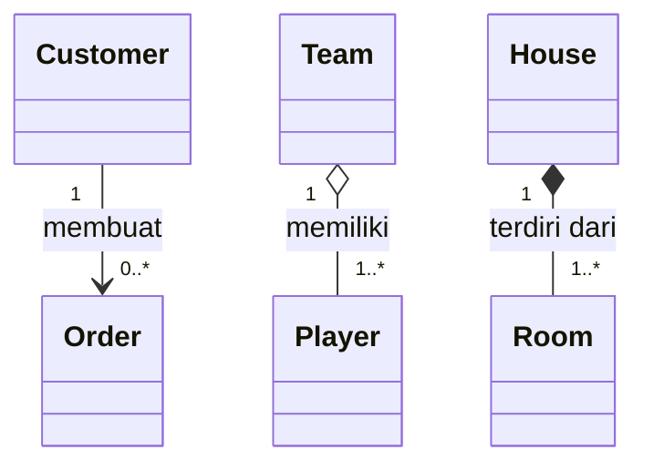

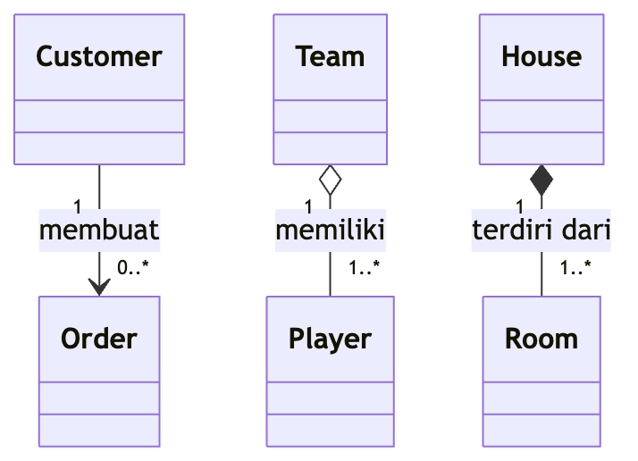

Jika kita hubungkan dengan studi kasus mobil, maka diagram kelasnya adalah sebagai berikut:

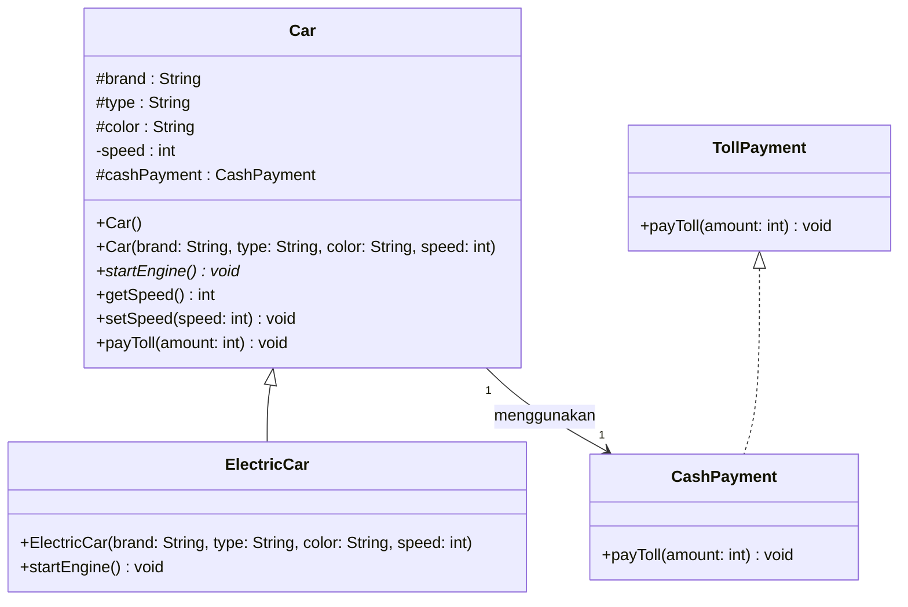

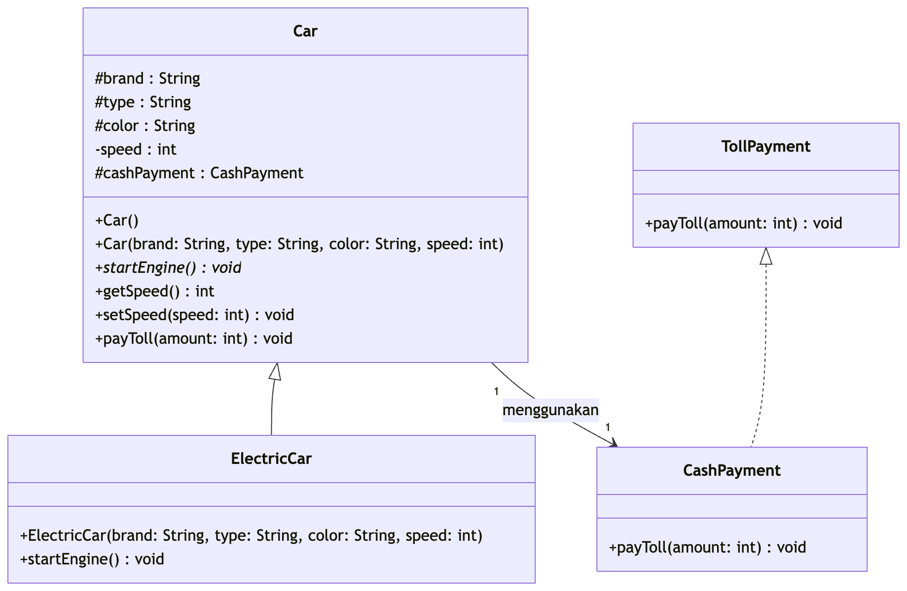

---

## 5. Anotasi pada Kelas (Class)

Kita bisa membubuhi keterangan (anotasi) pada kelas dengan penanda untuk memberikan keterangan tambahan tentang kelas tersebut. Beberapa anotasi yang umum meliputi:

| Anotasi             | Keterangan                                          |
| ------------------- | --------------------------------------------------- |
| `<<Interface>>`   | Untuk merepresentasikan kelas interface (antarmuka) |
| `<<Abstract>>`    | Untuk merepresentasikan kelas abstrak               |
| `<<Service>>`     | Untuk merepresentasikan kelas layanan (service)     |
| `<<Enumeration>>` | Untuk merepresentasikan enum                        |

Anotasi didefinisikan di dalam `<<` pembuka dan `>>` penutup. Ada tiga cara untuk menambahkan anotasi ke sebuah kelas, dan dalam semua kasus outputnya akan sama:

1. **Sejajar (Inline)** dengan definisi kelas:

   ```mermaid-example
   classDiagram
     class Shape <<interface>>

   ```
2. Dalam **baris terpisah** setelah kelas didefinisikan:

   ```mermaid-example
   classDiagram
     class Shape
     <<interface>> Shape
     Shape : noOfVertices
     Shape : draw()

   ```
3. Dalam **struktur bersarang (nested)** bersama dengan definisi kelas:

   ```mermaid-example
   classDiagram
     class Shape{
         <<interface>>
         noOfVertices
         draw()
     }
     class Color{
         <<enumeration>>
         RED
         BLUE
         GREEN
         WHITE
         BLACK
     }

   ```

Jika kita hubungkan dengan studi kasus mobil, maka diagram kelasnya adalah sebagai berikut:

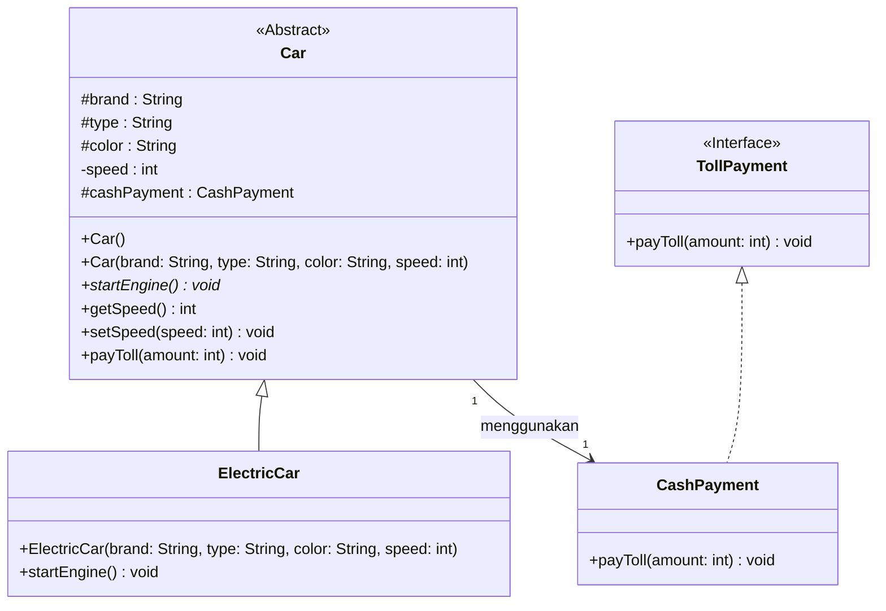

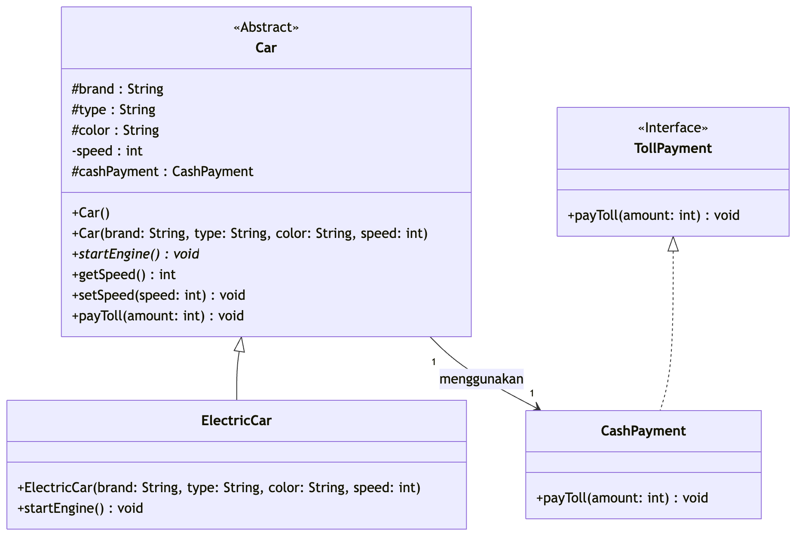

### A. Konvensi Penamaan Interface

**Interface** mendefinisikan kontrak yang harus diikuti oleh kelas yang mengimplementasikannya.

* **PascalCase (UpperCamelCase):** Sama seperti penamaan Kelas, diawali dengan **huruf kapital**.
* **Kata Sifat (Adjective) atau Kata Benda:** Tergantung pada tujuannya. Seringkali *interface* berakhiran dengan `-able` atau `-ible` jika mendefinisikan sebuah kemampuan.

Contoh Penerapan:

* `Runnable` (Kata sifat/kemampuan)
* `Serializable` (Kata sifat/kemampuan)
* `Kendaraan` (Kata benda, jika *interface* mendefinisikan entitas abstrak)
* `DapatTerbang`
* `runnable` ❌ (Diawali huruf kecil).
* `aksiBerjalan` ❌ (Menyerupai nama *method*).

## 6. Perbaikan

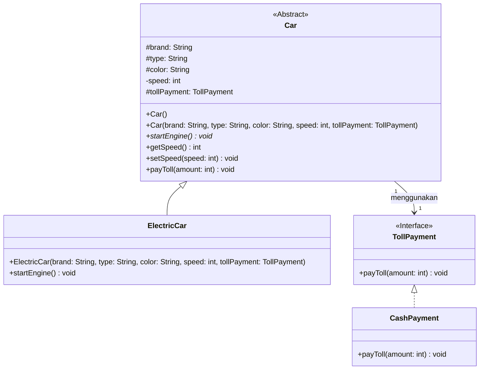

Perbaikan

1. Relasi `Car --> CashPayment` diganti jadi `Car --> TollPayment`

   Kalau `CashPayment` adalah implementasi dari `TollPayment`, maka `Car` sebaiknya bergantung pada **interface** `TollPayment`, bukan langsung ke `CashPayment`. Ini lebih fleksibel dan lebih sesuai OOP.
2. Atribut `cashPayment` diganti jadi `tollPayment: TollPayment`

   Atribut di abstract class sebaiknya memakai tipe interface, supaya nanti bisa diganti dengan implementasi lain seperti:

   * `CashPayment`
   * `CardPayment`
   * `EmoneyPayment`
3. Constructor diperbaiki

   Sebelumnya constructor `Car` dan `ElectricCar` belum menerima objek pembayaran, padahal class punya atribut pembayaran.

   Diubah menjadi:

   ```text
   +Car(brand: String, type: String, color: String, speed: int, tollPayment: TollPayment)
   ```

   dan

   ```text
   +ElectricCar(brand: String, type: String, color: String, speed: int, tollPayment: TollPayment)
   ```

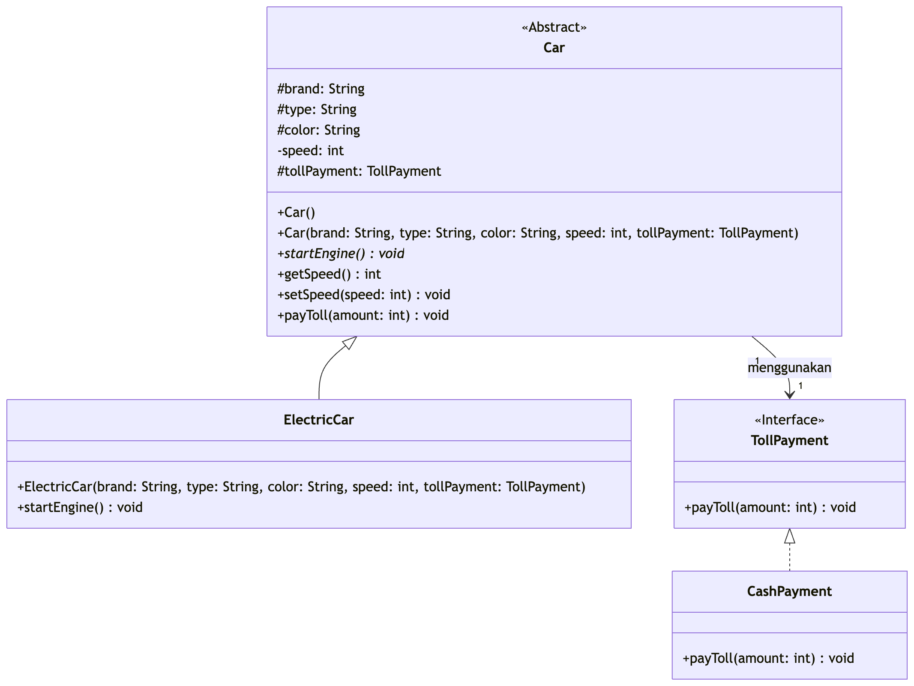

Hasil perbaikan di atas bisa diakses pada kode berikut:
[AppFinal.java](java/1-oop-car/src/AppFinal.java)
