# Module 06: Analisis Kompleksitas Struktur Data

## Daftar Isi
1. [Pengenalan Kompleksitas](#pengenalan-kompleksitas)
2. [Big O Notation](#big-o-notation)
3. [Jenis-jenis Kompleksitas Waktu](#jenis-jenis-kompleksitas-waktu)
4. [Kompleksitas Ruang (Space Complexity)](#kompleksitas-ruang-space-complexity)
5. [Analisis Kompleksitas Struktur Data](#analisis-kompleksitas-struktur-data)
   - [Array](#kompleksitas-array)
   - [Linked List](#kompleksitas-linked-list)
   - [Stack](#kompleksitas-stack)
   - [Queue](#kompleksitas-queue)
6. [Perbandingan Struktur Data](#perbandingan-struktur-data)
7. [Contoh Analisis Algoritma](#contoh-analisis-algoritma)
8. [Best, Average, dan Worst Case](#best-average-dan-worst-case)
9. [Tips Optimasi](#tips-optimasi)
10. [Latihan Analisis](#latihan-analisis)

---

## Pengenalan Kompleksitas

### Apa itu Kompleksitas Algoritma?

Kompleksitas algoritma adalah ukuran yang digunakan untuk menganalisis efisiensi algoritma dan struktur data. Analisis kompleksitas membantu kita memahami bagaimana performa algoritma berubah seiring bertambahnya ukuran input.

### Mengapa Kompleksitas Penting?

1. **Prediksi Performa** - Memperkirakan waktu eksekusi dan penggunaan memori
2. **Perbandingan Algoritma** - Memilih algoritma terbaik untuk masalah tertentu
3. **Skalabilitas** - Memahami bagaimana algoritma berperilaku dengan data besar
4. **Optimasi** - Mengidentifikasi bottleneck dan area perbaikan

### Dua Jenis Kompleksitas

| Jenis | Deskripsi | Pertanyaan |
|-------|-----------|------------|
| **Time Complexity** | Jumlah operasi yang dilakukan | "Berapa lama waktu yang dibutuhkan?" |
| **Space Complexity** | Jumlah memori yang digunakan | "Berapa banyak memori yang dibutuhkan?" |

---

## Big O Notation

### Apa itu Big O Notation?

Big O Notation adalah notasi matematika yang menggambarkan batas atas (upper bound) dari kompleksitas algoritma. Big O fokus pada pertumbuhan fungsi saat input mendekati tak hingga, mengabaikan konstanta dan terms yang lebih kecil.

### Contoh:
```
f(n) = 3n² + 5n + 100

Big O: O(n²)
```
- Konstanta 3 diabaikan
- Term 5n diabaikan (lebih kecil dari n²)
- Konstanta 100 diabaikan

### Notasi Kompleksitas Umum

| Notasi | Nama | Deskripsi | Contoh |
|--------|------|-----------|--------|
| O(1) | Constant | Tidak bergantung pada ukuran input | Akses array dengan index |
| O(log n) | Logarithmic | Berkurang setengah setiap iterasi | Binary search |
| O(n) | Linear | Berbanding lurus dengan input | Linear search |
| O(n log n) | Linearithmic | n kali logaritma | Merge sort, Quick sort |
| O(n²) | Quadratic | Kuadrat dari input | Bubble sort, Selection sort |
| O(n³) | Cubic | Kubik dari input | Matrix multiplication naif |
| O(2ⁿ) | Exponential | Dua pangkat n | Fibonacci rekursif |
| O(n!) | Factorial | Faktorial dari n | Permutasi brute force |

### Urutan Kompleksitas (Tercepat ke Terlambat)

```
O(1) < O(log n) < O(√n) < O(n) < O(n log n) < O(n²) < O(n³) < O(2ⁿ) < O(n!)
```

### Visualisasi Pertumbuhan

```
Untuk n = 1000:

O(1)       = 1
O(log n)   = ~10
O(n)       = 1,000
O(n log n) = ~10,000
O(n²)      = 1,000,000
O(n³)      = 1,000,000,000
O(2ⁿ)      = Tidak terhitung (terlalu besar)
```

### Grafik Pertumbuhan

```
    ^
    |                                          O(n!)
    |                                       O(2ⁿ)
    |                                    O(n³)
Time|                              O(n²)
    |                         O(n log n)
    |                    O(n)
    |               O(√n)
    |          O(log n)
    |     O(1)
    +------------------------------------------------->
                          n (ukuran input)
```

---

## Jenis-jenis Kompleksitas Waktu

### O(1) - Constant Time

Waktu eksekusi tetap sama tidak peduli ukuran input.

```java
// Contoh O(1)
public int getFirst(int[] arr) {
    return arr[0];  // Selalu satu operasi
}

public void push(int value) {
    stack[++top] = value;  // Operasi konstan
}

public int peek() {
    return stack[top];  // Akses langsung
}
```

**Karakteristik:**
- Tidak ada loop yang bergantung pada n
- Operasi langsung tanpa iterasi

---

### O(log n) - Logarithmic Time

Waktu eksekusi meningkat secara logaritmik. Biasanya terjadi ketika masalah dipecah menjadi setengah setiap iterasi.

```java
// Binary Search - O(log n)
public int binarySearch(int[] arr, int target) {
    int left = 0;
    int right = arr.length - 1;

    while (left <= right) {
        int mid = left + (right - left) / 2;

        if (arr[mid] == target) {
            return mid;
        } else if (arr[mid] < target) {
            left = mid + 1;  // Abaikan setengah kiri
        } else {
            right = mid - 1; // Abaikan setengah kanan
        }
    }
    return -1;
}
```

**Karakteristik:**
- Masalah dipecah menjadi setengah setiap iterasi
- Contoh: Binary search, operasi pada balanced BST

**Analisis:**
```
n = 16
Iterasi 1: n = 16
Iterasi 2: n = 8
Iterasi 3: n = 4
Iterasi 4: n = 2
Iterasi 5: n = 1

Total iterasi = log₂(16) = 4
```

---

### O(n) - Linear Time

Waktu eksekusi berbanding lurus dengan ukuran input.

```java
// Linear Search - O(n)
public int linearSearch(int[] arr, int target) {
    for (int i = 0; i < arr.length; i++) {  // Loop n kali
        if (arr[i] == target) {
            return i;
        }
    }
    return -1;
}

// Traverse Linked List - O(n)
public void display() {
    Node current = head;
    while (current != null) {  // Loop n kali
        System.out.print(current.data + " ");
        current = current.next;
    }
}

// Mencari nilai dalam stack - O(n)
public int search(int value) {
    for (int i = top; i >= 0; i--) {  // Loop n kali
        if (stack[i] == value) {
            return top - i + 1;
        }
    }
    return -1;
}
```

**Karakteristik:**
- Satu loop yang iterasi n kali
- Setiap elemen diproses sekali

---

### O(n log n) - Linearithmic Time

Kombinasi linear dan logarithmic. Biasanya terjadi pada algoritma divide and conquer.

```java
// Merge Sort - O(n log n)
public void mergeSort(int[] arr, int left, int right) {
    if (left < right) {
        int mid = left + (right - left) / 2;

        mergeSort(arr, left, mid);       // T(n/2)
        mergeSort(arr, mid + 1, right);  // T(n/2)
        merge(arr, left, mid, right);    // O(n)
    }
}

// Recurrence: T(n) = 2T(n/2) + O(n) = O(n log n)
```

**Karakteristik:**
- Divide: membagi masalah (log n level)
- Conquer: menggabungkan hasil (n operasi per level)
- Total: n × log n

---

### O(n²) - Quadratic Time

Waktu eksekusi meningkat secara kuadratik.

```java
// Bubble Sort - O(n²)
public void bubbleSort(int[] arr) {
    int n = arr.length;
    for (int i = 0; i < n - 1; i++) {           // Loop n kali
        for (int j = 0; j < n - i - 1; j++) {   // Loop n kali
            if (arr[j] > arr[j + 1]) {
                // Swap
                int temp = arr[j];
                arr[j] = arr[j + 1];
                arr[j + 1] = temp;
            }
        }
    }
}

// Nested Loop - O(n²)
public void printPairs(int[] arr) {
    for (int i = 0; i < arr.length; i++) {
        for (int j = 0; j < arr.length; j++) {
            System.out.println(arr[i] + ", " + arr[j]);
        }
    }
}
```

**Karakteristik:**
- Nested loop (loop di dalam loop)
- Setiap elemen dibandingkan dengan setiap elemen lain

---

### O(2ⁿ) - Exponential Time

Waktu eksekusi berlipat ganda setiap penambahan input.

```java
// Fibonacci Rekursif - O(2ⁿ)
public int fibonacci(int n) {
    if (n <= 1) {
        return n;
    }
    return fibonacci(n - 1) + fibonacci(n - 2);
}

// Setiap pemanggilan menghasilkan dua pemanggilan baru
// Tree rekursi:
//                    fib(5)
//                   /      \
//              fib(4)      fib(3)
//             /    \       /    \
//         fib(3) fib(2) fib(2) fib(1)
//         ...
```

**Karakteristik:**
- Setiap langkah menghasilkan dua atau lebih submasalah
- Sangat tidak efisien untuk input besar

---

## Kompleksitas Ruang (Space Complexity)

### Apa itu Space Complexity?

Space complexity mengukur jumlah memori yang digunakan oleh algoritma, termasuk:

1. **Input space** - Memori untuk menyimpan input
2. **Auxiliary space** - Memori tambahan yang digunakan algoritma
3. **Total space** = Input space + Auxiliary space

### Contoh Space Complexity

```java
// O(1) Space - Konstanta
public int sum(int[] arr) {
    int total = 0;  // Satu variabel
    for (int i = 0; i < arr.length; i++) {
        total += arr[i];
    }
    return total;
}
// Hanya menggunakan variabel total dan i, tidak bergantung pada n

// O(n) Space - Linear
public int[] copy(int[] arr) {
    int[] newArr = new int[arr.length];  // Array baru ukuran n
    for (int i = 0; i < arr.length; i++) {
        newArr[i] = arr[i];
    }
    return newArr;
}

// O(n) Space - Rekursi
public int factorial(int n) {
    if (n <= 1) return 1;
    return n * factorial(n - 1);  // Call stack depth = n
}
// Setiap rekursi menambah frame di call stack
```

### Space Complexity Struktur Data

| Struktur Data | Space Complexity |
|---------------|------------------|
| Array | O(n) |
| Linked List | O(n) |
| Stack (array) | O(n) |
| Stack (linked list) | O(n) |
| Queue (array) | O(n) |
| Queue (linked list) | O(n) |

---

## Analisis Kompleksitas Struktur Data

### Class Diagram Ringkasan Struktur Data

Berikut adalah class diagram ringkasan untuk semua struktur data yang dianalisis kompleksitasnya:

```mermaid
classDiagram
    class Array {
        -int[] data
        -int size
        -int capacity
        +get(index: int) int
        +set(index: int, value: int) void
        +insert(index: int, value: int) void
        +delete(index: int) int
        +search(value: int) int
        +size() int
    }
    note for Array "Access: O(1)\nSearch: O(n)\nInsert: O(n)\nDelete: O(n)"

    class SingleLinkedList {
        -Node head
        -int size
        +insertAtBeginning(data: int) void
        +insertAtEnd(data: int) void
        +deleteAtBeginning() int
        +deleteAtEnd() int
        +search(value: int) int
        +get(index: int) int
    }
    note for SingleLinkedList "Access: O(n)\nSearch: O(n)\nInsert Head: O(1)\nDelete Head: O(1)"

    class DoubleLinkedList {
        -DoubleNode head
        -DoubleNode tail
        -int size
        +insertAtBeginning(data: int) void
        +insertAtEnd(data: int) void
        +deleteAtBeginning() int
        +deleteAtEnd() int
    }
    note for DoubleLinkedList "Insert/Delete Head: O(1)\nInsert/Delete Tail: O(1)"

    class Stack {
        -int[] array
        -int top
        +push(value: int) void
        +pop() int
        +peek() int
        +isEmpty() boolean
    }
    note for Stack "Push: O(1)\nPop: O(1)\nPeek: O(1)"

    class Queue {
        -int[] array
        -int front
        -int rear
        +enqueue(value: int) void
        +dequeue() int
        +peek() int
        +isEmpty() boolean
    }
    note for Queue "Enqueue: O(1)\nDequeue: O(1)\nPeek: O(1)"

    class HashTable {
        -Entry[] table
        -int size
        +put(key: K, value: V) void
        +get(key: K) V
        +remove(key: K) void
        +containsKey(key: K) boolean
    }
    note for HashTable "Insert: O(1) avg\nSearch: O(1) avg\nDelete: O(1) avg"
```



---

### Kompleksitas Array

| Operasi | Time Complexity | Space Complexity |
|---------|----------------|------------------|
| Access by index | O(1) | O(1) |
| Search (unsorted) | O(n) | O(1) |
| Search (sorted) | O(log n) | O(1) |
| Insert at end | O(1) amortized | O(1) |
| Insert at beginning | O(n) | O(1) |
| Insert at middle | O(n) | O(1) |
| Delete at end | O(1) | O(1) |
| Delete at beginning | O(n) | O(1) |
| Delete at middle | O(n) | O(1) |

**Penjelasan:**

```java
// Access by index - O(1)
int value = arr[5];  // Langsung mengakses alamat memori

// Insert at beginning - O(n)
public void insertAtBeginning(int[] arr, int value) {
    // Shift semua elemen ke kanan
    for (int i = arr.length - 1; i > 0; i--) {  // O(n)
        arr[i] = arr[i - 1];
    }
    arr[0] = value;
}

// Delete at middle - O(n)
public void deleteAt(int[] arr, int index) {
    // Shift semua elemen setelah index ke kiri
    for (int i = index; i < arr.length - 1; i++) {  // O(n)
        arr[i] = arr[i + 1];
    }
}
```

---

### Kompleksitas Linked List

#### Single Linked List

| Operasi | Time Complexity | Penjelasan |
|---------|----------------|------------|
| Access by index | O(n) | Harus traverse dari head |
| Search | O(n) | Harus cek setiap node |
| Insert at beginning | O(1) | Update head pointer |
| Insert at end (tanpa tail) | O(n) | Traverse ke akhir |
| Insert at end (dengan tail) | O(1) | Akses tail langsung |
| Insert at middle | O(n) | Traverse ke posisi |
| Delete at beginning | O(1) | Update head pointer |
| Delete at end | O(n) | Cari node sebelum tail |
| Delete at middle | O(n) | Traverse ke posisi |

```java
// Insert at beginning - O(1)
public void insertAtBeginning(int data) {
    Node newNode = new Node(data);  // O(1)
    newNode.next = head;            // O(1)
    head = newNode;                 // O(1)
}
// Total: O(1)

// Insert at end tanpa tail pointer - O(n)
public void insertAtEnd(int data) {
    Node newNode = new Node(data);

    if (head == null) {
        head = newNode;
        return;
    }

    Node current = head;
    while (current.next != null) {  // O(n) - traverse
        current = current.next;
    }
    current.next = newNode;
}
// Total: O(n)

// Search - O(n)
public boolean search(int value) {
    Node current = head;
    while (current != null) {       // O(n) - worst case semua node
        if (current.data == value) {
            return true;
        }
        current = current.next;
    }
    return false;
}
```

#### Double Linked List

| Operasi | Time Complexity | Penjelasan |
|---------|----------------|------------|
| Insert at beginning | O(1) | Update head dan prev pointer |
| Insert at end | O(1) | Update tail dan next pointer |
| Delete at beginning | O(1) | Update head |
| Delete at end | O(1) | Update tail (berbeda dari single LL) |
| Delete by value | O(n) | Cari node dulu |

```java
// Delete at end (Double LL) - O(1)
public void deleteAtEnd() {
    if (tail == null) return;

    if (head == tail) {
        head = tail = null;
    } else {
        tail = tail.prev;    // O(1) - langsung akses prev
        tail.next = null;    // O(1)
    }
}
// Total: O(1) - berbeda dari Single LL yang O(n)
```

#### Perbandingan Jenis Linked List

| Operasi | Single LL | Double LL | Circular Single | Circular Double |
|---------|-----------|-----------|-----------------|-----------------|
| Insert at head | O(1) | O(1) | O(1) | O(1) |
| Insert at tail | O(n)* | O(1) | O(1) | O(1) |
| Delete at head | O(1) | O(1) | O(1) | O(1) |
| Delete at tail | O(n) | O(1) | O(n) | O(1) |
| Search | O(n) | O(n) | O(n) | O(n) |
| Reverse | O(n) | O(n) | O(n) | O(n) |

*O(1) jika ada tail pointer

---

### Kompleksitas Stack

| Operasi | Array-based | Linked List-based |
|---------|-------------|-------------------|
| Push | O(1) amortized | O(1) |
| Pop | O(1) | O(1) |
| Peek/Top | O(1) | O(1) |
| isEmpty | O(1) | O(1) |
| isFull | O(1) | N/A |
| Search | O(n) | O(n) |
| Size | O(1) | O(1) |

**Space Complexity:** O(n) untuk keduanya

```java
// Push (Array) - O(1) amortized
public void push(int value) {
    if (top == stack.length - 1) {
        // Resize array - O(n), tapi jarang terjadi
        resize();
    }
    stack[++top] = value;  // O(1)
}
// Amortized O(1) karena resize tidak sering

// Push (Linked List) - O(1)
public void push(int value) {
    StackNode newNode = new StackNode(value);  // O(1)
    newNode.next = top;                         // O(1)
    top = newNode;                              // O(1)
}
// Total: O(1) - selalu konstan, tidak ada resize

// Search - O(n)
public int search(int value) {
    Node current = top;
    int position = 1;
    while (current != null) {  // O(n) worst case
        if (current.data == value) {
            return position;
        }
        current = current.next;
        position++;
    }
    return -1;
}
```

---

### Kompleksitas Queue

| Operasi | Linear Array | Circular Array | Linked List |
|---------|--------------|----------------|-------------|
| Enqueue | O(1) | O(1) | O(1) |
| Dequeue | O(n)* | O(1) | O(1) |
| Peek Front | O(1) | O(1) | O(1) |
| Peek Rear | O(1) | O(1) | O(1) |
| isEmpty | O(1) | O(1) | O(1) |
| isFull | O(1) | O(1) | N/A |

*O(n) karena harus shift elemen

**Space Complexity:** O(n) untuk semua implementasi

```java
// Dequeue (Linear Array) - O(n)
public int dequeue() {
    int value = queue[front];

    // Shift semua elemen ke kiri
    for (int i = 0; i < rear; i++) {  // O(n)
        queue[i] = queue[i + 1];
    }
    rear--;

    return value;
}
// Total: O(n) - operasi shift mahal

// Dequeue (Circular Array) - O(1)
public int dequeue() {
    int value = queue[front];
    front = (front + 1) % maxSize;  // O(1) - hanya update index
    size--;
    return value;
}
// Total: O(1) - tidak ada shift

// Dequeue (Linked List) - O(1)
public int dequeue() {
    int value = front.data;
    front = front.next;  // O(1) - hanya pindah pointer
    if (front == null) {
        rear = null;
    }
    size--;
    return value;
}
// Total: O(1)
```

---

## Perbandingan Struktur Data

### Tabel Perbandingan Komprehensif

| Operasi | Array | Single LL | Double LL | Stack | Queue | Circular Queue |
|---------|-------|-----------|-----------|-------|-------|----------------|
| Access | O(1) | O(n) | O(n) | O(n)* | O(n)* | O(n)* |
| Search | O(n) | O(n) | O(n) | O(n) | O(n) | O(n) |
| Insert (front) | O(n) | O(1) | O(1) | - | - | - |
| Insert (end) | O(1)** | O(n)*** | O(1) | O(1) | O(1) | O(1) |
| Delete (front) | O(n) | O(1) | O(1) | - | O(1) | O(1) |
| Delete (end) | O(1) | O(n) | O(1) | O(1) | - | - |
| Space | O(n) | O(n) | O(n) | O(n) | O(n) | O(n) |

*Tidak sesuai use case
**Amortized O(1), bisa O(n) saat resize
***O(1) dengan tail pointer

### Kapan Menggunakan Apa?

```
┌─────────────────────────────────────────────────────────────────────┐
│                    PANDUAN PEMILIHAN STRUKTUR DATA                   │
├─────────────────────────────────────────────────────────────────────┤
│ Kebutuhan                          │ Pilihan Terbaik                 │
├─────────────────────────────────────────────────────────────────────┤
│ Akses random cepat                 │ Array                           │
│ Insert/delete di awal              │ Linked List                     │
│ Insert/delete di kedua ujung       │ Double Linked List / Deque      │
│ LIFO (Last In First Out)           │ Stack                           │
│ FIFO (First In First Out)          │ Queue                           │
│ Traversal berulang (circular)      │ Circular Linked List            │
│ Traversal dua arah                 │ Double Linked List              │
│ Memory terbatas, ukuran fixed      │ Array                           │
│ Ukuran dinamis                     │ Linked List                     │
│ Cache performance penting          │ Array                           │
└─────────────────────────────────────────────────────────────────────┘
```

### Panduan Pemilihan Berdasarkan Operasi Utama

#### Jika Operasi Utama adalah AKSES DATA:

| Skenario | Pilih | Kompleksitas |
|----------|-------|--------------|
| Akses by index | Array | O(1) |
| Akses elemen terakhir | Array atau Double LL dengan tail | O(1) |
| Akses elemen pertama | Semua struktur | O(1) |
| Akses elemen tengah | Array | O(1) |

#### Jika Operasi Utama adalah INSERT:

| Skenario | Pilih | Kompleksitas |
|----------|-------|--------------|
| Insert di awal | Linked List | O(1) |
| Insert di akhir | Array (amortized) atau Double LL | O(1) |
| Insert di tengah | Linked List (jika posisi diketahui) | O(1) insert, O(n) cari posisi |
| Insert terurut | Array (binary search) | O(log n) cari + O(n) shift |

#### Jika Operasi Utama adalah DELETE:

| Skenario | Pilih | Kompleksitas |
|----------|-------|--------------|
| Delete di awal | Linked List | O(1) |
| Delete di akhir | Double Linked List | O(1) |
| Delete by value | Hash Table | O(1) average |
| Delete di tengah | Linked List | O(1) delete, O(n) cari |

#### Jika Operasi Utama adalah SEARCH:

| Skenario | Pilih | Kompleksitas |
|----------|-------|--------------|
| Search by key | Hash Table | O(1) average |
| Search by value (sorted) | Sorted Array + Binary Search | O(log n) |
| Search by value (unsorted) | Array atau Linked List | O(n) |
| Search min/max | Heap atau Sorted Array | O(1) |

### Flowchart Pemilihan Struktur Data

```
                        START
                          │
                          ▼
            ┌─────────────────────────┐
            │ Apakah ukuran data      │
            │ diketahui dan tetap?    │
            └───────────┬─────────────┘
                        │
              ┌─────────┴─────────┐
              │                   │
             YES                  NO
              │                   │
              ▼                   ▼
        ┌───────────┐      ┌────────────┐
        │   ARRAY   │      │ Linked List│
        └─────┬─────┘      │ atau       │
              │            │ Dynamic    │
              │            │ Array      │
              │            └──────┬─────┘
              │                   │
              ▼                   ▼
     ┌────────────────┐  ┌────────────────┐
     │ Perlu akses    │  │ Insert/Delete  │
     │ random?        │  │ di mana?       │
     └───────┬────────┘  └───────┬────────┘
             │                   │
        ┌────┴────┐         ┌────┴────────┐
       YES       NO         │             │
        │         │      Awal/Akhir    Tengah
        ▼         ▼         │             │
    ┌───────┐ ┌───────┐     ▼             ▼
    │ Array │ │ Stack/│ ┌───────┐    ┌───────┐
    │       │ │ Queue │ │ LinkedList │Array  │
    └───────┘ └───────┘ └───────┘    └───────┘
```

### Trade-off yang Perlu Dipertimbangkan

| Aspek | Array | Linked List | Hash Table | Stack/Queue |
|-------|-------|-------------|------------|-------------|
| **Kecepatan akses** | Sangat cepat | Lambat | Cepat (by key) | Hanya ujung |
| **Penggunaan memory** | Efisien | Overhead pointer | Overhead hash | Efisien |
| **Fleksibilitas ukuran** | Terbatas | Sangat fleksibel | Fleksibel | Tergantung impl |
| **Cache performance** | Sangat baik | Buruk | Sedang | Tergantung impl |
| **Kompleksitas impl** | Mudah | Sedang | Kompleks | Mudah |

---

## Contoh Analisis Algoritma

### Contoh 1: Reverse Linked List

```java
public void reverse() {
    Node prev = null;      // O(1)
    Node current = head;   // O(1)
    Node next = null;      // O(1)

    while (current != null) {      // Loop n kali
        next = current.next;       // O(1)
        current.next = prev;       // O(1)
        prev = current;            // O(1)
        current = next;            // O(1)
    }

    head = prev;  // O(1)
}
```

**Analisis:**
- Inisialisasi: O(1) + O(1) + O(1) = O(1)
- Loop: n × O(1) = O(n)
- Assignment akhir: O(1)
- **Total Time Complexity: O(n)**
- **Space Complexity: O(1)** - hanya 3 variabel pointer

---

### Contoh 2: Palindrome Check dengan Stack

```java
public boolean isPalindrome(String str) {
    ArrayStack stack = new ArrayStack(str.length());  // O(n) space

    // Push semua karakter - O(n)
    for (int i = 0; i < str.length(); i++) {
        stack.push(str.charAt(i));  // O(1) per operasi
    }

    // Pop dan compare - O(n)
    for (int i = 0; i < str.length(); i++) {
        if (str.charAt(i) != stack.pop()) {  // O(1) per operasi
            return false;
        }
    }

    return true;
}
```

**Analisis:**
- Membuat stack: O(n) space
- Loop push: n × O(1) = O(n)
- Loop compare: n × O(1) = O(n)
- **Total Time Complexity: O(n) + O(n) = O(2n) = O(n)**
- **Space Complexity: O(n)** - stack menyimpan n karakter

---

### Contoh 3: Find Middle of Linked List

```java
// Metode 1: Two Pass - O(n) time, O(1) space
public Node findMiddle1(Node head) {
    // Pass 1: Hitung panjang
    int length = 0;
    Node current = head;
    while (current != null) {  // O(n)
        length++;
        current = current.next;
    }

    // Pass 2: Traverse ke tengah
    current = head;
    for (int i = 0; i < length / 2; i++) {  // O(n/2)
        current = current.next;
    }

    return current;
}
// Time: O(n) + O(n/2) = O(n)
// Space: O(1)

// Metode 2: Slow-Fast Pointer - O(n) time, O(1) space
public Node findMiddle2(Node head) {
    Node slow = head;
    Node fast = head;

    while (fast != null && fast.next != null) {  // O(n/2)
        slow = slow.next;       // Maju 1 langkah
        fast = fast.next.next;  // Maju 2 langkah
    }

    return slow;
}
// Time: O(n/2) = O(n)
// Space: O(1)
```

**Perbandingan:**
- Keduanya O(n) time dan O(1) space
- Metode 2 lebih efisien (hanya satu pass)

---

### Contoh 4: Queue-based BFS

```java
public void bfs(int[][] graph, int start) {
    int n = graph.length;
    boolean[] visited = new boolean[n];  // O(n) space
    LinkedQueue queue = new LinkedQueue();

    visited[start] = true;
    queue.enqueue(start);  // O(1)

    while (!queue.isEmpty()) {              // O(V) iterasi
        int current = queue.dequeue();      // O(1)
        System.out.print(current + " ");

        for (int i = 0; i < n; i++) {       // O(V) per iterasi
            if (graph[current][i] == 1 && !visited[i]) {
                visited[i] = true;
                queue.enqueue(i);           // O(1)
            }
        }
    }
}
```

**Analisis:**
- Setiap vertex diproses sekali: O(V)
- Untuk setiap vertex, cek semua edge: O(E) total
- **Time Complexity: O(V + E)**
- **Space Complexity: O(V)** - untuk visited array dan queue

---

## Best, Average, dan Worst Case

### Definisi

| Case | Deskripsi |
|------|-----------|
| **Best Case** | Skenario paling menguntungkan |
| **Average Case** | Skenario tipikal/rata-rata |
| **Worst Case** | Skenario paling tidak menguntungkan |

### Contoh: Linear Search

```java
public int linearSearch(int[] arr, int target) {
    for (int i = 0; i < arr.length; i++) {
        if (arr[i] == target) {
            return i;
        }
    }
    return -1;
}
```

| Case | Skenario | Kompleksitas |
|------|----------|--------------|
| Best | Target di index 0 | O(1) |
| Average | Target di tengah | O(n/2) = O(n) |
| Worst | Target tidak ada / di akhir | O(n) |

### Contoh: Quick Sort

```java
public void quickSort(int[] arr, int low, int high) {
    if (low < high) {
        int pi = partition(arr, low, high);
        quickSort(arr, low, pi - 1);
        quickSort(arr, pi + 1, high);
    }
}
```

| Case | Skenario | Kompleksitas |
|------|----------|--------------|
| Best | Pivot selalu di tengah | O(n log n) |
| Average | Pivot acak | O(n log n) |
| Worst | Array sudah sorted (pivot selalu di ujung) | O(n²) |

### Contoh: Stack Operations

| Operasi | Best | Average | Worst |
|---------|------|---------|-------|
| Push | O(1) | O(1) | O(n)* |
| Pop | O(1) | O(1) | O(1) |
| Peek | O(1) | O(1) | O(1) |
| Search | O(1) | O(n/2) | O(n) |

*Worst case O(n) terjadi saat array perlu resize

---

## Tips Optimasi

### 1. Pilih Struktur Data yang Tepat

```java
// ❌ Buruk: Sering insert di awal dengan array
for (int i = 0; i < n; i++) {
    insertAtBeginning(array, value);  // O(n) per operasi
}
// Total: O(n²)

// ✅ Baik: Gunakan Linked List
for (int i = 0; i < n; i++) {
    list.insertAtBeginning(value);    // O(1) per operasi
}
// Total: O(n)
```

### 2. Gunakan Pointer Tambahan

```java
// ❌ Tanpa tail pointer - O(n)
public void insertAtEnd(int data) {
    Node current = head;
    while (current.next != null) {
        current = current.next;
    }
    current.next = new Node(data);
}

// ✅ Dengan tail pointer - O(1)
public void insertAtEnd(int data) {
    Node newNode = new Node(data);
    tail.next = newNode;
    tail = newNode;
}
```

### 3. Gunakan Circular Array untuk Queue

```java
// ❌ Linear Queue Dequeue - O(n)
public int dequeue() {
    int value = queue[0];
    for (int i = 0; i < size - 1; i++) {
        queue[i] = queue[i + 1];
    }
    size--;
    return value;
}

// ✅ Circular Queue Dequeue - O(1)
public int dequeue() {
    int value = queue[front];
    front = (front + 1) % maxSize;
    size--;
    return value;
}
```

### 4. Hindari Operasi Berulang

```java
// ❌ Buruk: Menghitung size di setiap iterasi
while (list.calculateSize() > 0) {  // O(n) per iterasi
    // ...
}
// Total: O(n²)

// ✅ Baik: Maintain size variable
while (list.size > 0) {  // O(1) per iterasi
    // ...
}
// Total: O(n)
```

### 5. Trade-off Space vs Time

```java
// ❌ Hemat space, lambat
public int fibonacci(int n) {
    if (n <= 1) return n;
    return fibonacci(n-1) + fibonacci(n-2);  // O(2ⁿ)
}

// ✅ Gunakan extra space untuk kecepatan (memoization)
public int fibonacci(int n, int[] memo) {
    if (memo[n] != 0) return memo[n];
    if (n <= 1) return n;
    memo[n] = fibonacci(n-1, memo) + fibonacci(n-2, memo);
    return memo[n];  // O(n) time, O(n) space
}
```

---

## Latihan Analisis

### Soal 1: Analisis Kompleksitas

```java
public void mystery(int n) {
    for (int i = 1; i <= n; i *= 2) {
        for (int j = 0; j < n; j++) {
            System.out.println(i + ", " + j);
        }
    }
}
```

**Jawaban:**
- Loop luar: i = 1, 2, 4, 8, ... n → log n iterasi
- Loop dalam: n iterasi
- **Time Complexity: O(n log n)**
- **Space Complexity: O(1)**

---

### Soal 2: Analisis Kompleksitas

```java
public void process(int[] arr) {
    int n = arr.length;

    for (int i = 0; i < n; i++) {
        for (int j = i; j < n; j++) {
            System.out.println(arr[i] + arr[j]);
        }
    }
}
```

**Jawaban:**
- Iterasi: n + (n-1) + (n-2) + ... + 1 = n(n+1)/2
- **Time Complexity: O(n²)**
- **Space Complexity: O(1)**

---

### Soal 3: Analisis Struktur Data

**Pertanyaan:** Anda perlu menyimpan data yang:
- Sering di-insert di awal dan akhir
- Sering di-delete di awal dan akhir
- Jarang diakses secara random

**Struktur data terbaik?**

**Jawaban:** **Double Linked List** atau **Deque**
- Insert di awal: O(1)
- Insert di akhir: O(1)
- Delete di awal: O(1)
- Delete di akhir: O(1)

---

### Soal 4: Optimasi

**Kode berikut tidak efisien:**

```java
public boolean hasDuplicate(int[] arr) {
    for (int i = 0; i < arr.length; i++) {
        for (int j = i + 1; j < arr.length; j++) {
            if (arr[i] == arr[j]) {
                return true;
            }
        }
    }
    return false;
}
// Time: O(n²)
```

**Bagaimana cara mengoptimasi?**

**Jawaban:** Gunakan HashSet

```java
public boolean hasDuplicate(int[] arr) {
    HashSet<Integer> seen = new HashSet<>();
    for (int num : arr) {
        if (seen.contains(num)) {  // O(1) average
            return true;
        }
        seen.add(num);  // O(1) average
    }
    return false;
}
// Time: O(n), Space: O(n)
```

---

### Soal 5: Analisis Rekursi

```java
public int sum(int n) {
    if (n == 0) return 0;
    return n + sum(n - 1);
}
```

**Jawaban:**
- Rekursi depth: n
- Setiap level: O(1) operasi
- **Time Complexity: O(n)**
- **Space Complexity: O(n)** - karena call stack

---

## Ringkasan

### Cheat Sheet Kompleksitas

```
┌────────────────────────────────────────────────────────────────────┐
│                    KOMPLEKSITAS CHEAT SHEET                         │
├────────────────────────────────────────────────────────────────────┤
│ Struktur     │ Access │ Search │ Insert │ Delete │ Space          │
├────────────────────────────────────────────────────────────────────┤
│ Array        │ O(1)   │ O(n)   │ O(n)   │ O(n)   │ O(n)           │
│ Linked List  │ O(n)   │ O(n)   │ O(1)*  │ O(1)*  │ O(n)           │
│ Stack        │ O(n)   │ O(n)   │ O(1)   │ O(1)   │ O(n)           │
│ Queue        │ O(n)   │ O(n)   │ O(1)   │ O(1)   │ O(n)           │
├────────────────────────────────────────────────────────────────────┤
│ *jika posisi sudah diketahui                                       │
└────────────────────────────────────────────────────────────────────┘
```

### Key Takeaways

1. **Big O fokus pada worst case dan growth rate**
2. **Pilih struktur data berdasarkan operasi yang paling sering**
3. **Trade-off antara time dan space complexity**
4. **Konstanta dan lower order terms diabaikan**
5. **Amortized analysis penting untuk operasi yang jarang mahal**

---

## Tugas Praktikum

1. **Analisis kompleksitas waktu dan ruang** untuk semua operasi di Double Linked List implementasi Anda

2. **Implementasikan dan bandingkan** performa Linear Queue vs Circular Queue untuk 10000 operasi enqueue/dequeue

3. **Optimalkan** algoritma berikut dan jelaskan perbaikannya:
   ```java
   public int findMax(LinkedList list) {
       int max = Integer.MIN_VALUE;
       for (int i = 0; i < list.size(); i++) {  // size() adalah O(n)
           if (list.get(i) > max) {             // get(i) adalah O(n)
               max = list.get(i);
           }
       }
       return max;
   }
   ```

4. **Buktikan secara matematis** bahwa nested loop dengan i dari 0 sampai n dan j dari i sampai n menghasilkan O(n²)

5. **Desain struktur data hybrid** yang mendukung:
   - Insert: O(1)
   - Delete: O(1)
   - Get Min: O(1)
   - Get Max: O(1)

Selamat belajar!
