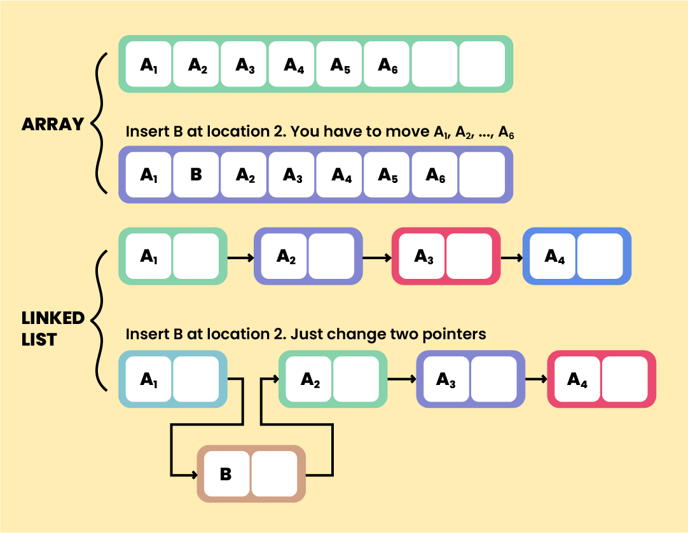
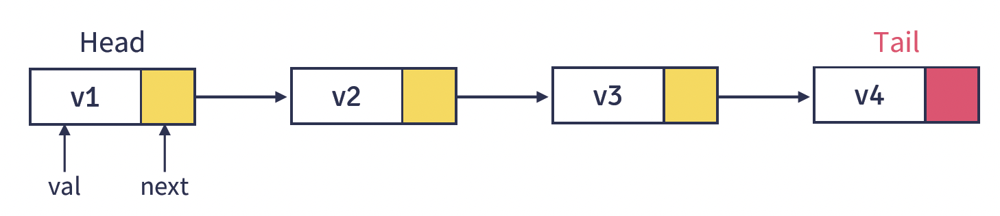
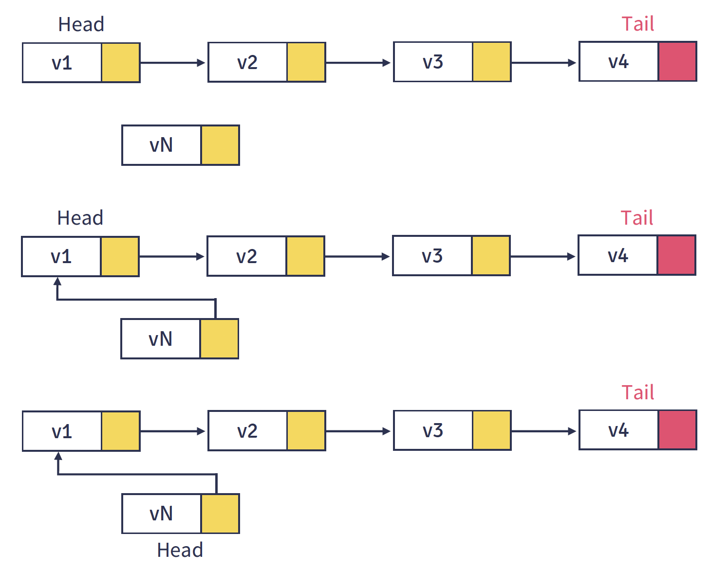
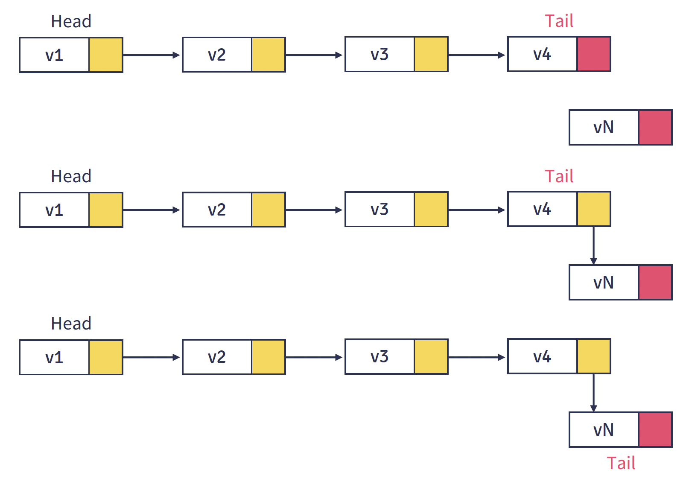
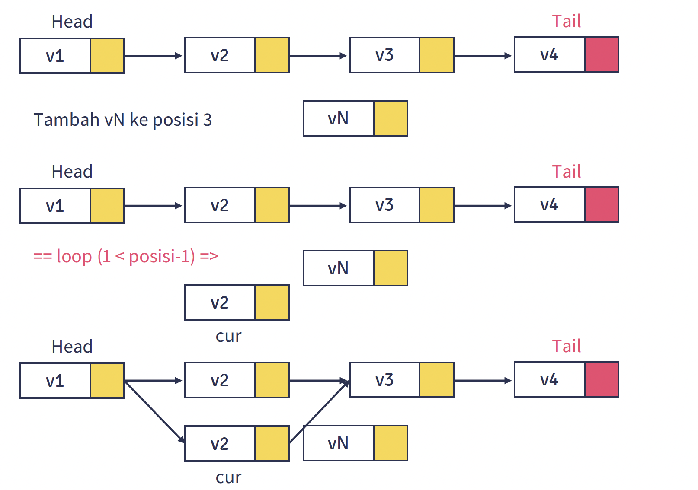
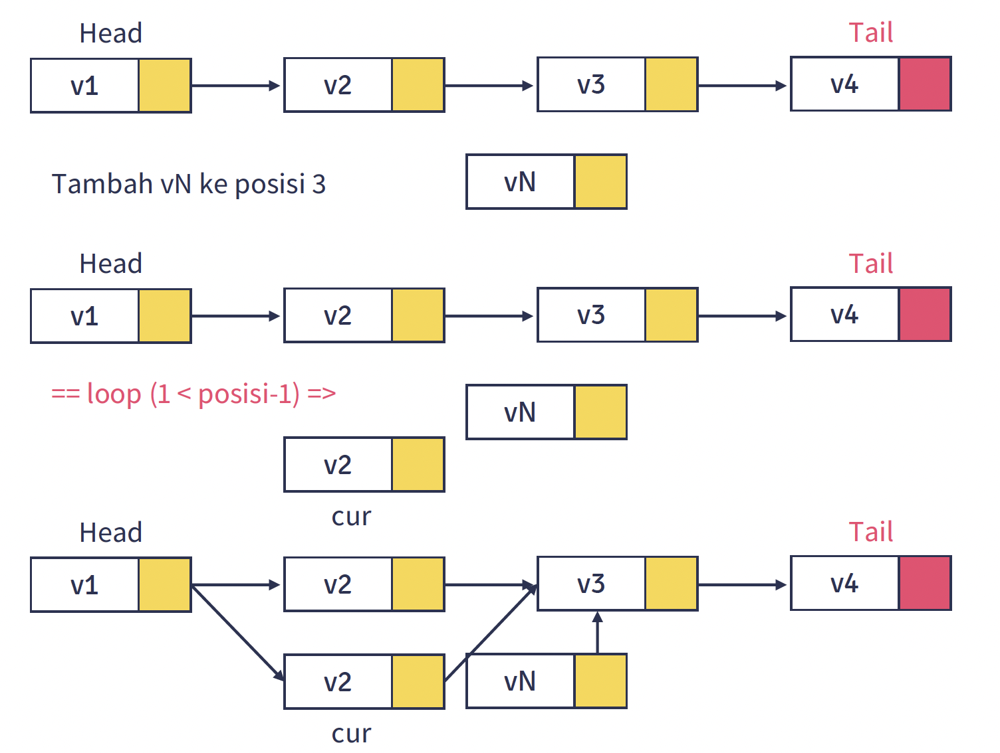
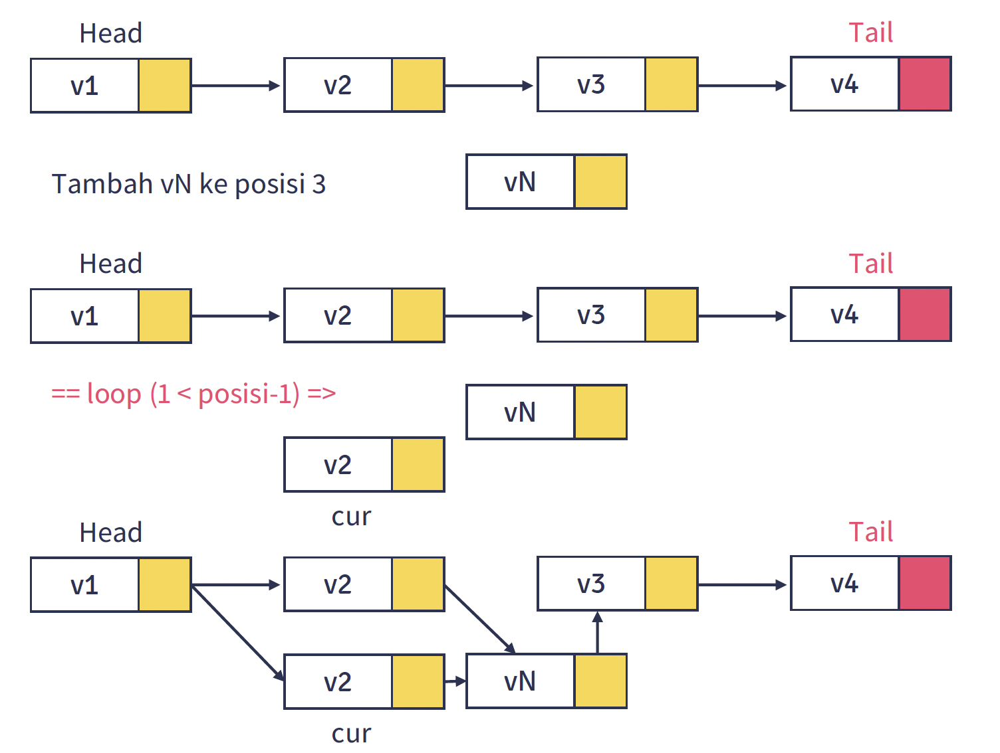
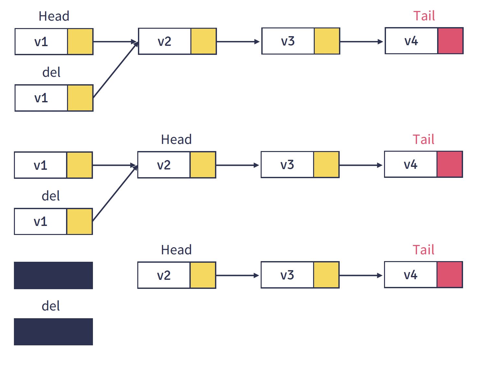
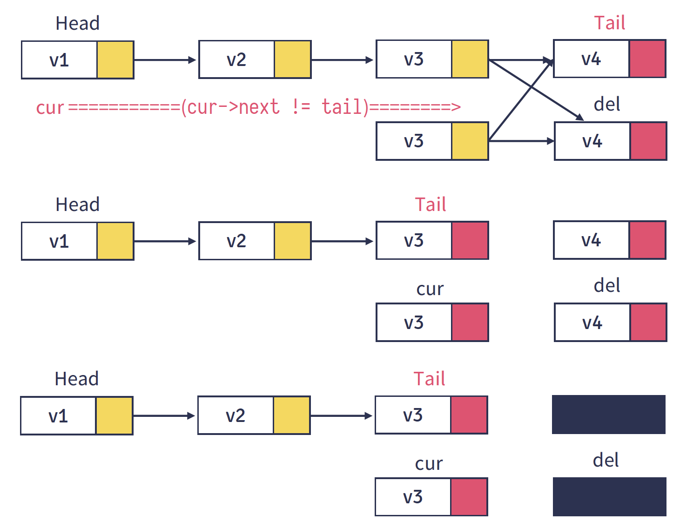

# Modul 7. Linked List dan Variasinya

## Daftar Isi

- [Pengenalan Linked List](#1-pengenalan-linked-list)
- [Single Linked List](#2-single-linked-list)
  - [Struktur Node](#21-struktur-node)
  - [Gambaran Operasi](#22-gambaran-operasi)
  - [Operasi Insert](#23-operasi-insert)
  - [Operasi Delete](#24-operasi-delete)
  - [Operasi Lainnya](#25-operasi-lainnya)
  - [Implementasi Lengkap](#26-implementasi-lengkap)
- [Double Linked List](#3-double-linked-list)
  - [Struktur Node](#31-struktur-node)
  - [Gambaran Operasi](#32-gambaran-operasi)
  - [Operasi Insert](#33-operasi-insert)
  - [Operasi Delete](#34-operasi-delete)
  - [Implementasi Lengkap](#35-implementasi-lengkap)
- [Circular Linked List](#4-circular-linked-list)
- [Perbandingan dan Kompleksitas](#5-perbandingan-dan-kompleksitas)
- [Latihan Praktikum](#6-latihan-praktikum)


## 1. Pengenalan Linked List

### 1.1 Apa itu Linked List?

**Linked List** adalah struktur data linear yang terdiri dari kumpulan **node** yang saling terhubung melalui **pointer/referensi**. Berbeda dengan array yang menyimpan data secara kontinu di memori, linked list menyimpan data secara tersebar dan dihubungkan dengan pointer.



### 1.2 Komponen Dasar

Setiap **node** dalam linked list minimal memiliki:

| Komponen | Deskripsi |
|----------|-----------|
| **Data** | Nilai/informasi yang disimpan |
| **Pointer (Next)** | Referensi ke node berikutnya |
| **Pointer (Prev)** | Referensi ke node sebelumnya (khusus Double Linked List) |

### 1.3 Jenis-jenis Linked List

| Jenis | Karakteristik | Traversal |
|-------|---------------|-----------|
| **Single Linked List** | Setiap node punya 1 pointer (next) | Satu arah (maju) |
| **Double Linked List** | Setiap node punya 2 pointer (prev, next) | Dua arah (maju & mundur) |
| **Circular Single** | Node terakhir menunjuk ke node pertama | Satu arah, melingkar |
| **Circular Double** | Kombinasi double dan circular | Dua arah, melingkar |

### 1.4 Keuntungan dan Kekurangan

**Keuntungan:**
- Ukuran dinamis (tidak perlu deklarasi ukuran di awal)
- Insert dan delete di awal/tengah lebih efisien daripada array
- Tidak ada pemborosan memori (alokasi sesuai kebutuhan)

**Kekurangan:**
- Tidak mendukung akses random (harus traverse dari awal)
- Membutuhkan memori ekstra untuk pointer
- Cache performance kurang optimal

## 2. Single Linked List

### 2.1 Struktur Node

Single Linked List terdiri dari node-node yang masing-masing memiliki **data** dan **pointer next** yang menunjuk ke node berikutnya. Node terakhir menunjuk ke `null`.



```
[HEAD] -> [Data|Next] -> [Data|Next] -> [Data|Next] -> NULL
```

#### 2.1.1 Definisi Class Node

```java
class Node {
    int data;       // Data yang disimpan
    Node next;      // Pointer ke node berikutnya

    // Constructor
    public Node(int data) {
        this.data = data;
        this.next = null;
    }
}
```

#### 2.1.2 Definisi Class SingleLinkedList

```java
class SingleLinkedList {
    private Node head;  // Pointer ke node pertama
    private int size;   // Jumlah node dalam list

    // Constructor
    public SingleLinkedList() {
        this.head = null;
        this.size = 0;
    }

    // Method isEmpty untuk cek list kosong
    public boolean isEmpty() {
        return head == null;
    }

    // Method getSize untuk mendapatkan jumlah node
    public int getSize() {
        return size;
    }
}
```

### 2.2 Gambaran Operasi

Berikut adalah operasi-operasi yang dapat dilakukan pada Single Linked List:

| Operasi | Fungsi | Kompleksitas |
|---------|--------|--------------|
| `insertAtBeginning(data)` | Menambah node di awal list | O(1) |
| `insertAtEnd(data)` | Menambah node di akhir list | O(n) |
| `insertAtPosition(data, pos)` | Menambah node di posisi tertentu | O(n) |
| `deleteAtBeginning()` | Menghapus node di awal list | O(1) |
| `deleteAtEnd()` | Menghapus node di akhir list | O(n) |
| `deleteByValue(value)` | Menghapus node berdasarkan nilai | O(n) |
| `search(value)` | Mencari posisi node dengan nilai tertentu | O(n) |
| `get(position)` | Mengambil data pada posisi tertentu | O(n) |
| `update(position, data)` | Mengubah data pada posisi tertentu | O(n) |
| `display()` | Menampilkan seluruh isi list | O(n) |
| `reverse()` | Membalik urutan list | O(n) |

### 2.3 Operasi Insert

#### 2.3.1 Insert di Awal (insertAtBeginning)

Menambahkan node baru di posisi paling depan list.

**Langkah-langkah:**
1. Buat node baru
2. Arahkan `next` node baru ke `head` saat ini
3. Update `head` menjadi node baru



```java
public void insertAtBeginning(int data) {
    // 1. Buat node baru
    Node newNode = new Node(data);

    // 2. Arahkan `next` node baru ke `head` saat ini
    newNode.next = head;

    // 3. Update `head` menjadi node baru
    head = newNode;
    size++;
}
```

**Contoh penggunaan:**
```java
SingleLinkedList list = new SingleLinkedList();
list.insertAtBeginning(10);  // List: 10 -> NULL
list.insertAtBeginning(20);  // List: 20 -> 10 -> NULL
list.insertAtBeginning(30);  // List: 30 -> 20 -> 10 -> NULL
```

#### 2.3.2 Insert di Akhir (insertAtEnd)

Menambahkan node baru di posisi paling belakang list.

**Langkah-langkah:**
1. Buat node baru
2. Jika list kosong, jadikan node baru sebagai head
3. Jika tidak, traverse sampai node terakhir
4. Arahkan `next` node terakhir ke node baru



```java
public void insertAtEnd(int data) {
    // 1. Buat node baru
    Node newNode = new Node(data);

    // 2. Jika list kosong, jadikan node baru sebagai head
    if (head == null) {
        head = newNode;
        size++;
        return;
    }

    // 3. Traverse sampai node terakhir
    Node current = head;
    while (current.next != null) {
        current = current.next;
    }

    // 4. Arahkan next node terakhir ke node baru
    current.next = newNode;
    size++;
}
```

**Contoh penggunaan:**
```java
SingleLinkedList list = new SingleLinkedList();
list.insertAtEnd(10);  // List: 10 -> NULL
list.insertAtEnd(20);  // List: 10 -> 20 -> NULL
list.insertAtEnd(30);  // List: 10 -> 20 -> 30 -> NULL
```

#### 2.3.3 Insert di Posisi Tertentu (insertAtPosition)

Menambahkan node baru pada posisi yang ditentukan (0-indexed).

**Langkah-langkah:**
1. Validasi posisi (0 <= pos <= size)
2. Jika posisi 0, panggil insertAtBeginning
3. Traverse sampai node sebelum posisi target
4. Sisipkan node baru







```java
public void insertAtPosition(int data, int position) {
    // 1. Validasi posisi
    if (position < 0 || position > size) {
        System.out.println("Posisi tidak valid!");
        return;
    }

    // 2. Jika posisi 0, insert di awal
    if (position == 0) {
        insertAtBeginning(data);
        return;
    }

    // 3. Buat node baru
    Node newNode = new Node(data);

    // 4. Traverse sampai node sebelum posisi target
    Node current = head;
    for (int i = 0; i < position - 1; i++) {
        current = current.next;
    }

    // 5. Sisipkan node baru
    newNode.next = current.next;
    current.next = newNode;
    size++;
}
```

**Contoh penggunaan:**
```java
// List awal: 10 -> 20 -> 30 -> NULL
list.insertAtPosition(25, 2);
// List akhir: 10 -> 20 -> 25 -> 30 -> NULL
```

### 2.4 Operasi Delete

#### 2.4.1 Delete di Awal (deleteAtBeginning)

Menghapus node di posisi paling depan list.

**Langkah-langkah:**
1. Cek apakah list kosong
2. Simpan data node yang akan dihapus (opsional)
3. Update head ke node berikutnya



```java
public int deleteAtBeginning() {
    // 1. Cek apakah list kosong
    if (isEmpty()) {
        System.out.println("List kosong!");
        return -1;
    }

    // 2. Simpan data node yang akan dihapus
    int deletedData = head.data;

    // 3. Update head ke node berikutnya
    head = head.next;
    size--;

    return deletedData;
}
```

**Contoh penggunaan:**
```java
// List awal: 30 -> 20 -> 10 -> NULL
int deleted = list.deleteAtBeginning();  // deleted = 30
// List akhir: 20 -> 10 -> NULL
```

#### 2.4.2 Delete di Akhir (deleteAtEnd)

Menghapus node di posisi paling belakang list.

**Langkah-langkah:**
1. Cek apakah list kosong
2. Jika hanya ada 1 node, hapus head
3. Traverse sampai node sebelum node terakhir
4. Set `next` node tersebut menjadi null



```java
public int deleteAtEnd() {
    // 1. Cek apakah list kosong
    if (isEmpty()) {
        System.out.println("List kosong!");
        return -1;
    }

    // 2. Jika hanya ada 1 node
    if (head.next == null) {
        int deletedData = head.data;
        head = null;
        size--;
        return deletedData;
    }

    // 3. Traverse sampai node sebelum node terakhir
    Node current = head;
    while (current.next.next != null) {
        current = current.next;
    }

    // 4. Simpan data dan hapus node terakhir
    int deletedData = current.next.data;
    current.next = null;
    size--;

    return deletedData;
}
```

**Contoh penggunaan:**
```java
// List awal: 10 -> 20 -> 30 -> NULL
int deleted = list.deleteAtEnd();  // deleted = 30
// List akhir: 10 -> 20 -> NULL
```

#### 2.4.3 Delete Berdasarkan Nilai (deleteByValue)

Menghapus node pertama yang memiliki nilai tertentu.

**Langkah-langkah:**
1. Cek apakah list kosong
2. Jika nilai ada di head, hapus head
3. Traverse untuk mencari node dengan nilai tersebut
4. Jika ditemukan, update pointer untuk melewati node tersebut

<!-- ILUSTRASI: Delete by Value -->
<p align="center">
  
  <br>
  <em>Gambar 2.7 Proses Delete Berdasarkan Nilai</em>
</p>

```java
public boolean deleteByValue(int value) {
    // 1. Cek apakah list kosong
    if (isEmpty()) {
        System.out.println("List kosong!");
        return false;
    }

    // 2. Jika nilai ada di head
    if (head.data == value) {
        head = head.next;
        size--;
        return true;
    }

    // 3. Traverse untuk mencari node dengan nilai tersebut
    Node current = head;
    while (current.next != null && current.next.data != value) {
        current = current.next;
    }

    // 4. Jika tidak ditemukan
    if (current.next == null) {
        System.out.println("Nilai " + value + " tidak ditemukan!");
        return false;
    }

    // 5. Hapus node dengan mengupdate pointer
    current.next = current.next.next;
    size--;
    return true;
}
```

**Contoh penggunaan:**
```java
// List awal: 10 -> 20 -> 30 -> 40 -> NULL
list.deleteByValue(30);
// List akhir: 10 -> 20 -> 40 -> NULL
```

### 2.5 Operasi Lainnya

#### 2.5.1 Search

Mencari posisi node dengan nilai tertentu.

```java
public int search(int value) {
    Node current = head;
    int position = 0;

    while (current != null) {
        if (current.data == value) {
            return position;  // Ditemukan, return posisi
        }
        current = current.next;
        position++;
    }

    return -1;  // Tidak ditemukan
}
```

**Contoh penggunaan:**
```java
// List: 10 -> 20 -> 30 -> NULL
int pos = list.search(20);  // pos = 1
int pos2 = list.search(50); // pos2 = -1 (tidak ditemukan)
```

#### 2.5.2 Get (Akses Data)

Mengambil data pada posisi tertentu.

```java
public int get(int position) {
    // Validasi posisi
    if (position < 0 || position >= size) {
        throw new IndexOutOfBoundsException("Posisi tidak valid!");
    }

    // Traverse ke posisi yang diminta
    Node current = head;
    for (int i = 0; i < position; i++) {
        current = current.next;
    }

    return current.data;
}
```

**Contoh penggunaan:**
```java
// List: 10 -> 20 -> 30 -> NULL
int data = list.get(1);  // data = 20
```

#### 2.5.3 Update

Mengubah data pada posisi tertentu.

```java
public void update(int position, int newData) {
    // Validasi posisi
    if (position < 0 || position >= size) {
        System.out.println("Posisi tidak valid!");
        return;
    }

    // Traverse ke posisi yang diminta
    Node current = head;
    for (int i = 0; i < position; i++) {
        current = current.next;
    }

    // Update data
    current.data = newData;
}
```

**Contoh penggunaan:**
```java
// List awal: 10 -> 20 -> 30 -> NULL
list.update(1, 25);
// List akhir: 10 -> 25 -> 30 -> NULL
```

#### 2.5.4 Display

Menampilkan seluruh isi list.

```java
public void display() {
    if (isEmpty()) {
        System.out.println("List kosong!");
        return;
    }

    System.out.print("List: ");
    Node current = head;

    while (current != null) {
        System.out.print(current.data);
        if (current.next != null) {
            System.out.print(" -> ");
        }
        current = current.next;
    }

    System.out.println(" -> NULL");
    System.out.println("Size: " + size);
}
```

**Output contoh:**
```
List: 10 -> 20 -> 30 -> NULL
Size: 3
```

#### 2.5.5 Reverse

Membalik urutan list.

**Langkah-langkah:**
1. Inisialisasi 3 pointer: prev, current, next
2. Traverse list sambil membalik arah pointer
3. Update head ke node terakhir (prev)

```java
public void reverse() {
    Node prev = null;
    Node current = head;
    Node next = null;

    while (current != null) {
        // Simpan next node
        next = current.next;

        // Balik arah pointer
        current.next = prev;

        // Geser prev dan current
        prev = current;
        current = next;
    }

    // Update head ke node terakhir
    head = prev;
}
```

**Contoh penggunaan:**
```java
// List awal: 10 -> 20 -> 30 -> NULL
list.reverse();
// List akhir: 30 -> 20 -> 10 -> NULL
```

### 2.6 Implementasi Lengkap

Berikut adalah implementasi lengkap Single Linked List dengan semua operasi:

#### File: Node.java

```java
public class Node {
    int data;
    Node next;

    public Node(int data) {
        this.data = data;
        this.next = null;
    }
}
```

#### File: SingleLinkedList.java

```java
public class SingleLinkedList {
    private Node head;
    private int size;

    public SingleLinkedList() {
        this.head = null;
        this.size = 0;
    }

    public boolean isEmpty() {
        return head == null;
    }

    public int getSize() {
        return size;
    }

    // ========== INSERT OPERATIONS ==========

    public void insertAtBeginning(int data) {
        Node newNode = new Node(data);
        newNode.next = head;
        head = newNode;
        size++;
    }

    public void insertAtEnd(int data) {
        Node newNode = new Node(data);

        if (head == null) {
            head = newNode;
        } else {
            Node current = head;
            while (current.next != null) {
                current = current.next;
            }
            current.next = newNode;
        }
        size++;
    }

    public void insertAtPosition(int data, int position) {
        if (position < 0 || position > size) {
            System.out.println("Posisi tidak valid!");
            return;
        }

        if (position == 0) {
            insertAtBeginning(data);
            return;
        }

        Node newNode = new Node(data);
        Node current = head;

        for (int i = 0; i < position - 1; i++) {
            current = current.next;
        }

        newNode.next = current.next;
        current.next = newNode;
        size++;
    }

    // ========== DELETE OPERATIONS ==========

    public int deleteAtBeginning() {
        if (isEmpty()) {
            System.out.println("List kosong!");
            return -1;
        }

        int deletedData = head.data;
        head = head.next;
        size--;
        return deletedData;
    }

    public int deleteAtEnd() {
        if (isEmpty()) {
            System.out.println("List kosong!");
            return -1;
        }

        if (head.next == null) {
            int deletedData = head.data;
            head = null;
            size--;
            return deletedData;
        }

        Node current = head;
        while (current.next.next != null) {
            current = current.next;
        }

        int deletedData = current.next.data;
        current.next = null;
        size--;
        return deletedData;
    }

    public boolean deleteByValue(int value) {
        if (isEmpty()) {
            return false;
        }

        if (head.data == value) {
            head = head.next;
            size--;
            return true;
        }

        Node current = head;
        while (current.next != null && current.next.data != value) {
            current = current.next;
        }

        if (current.next == null) {
            return false;
        }

        current.next = current.next.next;
        size--;
        return true;
    }

    // ========== OTHER OPERATIONS ==========

    public int search(int value) {
        Node current = head;
        int position = 0;

        while (current != null) {
            if (current.data == value) {
                return position;
            }
            current = current.next;
            position++;
        }
        return -1;
    }

    public int get(int position) {
        if (position < 0 || position >= size) {
            throw new IndexOutOfBoundsException("Posisi tidak valid!");
        }

        Node current = head;
        for (int i = 0; i < position; i++) {
            current = current.next;
        }
        return current.data;
    }

    public void update(int position, int newData) {
        if (position < 0 || position >= size) {
            System.out.println("Posisi tidak valid!");
            return;
        }

        Node current = head;
        for (int i = 0; i < position; i++) {
            current = current.next;
        }
        current.data = newData;
    }

    public void reverse() {
        Node prev = null;
        Node current = head;
        Node next = null;

        while (current != null) {
            next = current.next;
            current.next = prev;
            prev = current;
            current = next;
        }
        head = prev;
    }

    public void display() {
        if (isEmpty()) {
            System.out.println("List kosong!");
            return;
        }

        System.out.print("List: ");
        Node current = head;

        while (current != null) {
            System.out.print(current.data);
            if (current.next != null) {
                System.out.print(" -> ");
            }
            current = current.next;
        }
        System.out.println(" -> NULL");
    }

    public void clear() {
        head = null;
        size = 0;
    }
}
```

#### File: Main.java (Demo)

```java
public class Main {
    public static void main(String[] args) {
        SingleLinkedList list = new SingleLinkedList();

        System.out.println("=== INSERT OPERATIONS ===");
        list.insertAtBeginning(10);
        list.insertAtBeginning(20);
        list.insertAtEnd(5);
        list.insertAtEnd(15);
        list.display();
        // Output: List: 20 -> 10 -> 5 -> 15 -> NULL

        list.insertAtPosition(25, 2);
        list.display();
        // Output: List: 20 -> 10 -> 25 -> 5 -> 15 -> NULL

        System.out.println("\n=== SEARCH & GET ===");
        System.out.println("Posisi nilai 25: " + list.search(25));
        System.out.println("Data di posisi 2: " + list.get(2));

        System.out.println("\n=== UPDATE ===");
        list.update(2, 30);
        list.display();
        // Output: List: 20 -> 10 -> 30 -> 5 -> 15 -> NULL

        System.out.println("\n=== DELETE OPERATIONS ===");
        list.deleteAtBeginning();
        list.display();
        // Output: List: 10 -> 30 -> 5 -> 15 -> NULL

        list.deleteAtEnd();
        list.display();
        // Output: List: 10 -> 30 -> 5 -> NULL

        list.deleteByValue(30);
        list.display();
        // Output: List: 10 -> 5 -> NULL

        System.out.println("\n=== REVERSE ===");
        list.insertAtEnd(100);
        list.insertAtEnd(200);
        list.display();
        list.reverse();
        list.display();
        // Output: List: 200 -> 100 -> 5 -> 10 -> NULL
    }
}
```

## 3. Double Linked List

### 3.1 Struktur Node

Double Linked List memiliki node dengan **dua pointer**: `prev` (ke node sebelumnya) dan `next` (ke node berikutnya). Ini memungkinkan traversal dua arah.

<!-- ILUSTRASI: Struktur Double Linked List -->
<p align="center">
  
  <br>
  <em>Gambar 3.1 Struktur Double Linked List</em>
</p>

```
NULL <- [Prev|Data|Next] <-> [Prev|Data|Next] <-> [Prev|Data|Next] -> NULL
         ^                                              ^
        HEAD                                           TAIL
```

#### Definisi Class DoubleNode

```java
class DoubleNode {
    int data;
    DoubleNode prev;  // Pointer ke node sebelumnya
    DoubleNode next;  // Pointer ke node berikutnya

    public DoubleNode(int data) {
        this.data = data;
        this.prev = null;
        this.next = null;
    }
}
```

#### Definisi Class DoubleLinkedList

```java
class DoubleLinkedList {
    private DoubleNode head;  // Pointer ke node pertama
    private DoubleNode tail;  // Pointer ke node terakhir
    private int size;

    public DoubleLinkedList() {
        this.head = null;
        this.tail = null;
        this.size = 0;
    }

    public boolean isEmpty() {
        return head == null;
    }

    public int getSize() {
        return size;
    }
}
```

### 3.2 Gambaran Operasi

| Operasi | Fungsi | Kompleksitas |
|---------|--------|--------------|
| `insertAtBeginning(data)` | Menambah node di awal | O(1) |
| `insertAtEnd(data)` | Menambah node di akhir | O(1)* |
| `deleteAtBeginning()` | Menghapus node di awal | O(1) |
| `deleteAtEnd()` | Menghapus node di akhir | O(1)* |
| `displayForward()` | Menampilkan list dari depan ke belakang | O(n) |
| `displayBackward()` | Menampilkan list dari belakang ke depan | O(n) |

*O(1) karena ada tail pointer

**Keuntungan Double Linked List:**
- Traversal bisa dua arah
- Delete node lebih mudah (tidak perlu track node sebelumnya)
- Operasi di tail menjadi O(1)

**Kekurangan:**
- Membutuhkan memori ekstra untuk pointer prev
- Operasi insert/delete lebih kompleks

### 3.3 Operasi Insert

#### 3.3.1 Insert di Awal

<!-- ILUSTRASI: DLL Insert di Awal -->
<p align="center">
  
  <br>
  <em>Gambar 3.2 Proses Insert di Awal pada Double Linked List</em>
</p>

```java
public void insertAtBeginning(int data) {
    DoubleNode newNode = new DoubleNode(data);

    if (isEmpty()) {
        // Jika list kosong, head dan tail sama
        head = newNode;
        tail = newNode;
    } else {
        // Hubungkan node baru dengan head lama
        newNode.next = head;
        head.prev = newNode;
        head = newNode;
    }
    size++;
}
```

#### 3.3.2 Insert di Akhir

<!-- ILUSTRASI: DLL Insert di Akhir -->
<p align="center">
  
  <br>
  <em>Gambar 3.3 Proses Insert di Akhir pada Double Linked List</em>
</p>

```java
public void insertAtEnd(int data) {
    DoubleNode newNode = new DoubleNode(data);

    if (isEmpty()) {
        head = newNode;
        tail = newNode;
    } else {
        // Hubungkan node baru dengan tail lama
        newNode.prev = tail;
        tail.next = newNode;
        tail = newNode;
    }
    size++;
}
```

### 3.4 Operasi Delete

#### 3.4.1 Delete di Awal

<!-- ILUSTRASI: DLL Delete di Awal -->
<p align="center">
  
  <br>
  <em>Gambar 3.4 Proses Delete di Awal pada Double Linked List</em>
</p>

```java
public int deleteAtBeginning() {
    if (isEmpty()) {
        System.out.println("List kosong!");
        return -1;
    }

    int deletedData = head.data;

    if (head == tail) {
        // Hanya ada 1 node
        head = null;
        tail = null;
    } else {
        head = head.next;
        head.prev = null;
    }
    size--;
    return deletedData;
}
```

#### 3.4.2 Delete di Akhir

<!-- ILUSTRASI: DLL Delete di Akhir -->
<p align="center">
  
  <br>
  <em>Gambar 3.5 Proses Delete di Akhir pada Double Linked List</em>
</p>

```java
public int deleteAtEnd() {
    if (isEmpty()) {
        System.out.println("List kosong!");
        return -1;
    }

    int deletedData = tail.data;

    if (head == tail) {
        // Hanya ada 1 node
        head = null;
        tail = null;
    } else {
        tail = tail.prev;
        tail.next = null;
    }
    size--;
    return deletedData;
}
```

#### 3.4.3 Display Forward dan Backward

```java
// Menampilkan dari depan ke belakang
public void displayForward() {
    if (isEmpty()) {
        System.out.println("List kosong!");
        return;
    }

    System.out.print("Forward: NULL <- ");
    DoubleNode current = head;

    while (current != null) {
        System.out.print(current.data);
        if (current.next != null) {
            System.out.print(" <-> ");
        }
        current = current.next;
    }
    System.out.println(" -> NULL");
}

// Menampilkan dari belakang ke depan
public void displayBackward() {
    if (isEmpty()) {
        System.out.println("List kosong!");
        return;
    }

    System.out.print("Backward: NULL <- ");
    DoubleNode current = tail;

    while (current != null) {
        System.out.print(current.data);
        if (current.prev != null) {
            System.out.print(" <-> ");
        }
        current = current.prev;
    }
    System.out.println(" -> NULL");
}
```

### 3.5 Implementasi Lengkap

#### File: DoubleNode.java

```java
public class DoubleNode {
    int data;
    DoubleNode prev;
    DoubleNode next;

    public DoubleNode(int data) {
        this.data = data;
        this.prev = null;
        this.next = null;
    }
}
```

#### File: DoubleLinkedList.java

```java
public class DoubleLinkedList {
    private DoubleNode head;
    private DoubleNode tail;
    private int size;

    public DoubleLinkedList() {
        this.head = null;
        this.tail = null;
        this.size = 0;
    }

    public boolean isEmpty() {
        return head == null;
    }

    public int getSize() {
        return size;
    }

    // ========== INSERT OPERATIONS ==========

    public void insertAtBeginning(int data) {
        DoubleNode newNode = new DoubleNode(data);

        if (isEmpty()) {
            head = newNode;
            tail = newNode;
        } else {
            newNode.next = head;
            head.prev = newNode;
            head = newNode;
        }
        size++;
    }

    public void insertAtEnd(int data) {
        DoubleNode newNode = new DoubleNode(data);

        if (isEmpty()) {
            head = newNode;
            tail = newNode;
        } else {
            newNode.prev = tail;
            tail.next = newNode;
            tail = newNode;
        }
        size++;
    }

    // ========== DELETE OPERATIONS ==========

    public int deleteAtBeginning() {
        if (isEmpty()) {
            return -1;
        }

        int deletedData = head.data;

        if (head == tail) {
            head = null;
            tail = null;
        } else {
            head = head.next;
            head.prev = null;
        }
        size--;
        return deletedData;
    }

    public int deleteAtEnd() {
        if (isEmpty()) {
            return -1;
        }

        int deletedData = tail.data;

        if (head == tail) {
            head = null;
            tail = null;
        } else {
            tail = tail.prev;
            tail.next = null;
        }
        size--;
        return deletedData;
    }

    // ========== DISPLAY OPERATIONS ==========

    public void displayForward() {
        if (isEmpty()) {
            System.out.println("List kosong!");
            return;
        }

        System.out.print("Forward:  NULL <- ");
        DoubleNode current = head;

        while (current != null) {
            System.out.print(current.data);
            if (current.next != null) {
                System.out.print(" <-> ");
            }
            current = current.next;
        }
        System.out.println(" -> NULL");
    }

    public void displayBackward() {
        if (isEmpty()) {
            System.out.println("List kosong!");
            return;
        }

        System.out.print("Backward: NULL <- ");
        DoubleNode current = tail;

        while (current != null) {
            System.out.print(current.data);
            if (current.prev != null) {
                System.out.print(" <-> ");
            }
            current = current.prev;
        }
        System.out.println(" -> NULL");
    }
}
```

#### File: Main.java (Demo)

```java
public class Main {
    public static void main(String[] args) {
        DoubleLinkedList list = new DoubleLinkedList();

        System.out.println("=== INSERT OPERATIONS ===");
        list.insertAtBeginning(10);
        list.insertAtBeginning(20);
        list.insertAtEnd(5);
        list.insertAtEnd(15);

        list.displayForward();
        // Output: Forward:  NULL <- 20 <-> 10 <-> 5 <-> 15 -> NULL

        list.displayBackward();
        // Output: Backward: NULL <- 15 <-> 5 <-> 10 <-> 20 -> NULL

        System.out.println("\n=== DELETE OPERATIONS ===");
        System.out.println("Deleted from beginning: " + list.deleteAtBeginning());
        list.displayForward();
        // Output: Forward:  NULL <- 10 <-> 5 <-> 15 -> NULL

        System.out.println("Deleted from end: " + list.deleteAtEnd());
        list.displayForward();
        // Output: Forward:  NULL <- 10 <-> 5 -> NULL
    }
}
```

## 4. Circular Linked List

### 4.1 Circular Single Linked List

Pada Circular Single Linked List, node terakhir menunjuk kembali ke node pertama (head), membentuk lingkaran.

<!-- ILUSTRASI: Circular Single Linked List -->
<p align="center">
  
  <br>
  <em>Gambar 4.1 Struktur Circular Single Linked List</em>
</p>

```
    +---> [Data|Next] -> [Data|Next] -> [Data|Next] ---+
    |                                                   |
    +---------------------------------------------------+
```

#### Implementasi Singkat

```java
class CircularSingleLinkedList {
    private Node head;
    private Node tail;
    private int size;

    public void insertAtEnd(int data) {
        Node newNode = new Node(data);

        if (head == null) {
            head = newNode;
            tail = newNode;
            newNode.next = head;  // Menunjuk ke diri sendiri
        } else {
            tail.next = newNode;
            newNode.next = head;  // Node baru menunjuk ke head
            tail = newNode;
        }
        size++;
    }

    public void display() {
        if (head == null) {
            System.out.println("List kosong!");
            return;
        }

        Node current = head;
        System.out.print("Circular: ");

        do {
            System.out.print(current.data + " -> ");
            current = current.next;
        } while (current != head);

        System.out.println("(kembali ke " + head.data + ")");
    }
}
```

### 4.2 Circular Double Linked List

Kombinasi Double Linked List dan Circular, dimana head.prev menunjuk ke tail, dan tail.next menunjuk ke head.

<!-- ILUSTRASI: Circular Double Linked List -->
<p align="center">
  
  <br>
  <em>Gambar 4.2 Struktur Circular Double Linked List</em>
</p>

```
    +---> [Prev|Data|Next] <-> [Prev|Data|Next] <-> [Prev|Data|Next] <---+
    |                                                                     |
    +---------------------------------------------------------------------+
```

#### Implementasi Singkat (Circular Double Linked List)

```java
class CircularDoublyLinkedList {
    class Node {
        int data;
        Node prev, next;

        Node(int data) {
            this.data = data;
            this.prev = this.next = null;
        }
    }

    private Node head;

    public void insertAtEnd(int data) {
        Node newNode = new Node(data);
        if (head == null) {
            head = newNode;
            head.next = head;
            head.prev = head;
        } else {
            Node tail = head.prev;
            newNode.next = head;
            newNode.prev = tail;
            head.prev = newNode;
            tail.next = newNode;
        }
    }

    public void displayForward() {
        if (head == null) return;
        Node current = head;
        System.out.print("Forward: (tail) <-> ");
        do {
            System.out.print(current.data + " <-> ");
            current = current.next;
        } while (current != head);
        System.out.println("(head)");
    }
}
```

## 5. Perbandingan dan Kompleksitas

### 5.1 Tabel Kompleksitas Waktu

| Operasi | Single LL | Double LL | Array |
|---------|-----------|-----------|-------|
| Insert di awal | O(1) | O(1) | O(n) |
| Insert di akhir | O(n) | O(1)* | O(1)** |
| Insert di tengah | O(n) | O(n) | O(n) |
| Delete di awal | O(1) | O(1) | O(n) |
| Delete di akhir | O(n) | O(1)* | O(1) |
| Delete di tengah | O(n) | O(n) | O(n) |
| Akses (Get) | O(n) | O(n) | O(1) |
| Search | O(n) | O(n) | O(n) |

*Dengan tail pointer
**Amortized

### 5.2 Kapan Menggunakan Linked List?

| Situasi | Rekomendasi |
|---------|-------------|
| Sering insert/delete di awal | Single Linked List |
| Sering insert/delete di kedua ujung | Double Linked List |
| Butuh traversal dua arah | Double Linked List |
| Butuh akses random yang cepat | Array |
| Ukuran data tidak diketahui | Linked List |
| Implementasi Stack | Single Linked List |
| Implementasi Queue | Double Linked List / Circular |
| Implementasi Deque | Double Linked List |

## 6. Latihan Praktikum

### Latihan 1: Implementasi Dasar
Implementasikan Single Linked List dengan operasi:
- insertAtBeginning
- insertAtEnd
- deleteAtBeginning
- display

### Latihan 2: Mencari Node Tengah
Buatlah method `getMiddle()` yang mengembalikan data node tengah dari linked list. Gunakan teknik two-pointer (slow dan fast pointer).

### Latihan 3: Deteksi Cycle
Buatlah method `hasCycle()` yang mendeteksi apakah linked list memiliki cycle (node menunjuk ke node sebelumnya). Gunakan Floyd's Cycle Detection Algorithm.

### Latihan 4: Merge Two Sorted Lists
Buatlah method untuk menggabungkan dua sorted linked list menjadi satu sorted linked list.

### Latihan 5: Implementasi Stack dengan Linked List
Implementasikan Stack menggunakan Single Linked List dengan operasi:
- push(data)
- pop()
- peek()
- isEmpty()

### Latihan 6: Implementasi Queue dengan Double Linked List
Implementasikan Queue menggunakan Double Linked List dengan operasi:
- enqueue(data)
- dequeue()
- front()
- isEmpty()

## Referensi

1. Cormen, T. H., et al. (2009). *Introduction to Algorithms* (3rd ed.). MIT Press.
2. Weiss, M. A. (2014). *Data Structures and Algorithm Analysis in Java* (3rd ed.). Pearson.
3. [GeeksforGeeks - Linked List Data Structure](https://www.geeksforgeeks.org/data-structures/linked-list/)
4. [Visualgo - Linked List Visualization](https://visualgo.net/en/list)
