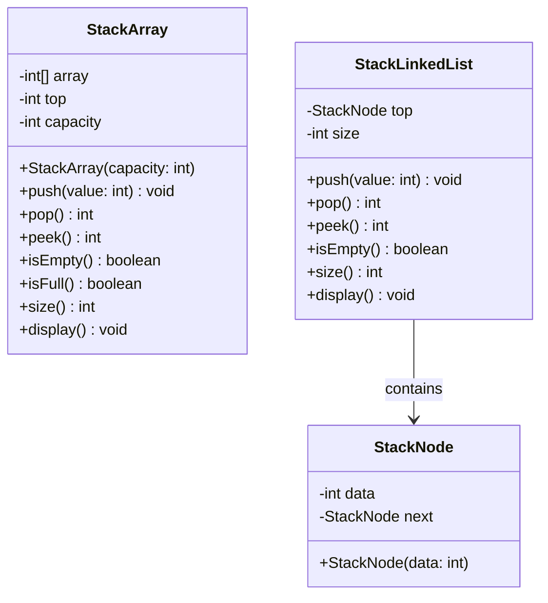
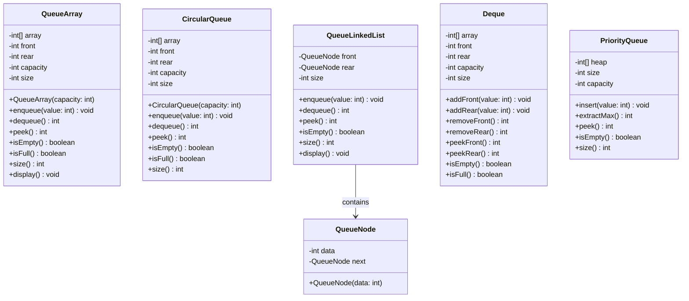

# Module 08: Stack dan Queue

## Daftar Isi
1. [Stack](#stack)
   - [Konsep Dasar Stack](#konsep-dasar-stack)
   - [Stack tanpa OOP](#stack-tanpa-oop)
   - [Stack dengan OOP (Array-based)](#stack-dengan-oop-array-based)
   - [Stack dengan OOP (Linked List-based)](#stack-dengan-oop-linked-list-based)
2. [Queue](#queue)
   - [Konsep Dasar Queue](#konsep-dasar-queue)
   - [Queue tanpa OOP](#queue-tanpa-oop)
   - [Queue dengan OOP (Array-based)](#queue-dengan-oop-array-based)
   - [Queue dengan OOP (Circular Queue)](#queue-dengan-oop-circular-queue)
   - [Queue dengan OOP (Linked List-based)](#queue-dengan-oop-linked-list-based)
3. [Deque (Double-Ended Queue)](#deque-double-ended-queue)
4. [Priority Queue](#priority-queue)
5. [Kapan Menggunakan Stack dan Queue](#kapan-menggunakan-stack-dan-queue)
6. [Kompleksitas Stack dan Queue](#kompleksitas-stack-dan-queue)
7. [Latihan Praktikum](#latihan-praktikum)

---

## Stack

### Konsep Dasar Stack

Stack adalah struktur data linear yang mengikuti prinsip **LIFO (Last In First Out)**. Elemen terakhir yang dimasukkan adalah elemen pertama yang dikeluarkan.

```
    +-------+
    |   4   |  <- TOP (elemen terakhir masuk, pertama keluar)
    +-------+
    |   3   |
    +-------+
    |   2   |
    +-------+
    |   1   |  <- BOTTOM (elemen pertama masuk, terakhir keluar)
    +-------+
```

### Operasi Stack

| Operasi | Deskripsi |
|---------|-----------|
| **Push** | Menambahkan elemen ke top stack |
| **Pop** | Menghapus dan mengembalikan elemen dari top stack |
| **Peek/Top** | Melihat elemen paling atas tanpa menghapus |
| **isEmpty** | Cek apakah stack kosong |
| **isFull** | Cek apakah stack penuh (untuk array-based) |
| **Size** | Mendapatkan jumlah elemen |

### Aplikasi Stack
- **Function call stack** - Menyimpan return address dan local variables
- **Undo/Redo mechanism** - Text editor, image editor
- **Expression evaluation** - Infix, postfix, prefix conversion
- **Backtracking** - Maze solving, game algorithms
- **Browser history** - Tombol back
- **Syntax parsing** - Compiler, bracket matching

### Class Diagram Stack



---

### Stack tanpa OOP

```java
public class StackNoOOP {
    static int[] stack = new int[100];
    static int top = -1;
    static int MAX_SIZE = 100;

    // Push elemen ke stack
    public static void push(int value) {
        if (top >= MAX_SIZE - 1) {
            System.out.println("Stack Overflow! Stack penuh.");
            return;
        }

        top++;
        stack[top] = value;
        System.out.println("Push: " + value);
    }

    // Pop elemen dari stack
    public static int pop() {
        if (top < 0) {
            System.out.println("Stack Underflow! Stack kosong.");
            return -1;
        }

        int value = stack[top];
        top--;
        System.out.println("Pop: " + value);
        return value;
    }

    // Peek elemen teratas
    public static int peek() {
        if (top < 0) {
            System.out.println("Stack kosong!");
            return -1;
        }

        return stack[top];
    }

    // Cek apakah stack kosong
    public static boolean isEmpty() {
        return top < 0;
    }

    // Cek apakah stack penuh
    public static boolean isFull() {
        return top >= MAX_SIZE - 1;
    }

    // Mendapatkan ukuran stack
    public static int size() {
        return top + 1;
    }

    // Tampilkan semua elemen
    public static void display() {
        if (isEmpty()) {
            System.out.println("Stack kosong!");
            return;
        }

        System.out.print("Stack (bottom to top): ");
        for (int i = 0; i <= top; i++) {
            System.out.print(stack[i] + " ");
        }
        System.out.println();
    }

    // Clear stack
    public static void clear() {
        top = -1;
        System.out.println("Stack dikosongkan");
    }

    // Search elemen (return posisi dari top, -1 jika tidak ada)
    public static int search(int value) {
        for (int i = top; i >= 0; i--) {
            if (stack[i] == value) {
                return top - i + 1; // posisi dari top (1-indexed)
            }
        }
        return -1;
    }

    public static void main(String[] args) {
        System.out.println("=== STACK TANPA OOP ===\n");

        // Test push
        push(10);
        push(20);
        push(30);
        push(40);
        display();

        System.out.println("\nUkuran stack: " + size());
        System.out.println("Elemen teratas: " + peek());

        // Test search
        System.out.println("\nPosisi 30 dari top: " + search(30));
        System.out.println("Posisi 100 dari top: " + search(100));

        // Test pop
        System.out.println();
        pop();
        pop();
        display();

        System.out.println("\nStack kosong? " + isEmpty());
        System.out.println("Stack penuh? " + isFull());

        // Test clear
        System.out.println();
        clear();
        display();
    }
}
```

**Output:**
```
=== STACK TANPA OOP ===

Push: 10
Push: 20
Push: 30
Push: 40
Stack (bottom to top): 10 20 30 40

Ukuran stack: 4
Elemen teratas: 40

Posisi 30 dari top: 2
Posisi 100 dari top: -1

Pop: 40
Pop: 30
Stack (bottom to top): 10 20

Stack kosong? false
Stack penuh? false

Stack dikosongkan
Stack kosong!
```

---

### Stack dengan OOP (Array-based)

```java
// File: ArrayStack.java
class ArrayStack {
    private int[] stack;
    private int top;
    private int maxSize;

    // Constructor
    public ArrayStack(int size) {
        this.maxSize = size;
        this.stack = new int[maxSize];
        this.top = -1;
    }

    // Push elemen - O(1)
    public void push(int value) {
        if (isFull()) {
            System.out.println("Stack Overflow! Stack penuh.");
            return;
        }

        stack[++top] = value;
        System.out.println("Push: " + value);
    }

    // Pop elemen - O(1)
    public int pop() {
        if (isEmpty()) {
            System.out.println("Stack Underflow! Stack kosong.");
            return -1;
        }

        int value = stack[top--];
        System.out.println("Pop: " + value);
        return value;
    }

    // Peek elemen teratas - O(1)
    public int peek() {
        if (isEmpty()) {
            System.out.println("Stack kosong!");
            return -1;
        }

        return stack[top];
    }

    // Cek apakah kosong - O(1)
    public boolean isEmpty() {
        return top == -1;
    }

    // Cek apakah penuh - O(1)
    public boolean isFull() {
        return top == maxSize - 1;
    }

    // Get ukuran - O(1)
    public int size() {
        return top + 1;
    }

    // Display stack - O(n)
    public void display() {
        if (isEmpty()) {
            System.out.println("Stack kosong!");
            return;
        }

        System.out.print("Stack (bottom to top): ");
        for (int i = 0; i <= top; i++) {
            System.out.print(stack[i] + " ");
        }
        System.out.println();
    }

    // Display stack visual - O(n)
    public void displayVisual() {
        if (isEmpty()) {
            System.out.println("Stack kosong!");
            return;
        }

        System.out.println("Stack (visual):");
        System.out.println("+-------+");
        for (int i = top; i >= 0; i--) {
            String label = (i == top) ? " <- TOP" : "";
            System.out.printf("| %3d   |%s%n", stack[i], label);
            System.out.println("+-------+");
        }
    }

    // Clear stack - O(1)
    public void clear() {
        top = -1;
        System.out.println("Stack dikosongkan");
    }

    // Search elemen - O(n)
    public int search(int value) {
        for (int i = top; i >= 0; i--) {
            if (stack[i] == value) {
                return top - i + 1;
            }
        }
        return -1;
    }

    // Get capacity
    public int capacity() {
        return maxSize;
    }
}

// File: ArrayStackDemo.java
public class ArrayStackDemo {
    public static void main(String[] args) {
        System.out.println("=== STACK DENGAN OOP (ARRAY-BASED) ===\n");

        ArrayStack stack = new ArrayStack(5);

        // Test push
        stack.push(10);
        stack.push(20);
        stack.push(30);
        stack.push(40);
        stack.display();
        stack.displayVisual();

        System.out.println("\nUkuran: " + stack.size());
        System.out.println("Kapasitas: " + stack.capacity());
        System.out.println("Elemen teratas: " + stack.peek());

        // Test pop
        System.out.println();
        stack.pop();
        stack.pop();
        stack.display();

        // Test overflow
        System.out.println("\nMengisi stack hingga penuh:");
        stack.push(50);
        stack.push(60);
        stack.push(70);
        stack.push(80); // Overflow
        stack.display();

        System.out.println("\nStack penuh? " + stack.isFull());
    }
}
```

**Output:**
```
=== STACK DENGAN OOP (ARRAY-BASED) ===

Push: 10
Push: 20
Push: 30
Push: 40
Stack (bottom to top): 10 20 30 40
Stack (visual):
+-------+
|  40   | <- TOP
+-------+
|  30   |
+-------+
|  20   |
+-------+
|  10   |
+-------+

Ukuran: 4
Kapasitas: 5
Elemen teratas: 40

Pop: 40
Pop: 30
Stack (bottom to top): 10 20

Mengisi stack hingga penuh:
Push: 50
Push: 60
Push: 70
Stack Overflow! Stack penuh.
Stack (bottom to top): 10 20 50 60 70

Stack penuh? true
```

---

### Stack dengan OOP (Linked List-based)

```java
// File: StackNode.java
class StackNode {
    int data;
    StackNode next;

    public StackNode(int data) {
        this.data = data;
        this.next = null;
    }
}

// File: LinkedStack.java
class LinkedStack {
    private StackNode top;
    private int size;

    // Constructor
    public LinkedStack() {
        this.top = null;
        this.size = 0;
    }

    // Push elemen - O(1)
    public void push(int value) {
        StackNode newNode = new StackNode(value);
        newNode.next = top;
        top = newNode;
        size++;
        System.out.println("Push: " + value);
    }

    // Pop elemen - O(1)
    public int pop() {
        if (isEmpty()) {
            System.out.println("Stack Underflow! Stack kosong.");
            return -1;
        }

        int value = top.data;
        top = top.next;
        size--;
        System.out.println("Pop: " + value);
        return value;
    }

    // Peek elemen teratas - O(1)
    public int peek() {
        if (isEmpty()) {
            System.out.println("Stack kosong!");
            return -1;
        }

        return top.data;
    }

    // Cek apakah kosong - O(1)
    public boolean isEmpty() {
        return top == null;
    }

    // Get ukuran - O(1)
    public int size() {
        return size;
    }

    // Display stack - O(n)
    public void display() {
        if (isEmpty()) {
            System.out.println("Stack kosong!");
            return;
        }

        System.out.print("Stack (top to bottom): ");
        StackNode current = top;
        while (current != null) {
            System.out.print(current.data + " ");
            current = current.next;
        }
        System.out.println();
    }

    // Display visual - O(n)
    public void displayVisual() {
        if (isEmpty()) {
            System.out.println("Stack kosong!");
            return;
        }

        System.out.println("Stack (visual):");
        StackNode current = top;
        boolean isTop = true;
        while (current != null) {
            System.out.println("+-------+");
            String label = isTop ? " <- TOP" : "";
            System.out.printf("| %3d   |%s%n", current.data, label);
            current = current.next;
            isTop = false;
        }
        System.out.println("+-------+");
    }

    // Clear stack - O(1)
    public void clear() {
        top = null;
        size = 0;
        System.out.println("Stack dikosongkan");
    }

    // Search elemen - O(n)
    public int search(int value) {
        StackNode current = top;
        int position = 1;
        while (current != null) {
            if (current.data == value) {
                return position;
            }
            current = current.next;
            position++;
        }
        return -1;
    }

    // Reverse stack - O(n)
    public void reverse() {
        if (isEmpty() || size == 1) return;

        LinkedStack tempStack = new LinkedStack();

        // Pop semua ke temp stack
        while (!isEmpty()) {
            tempStack.push(pop());
        }

        // Temp stack sekarang jadi stack utama
        this.top = tempStack.top;
        this.size = tempStack.size;
        System.out.println("Stack berhasil di-reverse");
    }
}

// File: LinkedStackDemo.java
public class LinkedStackDemo {
    public static void main(String[] args) {
        System.out.println("=== STACK DENGAN OOP (LINKED LIST-BASED) ===\n");

        LinkedStack stack = new LinkedStack();

        // Test push
        stack.push(10);
        stack.push(20);
        stack.push(30);
        stack.push(40);
        stack.display();
        stack.displayVisual();

        System.out.println("\nUkuran stack: " + stack.size());
        System.out.println("Elemen teratas: " + stack.peek());

        // Test search
        System.out.println("\nPosisi 20 dari top: " + stack.search(20));

        // Test pop
        System.out.println();
        stack.pop();
        stack.pop();
        stack.display();

        // Test tidak ada batas (dynamic)
        System.out.println("\nMenambah banyak elemen (tidak ada batas):");
        for (int i = 1; i <= 5; i++) {
            stack.push(i * 100);
        }
        stack.display();

        System.out.println("\nStack kosong? " + stack.isEmpty());
    }
}
```

**Output:**
```
=== STACK DENGAN OOP (LINKED LIST-BASED) ===

Push: 10
Push: 20
Push: 30
Push: 40
Stack (top to bottom): 40 30 20 10
Stack (visual):
+-------+
|  40   | <- TOP
+-------+
|  30   |
+-------+
|  20   |
+-------+
|  10   |
+-------+

Ukuran stack: 4
Elemen teratas: 40

Posisi 20 dari top: 3

Pop: 40
Pop: 30
Stack (top to bottom): 20 10

Menambah banyak elemen (tidak ada batas):
Push: 100
Push: 200
Push: 300
Push: 400
Push: 500
Stack (top to bottom): 500 400 300 200 100 20 10

Stack kosong? false
```

---

## Queue

### Konsep Dasar Queue

Queue adalah struktur data linear yang mengikuti prinsip **FIFO (First In First Out)**. Elemen pertama yang dimasukkan adalah elemen pertama yang dikeluarkan.

```
Enqueue ->  +---+---+---+---+---+  -> Dequeue
            | 1 | 2 | 3 | 4 | 5 |
            +---+---+---+---+---+
              ^               ^
            FRONT           REAR
```

### Operasi Queue

| Operasi | Deskripsi |
|---------|-----------|
| **Enqueue** | Menambahkan elemen di belakang (rear) |
| **Dequeue** | Menghapus elemen dari depan (front) |
| **Peek/Front** | Melihat elemen paling depan tanpa menghapus |
| **isEmpty** | Cek apakah queue kosong |
| **isFull** | Cek apakah queue penuh |
| **Size** | Mendapatkan jumlah elemen |

### Aplikasi Queue
- **Task scheduling** - OS process scheduling
- **Print spooling** - Printer queue
- **BFS (Breadth First Search)** - Graph traversal
- **Buffer** - IO Buffers, playlist
- **Message queues** - Asynchronous processing
- **Customer service** - Ticket systems

### Class Diagram Queue



---

### Queue tanpa OOP

```java
public class QueueNoOOP {
    static int[] queue = new int[100];
    static int front = -1;
    static int rear = -1;
    static int MAX_SIZE = 100;

    // Enqueue elemen ke queue
    public static void enqueue(int value) {
        if (rear >= MAX_SIZE - 1) {
            System.out.println("Queue Overflow! Queue penuh.");
            return;
        }

        if (front == -1) {
            front = 0;
        }

        rear++;
        queue[rear] = value;
        System.out.println("Enqueue: " + value);
    }

    // Dequeue elemen dari queue
    public static int dequeue() {
        if (front == -1 || front > rear) {
            System.out.println("Queue Underflow! Queue kosong.");
            return -1;
        }

        int value = queue[front];
        front++;

        // Reset queue jika kosong
        if (front > rear) {
            front = rear = -1;
        }

        System.out.println("Dequeue: " + value);
        return value;
    }

    // Peek elemen depan
    public static int peek() {
        if (front == -1 || front > rear) {
            System.out.println("Queue kosong!");
            return -1;
        }

        return queue[front];
    }

    // Peek elemen belakang
    public static int peekRear() {
        if (rear == -1) {
            System.out.println("Queue kosong!");
            return -1;
        }

        return queue[rear];
    }

    // Cek apakah queue kosong
    public static boolean isEmpty() {
        return front == -1 || front > rear;
    }

    // Cek apakah queue penuh
    public static boolean isFull() {
        return rear >= MAX_SIZE - 1;
    }

    // Mendapatkan ukuran queue
    public static int size() {
        if (isEmpty()) {
            return 0;
        }
        return rear - front + 1;
    }

    // Tampilkan semua elemen
    public static void display() {
        if (isEmpty()) {
            System.out.println("Queue kosong!");
            return;
        }

        System.out.print("Queue (front to rear): ");
        for (int i = front; i <= rear; i++) {
            System.out.print(queue[i] + " ");
        }
        System.out.println();
    }

    // Clear queue
    public static void clear() {
        front = rear = -1;
        System.out.println("Queue dikosongkan");
    }

    public static void main(String[] args) {
        System.out.println("=== QUEUE TANPA OOP ===\n");

        // Test enqueue
        enqueue(10);
        enqueue(20);
        enqueue(30);
        enqueue(40);
        display();

        System.out.println("\nUkuran queue: " + size());
        System.out.println("Elemen depan: " + peek());
        System.out.println("Elemen belakang: " + peekRear());

        // Test dequeue
        System.out.println();
        dequeue();
        dequeue();
        display();

        System.out.println("\nQueue kosong? " + isEmpty());

        // Test enqueue lagi
        System.out.println();
        enqueue(50);
        enqueue(60);
        display();
    }
}
```

**Output:**
```
=== QUEUE TANPA OOP ===

Enqueue: 10
Enqueue: 20
Enqueue: 30
Enqueue: 40
Queue (front to rear): 10 20 30 40

Ukuran queue: 4
Elemen depan: 10
Elemen belakang: 40

Dequeue: 10
Dequeue: 20
Queue (front to rear): 30 40

Queue kosong? false

Enqueue: 50
Enqueue: 60
Queue (front to rear): 30 40 50 60
```

---

### Queue dengan OOP (Array-based)

```java
// File: ArrayQueue.java
class ArrayQueue {
    private int[] queue;
    private int front;
    private int rear;
    private int size;
    private int maxSize;

    // Constructor
    public ArrayQueue(int maxSize) {
        this.maxSize = maxSize;
        this.queue = new int[maxSize];
        this.front = -1;
        this.rear = -1;
        this.size = 0;
    }

    // Enqueue elemen - O(1)
    public void enqueue(int value) {
        if (isFull()) {
            System.out.println("Queue Overflow! Queue penuh.");
            return;
        }

        if (front == -1) {
            front = 0;
        }

        rear++;
        queue[rear] = value;
        size++;
        System.out.println("Enqueue: " + value);
    }

    // Dequeue elemen - O(n) karena harus shift
    public int dequeue() {
        if (isEmpty()) {
            System.out.println("Queue Underflow! Queue kosong.");
            return -1;
        }

        int value = queue[front];

        // Shift semua elemen ke kiri
        for (int i = 0; i < rear; i++) {
            queue[i] = queue[i + 1];
        }

        rear--;
        size--;

        if (size == 0) {
            front = rear = -1;
        }

        System.out.println("Dequeue: " + value);
        return value;
    }

    // Peek elemen depan - O(1)
    public int peek() {
        if (isEmpty()) {
            System.out.println("Queue kosong!");
            return -1;
        }

        return queue[front];
    }

    // Peek elemen belakang - O(1)
    public int peekRear() {
        if (isEmpty()) {
            System.out.println("Queue kosong!");
            return -1;
        }

        return queue[rear];
    }

    // Cek apakah kosong - O(1)
    public boolean isEmpty() {
        return size == 0;
    }

    // Cek apakah penuh - O(1)
    public boolean isFull() {
        return size == maxSize;
    }

    // Get ukuran - O(1)
    public int size() {
        return size;
    }

    // Display queue - O(n)
    public void display() {
        if (isEmpty()) {
            System.out.println("Queue kosong!");
            return;
        }

        System.out.print("Queue (front to rear): ");
        for (int i = front; i <= rear; i++) {
            System.out.print(queue[i] + " ");
        }
        System.out.println();
    }

    // Display visual
    public void displayVisual() {
        if (isEmpty()) {
            System.out.println("Queue kosong!");
            return;
        }

        System.out.println("Queue (visual):");
        System.out.print("FRONT -> ");
        for (int i = front; i <= rear; i++) {
            System.out.print("[" + queue[i] + "]");
            if (i < rear) System.out.print("-");
        }
        System.out.println(" <- REAR");
    }

    // Clear queue - O(1)
    public void clear() {
        front = rear = -1;
        size = 0;
        System.out.println("Queue dikosongkan");
    }
}

// File: ArrayQueueDemo.java
public class ArrayQueueDemo {
    public static void main(String[] args) {
        System.out.println("=== QUEUE DENGAN OOP (ARRAY-BASED) ===\n");

        ArrayQueue queue = new ArrayQueue(5);

        // Test enqueue
        queue.enqueue(10);
        queue.enqueue(20);
        queue.enqueue(30);
        queue.enqueue(40);
        queue.display();
        queue.displayVisual();

        System.out.println("\nUkuran queue: " + queue.size());
        System.out.println("Elemen depan: " + queue.peek());
        System.out.println("Elemen belakang: " + queue.peekRear());

        // Test dequeue
        System.out.println();
        queue.dequeue();
        queue.dequeue();
        queue.display();

        // Test enqueue lagi
        System.out.println();
        queue.enqueue(50);
        queue.enqueue(60);
        queue.enqueue(70);
        queue.display();

        System.out.println("\nQueue penuh? " + queue.isFull());
    }
}
```

---

### Queue dengan OOP (Circular Queue)

Circular Queue mengatasi masalah pemborosan ruang pada linear queue dengan membuat array "melingkar".

```java
// File: CircularQueue.java
class CircularQueue {
    private int[] queue;
    private int front;
    private int rear;
    private int size;
    private int maxSize;

    // Constructor
    public CircularQueue(int maxSize) {
        this.maxSize = maxSize;
        this.queue = new int[maxSize];
        this.front = -1;
        this.rear = -1;
        this.size = 0;
    }

    // Enqueue elemen - O(1)
    public void enqueue(int value) {
        if (isFull()) {
            System.out.println("Queue Overflow! Queue penuh.");
            return;
        }

        if (front == -1) {
            front = 0;
        }

        rear = (rear + 1) % maxSize;
        queue[rear] = value;
        size++;
        System.out.println("Enqueue: " + value);
    }

    // Dequeue elemen - O(1)
    public int dequeue() {
        if (isEmpty()) {
            System.out.println("Queue Underflow! Queue kosong.");
            return -1;
        }

        int value = queue[front];

        if (front == rear) {
            // Queue menjadi kosong
            front = rear = -1;
        } else {
            front = (front + 1) % maxSize;
        }

        size--;
        System.out.println("Dequeue: " + value);
        return value;
    }

    // Peek elemen depan - O(1)
    public int peek() {
        if (isEmpty()) {
            System.out.println("Queue kosong!");
            return -1;
        }

        return queue[front];
    }

    // Peek elemen belakang - O(1)
    public int peekRear() {
        if (isEmpty()) {
            System.out.println("Queue kosong!");
            return -1;
        }

        return queue[rear];
    }

    // Cek apakah kosong - O(1)
    public boolean isEmpty() {
        return front == -1;
    }

    // Cek apakah penuh - O(1)
    public boolean isFull() {
        return (rear + 1) % maxSize == front;
    }

    // Get ukuran - O(1)
    public int size() {
        return size;
    }

    // Display queue - O(n)
    public void display() {
        if (isEmpty()) {
            System.out.println("Queue kosong!");
            return;
        }

        System.out.print("Queue (front to rear): ");
        int i = front;
        while (true) {
            System.out.print(queue[i] + " ");
            if (i == rear) break;
            i = (i + 1) % maxSize;
        }
        System.out.println();
    }

    // Display dengan posisi index
    public void displayWithIndex() {
        if (isEmpty()) {
            System.out.println("Queue kosong!");
            return;
        }

        System.out.println("Queue internal state:");
        System.out.println("Front index: " + front + ", Rear index: " + rear);
        System.out.print("Array: ");
        for (int i = 0; i < maxSize; i++) {
            if (isIndexInQueue(i)) {
                System.out.print("[" + queue[i] + "] ");
            } else {
                System.out.print("[ ] ");
            }
        }
        System.out.println();
    }

    // Helper: cek apakah index ada dalam queue
    private boolean isIndexInQueue(int index) {
        if (isEmpty()) return false;
        if (front <= rear) {
            return index >= front && index <= rear;
        } else {
            return index >= front || index <= rear;
        }
    }

    // Clear queue - O(1)
    public void clear() {
        front = rear = -1;
        size = 0;
        System.out.println("Queue dikosongkan");
    }
}

// File: CircularQueueDemo.java
public class CircularQueueDemo {
    public static void main(String[] args) {
        System.out.println("=== CIRCULAR QUEUE ===\n");

        CircularQueue queue = new CircularQueue(5);

        // Test enqueue
        queue.enqueue(10);
        queue.enqueue(20);
        queue.enqueue(30);
        queue.enqueue(40);
        queue.display();
        queue.displayWithIndex();

        // Test dequeue
        System.out.println();
        queue.dequeue();
        queue.dequeue();
        queue.display();
        queue.displayWithIndex();

        // Test circular behavior
        System.out.println("\n=== TEST CIRCULAR BEHAVIOR ===");
        queue.enqueue(50);
        queue.enqueue(60);
        queue.enqueue(70); // Akan wrap around
        queue.display();
        queue.displayWithIndex();

        // Test lagi
        System.out.println();
        queue.dequeue();
        queue.enqueue(80);
        queue.display();
        queue.displayWithIndex();

        System.out.println("\nQueue penuh? " + queue.isFull());
    }
}
```

**Output:**
```
=== CIRCULAR QUEUE ===

Enqueue: 10
Enqueue: 20
Enqueue: 30
Enqueue: 40
Queue (front to rear): 10 20 30 40
Queue internal state:
Front index: 0, Rear index: 3
Array: [10] [20] [30] [40] [ ]

Dequeue: 10
Dequeue: 20
Queue (front to rear): 30 40
Queue internal state:
Front index: 2, Rear index: 3
Array: [ ] [ ] [30] [40] [ ]

=== TEST CIRCULAR BEHAVIOR ===
Enqueue: 50
Enqueue: 60
Enqueue: 70
Queue (front to rear): 30 40 50 60 70
Queue internal state:
Front index: 2, Rear index: 1
Array: [60] [70] [30] [40] [50]

Dequeue: 30
Enqueue: 80
Queue (front to rear): 40 50 60 70 80
Queue internal state:
Front index: 3, Rear index: 2
Array: [60] [70] [80] [40] [50]

Queue penuh? true
```

---

### Queue dengan OOP (Linked List-based)

```java
// File: QueueNode.java
class QueueNode {
    int data;
    QueueNode next;

    public QueueNode(int data) {
        this.data = data;
        this.next = null;
    }
}

// File: LinkedQueue.java
class LinkedQueue {
    private QueueNode front;
    private QueueNode rear;
    private int size;

    // Constructor
    public LinkedQueue() {
        this.front = null;
        this.rear = null;
        this.size = 0;
    }

    // Enqueue elemen - O(1)
    public void enqueue(int value) {
        QueueNode newNode = new QueueNode(value);

        if (rear == null) {
            front = rear = newNode;
        } else {
            rear.next = newNode;
            rear = newNode;
        }

        size++;
        System.out.println("Enqueue: " + value);
    }

    // Dequeue elemen - O(1)
    public int dequeue() {
        if (isEmpty()) {
            System.out.println("Queue Underflow! Queue kosong.");
            return -1;
        }

        int value = front.data;
        front = front.next;

        if (front == null) {
            rear = null;
        }

        size--;
        System.out.println("Dequeue: " + value);
        return value;
    }

    // Peek elemen depan - O(1)
    public int peek() {
        if (isEmpty()) {
            System.out.println("Queue kosong!");
            return -1;
        }

        return front.data;
    }

    // Peek elemen belakang - O(1)
    public int peekRear() {
        if (isEmpty()) {
            System.out.println("Queue kosong!");
            return -1;
        }

        return rear.data;
    }

    // Cek apakah kosong - O(1)
    public boolean isEmpty() {
        return front == null;
    }

    // Get ukuran - O(1)
    public int size() {
        return size;
    }

    // Display queue - O(n)
    public void display() {
        if (isEmpty()) {
            System.out.println("Queue kosong!");
            return;
        }

        System.out.print("Queue (front to rear): ");
        QueueNode current = front;
        while (current != null) {
            System.out.print(current.data + " ");
            current = current.next;
        }
        System.out.println();
    }

    // Display visual
    public void displayVisual() {
        if (isEmpty()) {
            System.out.println("Queue kosong!");
            return;
        }

        System.out.println("Queue (visual):");
        System.out.print("FRONT -> ");
        QueueNode current = front;
        while (current != null) {
            System.out.print("[" + current.data + "]");
            if (current.next != null) System.out.print(" -> ");
            current = current.next;
        }
        System.out.println(" <- REAR");
    }

    // Clear queue - O(1)
    public void clear() {
        front = rear = null;
        size = 0;
        System.out.println("Queue dikosongkan");
    }

    // Reverse queue - O(n)
    public void reverse() {
        if (isEmpty() || size == 1) return;

        LinkedStack tempStack = new LinkedStack();

        // Dequeue semua ke stack
        while (!isEmpty()) {
            tempStack.push(dequeue());
        }

        // Pop dari stack ke queue
        while (!tempStack.isEmpty()) {
            enqueue(tempStack.pop());
        }

        System.out.println("Queue berhasil di-reverse");
    }
}

// File: LinkedQueueDemo.java
public class LinkedQueueDemo {
    public static void main(String[] args) {
        System.out.println("=== QUEUE DENGAN OOP (LINKED LIST-BASED) ===\n");

        LinkedQueue queue = new LinkedQueue();

        // Test enqueue
        queue.enqueue(10);
        queue.enqueue(20);
        queue.enqueue(30);
        queue.enqueue(40);
        queue.display();
        queue.displayVisual();

        System.out.println("\nUkuran queue: " + queue.size());
        System.out.println("Elemen depan: " + queue.peek());
        System.out.println("Elemen belakang: " + queue.peekRear());

        // Test dequeue
        System.out.println();
        queue.dequeue();
        queue.dequeue();
        queue.display();

        // Test enqueue lagi (unlimited)
        System.out.println("\nMenambah banyak elemen (tidak ada batas):");
        for (int i = 1; i <= 5; i++) {
            queue.enqueue(i * 100);
        }
        queue.display();

        System.out.println("\nQueue kosong? " + queue.isEmpty());
    }
}
```

**Output:**
```
=== QUEUE DENGAN OOP (LINKED LIST-BASED) ===

Enqueue: 10
Enqueue: 20
Enqueue: 30
Enqueue: 40
Queue (front to rear): 10 20 30 40
Queue (visual):
FRONT -> [10] -> [20] -> [30] -> [40] <- REAR

Ukuran queue: 4
Elemen depan: 10
Elemen belakang: 40

Dequeue: 10
Dequeue: 20
Queue (front to rear): 30 40

Menambah banyak elemen (tidak ada batas):
Enqueue: 100
Enqueue: 200
Enqueue: 300
Enqueue: 400
Enqueue: 500
Queue (front to rear): 30 40 100 200 300 400 500

Queue kosong? false
```

---

## Deque (Double-Ended Queue)

Deque adalah queue yang mendukung operasi insert dan delete di kedua ujung (front dan rear).

```java
// File: Deque.java
class Deque {
    private int[] deque;
    private int front;
    private int rear;
    private int size;
    private int maxSize;

    public Deque(int maxSize) {
        this.maxSize = maxSize;
        this.deque = new int[maxSize];
        this.front = -1;
        this.rear = -1;
        this.size = 0;
    }

    // Insert di depan - O(1)
    public void insertFront(int value) {
        if (isFull()) {
            System.out.println("Deque penuh!");
            return;
        }

        if (front == -1) {
            front = rear = 0;
        } else if (front == 0) {
            front = maxSize - 1;
        } else {
            front--;
        }

        deque[front] = value;
        size++;
        System.out.println("Insert front: " + value);
    }

    // Insert di belakang - O(1)
    public void insertRear(int value) {
        if (isFull()) {
            System.out.println("Deque penuh!");
            return;
        }

        if (front == -1) {
            front = rear = 0;
        } else {
            rear = (rear + 1) % maxSize;
        }

        deque[rear] = value;
        size++;
        System.out.println("Insert rear: " + value);
    }

    // Delete dari depan - O(1)
    public int deleteFront() {
        if (isEmpty()) {
            System.out.println("Deque kosong!");
            return -1;
        }

        int value = deque[front];

        if (front == rear) {
            front = rear = -1;
        } else {
            front = (front + 1) % maxSize;
        }

        size--;
        System.out.println("Delete front: " + value);
        return value;
    }

    // Delete dari belakang - O(1)
    public int deleteRear() {
        if (isEmpty()) {
            System.out.println("Deque kosong!");
            return -1;
        }

        int value = deque[rear];

        if (front == rear) {
            front = rear = -1;
        } else if (rear == 0) {
            rear = maxSize - 1;
        } else {
            rear--;
        }

        size--;
        System.out.println("Delete rear: " + value);
        return value;
    }

    // Get front - O(1)
    public int getFront() {
        if (isEmpty()) {
            System.out.println("Deque kosong!");
            return -1;
        }
        return deque[front];
    }

    // Get rear - O(1)
    public int getRear() {
        if (isEmpty()) {
            System.out.println("Deque kosong!");
            return -1;
        }
        return deque[rear];
    }

    public boolean isEmpty() {
        return front == -1;
    }

    public boolean isFull() {
        return (front == 0 && rear == maxSize - 1) || (front == rear + 1);
    }

    public int size() {
        return size;
    }

    public void display() {
        if (isEmpty()) {
            System.out.println("Deque kosong!");
            return;
        }

        System.out.print("Deque (front to rear): ");
        int i = front;
        while (true) {
            System.out.print(deque[i] + " ");
            if (i == rear) break;
            i = (i + 1) % maxSize;
        }
        System.out.println();
    }
}

// File: DequeDemo.java
public class DequeDemo {
    public static void main(String[] args) {
        System.out.println("=== DEQUE (DOUBLE-ENDED QUEUE) ===\n");

        Deque deque = new Deque(5);

        // Test insert
        deque.insertRear(10);
        deque.insertRear(20);
        deque.insertFront(5);
        deque.insertFront(1);
        deque.display();

        System.out.println("\nFront: " + deque.getFront());
        System.out.println("Rear: " + deque.getRear());

        // Test delete
        System.out.println();
        deque.deleteFront();
        deque.deleteRear();
        deque.display();

        // Mixed operations
        System.out.println();
        deque.insertRear(30);
        deque.insertFront(0);
        deque.display();
    }
}
```

**Output:**
```
=== DEQUE (DOUBLE-ENDED QUEUE) ===

Insert rear: 10
Insert rear: 20
Insert front: 5
Insert front: 1
Deque (front to rear): 1 5 10 20

Front: 1
Rear: 20

Delete front: 1
Delete rear: 20
Deque (front to rear): 5 10

Insert rear: 30
Insert front: 0
Deque (front to rear): 0 5 10 30
```

---

## Priority Queue

Priority Queue adalah queue dimana setiap elemen memiliki prioritas, dan elemen dengan prioritas tertinggi dikeluarkan terlebih dahulu.

```java
// File: PriorityQueue.java
class PriorityQueue {
    private int[] data;
    private int[] priority;
    private int size;
    private int maxSize;

    public PriorityQueue(int maxSize) {
        this.maxSize = maxSize;
        this.data = new int[maxSize];
        this.priority = new int[maxSize];
        this.size = 0;
    }

    // Enqueue dengan prioritas - O(n)
    public void enqueue(int value, int prio) {
        if (isFull()) {
            System.out.println("Priority Queue penuh!");
            return;
        }

        // Cari posisi yang tepat berdasarkan prioritas
        int i;
        for (i = size - 1; i >= 0; i--) {
            if (priority[i] > prio) {
                // Geser ke kanan
                data[i + 1] = data[i];
                priority[i + 1] = priority[i];
            } else {
                break;
            }
        }

        // Insert di posisi yang tepat
        data[i + 1] = value;
        priority[i + 1] = prio;
        size++;
        System.out.println("Enqueue: " + value + " (priority: " + prio + ")");
    }

    // Dequeue - O(1)
    public int dequeue() {
        if (isEmpty()) {
            System.out.println("Priority Queue kosong!");
            return -1;
        }

        int value = data[size - 1];
        int prio = priority[size - 1];
        size--;
        System.out.println("Dequeue: " + value + " (priority: " + prio + ")");
        return value;
    }

    // Peek - O(1)
    public int peek() {
        if (isEmpty()) {
            System.out.println("Priority Queue kosong!");
            return -1;
        }

        return data[size - 1];
    }

    public boolean isEmpty() {
        return size == 0;
    }

    public boolean isFull() {
        return size == maxSize;
    }

    public int size() {
        return size;
    }

    public void display() {
        if (isEmpty()) {
            System.out.println("Priority Queue kosong!");
            return;
        }

        System.out.println("Priority Queue (lowest to highest priority):");
        for (int i = 0; i < size; i++) {
            System.out.println("  " + data[i] + " (priority: " + priority[i] + ")");
        }
        System.out.println("Next to dequeue: " + data[size - 1]);
    }
}

// File: PriorityQueueDemo.java
public class PriorityQueueDemo {
    public static void main(String[] args) {
        System.out.println("=== PRIORITY QUEUE ===\n");

        PriorityQueue pq = new PriorityQueue(10);

        // Enqueue dengan berbagai prioritas
        pq.enqueue(100, 3);  // Low priority
        pq.enqueue(200, 1);  // High priority
        pq.enqueue(300, 2);  // Medium priority
        pq.enqueue(400, 1);  // High priority
        pq.enqueue(500, 5);  // Lowest priority

        System.out.println();
        pq.display();

        // Dequeue berdasarkan prioritas
        System.out.println("\nDequeue berdasarkan prioritas:");
        while (!pq.isEmpty()) {
            pq.dequeue();
        }
    }
}
```

**Output:**
```
=== PRIORITY QUEUE ===

Enqueue: 100 (priority: 3)
Enqueue: 200 (priority: 1)
Enqueue: 300 (priority: 2)
Enqueue: 400 (priority: 1)
Enqueue: 500 (priority: 5)

Priority Queue (lowest to highest priority):
  500 (priority: 5)
  100 (priority: 3)
  300 (priority: 2)
  200 (priority: 1)
  400 (priority: 1)
Next to dequeue: 400

Dequeue berdasarkan prioritas:
Dequeue: 400 (priority: 1)
Dequeue: 200 (priority: 1)
Dequeue: 300 (priority: 2)
Dequeue: 100 (priority: 3)
Dequeue: 500 (priority: 5)
```

---

## Kapan Menggunakan Stack dan Queue

### Stack vs Queue vs Deque

| Kriteria | Stack (LIFO) | Queue (FIFO) | Deque |
|----------|--------------|--------------|-------|
| **Prinsip** | Last In First Out | First In First Out | Double-ended |
| **Insert** | Hanya di top | Hanya di rear | Di front atau rear |
| **Delete** | Hanya di top | Hanya di front | Di front atau rear |
| **Use case** | Undo, recursion | Antrian, BFS | Sliding window |

### Kapan Menggunakan Stack

**Gunakan Stack ketika:**
- Perlu memproses data dalam urutan terbalik (LIFO)
- Implementasi undo/redo functionality
- Parsing expression (infix, postfix, prefix)
- Backtracking algorithm (maze, puzzle)
- Menyimpan state sementara yang perlu di-restore

**Contoh penggunaan nyata:**

| Aplikasi | Penggunaan Stack |
|----------|------------------|
| **Text Editor** | Undo: push setiap aksi, pop untuk undo |
| **Browser** | Back button: push halaman dikunjungi |
| **Compiler** | Bracket matching: push '(', pop saat ')' |
| **Function Call** | Call stack: push saat panggil, pop saat return |
| **Expression** | Evaluasi postfix: push operand, pop untuk operasi |

### Kapan Menggunakan Queue

**Gunakan Queue ketika:**
- Perlu memproses data sesuai urutan kedatangan (FIFO)
- Implementasi antrian/waiting list
- Breadth-First Search (BFS) pada graph/tree
- Task scheduling dan job processing
- Buffer untuk data streaming

**Contoh penggunaan nyata:**

| Aplikasi | Penggunaan Queue |
|----------|------------------|
| **Printer** | Print queue: dokumen dicetak sesuai urutan |
| **Customer Service** | Ticket system: dilayani sesuai antrian |
| **OS** | Process scheduling: round-robin |
| **Network** | Packet buffer: kirim sesuai urutan |
| **BFS** | Level-order traversal tree/graph |

### Kapan Menggunakan Deque

**Gunakan Deque ketika:**
- Butuh insert/delete di kedua ujung
- Implementasi sliding window algorithm
- Perlu stack DAN queue dalam satu struktur
- Palindrome checking

**Contoh penggunaan nyata:**

| Aplikasi | Penggunaan Deque |
|----------|------------------|
| **Sliding Window** | Maximum in sliding window problem |
| **Work Stealing** | Thread pool work distribution |
| **Undo/Redo** | Undo dari belakang, redo dari depan |
| **Browser History** | Back (pop rear) & Forward (pop front) |

### Kapan Menggunakan Priority Queue

**Gunakan Priority Queue ketika:**
- Perlu memproses berdasarkan prioritas, bukan urutan
- Implementasi Dijkstra's algorithm
- Task scheduling dengan priority
- Huffman coding

**Contoh penggunaan nyata:**

| Aplikasi | Penggunaan Priority Queue |
|----------|---------------------------|
| **Hospital ER** | Pasien kritis didahulukan |
| **OS Scheduling** | High-priority process first |
| **Dijkstra** | Pilih node dengan jarak terpendek |
| **Huffman** | Pilih node dengan frekuensi terendah |

### Tabel Keputusan Pemilihan

| Kebutuhan | Rekomendasi | Alasan |
|-----------|-------------|--------|
| Proses urutan terbalik | Stack | LIFO |
| Proses sesuai kedatangan | Queue | FIFO |
| Insert/delete dua ujung | Deque | Fleksibel |
| Proses berdasarkan prioritas | Priority Queue | Heap-based |
| Undo functionality | Stack | Push aksi, pop untuk undo |
| BFS traversal | Queue | Level by level |
| DFS traversal | Stack | Backtracking |
| Sliding window | Deque | Efisien untuk kedua ujung |

### Kapan TIDAK Menggunakan Stack/Queue

| Situasi | Alternatif | Alasan |
|---------|------------|--------|
| Perlu akses random | Array/List | Stack/Queue hanya akses ujung |
| Perlu search cepat | HashSet/HashMap | Stack/Queue search = O(n) |
| Data perlu terurut | TreeSet/PriorityQueue | Stack/Queue tidak sort |
| Perlu insert di tengah | LinkedList | Stack/Queue hanya di ujung |

### Array-based vs Linked List-based

| Kriteria | Array-based | Linked List-based |
|----------|-------------|-------------------|
| **Memory** | Fixed atau resize | Dinamis |
| **Cache** | Cache-friendly | Cache-unfriendly |
| **Overhead** | Minimal | Pointer per node |
| **Resize** | O(n) saat penuh | Tidak perlu |
| **Implementasi** | Lebih mudah | Sedikit kompleks |

**Rekomendasi:**
- Ukuran diketahui/terbatas → **Array-based**
- Ukuran tidak diketahui/sering berubah → **Linked List-based**
- Performance critical → **Array-based** (cache locality)

---

## Kompleksitas Stack dan Queue

### Kompleksitas Waktu Stack

| Operasi | Array-based | Linked List-based |
|---------|-------------|-------------------|
| **Push** | O(1) amortized* | O(1) |
| **Pop** | O(1) | O(1) |
| **Peek/Top** | O(1) | O(1) |
| **isEmpty** | O(1) | O(1) |
| **isFull** | O(1) | N/A |
| **Search** | O(n) | O(n) |
| **Size** | O(1) | O(1) |

*O(n) jika perlu resize array

### Kompleksitas Waktu Queue

| Operasi | Linear Array | Circular Array | Linked List |
|---------|--------------|----------------|-------------|
| **Enqueue** | O(1) | O(1) | O(1) |
| **Dequeue** | O(n)* | O(1) | O(1) |
| **Peek Front** | O(1) | O(1) | O(1) |
| **Peek Rear** | O(1) | O(1) | O(1) |
| **isEmpty** | O(1) | O(1) | O(1) |
| **isFull** | O(1) | O(1) | N/A |
| **Size** | O(1) | O(1) | O(1) |

*O(n) karena perlu shift semua elemen

### Kompleksitas Waktu Struktur Lain

| Operasi | Deque | Priority Queue (unsorted array) |
|---------|-------|-------------------------------|
| **Insert Front** | O(1) | - |
| **Insert Rear** | O(1) | - |
| **Enqueue** | - | O(1) atau O(n)* |
| **Delete Front** | O(1) | - |
| **Delete Rear** | O(1) | - |
| **Dequeue** | - | O(n)** |
| **Peek** | O(1) | O(n) |

*O(n) jika menggunakan sorted array
**O(1) jika menggunakan sorted array

### Kompleksitas Ruang

| Struktur Data | Space Complexity |
|---------------|------------------|
| Stack (Array) | O(n) |
| Stack (Linked List) | O(n) |
| Queue (Array) | O(n) |
| Queue (Linked List) | O(n) |
| Circular Queue | O(n) |
| Deque | O(n) |
| Priority Queue | O(n) |

### Perbandingan Implementasi

**Stack:**
```java
// Array-based Push - O(1)
public void push(int value) {
    stack[++top] = value;  // Single operation
}

// Linked List-based Push - O(1)
public void push(int value) {
    StackNode newNode = new StackNode(value);  // O(1)
    newNode.next = top;                         // O(1)
    top = newNode;                              // O(1)
}
```

**Queue:**
```java
// Linear Array Dequeue - O(n)
public int dequeue() {
    int value = queue[front];
    for (int i = 0; i < rear; i++) {  // O(n) - shift semua
        queue[i] = queue[i + 1];
    }
    rear--;
    return value;
}

// Circular Array Dequeue - O(1)
public int dequeue() {
    int value = queue[front];
    front = (front + 1) % maxSize;  // O(1) - no shifting
    return value;
}

// Linked List Dequeue - O(1)
public int dequeue() {
    int value = front.data;
    front = front.next;  // O(1) - just move pointer
    return value;
}
```

---

## Perbandingan dengan Java Collections Framework

### Implementasi Manual vs Java Built-in

| Implementasi Manual | Java Built-in | Catatan |
|---------------------|---------------|---------|
| `ArrayStack` | `java.util.Stack` | Stack adalah legacy class, lebih baik gunakan Deque |
| `LinkedStack` | `ArrayDeque` sebagai Stack | `push()`, `pop()`, `peek()` |
| `ArrayQueue` | `java.util.Queue` interface | Diimplementasikan oleh LinkedList, ArrayDeque |
| `LinkedQueue` | `java.util.LinkedList` | Implements Queue interface |
| `Deque` | `java.util.Deque` interface | ArrayDeque atau LinkedList |
| `PriorityQueue` | `java.util.PriorityQueue` | Heap-based implementation |

### Rekomendasi Penggunaan

| Kebutuhan | Rekomendasi Java | Alasan |
|-----------|------------------|--------|
| Stack | `ArrayDeque` | Lebih cepat dari Stack, thread-unsafe tapi efisien |
| Queue | `LinkedList` atau `ArrayDeque` | LinkedList untuk ukuran dinamis, ArrayDeque untuk performa |
| Deque | `ArrayDeque` | Lebih cepat dari LinkedList untuk operasi ujung |
| Priority Queue | `PriorityQueue` | Built-in heap implementation |
| Thread-safe Stack | `ConcurrentLinkedDeque` | Untuk multithreading |
| Thread-safe Queue | `ConcurrentLinkedQueue` | Untuk multithreading |

### Contoh Penggunaan Java Stack (dengan ArrayDeque)

```java
import java.util.ArrayDeque;
import java.util.Deque;

public class JavaStackDemo {
    public static void main(String[] args) {
        // Menggunakan ArrayDeque sebagai Stack (LIFO)
        Deque<Integer> stack = new ArrayDeque<>();

        // Push operations
        stack.push(10);
        stack.push(20);
        stack.push(30);
        System.out.println("Stack: " + stack);  // [30, 20, 10]

        // Peek (lihat tanpa menghapus)
        System.out.println("Peek: " + stack.peek());  // 30

        // Pop operations
        System.out.println("Pop: " + stack.pop());    // 30
        System.out.println("Pop: " + stack.pop());    // 20
        System.out.println("Stack after pop: " + stack);  // [10]

        // Check empty
        System.out.println("isEmpty: " + stack.isEmpty());  // false

        // Size
        System.out.println("Size: " + stack.size());  // 1
    }
}
```

**Output:**
```
Stack: [30, 20, 10]
Peek: 30
Pop: 30
Pop: 20
Stack after pop: [10]
isEmpty: false
Size: 1
```

### Contoh Penggunaan Java Queue

```java
import java.util.LinkedList;
import java.util.Queue;

public class JavaQueueDemo {
    public static void main(String[] args) {
        // Menggunakan LinkedList sebagai Queue (FIFO)
        Queue<String> queue = new LinkedList<>();

        // Enqueue operations (offer atau add)
        queue.offer("Customer 1");
        queue.offer("Customer 2");
        queue.offer("Customer 3");
        System.out.println("Queue: " + queue);

        // Peek (lihat tanpa menghapus)
        System.out.println("Peek: " + queue.peek());  // Customer 1

        // Dequeue operations (poll atau remove)
        System.out.println("Poll: " + queue.poll());  // Customer 1
        System.out.println("Poll: " + queue.poll());  // Customer 2
        System.out.println("Queue after poll: " + queue);  // [Customer 3]

        // Check empty
        System.out.println("isEmpty: " + queue.isEmpty());  // false
    }
}
```

**Output:**
```
Queue: [Customer 1, Customer 2, Customer 3]
Peek: Customer 1
Poll: Customer 1
Poll: Customer 2
Queue after poll: [Customer 3]
isEmpty: false
```

### Contoh Penggunaan Java Deque

```java
import java.util.ArrayDeque;
import java.util.Deque;

public class JavaDequeDemo {
    public static void main(String[] args) {
        Deque<Integer> deque = new ArrayDeque<>();

        // Insert di kedua ujung
        deque.addFirst(10);
        deque.addLast(30);
        deque.addFirst(5);
        deque.addLast(40);
        System.out.println("Deque: " + deque);  // [5, 10, 30, 40]

        // Akses tanpa menghapus
        System.out.println("First: " + deque.peekFirst());  // 5
        System.out.println("Last: " + deque.peekLast());    // 40

        // Hapus dari kedua ujung
        System.out.println("Remove first: " + deque.removeFirst());  // 5
        System.out.println("Remove last: " + deque.removeLast());    // 40
        System.out.println("Deque after remove: " + deque);  // [10, 30]
    }
}
```

### Contoh Penggunaan Java PriorityQueue

```java
import java.util.PriorityQueue;
import java.util.Comparator;

public class JavaPriorityQueueDemo {
    public static void main(String[] args) {
        // Min-Heap (default)
        PriorityQueue<Integer> minHeap = new PriorityQueue<>();
        minHeap.offer(30);
        minHeap.offer(10);
        minHeap.offer(20);

        System.out.println("Min-Heap polls:");
        while (!minHeap.isEmpty()) {
            System.out.println(minHeap.poll());  // 10, 20, 30
        }

        // Max-Heap (dengan custom comparator)
        PriorityQueue<Integer> maxHeap = new PriorityQueue<>(Comparator.reverseOrder());
        maxHeap.offer(30);
        maxHeap.offer(10);
        maxHeap.offer(20);

        System.out.println("\nMax-Heap polls:");
        while (!maxHeap.isEmpty()) {
            System.out.println(maxHeap.poll());  // 30, 20, 10
        }

        // Priority Queue dengan custom object
        PriorityQueue<Task> taskQueue = new PriorityQueue<>(
            Comparator.comparingInt(t -> t.priority)
        );

        taskQueue.offer(new Task("Low priority task", 3));
        taskQueue.offer(new Task("High priority task", 1));
        taskQueue.offer(new Task("Medium priority task", 2));

        System.out.println("\nTask Queue (by priority):");
        while (!taskQueue.isEmpty()) {
            Task t = taskQueue.poll();
            System.out.println(t.name + " (priority: " + t.priority + ")");
        }
    }

    static class Task {
        String name;
        int priority;

        Task(String name, int priority) {
            this.name = name;
            this.priority = priority;
        }
    }
}
```

**Output:**
```
Min-Heap polls:
10
20
30

Max-Heap polls:
30
20
10

Task Queue (by priority):
High priority task (priority: 1)
Medium priority task (priority: 2)
Low priority task (priority: 3)
```

### Method Penting di Java Collections untuk Stack/Queue

| Interface | Method | Deskripsi | Return jika kosong |
|-----------|--------|-----------|-------------------|
| **Deque (Stack)** | `push(E e)` | Insert di atas | - |
| | `pop()` | Hapus dari atas | Exception |
| | `peek()` | Lihat atas | null |
| **Queue** | `offer(E e)` | Insert di belakang | - |
| | `poll()` | Hapus dari depan | null |
| | `peek()` | Lihat depan | null |
| **Deque** | `addFirst(E e)` | Insert di depan | - |
| | `addLast(E e)` | Insert di belakang | - |
| | `removeFirst()` | Hapus dari depan | Exception |
| | `removeLast()` | Hapus dari belakang | Exception |
| **PriorityQueue** | `offer(E e)` | Insert dengan prioritas | - |
| | `poll()` | Hapus elemen prioritas tertinggi | null |
| | `peek()` | Lihat elemen prioritas tertinggi | null |

---

## Latihan Praktikum

### Latihan 1: Balanced Parentheses Checker

```java
public class BalancedParentheses {
    public static boolean isBalanced(String expression) {
        ArrayStack stack = new ArrayStack(100);

        for (int i = 0; i < expression.length(); i++) {
            char c = expression.charAt(i);

            if (c == '(' || c == '[' || c == '{') {
                stack.push(c);
            } else if (c == ')' || c == ']' || c == '}') {
                if (stack.isEmpty()) {
                    return false;
                }

                char top = (char) stack.pop();

                if ((c == ')' && top != '(') ||
                    (c == ']' && top != '[') ||
                    (c == '}' && top != '{')) {
                    return false;
                }
            }
        }

        return stack.isEmpty();
    }

    public static void main(String[] args) {
        System.out.println("=== BALANCED PARENTHESES CHECKER ===\n");

        String[] testCases = {
            "{[()]}",
            "{[(])}",
            "((()))",
            "({[})",
            "",
            "((("
        };

        for (String test : testCases) {
            System.out.println("\"" + test + "\" is balanced? " + isBalanced(test));
        }
    }
}
```

### Latihan 2: Infix to Postfix Conversion

```java
public class InfixToPostfix {
    public static int precedence(char op) {
        switch (op) {
            case '+':
            case '-':
                return 1;
            case '*':
            case '/':
                return 2;
            case '^':
                return 3;
            default:
                return -1;
        }
    }

    public static String infixToPostfix(String expression) {
        StringBuilder result = new StringBuilder();
        ArrayStack stack = new ArrayStack(100);

        for (int i = 0; i < expression.length(); i++) {
            char c = expression.charAt(i);

            // Operand
            if (Character.isLetterOrDigit(c)) {
                result.append(c);
            }
            // Left parenthesis
            else if (c == '(') {
                stack.push(c);
            }
            // Right parenthesis
            else if (c == ')') {
                while (!stack.isEmpty() && stack.peek() != '(') {
                    result.append((char) stack.pop());
                }
                stack.pop(); // Remove '('
            }
            // Operator
            else {
                while (!stack.isEmpty() && precedence(c) <= precedence((char) stack.peek())) {
                    result.append((char) stack.pop());
                }
                stack.push(c);
            }
        }

        // Pop remaining operators
        while (!stack.isEmpty()) {
            result.append((char) stack.pop());
        }

        return result.toString();
    }

    public static void main(String[] args) {
        System.out.println("=== INFIX TO POSTFIX CONVERSION ===\n");

        String[] testCases = {
            "a+b*c",
            "(a+b)*c",
            "a+b*c-d/e",
            "((a+b)*c-d)/e"
        };

        for (String test : testCases) {
            System.out.println("Infix:   " + test);
            System.out.println("Postfix: " + infixToPostfix(test));
            System.out.println();
        }
    }
}
```

### Latihan 3: Postfix Expression Evaluator

```java
public class PostfixEvaluator {
    public static int evaluate(String postfix) {
        ArrayStack stack = new ArrayStack(100);

        for (int i = 0; i < postfix.length(); i++) {
            char c = postfix.charAt(i);

            if (Character.isDigit(c)) {
                stack.push(c - '0');
            } else {
                int operand2 = stack.pop();
                int operand1 = stack.pop();

                int result = 0;
                switch (c) {
                    case '+': result = operand1 + operand2; break;
                    case '-': result = operand1 - operand2; break;
                    case '*': result = operand1 * operand2; break;
                    case '/': result = operand1 / operand2; break;
                }
                stack.push(result);
            }
        }

        return stack.pop();
    }

    public static void main(String[] args) {
        System.out.println("=== POSTFIX EXPRESSION EVALUATOR ===\n");

        String[] testCases = {
            "23+",        // 2 + 3 = 5
            "23*5+",      // 2 * 3 + 5 = 11
            "234*+",      // 2 + 3 * 4 = 14
            "82/3-"       // 8 / 2 - 3 = 1
        };

        for (String test : testCases) {
            System.out.println("Postfix: " + test);
            System.out.println("Result:  " + evaluate(test));
            System.out.println();
        }
    }
}
```

### Latihan 4: Reverse String using Stack

```java
public class ReverseString {
    public static String reverse(String str) {
        ArrayStack stack = new ArrayStack(str.length());

        // Push semua karakter ke stack
        for (int i = 0; i < str.length(); i++) {
            stack.push(str.charAt(i));
        }

        // Pop semua karakter untuk membentuk string terbalik
        StringBuilder reversed = new StringBuilder();
        while (!stack.isEmpty()) {
            reversed.append((char) stack.pop());
        }

        return reversed.toString();
    }

    public static void main(String[] args) {
        System.out.println("=== REVERSE STRING USING STACK ===\n");

        String original = "Hello World!";
        String reversed = reverse(original);

        System.out.println("Original: " + original);
        System.out.println("Reversed: " + reversed);
    }
}
```

### Latihan 5: Queue-based Level Order Traversal (Simulasi)

```java
public class LevelOrderSimulation {
    public static void main(String[] args) {
        System.out.println("=== LEVEL ORDER TRAVERSAL SIMULATION ===\n");

        /*
         * Simulasi tree:
         *        1
         *       / \
         *      2   3
         *     / \   \
         *    4   5   6
         *
         * Level order: 1 2 3 4 5 6
         */

        // Representasi tree dengan adjacency list sederhana
        int[][] children = {
            {},       // 0 (tidak digunakan)
            {2, 3},   // 1 -> children: 2, 3
            {4, 5},   // 2 -> children: 4, 5
            {6},      // 3 -> children: 6
            {},       // 4 -> no children
            {},       // 5 -> no children
            {}        // 6 -> no children
        };

        LinkedQueue queue = new LinkedQueue();
        queue.enqueue(1); // Start from root

        System.out.print("Level Order Traversal: ");
        while (!queue.isEmpty()) {
            int node = queue.dequeue();
            System.out.print(node + " ");

            // Enqueue children
            for (int child : children[node]) {
                queue.enqueue(child);
            }
        }
        System.out.println();
    }
}
```

### Latihan 6: Hot Potato Game (Josephus Problem dengan Queue)

```java
public class HotPotatoGame {
    public static String hotPotato(String[] players, int num) {
        LinkedQueue queue = new LinkedQueue();

        // Masukkan semua pemain ke queue
        for (int i = 0; i < players.length; i++) {
            queue.enqueue(i); // Gunakan index
        }

        while (queue.size() > 1) {
            // Pass the potato num times
            for (int i = 0; i < num; i++) {
                int player = queue.dequeue();
                queue.enqueue(player);
            }

            // Eliminate current player
            int eliminated = queue.dequeue();
            System.out.println("Eliminated: " + players[eliminated]);
        }

        return players[queue.peek()];
    }

    public static void main(String[] args) {
        System.out.println("=== HOT POTATO GAME ===\n");

        String[] players = {"Alice", "Bob", "Charlie", "David", "Eve"};
        int passCount = 7;

        System.out.println("Players: Alice, Bob, Charlie, David, Eve");
        System.out.println("Pass count: " + passCount);
        System.out.println();

        String winner = hotPotato(players, passCount);
        System.out.println("\nWinner: " + winner);
    }
}
```

---

## Ringkasan

### Perbandingan Stack vs Queue

| Aspek | Stack | Queue |
|-------|-------|-------|
| Prinsip | LIFO | FIFO |
| Insert | Push (top) | Enqueue (rear) |
| Delete | Pop (top) | Dequeue (front) |
| Access | Top only | Front only |
| Use case | Undo, recursion | Scheduling, BFS |

### Kapan Menggunakan Stack?
- Undo/Redo operations
- Function call management
- Expression parsing (brackets, postfix)
- Backtracking algorithms (maze, DFS)
- Browser back button

### Kapan Menggunakan Queue?
- Task scheduling
- Print job management
- Breadth-first search
- Message passing
- Request handling (web servers)

### Kapan Menggunakan Deque?
- Sliding window algorithms
- Undo/Redo dengan forward
- Browser history (back dan forward)
- Work-stealing algorithms

### Kapan Menggunakan Priority Queue?
- Dijkstra's shortest path
- Huffman coding
- Task scheduling dengan prioritas
- Event-driven simulation
- A* pathfinding

---

## Tugas Praktikum

1. **Implementasikan Two Stack Queue** - Queue menggunakan dua stack

2. **Buat Min Stack** - Stack yang support operasi getMin() dalam O(1)

3. **Implementasikan Stack dengan Queue** - Stack menggunakan queue

4. **Buat program Palindrome Checker** menggunakan Stack dan Queue

5. **Implementasikan Sliding Window Maximum** menggunakan Deque

Selamat belajar!
