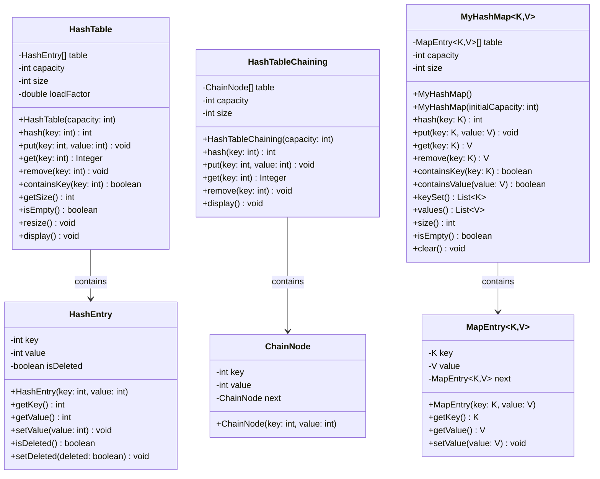

# Module 09: Hashing dan Map

## Daftar Isi
1. [Pengenalan Hashing](#pengenalan-hashing)
2. [Hash Function](#hash-function)
3. [Hash Table](#hash-table)
   - [Hash Table tanpa OOP](#hash-table-tanpa-oop)
   - [Hash Table dengan OOP](#hash-table-dengan-oop)
4. [Collision Handling](#collision-handling)
   - [Chaining (Separate Chaining)](#chaining-separate-chaining)
   - [Open Addressing](#open-addressing)
5. [Map (Key-Value Pair)](#map-key-value-pair)
   - [Map tanpa OOP](#map-tanpa-oop)
   - [Map dengan OOP](#map-dengan-oop)
6. [HashMap dengan Generics](#hashmap-dengan-generics)
7. [Kapan Menggunakan Hashing dan Map](#kapan-menggunakan-hashing-dan-map)
8. [Kompleksitas Hashing](#kompleksitas-hashing)
9. [Latihan Praktikum](#latihan-praktikum)

---

## Pengenalan Hashing

### Apa itu Hashing?

Hashing adalah teknik untuk memetakan data berukuran besar ke nilai berukuran tetap (hash value/hash code) menggunakan fungsi matematika yang disebut **Hash Function**. Hash value ini kemudian digunakan sebagai indeks untuk menyimpan dan mengambil data dengan cepat.

### Mengapa Hashing Penting?

Bayangkan Anda memiliki 1 juta data dan ingin mencari satu data tertentu:
- **Array/List**: Pencarian linear O(n) = 1 juta operasi (worst case)
- **Binary Search**: O(log n) = ~20 operasi (data harus terurut)
- **Hashing**: O(1) = 1 operasi (rata-rata)!

### Komponen Utama Hashing

```
┌─────────────────────────────────────────────────────────────┐
│                        HASHING PROCESS                       │
├─────────────────────────────────────────────────────────────┤
│                                                              │
│    Key (Input)          Hash Function         Index          │
│   ┌─────────┐          ┌───────────┐       ┌─────────┐      │
│   │ "John"  │  ─────>  │  h(key)   │ ───>  │    3    │      │
│   └─────────┘          └───────────┘       └─────────┘      │
│                                                              │
│                        Hash Table                            │
│                   ┌────┬─────────────┐                       │
│              [0]  │    │             │                       │
│              [1]  │    │             │                       │
│              [2]  │    │             │                       │
│              [3]  │ ──>│   "John"    │  <── Data disimpan    │
│              [4]  │    │             │                       │
│              [5]  │    │             │                       │
│                   └────┴─────────────┘                       │
└─────────────────────────────────────────────────────────────┘
```

### Terminologi Penting

| Istilah | Penjelasan |
|---------|------------|
| **Key** | Data input yang akan di-hash (bisa string, integer, object) |
| **Hash Function** | Fungsi matematika yang mengkonversi key menjadi index |
| **Hash Value/Code** | Hasil dari hash function |
| **Hash Table** | Array yang menyimpan data berdasarkan hash value |
| **Bucket** | Slot/posisi dalam hash table |
| **Collision** | Ketika dua key berbeda menghasilkan hash value yang sama |
| **Load Factor** | Rasio jumlah elemen terhadap ukuran tabel (n/m) |

### Keuntungan Hashing
- Operasi insert, delete, search rata-rata O(1)
- Efisien untuk data berukuran besar
- Cocok untuk implementasi cache, database indexing

### Kekurangan Hashing
- Membutuhkan memori tambahan
- Collision bisa menurunkan performa
- Tidak mendukung operasi range query (data tidak terurut)
- Pemilihan hash function yang buruk bisa menyebabkan banyak collision

### Class Diagram Hashing dan Map

Berikut adalah class diagram untuk struktur data Hashing dan Map yang akan dibahas dalam modul ini:



---

## Hash Function

### Karakteristik Hash Function yang Baik

1. **Deterministic**: Input yang sama selalu menghasilkan output yang sama
2. **Uniform Distribution**: Menyebar data secara merata ke seluruh tabel
3. **Efficient**: Cepat dihitung
4. **Minimize Collision**: Meminimalkan dua key berbeda menghasilkan hash yang sama

### Jenis-jenis Hash Function

#### 1. Division Method
Menggunakan operasi modulo untuk mendapatkan index.

```java
int hash(int key, int tableSize) {
    return key % tableSize;
}
```

**Tips**: Pilih tableSize yang merupakan bilangan prima untuk distribusi lebih baik.

#### 2. Multiplication Method
Mengalikan key dengan konstanta A (0 < A < 1), mengambil bagian desimal, lalu kalikan dengan ukuran tabel.

```java
int hash(int key, int tableSize) {
    double A = 0.6180339887; // (sqrt(5) - 1) / 2 (Golden ratio)
    double temp = key * A;
    temp = temp - Math.floor(temp); // Ambil bagian desimal
    return (int) Math.floor(tableSize * temp);
}
```

#### 3. String Hash Function
Untuk key berupa string, gunakan teknik polynomial rolling hash.

```java
int hashString(String key, int tableSize) {
    int hash = 0;
    int prime = 31; // Bilangan prima

    for (int i = 0; i < key.length(); i++) {
        hash = (hash * prime + key.charAt(i)) % tableSize;
    }

    return Math.abs(hash);
}
```

#### 4. Java's hashCode()
Java menyediakan method bawaan `hashCode()` untuk setiap object.

```java
String name = "John";
int hashCode = name.hashCode();  // Returns integer hash code
int index = Math.abs(hashCode % tableSize);
```

---

## Hash Table

### Konsep Hash Table

Hash Table adalah struktur data yang menggunakan array dan hash function untuk menyimpan pasangan key-value. Data diakses berdasarkan key, bukan index numerik.

```
Key "apple"  --hash--> index 2 --> Hash Table[2] = "apple"
Key "banana" --hash--> index 5 --> Hash Table[5] = "banana"
```

---

### Hash Table tanpa OOP

```java
public class HashTableNoOOP {
    static final int TABLE_SIZE = 10;
    static int[] table = new int[TABLE_SIZE];
    static boolean[] occupied = new boolean[TABLE_SIZE];
    static int size = 0;

    // Hash function sederhana
    public static int hash(int key) {
        return Math.abs(key % TABLE_SIZE);
    }

    // Insert - Linear Probing untuk collision
    public static void insert(int key) {
        if (size >= TABLE_SIZE) {
            System.out.println("Hash Table penuh!");
            return;
        }

        int index = hash(key);
        int originalIndex = index;

        // Linear probing jika terjadi collision
        while (occupied[index]) {
            if (table[index] == key) {
                System.out.println("Key " + key + " sudah ada di index " + index);
                return;
            }
            index = (index + 1) % TABLE_SIZE;
            if (index == originalIndex) {
                System.out.println("Hash Table penuh!");
                return;
            }
        }

        table[index] = key;
        occupied[index] = true;
        size++;
        System.out.println("Insert " + key + " di index " + index);
    }

    // Search
    public static int search(int key) {
        int index = hash(key);
        int originalIndex = index;

        while (occupied[index]) {
            if (table[index] == key) {
                return index;
            }
            index = (index + 1) % TABLE_SIZE;
            if (index == originalIndex) break;
        }

        return -1; // Not found
    }

    // Delete
    public static void delete(int key) {
        int index = search(key);

        if (index == -1) {
            System.out.println("Key " + key + " tidak ditemukan!");
            return;
        }

        // Mark as deleted (menggunakan teknik lazy deletion)
        // Untuk simplifikasi, kita set occupied = false
        // Catatan: Ini bisa menyebabkan masalah pada linear probing
        // Solusi yang lebih baik: gunakan tombstone/deleted marker
        occupied[index] = false;
        size--;
        System.out.println("Delete " + key + " dari index " + index);
    }

    // Display
    public static void display() {
        System.out.println("\n=== HASH TABLE ===");
        System.out.println("Index | Value | Status");
        System.out.println("------+-------+--------");
        for (int i = 0; i < TABLE_SIZE; i++) {
            String value = occupied[i] ? String.valueOf(table[i]) : "-";
            String status = occupied[i] ? "Occupied" : "Empty";
            System.out.printf("  %d   |  %s   | %s%n", i, value, status);
        }
        System.out.println("Size: " + size + "/" + TABLE_SIZE);
    }

    // Get Load Factor
    public static double getLoadFactor() {
        return (double) size / TABLE_SIZE;
    }

    public static void main(String[] args) {
        System.out.println("=== HASH TABLE TANPA OOP ===\n");

        // Test insert
        insert(15);  // 15 % 10 = 5
        insert(25);  // 25 % 10 = 5 (collision!) -> linear probe to 6
        insert(35);  // 35 % 10 = 5 (collision!) -> linear probe to 7
        insert(10);  // 10 % 10 = 0
        insert(22);  // 22 % 10 = 2

        display();
        System.out.println("Load Factor: " + getLoadFactor());

        // Test search
        System.out.println("\n=== SEARCH ===");
        int idx = search(25);
        System.out.println("Key 25 ditemukan di index: " + (idx != -1 ? idx : "Tidak ditemukan"));
        idx = search(100);
        System.out.println("Key 100 ditemukan di index: " + (idx != -1 ? idx : "Tidak ditemukan"));

        // Test delete
        System.out.println("\n=== DELETE ===");
        delete(25);
        display();
    }
}
```

**Output:**
```
=== HASH TABLE TANPA OOP ===

Insert 15 di index 5
Insert 25 di index 6
Insert 35 di index 7
Insert 10 di index 0
Insert 22 di index 2

=== HASH TABLE ===
Index | Value | Status
------+-------+--------
  0   |  10   | Occupied
  1   |  -   | Empty
  2   |  22   | Occupied
  3   |  -   | Empty
  4   |  -   | Empty
  5   |  15   | Occupied
  6   |  25   | Occupied
  7   |  35   | Occupied
  8   |  -   | Empty
  9   |  -   | Empty
Size: 5/10
Load Factor: 0.5

=== SEARCH ===
Key 25 ditemukan di index: 6
Key 100 ditemukan di index: Tidak ditemukan

=== DELETE ===
Delete 25 dari index 6

=== HASH TABLE ===
Index | Value | Status
------+-------+--------
  0   |  10   | Occupied
  1   |  -   | Empty
  2   |  22   | Occupied
  3   |  -   | Empty
  4   |  -   | Empty
  5   |  15   | Occupied
  6   |  -   | Empty
  7   |  35   | Occupied
  8   |  -   | Empty
  9   |  -   | Empty
Size: 4/10
```

---

### Hash Table dengan OOP

```java
// File: HashEntry.java
class HashEntry {
    int key;
    int value;
    boolean isDeleted;

    public HashEntry(int key, int value) {
        this.key = key;
        this.value = value;
        this.isDeleted = false;
    }
}

// File: HashTable.java
class HashTable {
    private HashEntry[] table;
    private int capacity;
    private int size;
    private static final double MAX_LOAD_FACTOR = 0.75;

    public HashTable(int capacity) {
        this.capacity = capacity;
        this.table = new HashEntry[capacity];
        this.size = 0;
    }

    // Hash function
    private int hash(int key) {
        return Math.abs(key % capacity);
    }

    // Second hash for double hashing
    private int hash2(int key) {
        return 7 - (key % 7);  // 7 adalah bilangan prima < capacity
    }

    // Get load factor
    public double getLoadFactor() {
        return (double) size / capacity;
    }

    // Resize table when load factor exceeds threshold
    private void resize() {
        System.out.println("\n[Resizing table from " + capacity + " to " + (capacity * 2) + "]");

        HashEntry[] oldTable = table;
        int oldCapacity = capacity;

        capacity *= 2;
        table = new HashEntry[capacity];
        size = 0;

        for (int i = 0; i < oldCapacity; i++) {
            if (oldTable[i] != null && !oldTable[i].isDeleted) {
                put(oldTable[i].key, oldTable[i].value);
            }
        }
    }

    // Insert key-value pair (Linear Probing)
    public void put(int key, int value) {
        if (getLoadFactor() >= MAX_LOAD_FACTOR) {
            resize();
        }

        int index = hash(key);
        int originalIndex = index;
        int i = 1;

        while (table[index] != null && !table[index].isDeleted) {
            if (table[index].key == key) {
                // Update existing key
                table[index].value = value;
                System.out.println("Update key " + key + " dengan value " + value + " di index " + index);
                return;
            }
            // Linear probing
            index = (originalIndex + i) % capacity;
            i++;
            if (index == originalIndex) {
                System.out.println("Hash Table penuh!");
                return;
            }
        }

        table[index] = new HashEntry(key, value);
        size++;
        System.out.println("Insert (" + key + ", " + value + ") di index " + index);
    }

    // Get value by key
    public Integer get(int key) {
        int index = hash(key);
        int originalIndex = index;
        int i = 1;

        while (table[index] != null) {
            if (!table[index].isDeleted && table[index].key == key) {
                return table[index].value;
            }
            index = (originalIndex + i) % capacity;
            i++;
            if (index == originalIndex) break;
        }

        return null; // Not found
    }

    // Remove key
    public void remove(int key) {
        int index = hash(key);
        int originalIndex = index;
        int i = 1;

        while (table[index] != null) {
            if (!table[index].isDeleted && table[index].key == key) {
                table[index].isDeleted = true;  // Tombstone
                size--;
                System.out.println("Remove key " + key + " dari index " + index);
                return;
            }
            index = (originalIndex + i) % capacity;
            i++;
            if (index == originalIndex) break;
        }

        System.out.println("Key " + key + " tidak ditemukan!");
    }

    // Check if key exists
    public boolean containsKey(int key) {
        return get(key) != null;
    }

    // Get size
    public int getSize() {
        return size;
    }

    // Check if empty
    public boolean isEmpty() {
        return size == 0;
    }

    // Clear table
    public void clear() {
        table = new HashEntry[capacity];
        size = 0;
        System.out.println("Hash Table dikosongkan");
    }

    // Display table
    public void display() {
        System.out.println("\n=== HASH TABLE ===");
        System.out.println("Index |   Key   |  Value  | Status");
        System.out.println("------+---------+---------+----------");
        for (int i = 0; i < capacity; i++) {
            String key = "-";
            String value = "-";
            String status = "Empty";

            if (table[i] != null) {
                if (table[i].isDeleted) {
                    status = "Deleted";
                } else {
                    key = String.valueOf(table[i].key);
                    value = String.valueOf(table[i].value);
                    status = "Occupied";
                }
            }
            System.out.printf("  %2d  |  %5s  |  %5s  | %s%n", i, key, value, status);
        }
        System.out.println("Size: " + size + "/" + capacity);
        System.out.printf("Load Factor: %.2f%n", getLoadFactor());
    }
}

// File: HashTableDemo.java
public class HashTableDemo {
    public static void main(String[] args) {
        System.out.println("=== HASH TABLE DENGAN OOP ===\n");

        HashTable ht = new HashTable(7);

        // Test insert
        ht.put(10, 100);
        ht.put(20, 200);
        ht.put(30, 300);
        ht.put(17, 170);  // 17 % 7 = 3 (collision with 10 % 7 = 3)
        ht.put(24, 240);  // 24 % 7 = 3 (collision!)
        ht.display();

        // Test get
        System.out.println("\n=== GET ===");
        System.out.println("get(17) = " + ht.get(17));
        System.out.println("get(99) = " + ht.get(99));

        // Test contains
        System.out.println("\n=== CONTAINS ===");
        System.out.println("containsKey(20) = " + ht.containsKey(20));
        System.out.println("containsKey(99) = " + ht.containsKey(99));

        // Test update
        System.out.println("\n=== UPDATE ===");
        ht.put(17, 1700);  // Update existing key
        System.out.println("get(17) setelah update = " + ht.get(17));

        // Test remove
        System.out.println("\n=== REMOVE ===");
        ht.remove(20);
        ht.display();

        // Test resize (add more elements to trigger resize)
        System.out.println("\n=== TRIGGER RESIZE ===");
        ht.put(5, 50);
        ht.put(12, 120);
        ht.display();
    }
}
```

**Output:**
```
=== HASH TABLE DENGAN OOP ===

Insert (10, 100) di index 3
Insert (20, 200) di index 6
Insert (30, 300) di index 2
Insert (17, 170) di index 4
Insert (24, 240) di index 5

=== HASH TABLE ===
Index |   Key   |  Value  | Status
------+---------+---------+----------
   0  |     -   |     -   | Empty
   1  |     -   |     -   | Empty
   2  |    30   |   300   | Occupied
   3  |    10   |   100   | Occupied
   4  |    17   |   170   | Occupied
   5  |    24   |   240   | Occupied
   6  |    20   |   200   | Occupied
Size: 5/7
Load Factor: 0.71

=== GET ===
get(17) = 170
get(99) = null

=== CONTAINS ===
containsKey(20) = true
containsKey(99) = false

=== UPDATE ===
Update key 17 dengan value 1700 di index 4
get(17) setelah update = 1700

=== REMOVE ===
Remove key 20 dari index 6

=== HASH TABLE ===
Index |   Key   |  Value  | Status
------+---------+---------+----------
   0  |     -   |     -   | Empty
   1  |     -   |     -   | Empty
   2  |    30   |   300   | Occupied
   3  |    10   |   100   | Occupied
   4  |    17   |  1700   | Occupied
   5  |    24   |   240   | Occupied
   6  |     -   |     -   | Deleted
Size: 4/7
Load Factor: 0.57

=== TRIGGER RESIZE ===

[Resizing table from 7 to 14]
Insert (30, 300) di index 2
Insert (10, 100) di index 10
Insert (17, 1700) di index 3
Insert (24, 240) di index 10
Insert (5, 50) di index 5
Insert (12, 120) di index 12

=== HASH TABLE ===
Index |   Key   |  Value  | Status
------+---------+---------+----------
   0  |     -   |     -   | Empty
   1  |     -   |     -   | Empty
   2  |    30   |   300   | Occupied
   3  |    17   |  1700   | Occupied
   4  |     -   |     -   | Empty
   5  |     5   |    50   | Occupied
   6  |     -   |     -   | Empty
   7  |     -   |     -   | Empty
   8  |     -   |     -   | Empty
   9  |     -   |     -   | Empty
  10  |    10   |   100   | Occupied
  11  |    24   |   240   | Occupied
  12  |    12   |   120   | Occupied
  13  |     -   |     -   | Empty
Size: 6/14
Load Factor: 0.43
```

---

## Collision Handling

### Apa itu Collision?

Collision terjadi ketika dua key berbeda menghasilkan hash value yang sama.

```
hash("apple")  = 3    ─┐
                       ├──> Collision! Kedua key ingin menempati index 3
hash("orange") = 3    ─┘
```

### Dua Strategi Utama

```
┌────────────────────────────────────────────────────────────────────┐
│                     COLLISION HANDLING                              │
├──────────────────────────────┬─────────────────────────────────────┤
│      CHAINING                │          OPEN ADDRESSING            │
│   (Separate Chaining)        │                                     │
├──────────────────────────────┼─────────────────────────────────────┤
│                              │                                     │
│   [0] -> [A] -> [B] -> null  │   [0] | A                           │
│   [1] -> null                │   [1] |                             │
│   [2] -> [C] -> null         │   [2] | B  <- probe                 │
│   [3] -> null                │   [3] | C  <- probe                 │
│                              │                                     │
│   Menggunakan Linked List    │   Linear/Quadratic/Double Hashing   │
│   di setiap bucket           │   Mencari slot kosong berikutnya    │
│                              │                                     │
└──────────────────────────────┴─────────────────────────────────────┘
```

---

### Chaining (Separate Chaining)

Setiap bucket dalam hash table adalah linked list. Ketika collision terjadi, elemen baru ditambahkan ke linked list di bucket tersebut.

```java
// File: ChainNode.java
class ChainNode {
    int key;
    int value;
    ChainNode next;

    public ChainNode(int key, int value) {
        this.key = key;
        this.value = value;
        this.next = null;
    }
}

// File: HashTableChaining.java
class HashTableChaining {
    private ChainNode[] table;
    private int capacity;
    private int size;

    public HashTableChaining(int capacity) {
        this.capacity = capacity;
        this.table = new ChainNode[capacity];
        this.size = 0;
    }

    private int hash(int key) {
        return Math.abs(key % capacity);
    }

    // Insert
    public void put(int key, int value) {
        int index = hash(key);

        // Check if key already exists
        ChainNode current = table[index];
        while (current != null) {
            if (current.key == key) {
                current.value = value;  // Update
                System.out.println("Update (" + key + ", " + value + ") di index " + index);
                return;
            }
            current = current.next;
        }

        // Insert at beginning of chain
        ChainNode newNode = new ChainNode(key, value);
        newNode.next = table[index];
        table[index] = newNode;
        size++;
        System.out.println("Insert (" + key + ", " + value + ") di index " + index);
    }

    // Get
    public Integer get(int key) {
        int index = hash(key);
        ChainNode current = table[index];

        while (current != null) {
            if (current.key == key) {
                return current.value;
            }
            current = current.next;
        }

        return null;
    }

    // Remove
    public void remove(int key) {
        int index = hash(key);

        if (table[index] == null) {
            System.out.println("Key " + key + " tidak ditemukan!");
            return;
        }

        // If head node is to be deleted
        if (table[index].key == key) {
            table[index] = table[index].next;
            size--;
            System.out.println("Remove key " + key + " dari index " + index);
            return;
        }

        // Search in chain
        ChainNode current = table[index];
        while (current.next != null) {
            if (current.next.key == key) {
                current.next = current.next.next;
                size--;
                System.out.println("Remove key " + key + " dari index " + index);
                return;
            }
            current = current.next;
        }

        System.out.println("Key " + key + " tidak ditemukan!");
    }

    // Get chain length at index
    public int getChainLength(int index) {
        int length = 0;
        ChainNode current = table[index];
        while (current != null) {
            length++;
            current = current.next;
        }
        return length;
    }

    // Display
    public void display() {
        System.out.println("\n=== HASH TABLE (CHAINING) ===");
        for (int i = 0; i < capacity; i++) {
            System.out.print("[" + i + "] -> ");
            ChainNode current = table[i];
            if (current == null) {
                System.out.println("null");
            } else {
                while (current != null) {
                    System.out.print("(" + current.key + "," + current.value + ")");
                    if (current.next != null) {
                        System.out.print(" -> ");
                    }
                    current = current.next;
                }
                System.out.println(" -> null");
            }
        }
        System.out.println("Total Size: " + size);
    }

    public int getSize() {
        return size;
    }
}

// File: ChainingDemo.java
public class ChainingDemo {
    public static void main(String[] args) {
        System.out.println("=== COLLISION HANDLING: CHAINING ===\n");

        HashTableChaining ht = new HashTableChaining(7);

        // Insert elements that will cause collisions
        ht.put(10, 100);  // 10 % 7 = 3
        ht.put(17, 170);  // 17 % 7 = 3 (collision!)
        ht.put(24, 240);  // 24 % 7 = 3 (collision!)
        ht.put(31, 310);  // 31 % 7 = 3 (collision!)
        ht.put(5, 50);    // 5 % 7 = 5
        ht.put(12, 120);  // 12 % 7 = 5 (collision!)
        ht.put(20, 200);  // 20 % 7 = 6

        ht.display();

        // Test get
        System.out.println("\n=== GET ===");
        System.out.println("get(17) = " + ht.get(17));
        System.out.println("get(24) = " + ht.get(24));
        System.out.println("get(99) = " + ht.get(99));

        // Test remove
        System.out.println("\n=== REMOVE ===");
        ht.remove(17);  // Remove from middle of chain
        ht.display();

        // Show chain lengths
        System.out.println("\n=== CHAIN LENGTHS ===");
        for (int i = 0; i < 7; i++) {
            System.out.println("Index " + i + ": " + ht.getChainLength(i) + " elements");
        }
    }
}
```

**Output:**
```
=== COLLISION HANDLING: CHAINING ===

Insert (10, 100) di index 3
Insert (17, 170) di index 3
Insert (24, 240) di index 3
Insert (31, 310) di index 3
Insert (5, 50) di index 5
Insert (12, 120) di index 5
Insert (20, 200) di index 6

=== HASH TABLE (CHAINING) ===
[0] -> null
[1] -> null
[2] -> null
[3] -> (31,310) -> (24,240) -> (17,170) -> (10,100) -> null
[4] -> null
[5] -> (12,120) -> (5,50) -> null
[6] -> (20,200) -> null
Total Size: 7

=== GET ===
get(17) = 170
get(24) = 240
get(99) = null

=== REMOVE ===
Remove key 17 dari index 3

=== HASH TABLE (CHAINING) ===
[0] -> null
[1] -> null
[2] -> null
[3] -> (31,310) -> (24,240) -> (10,100) -> null
[4] -> null
[5] -> (12,120) -> (5,50) -> null
[6] -> (20,200) -> null
Total Size: 6

=== CHAIN LENGTHS ===
Index 0: 0 elements
Index 1: 0 elements
Index 2: 0 elements
Index 3: 3 elements
Index 4: 0 elements
Index 5: 2 elements
Index 6: 1 elements
```

---

### Open Addressing

Pada Open Addressing, semua elemen disimpan langsung dalam array. Ketika collision terjadi, algoritma mencari slot kosong berikutnya menggunakan teknik probing.

#### 1. Linear Probing
Jika slot `h(k)` penuh, coba `h(k)+1`, `h(k)+2`, dst.

```java
index = (hash(key) + i) % capacity;  // i = 0, 1, 2, 3, ...
```

**Masalah**: Primary Clustering - elemen cenderung mengelompok.

#### 2. Quadratic Probing
Menggunakan fungsi kuadrat untuk probing.

```java
index = (hash(key) + i*i) % capacity;  // i = 0, 1, 2, 3, ...
```

**Lebih baik dari linear probing, mengurangi clustering.

#### 3. Double Hashing
Menggunakan dua hash function.

```java
index = (hash1(key) + i * hash2(key)) % capacity;  // i = 0, 1, 2, 3, ...
```

```java
// File: OpenAddressingDemo.java
public class OpenAddressingDemo {
    static final int CAPACITY = 11;  // Bilangan prima
    static int[] keys;
    static int[] values;
    static boolean[] occupied;
    static boolean[] deleted;
    static int size;

    // Initialize
    public static void init() {
        keys = new int[CAPACITY];
        values = new int[CAPACITY];
        occupied = new boolean[CAPACITY];
        deleted = new boolean[CAPACITY];
        size = 0;
    }

    // Primary hash function
    public static int hash1(int key) {
        return Math.abs(key % CAPACITY);
    }

    // Secondary hash function for double hashing
    public static int hash2(int key) {
        return 7 - (Math.abs(key) % 7);  // Never returns 0
    }

    // ==================== LINEAR PROBING ====================
    public static void insertLinear(int key, int value) {
        if (size >= CAPACITY) {
            System.out.println("Table penuh!");
            return;
        }

        int index = hash1(key);
        int i = 0;

        while (occupied[index] && !deleted[index]) {
            if (keys[index] == key) {
                values[index] = value;
                System.out.println("[Linear] Update (" + key + ", " + value + ") di index " + index);
                return;
            }
            i++;
            index = (hash1(key) + i) % CAPACITY;
        }

        keys[index] = key;
        values[index] = value;
        occupied[index] = true;
        deleted[index] = false;
        size++;
        System.out.println("[Linear] Insert (" + key + ", " + value + ") di index " + index + " (probes: " + i + ")");
    }

    // ==================== QUADRATIC PROBING ====================
    public static void insertQuadratic(int key, int value) {
        if (size >= CAPACITY) {
            System.out.println("Table penuh!");
            return;
        }

        int index = hash1(key);
        int i = 0;

        while (occupied[index] && !deleted[index]) {
            if (keys[index] == key) {
                values[index] = value;
                System.out.println("[Quadratic] Update (" + key + ", " + value + ") di index " + index);
                return;
            }
            i++;
            index = (hash1(key) + i * i) % CAPACITY;
        }

        keys[index] = key;
        values[index] = value;
        occupied[index] = true;
        deleted[index] = false;
        size++;
        System.out.println("[Quadratic] Insert (" + key + ", " + value + ") di index " + index + " (probes: " + i + ")");
    }

    // ==================== DOUBLE HASHING ====================
    public static void insertDouble(int key, int value) {
        if (size >= CAPACITY) {
            System.out.println("Table penuh!");
            return;
        }

        int index = hash1(key);
        int step = hash2(key);
        int i = 0;

        while (occupied[index] && !deleted[index]) {
            if (keys[index] == key) {
                values[index] = value;
                System.out.println("[Double] Update (" + key + ", " + value + ") di index " + index);
                return;
            }
            i++;
            index = (hash1(key) + i * step) % CAPACITY;
        }

        keys[index] = key;
        values[index] = value;
        occupied[index] = true;
        deleted[index] = false;
        size++;
        System.out.println("[Double] Insert (" + key + ", " + value + ") di index " + index + " (probes: " + i + ")");
    }

    // Display
    public static void display(String method) {
        System.out.println("\n=== HASH TABLE (" + method + ") ===");
        System.out.println("Index | Key | Value | Status");
        System.out.println("------+-----+-------+--------");
        for (int i = 0; i < CAPACITY; i++) {
            String k = occupied[i] ? String.valueOf(keys[i]) : "-";
            String v = occupied[i] ? String.valueOf(values[i]) : "-";
            String status = deleted[i] ? "Deleted" : (occupied[i] ? "Occupied" : "Empty");
            System.out.printf("  %2d  | %3s | %5s | %s%n", i, k, v, status);
        }
    }

    public static void main(String[] args) {
        // Test semua data yang sama untuk setiap metode
        int[][] data = {{22, 220}, {33, 330}, {44, 440}, {55, 550}, {11, 110}, {77, 770}};

        // ==================== LINEAR PROBING ====================
        System.out.println("==================== LINEAR PROBING ====================\n");
        init();
        for (int[] d : data) {
            insertLinear(d[0], d[1]);
        }
        display("LINEAR");

        // ==================== QUADRATIC PROBING ====================
        System.out.println("\n==================== QUADRATIC PROBING ====================\n");
        init();
        for (int[] d : data) {
            insertQuadratic(d[0], d[1]);
        }
        display("QUADRATIC");

        // ==================== DOUBLE HASHING ====================
        System.out.println("\n==================== DOUBLE HASHING ====================\n");
        init();
        for (int[] d : data) {
            insertDouble(d[0], d[1]);
        }
        display("DOUBLE");
    }
}
```

**Output:**
```
==================== LINEAR PROBING ====================

[Linear] Insert (22, 220) di index 0 (probes: 0)
[Linear] Insert (33, 330) di index 0 (probes: 0)
[Linear] Insert (44, 440) di index 0 (probes: 0)
[Linear] Insert (55, 550) di index 0 (probes: 0)
[Linear] Insert (11, 110) di index 0 (probes: 0)
[Linear] Insert (77, 770) di index 0 (probes: 0)

=== HASH TABLE (LINEAR) ===
Index | Key | Value | Status
------+-----+-------+--------
   0  |  22 |   220 | Occupied
   1  |  33 |   330 | Occupied
   2  |  44 |   440 | Occupied
   3  |  55 |   550 | Occupied
   4  |  11 |   110 | Occupied
   5  |  77 |   770 | Occupied
   6  |   - |     - | Empty
   7  |   - |     - | Empty
   8  |   - |     - | Empty
   9  |   - |     - | Empty
  10  |   - |     - | Empty

==================== QUADRATIC PROBING ====================

[Quadratic] Insert (22, 220) di index 0 (probes: 0)
[Quadratic] Insert (33, 330) di index 0 (probes: 0)
[Quadratic] Insert (44, 440) di index 0 (probes: 0)
[Quadratic] Insert (55, 550) di index 0 (probes: 0)
[Quadratic] Insert (11, 110) di index 0 (probes: 0)
[Quadratic] Insert (77, 770) di index 0 (probes: 0)

=== HASH TABLE (QUADRATIC) ===
Index | Key | Value | Status
------+-----+-------+--------
   0  |  22 |   220 | Occupied
   1  |  33 |   330 | Occupied
   4  |  44 |   440 | Occupied
   5  |  55 |   550 | Occupied
   9  |  11 |   110 | Occupied
   3  |  77 |   770 | Occupied
   ...

==================== DOUBLE HASHING ====================

[Double] Insert (22, 220) di index 0 (probes: 0)
[Double] Insert (33, 330) di index 0 (probes: 0)
[Double] Insert (44, 440) di index 0 (probes: 0)
...
```

---

## Map (Key-Value Pair)

### Apa itu Map?

Map adalah struktur data yang menyimpan pasangan key-value, dimana setiap key bersifat unik. Map menggunakan hashing untuk operasi yang efisien.

```
┌───────────────────────────────────────┐
│              MAP                       │
├─────────────┬─────────────────────────┤
│    KEY      │         VALUE           │
├─────────────┼─────────────────────────┤
│   "nama"    │        "John"           │
│   "umur"    │           25            │
│   "kota"    │       "Jakarta"         │
│   "email"   │   "john@email.com"      │
└─────────────┴─────────────────────────┘
```

---

### Map tanpa OOP

```java
public class MapNoOOP {
    static final int CAPACITY = 16;

    // Separate arrays for keys and values
    static String[] keys = new String[CAPACITY];
    static String[] values = new String[CAPACITY];
    static boolean[] occupied = new boolean[CAPACITY];
    static int size = 0;

    // Hash function untuk string
    public static int hash(String key) {
        int hash = 0;
        for (int i = 0; i < key.length(); i++) {
            hash = (hash * 31 + key.charAt(i)) % CAPACITY;
        }
        return Math.abs(hash);
    }

    // Put key-value
    public static void put(String key, String value) {
        int index = hash(key);
        int originalIndex = index;
        int i = 0;

        while (occupied[index]) {
            if (keys[index].equals(key)) {
                values[index] = value;  // Update
                System.out.println("Update: " + key + " = " + value);
                return;
            }
            i++;
            index = (originalIndex + i) % CAPACITY;
            if (index == originalIndex) {
                System.out.println("Map penuh!");
                return;
            }
        }

        keys[index] = key;
        values[index] = value;
        occupied[index] = true;
        size++;
        System.out.println("Put: " + key + " = " + value + " (index " + index + ")");
    }

    // Get value by key
    public static String get(String key) {
        int index = hash(key);
        int originalIndex = index;
        int i = 0;

        while (occupied[index]) {
            if (keys[index].equals(key)) {
                return values[index];
            }
            i++;
            index = (originalIndex + i) % CAPACITY;
            if (index == originalIndex) break;
        }

        return null;
    }

    // Remove by key
    public static void remove(String key) {
        int index = hash(key);
        int originalIndex = index;
        int i = 0;

        while (occupied[index]) {
            if (keys[index].equals(key)) {
                occupied[index] = false;
                keys[index] = null;
                values[index] = null;
                size--;
                System.out.println("Remove: " + key);
                return;
            }
            i++;
            index = (originalIndex + i) % CAPACITY;
            if (index == originalIndex) break;
        }

        System.out.println("Key " + key + " tidak ditemukan!");
    }

    // Check if key exists
    public static boolean containsKey(String key) {
        return get(key) != null;
    }

    // Display all entries
    public static void displayAll() {
        System.out.println("\n=== MAP ENTRIES ===");
        for (int i = 0; i < CAPACITY; i++) {
            if (occupied[i]) {
                System.out.println("  " + keys[i] + " : " + values[i]);
            }
        }
        System.out.println("Size: " + size);
    }

    // Get all keys
    public static void displayKeys() {
        System.out.print("Keys: [");
        boolean first = true;
        for (int i = 0; i < CAPACITY; i++) {
            if (occupied[i]) {
                if (!first) System.out.print(", ");
                System.out.print(keys[i]);
                first = false;
            }
        }
        System.out.println("]");
    }

    public static void main(String[] args) {
        System.out.println("=== MAP TANPA OOP ===\n");

        // Test put
        put("nama", "John Doe");
        put("umur", "25");
        put("kota", "Jakarta");
        put("email", "john@email.com");
        put("pekerjaan", "Software Engineer");

        displayAll();
        displayKeys();

        // Test get
        System.out.println("\n=== GET ===");
        System.out.println("get(nama) = " + get("nama"));
        System.out.println("get(umur) = " + get("umur"));
        System.out.println("get(alamat) = " + get("alamat"));

        // Test containsKey
        System.out.println("\n=== CONTAINS KEY ===");
        System.out.println("containsKey(email) = " + containsKey("email"));
        System.out.println("containsKey(telepon) = " + containsKey("telepon"));

        // Test update
        System.out.println("\n=== UPDATE ===");
        put("umur", "26");
        System.out.println("get(umur) setelah update = " + get("umur"));

        // Test remove
        System.out.println("\n=== REMOVE ===");
        remove("kota");
        displayAll();
    }
}
```

**Output:**
```
=== MAP TANPA OOP ===

Put: nama = John Doe (index 4)
Put: umur = 25 (index 7)
Put: kota = Jakarta (index 9)
Put: email = john@email.com (index 15)
Put: pekerjaan = Software Engineer (index 2)

=== MAP ENTRIES ===
  pekerjaan : Software Engineer
  nama : John Doe
  umur : 25
  kota : Jakarta
  email : john@email.com
Size: 5
Keys: [pekerjaan, nama, umur, kota, email]

=== GET ===
get(nama) = John Doe
get(umur) = 25
get(alamat) = null

=== CONTAINS KEY ===
containsKey(email) = true
containsKey(telepon) = false

=== UPDATE ===
Update: umur = 26
get(umur) setelah update = 26

=== REMOVE ===
Remove: kota

=== MAP ENTRIES ===
  pekerjaan : Software Engineer
  nama : John Doe
  umur : 26
  email : john@email.com
Size: 4
```

---

### Map dengan OOP

```java
import java.util.ArrayList;
import java.util.List;

// File: MapEntry.java
class MapEntry<K, V> {
    K key;
    V value;
    MapEntry<K, V> next;  // For chaining

    public MapEntry(K key, V value) {
        this.key = key;
        this.value = value;
        this.next = null;
    }
}

// File: MyHashMap.java
class MyHashMap<K, V> {
    private MapEntry<K, V>[] table;
    private int capacity;
    private int size;
    private static final int DEFAULT_CAPACITY = 16;
    private static final double LOAD_FACTOR = 0.75;

    @SuppressWarnings("unchecked")
    public MyHashMap() {
        this.capacity = DEFAULT_CAPACITY;
        this.table = new MapEntry[capacity];
        this.size = 0;
    }

    @SuppressWarnings("unchecked")
    public MyHashMap(int initialCapacity) {
        this.capacity = initialCapacity;
        this.table = new MapEntry[capacity];
        this.size = 0;
    }

    private int hash(K key) {
        return Math.abs(key.hashCode() % capacity);
    }

    @SuppressWarnings("unchecked")
    private void resize() {
        System.out.println("\n[Resizing from " + capacity + " to " + (capacity * 2) + "]");

        MapEntry<K, V>[] oldTable = table;
        int oldCapacity = capacity;

        capacity *= 2;
        table = new MapEntry[capacity];
        size = 0;

        for (int i = 0; i < oldCapacity; i++) {
            MapEntry<K, V> entry = oldTable[i];
            while (entry != null) {
                put(entry.key, entry.value);
                entry = entry.next;
            }
        }
    }

    // Put key-value pair
    public void put(K key, V value) {
        if ((double) size / capacity >= LOAD_FACTOR) {
            resize();
        }

        int index = hash(key);
        MapEntry<K, V> entry = table[index];

        // Check if key exists
        while (entry != null) {
            if (entry.key.equals(key)) {
                entry.value = value;  // Update
                System.out.println("Update: " + key + " = " + value);
                return;
            }
            entry = entry.next;
        }

        // Insert at beginning of chain
        MapEntry<K, V> newEntry = new MapEntry<>(key, value);
        newEntry.next = table[index];
        table[index] = newEntry;
        size++;
        System.out.println("Put: " + key + " = " + value);
    }

    // Get value by key
    public V get(K key) {
        int index = hash(key);
        MapEntry<K, V> entry = table[index];

        while (entry != null) {
            if (entry.key.equals(key)) {
                return entry.value;
            }
            entry = entry.next;
        }

        return null;
    }

    // Get value or default
    public V getOrDefault(K key, V defaultValue) {
        V value = get(key);
        return value != null ? value : defaultValue;
    }

    // Remove by key
    public V remove(K key) {
        int index = hash(key);
        MapEntry<K, V> entry = table[index];
        MapEntry<K, V> prev = null;

        while (entry != null) {
            if (entry.key.equals(key)) {
                if (prev == null) {
                    table[index] = entry.next;
                } else {
                    prev.next = entry.next;
                }
                size--;
                System.out.println("Remove: " + key);
                return entry.value;
            }
            prev = entry;
            entry = entry.next;
        }

        return null;
    }

    // Check if key exists
    public boolean containsKey(K key) {
        return get(key) != null;
    }

    // Check if value exists
    public boolean containsValue(V value) {
        for (int i = 0; i < capacity; i++) {
            MapEntry<K, V> entry = table[i];
            while (entry != null) {
                if (entry.value.equals(value)) {
                    return true;
                }
                entry = entry.next;
            }
        }
        return false;
    }

    // Get all keys
    public List<K> keySet() {
        List<K> keys = new ArrayList<>();
        for (int i = 0; i < capacity; i++) {
            MapEntry<K, V> entry = table[i];
            while (entry != null) {
                keys.add(entry.key);
                entry = entry.next;
            }
        }
        return keys;
    }

    // Get all values
    public List<V> values() {
        List<V> vals = new ArrayList<>();
        for (int i = 0; i < capacity; i++) {
            MapEntry<K, V> entry = table[i];
            while (entry != null) {
                vals.add(entry.value);
                entry = entry.next;
            }
        }
        return vals;
    }

    // Get size
    public int size() {
        return size;
    }

    // Check if empty
    public boolean isEmpty() {
        return size == 0;
    }

    // Clear map
    @SuppressWarnings("unchecked")
    public void clear() {
        table = new MapEntry[capacity];
        size = 0;
        System.out.println("Map cleared");
    }

    // Display
    public void display() {
        System.out.println("\n=== MY HASH MAP ===");
        System.out.println("{");
        for (int i = 0; i < capacity; i++) {
            MapEntry<K, V> entry = table[i];
            while (entry != null) {
                System.out.println("  " + entry.key + " : " + entry.value);
                entry = entry.next;
            }
        }
        System.out.println("}");
        System.out.println("Size: " + size);
    }
}

// File: HashMapDemo.java
public class HashMapDemo {
    public static void main(String[] args) {
        System.out.println("=== MY HASH MAP DENGAN OOP ===\n");

        MyHashMap<String, Object> map = new MyHashMap<>(4);

        // Test put dengan berbagai tipe value
        map.put("nama", "John Doe");
        map.put("umur", 25);
        map.put("gaji", 15000000.50);
        map.put("aktif", true);
        map.put("hobi", "Programming");

        map.display();

        // Test get
        System.out.println("\n=== GET ===");
        System.out.println("get(nama) = " + map.get("nama"));
        System.out.println("get(umur) = " + map.get("umur"));
        System.out.println("get(alamat) = " + map.get("alamat"));

        // Test getOrDefault
        System.out.println("\n=== GET OR DEFAULT ===");
        System.out.println("getOrDefault(alamat, 'N/A') = " + map.getOrDefault("alamat", "N/A"));

        // Test contains
        System.out.println("\n=== CONTAINS ===");
        System.out.println("containsKey(gaji) = " + map.containsKey("gaji"));
        System.out.println("containsValue(25) = " + map.containsValue(25));
        System.out.println("containsValue(100) = " + map.containsValue(100));

        // Test keySet and values
        System.out.println("\n=== KEYS & VALUES ===");
        System.out.println("Keys: " + map.keySet());
        System.out.println("Values: " + map.values());

        // Test update
        System.out.println("\n=== UPDATE ===");
        map.put("umur", 26);
        System.out.println("get(umur) setelah update = " + map.get("umur"));

        // Test remove
        System.out.println("\n=== REMOVE ===");
        map.remove("hobi");
        map.display();

        // Test dengan Integer key
        System.out.println("\n=== MAP DENGAN INTEGER KEY ===");
        MyHashMap<Integer, String> intMap = new MyHashMap<>();
        intMap.put(1, "Satu");
        intMap.put(2, "Dua");
        intMap.put(3, "Tiga");
        intMap.display();
    }
}
```

**Output:**
```
=== MY HASH MAP DENGAN OOP ===

Put: nama = John Doe
Put: umur = 25
Put: gaji = 1.50000005E7

[Resizing from 4 to 8]
Put: umur = 25
Put: nama = John Doe
Put: gaji = 1.50000005E7
Put: aktif = true
Put: hobi = Programming

=== MY HASH MAP ===
{
  umur : 25
  aktif : true
  nama : John Doe
  hobi : Programming
  gaji : 1.50000005E7
}
Size: 5

=== GET ===
get(nama) = John Doe
get(umur) = 25
get(alamat) = null

=== GET OR DEFAULT ===
getOrDefault(alamat, 'N/A') = N/A

=== CONTAINS ===
containsKey(gaji) = true
containsValue(25) = true
containsValue(100) = false

=== KEYS & VALUES ===
Keys: [umur, aktif, nama, hobi, gaji]
Values: [25, true, John Doe, Programming, 1.50000005E7]

=== UPDATE ===
Update: umur = 26
get(umur) setelah update = 26

=== REMOVE ===
Remove: hobi

=== MY HASH MAP ===
{
  umur : 26
  aktif : true
  nama : John Doe
  gaji : 1.50000005E7
}
Size: 4

=== MAP DENGAN INTEGER KEY ===
Put: 1 = Satu
Put: 2 = Dua
Put: 3 = Tiga

=== MY HASH MAP ===
{
  1 : Satu
  2 : Dua
  3 : Tiga
}
Size: 3
```

---

## HashMap dengan Generics

### Implementasi HashMap Lengkap dengan Generics

```java
import java.util.ArrayList;
import java.util.List;
import java.util.Iterator;

// File: Entry.java
class Entry<K, V> {
    final K key;
    V value;
    Entry<K, V> next;
    final int hash;

    public Entry(K key, V value, int hash) {
        this.key = key;
        this.value = value;
        this.hash = hash;
        this.next = null;
    }

    public K getKey() { return key; }
    public V getValue() { return value; }
    public void setValue(V value) { this.value = value; }

    @Override
    public String toString() {
        return key + "=" + value;
    }
}

// File: GenericHashMap.java
class GenericHashMap<K, V> implements Iterable<Entry<K, V>> {
    private Entry<K, V>[] buckets;
    private int capacity;
    private int size;
    private final double loadFactor;

    private static final int DEFAULT_CAPACITY = 16;
    private static final double DEFAULT_LOAD_FACTOR = 0.75;

    @SuppressWarnings("unchecked")
    public GenericHashMap() {
        this.capacity = DEFAULT_CAPACITY;
        this.loadFactor = DEFAULT_LOAD_FACTOR;
        this.buckets = new Entry[capacity];
        this.size = 0;
    }

    @SuppressWarnings("unchecked")
    public GenericHashMap(int initialCapacity, double loadFactor) {
        this.capacity = initialCapacity;
        this.loadFactor = loadFactor;
        this.buckets = new Entry[capacity];
        this.size = 0;
    }

    // Compute hash
    private int hash(K key) {
        if (key == null) return 0;
        int h = key.hashCode();
        // Spread bits untuk distribusi lebih baik
        return (h ^ (h >>> 16)) & (capacity - 1);
    }

    // Resize when load factor exceeded
    @SuppressWarnings("unchecked")
    private void resize() {
        Entry<K, V>[] oldBuckets = buckets;
        int oldCapacity = capacity;

        capacity *= 2;
        buckets = new Entry[capacity];
        size = 0;

        for (int i = 0; i < oldCapacity; i++) {
            Entry<K, V> entry = oldBuckets[i];
            while (entry != null) {
                put(entry.key, entry.value);
                entry = entry.next;
            }
        }
    }

    // PUT
    public V put(K key, V value) {
        if ((double) size / capacity >= loadFactor) {
            resize();
        }

        int hash = hash(key);
        int index = hash & (capacity - 1);

        Entry<K, V> entry = buckets[index];
        while (entry != null) {
            if (entry.hash == hash &&
                (entry.key == key || (key != null && key.equals(entry.key)))) {
                V oldValue = entry.value;
                entry.value = value;
                return oldValue;
            }
            entry = entry.next;
        }

        Entry<K, V> newEntry = new Entry<>(key, value, hash);
        newEntry.next = buckets[index];
        buckets[index] = newEntry;
        size++;
        return null;
    }

    // GET
    public V get(K key) {
        int hash = hash(key);
        int index = hash & (capacity - 1);

        Entry<K, V> entry = buckets[index];
        while (entry != null) {
            if (entry.hash == hash &&
                (entry.key == key || (key != null && key.equals(entry.key)))) {
                return entry.value;
            }
            entry = entry.next;
        }
        return null;
    }

    // REMOVE
    public V remove(K key) {
        int hash = hash(key);
        int index = hash & (capacity - 1);

        Entry<K, V> entry = buckets[index];
        Entry<K, V> prev = null;

        while (entry != null) {
            if (entry.hash == hash &&
                (entry.key == key || (key != null && key.equals(entry.key)))) {
                if (prev == null) {
                    buckets[index] = entry.next;
                } else {
                    prev.next = entry.next;
                }
                size--;
                return entry.value;
            }
            prev = entry;
            entry = entry.next;
        }
        return null;
    }

    // Contains Key
    public boolean containsKey(K key) {
        return get(key) != null;
    }

    // Contains Value
    public boolean containsValue(V value) {
        for (int i = 0; i < capacity; i++) {
            Entry<K, V> entry = buckets[i];
            while (entry != null) {
                if (entry.value == value ||
                    (value != null && value.equals(entry.value))) {
                    return true;
                }
                entry = entry.next;
            }
        }
        return false;
    }

    // Get all entries
    public List<Entry<K, V>> entrySet() {
        List<Entry<K, V>> entries = new ArrayList<>();
        for (int i = 0; i < capacity; i++) {
            Entry<K, V> entry = buckets[i];
            while (entry != null) {
                entries.add(entry);
                entry = entry.next;
            }
        }
        return entries;
    }

    // Get all keys
    public List<K> keySet() {
        List<K> keys = new ArrayList<>();
        for (Entry<K, V> entry : entrySet()) {
            keys.add(entry.key);
        }
        return keys;
    }

    // Get all values
    public List<V> values() {
        List<V> vals = new ArrayList<>();
        for (Entry<K, V> entry : entrySet()) {
            vals.add(entry.value);
        }
        return vals;
    }

    // Size
    public int size() { return size; }

    // Is Empty
    public boolean isEmpty() { return size == 0; }

    // Clear
    @SuppressWarnings("unchecked")
    public void clear() {
        buckets = new Entry[capacity];
        size = 0;
    }

    // Iterator implementation
    @Override
    public Iterator<Entry<K, V>> iterator() {
        return entrySet().iterator();
    }

    // Compute if absent
    public V computeIfAbsent(K key, java.util.function.Function<K, V> mappingFunction) {
        V value = get(key);
        if (value == null) {
            value = mappingFunction.apply(key);
            put(key, value);
        }
        return value;
    }

    // Merge
    public V merge(K key, V value, java.util.function.BiFunction<V, V, V> remappingFunction) {
        V oldValue = get(key);
        V newValue = (oldValue == null) ? value : remappingFunction.apply(oldValue, value);
        put(key, newValue);
        return newValue;
    }

    // ForEach
    public void forEach(java.util.function.BiConsumer<K, V> action) {
        for (Entry<K, V> entry : entrySet()) {
            action.accept(entry.key, entry.value);
        }
    }

    @Override
    public String toString() {
        StringBuilder sb = new StringBuilder("{");
        boolean first = true;
        for (Entry<K, V> entry : entrySet()) {
            if (!first) sb.append(", ");
            sb.append(entry.key).append("=").append(entry.value);
            first = false;
        }
        sb.append("}");
        return sb.toString();
    }
}

// File: GenericHashMapDemo.java
public class GenericHashMapDemo {
    public static void main(String[] args) {
        System.out.println("=== GENERIC HASH MAP ===\n");

        // Map<String, Integer> - Word frequency
        GenericHashMap<String, Integer> wordCount = new GenericHashMap<>();

        String[] words = {"apple", "banana", "apple", "cherry", "banana", "apple"};
        for (String word : words) {
            wordCount.merge(word, 1, Integer::sum);
        }

        System.out.println("Word Frequency:");
        System.out.println(wordCount);

        // ForEach
        System.out.println("\nIterating with forEach:");
        wordCount.forEach((k, v) -> System.out.println("  " + k + " appears " + v + " times"));

        // Map<Integer, String> - Student grades
        System.out.println("\n=== STUDENT GRADES ===");
        GenericHashMap<Integer, String> grades = new GenericHashMap<>();
        grades.put(101, "A");
        grades.put(102, "B");
        grades.put(103, "A");
        grades.put(104, "C");

        System.out.println("Grades: " + grades);
        System.out.println("Student 102 grade: " + grades.get(102));

        // ComputeIfAbsent
        System.out.println("\n=== COMPUTE IF ABSENT ===");
        GenericHashMap<String, List<String>> categoryMap = new GenericHashMap<>();
        categoryMap.computeIfAbsent("fruits", k -> new ArrayList<>()).add("apple");
        categoryMap.computeIfAbsent("fruits", k -> new ArrayList<>()).add("banana");
        categoryMap.computeIfAbsent("vegetables", k -> new ArrayList<>()).add("carrot");

        System.out.println("Categories: " + categoryMap);

        // Using enhanced for-loop
        System.out.println("\n=== USING FOR-EACH LOOP ===");
        for (Entry<String, Integer> entry : wordCount) {
            System.out.println(entry.getKey() + " -> " + entry.getValue());
        }
    }
}
```

**Output:**
```
=== GENERIC HASH MAP ===

Word Frequency:
{apple=3, banana=2, cherry=1}

Iterating with forEach:
  apple appears 3 times
  banana appears 2 times
  cherry appears 1 times

=== STUDENT GRADES ===
Grades: {101=A, 102=B, 103=A, 104=C}
Student 102 grade: B

=== COMPUTE IF ABSENT ===
Categories: {fruits=[apple, banana], vegetables=[carrot]}

=== USING FOR-EACH LOOP ===
apple -> 3
banana -> 2
cherry -> 1
```

---

## Kapan Menggunakan Hashing dan Map

### Hash Table vs Struktur Data Lain

| Kriteria | Hash Table | Array | Linked List | BST |
|----------|------------|-------|-------------|-----|
| **Search by key** | O(1) avg | O(n) | O(n) | O(log n) |
| **Insert** | O(1) avg | O(n) | O(1) | O(log n) |
| **Delete** | O(1) avg | O(n) | O(n) | O(log n) |
| **Ordered traversal** | Tidak | Tidak | Tidak | Ya |
| **Range query** | Tidak | Ya (sorted) | Tidak | Ya |
| **Memory overhead** | Sedang | Rendah | Tinggi | Tinggi |

### Kapan Menggunakan Hash Table / HashMap

**Gunakan Hash Table ketika:**
- Perlu lookup/search cepat by key → O(1)
- Tidak perlu data terurut
- Key bersifat unik
- Operasi utama adalah insert, delete, search

**Contoh penggunaan nyata:**

| Aplikasi | Penggunaan Hash Table |
|----------|----------------------|
| **Database indexing** | Index kolom untuk query cepat |
| **Caching** | Store key-value pairs di memory |
| **Symbol table** | Compiler menyimpan variabel |
| **Spell checker** | Dictionary lookup |
| **Count frequency** | Word count, character frequency |
| **Detect duplicates** | Check apakah item sudah ada |
| **Two Sum problem** | Store complement untuk O(n) solution |

### Kapan Menggunakan HashSet

**Gunakan HashSet ketika:**
- Hanya perlu menyimpan keys (tanpa values)
- Perlu check membership cepat
- Perlu menghilangkan duplikat
- Tidak perlu data terurut

**Contoh penggunaan:**
```java
// Cek duplikat dalam array
HashSet<Integer> seen = new HashSet<>();
for (int num : array) {
    if (seen.contains(num)) {
        System.out.println("Duplikat: " + num);
    }
    seen.add(num);
}
```

### Kapan Menggunakan LinkedHashMap

**Gunakan LinkedHashMap ketika:**
- Perlu mempertahankan urutan insertion
- Implementasi LRU Cache
- Perlu iterasi sesuai urutan masuk

### Kapan Menggunakan TreeMap

**Gunakan TreeMap ketika:**
- Perlu data terurut by key
- Perlu operasi range (subMap, headMap, tailMap)
- Perlu find min/max key
- Trade-off: O(log n) vs O(1)

### Chaining vs Open Addressing

| Kriteria | Chaining | Open Addressing |
|----------|----------|-----------------|
| **Implementasi** | Lebih mudah | Lebih kompleks |
| **Load factor tinggi** | Lebih stabil | Degradasi performa |
| **Memory** | Extra untuk pointer | In-place |
| **Cache performance** | Buruk | Lebih baik |
| **Deletion** | Mudah | Perlu tombstone |
| **Cocok untuk** | Unknown load | Low load factor |

**Rekomendasi:**
- Load factor < 0.5 → **Open Addressing** (Linear/Quadratic Probing)
- Load factor > 0.7 → **Chaining**
- Banyak deletion → **Chaining**
- Memory terbatas → **Open Addressing**

### Tabel Keputusan Pemilihan

| Kebutuhan | Rekomendasi | Alasan |
|-----------|-------------|--------|
| Lookup by key O(1) | HashMap | Average O(1) untuk semua operasi |
| Data perlu terurut | TreeMap | Sorted by key |
| Urutan insertion penting | LinkedHashMap | Maintain insertion order |
| Hanya perlu keys | HashSet | Tanpa value overhead |
| Keys terurut + unique | TreeSet | Sorted Set |
| Frequency counting | HashMap<K, Integer> | Key → count |
| Cache dengan eviction | LinkedHashMap (LRU) | removeEldestEntry() |
| Bidirectional mapping | Dua HashMap | key→value dan value→key |

### Kapan TIDAK Menggunakan Hash Table

| Situasi | Alternatif | Alasan |
|---------|------------|--------|
| Perlu data terurut | TreeMap/TreeSet | Hash tidak maintain order |
| Perlu range query | TreeMap | subMap(), headMap() |
| Perlu find min/max | TreeMap atau Heap | Hash tidak support |
| Key tidak bisa di-hash | TreeMap | Butuh Comparable |
| Memory sangat terbatas | Array | Hash punya overhead |
| Banyak collision expected | TreeMap | Worst case O(log n) vs O(n) |

### Tips Memilih Hash Function

| Tipe Key | Hash Function |
|----------|---------------|
| Integer | `key % tableSize` (tableSize = prime) |
| String | Polynomial rolling hash |
| Object | Override `hashCode()` dan `equals()` |
| Multiple fields | Combine hash dari setiap field |

### Best Practices

1. **Pilih initial capacity yang tepat** - Hindari resize berulang
2. **Jaga load factor < 0.75** - Default Java HashMap
3. **Override hashCode() dan equals()** - Untuk custom object sebagai key
4. **Gunakan immutable object sebagai key** - Hindari hash berubah
5. **Pilih prime number sebagai table size** - Distribusi lebih baik

---

## Kompleksitas Hashing

### Tabel Kompleksitas Waktu

| Operasi | Average Case | Worst Case (Banyak Collision) |
|---------|--------------|-------------------------------|
| **Insert (put)** | O(1) | O(n) |
| **Search (get)** | O(1) | O(n) |
| **Delete (remove)** | O(1) | O(n) |
| **Contains** | O(1) | O(n) |

### Mengapa Average O(1)?

Dengan hash function yang baik dan load factor yang terjaga:
- Data terdistribusi merata
- Jumlah collision minimal
- Akses langsung ke bucket menggunakan index

### Kapan Worst Case O(n) Terjadi?

1. **Hash function buruk**: Semua key menghasilkan hash yang sama
2. **Load factor tinggi**: Terlalu banyak elemen relatif terhadap ukuran tabel
3. **Banyak collision**: Rantai chain menjadi panjang

### Perbandingan dengan Struktur Data Lain

| Operasi | Array (unsorted) | Array (sorted) | Hash Table | BST (balanced) |
|---------|-----------------|----------------|------------|----------------|
| Search | O(n) | O(log n) | O(1)* | O(log n) |
| Insert | O(1)** | O(n) | O(1)* | O(log n) |
| Delete | O(n) | O(n) | O(1)* | O(log n) |

*Average case
**Di akhir array

### Tips Optimasi

1. **Pilih ukuran tabel yang prima** untuk distribusi hash lebih baik
2. **Jaga load factor < 0.75** untuk performa optimal
3. **Resize tabel** ketika load factor melebihi threshold
4. **Gunakan hash function yang baik** untuk meminimalkan collision
5. **Pertimbangkan chaining vs open addressing** sesuai kebutuhan

---

## Perbandingan dengan Java Collections Framework

### Implementasi Manual vs Java Built-in

| Implementasi Manual | Java Built-in | Perbedaan Utama |
|---------------------|---------------|-----------------|
| `HashTable` (Open Addressing) | `java.util.HashMap` | HashMap menggunakan chaining + tree |
| `HashTable` (Chaining) | `java.util.HashMap` | Mirip, tapi HashMap lebih optimized |
| `MyHashMap<K,V>` | `java.util.HashMap<K,V>` | HashMap punya resize, tree-ify |
| Custom HashSet | `java.util.HashSet` | HashSet dibangun di atas HashMap |
| - | `java.util.LinkedHashMap` | Menjaga insertion order |
| - | `java.util.TreeMap` | Sorted by key (Red-Black Tree) |
| - | `java.util.Hashtable` | Legacy, synchronized |
| - | `java.util.ConcurrentHashMap` | Thread-safe, modern |

### Kapan Menggunakan Implementasi Mana?

| Kebutuhan | Rekomendasi | Alasan |
|-----------|-------------|--------|
| Key-value storage umum | `HashMap` | O(1) average, paling efisien |
| Perlu iteration order sesuai insertion | `LinkedHashMap` | Maintains insertion order |
| Perlu key terurut | `TreeMap` | Sorted by natural order atau Comparator |
| Set unik tanpa value | `HashSet` | Built on HashMap |
| Set unik terurut | `TreeSet` | Built on TreeMap |
| Thread-safe | `ConcurrentHashMap` | Modern concurrent implementation |
| Legacy code | `Hashtable` | Avoid for new code |

### Contoh Penggunaan Java HashMap

```java
import java.util.HashMap;
import java.util.Map;

public class JavaHashMapDemo {
    public static void main(String[] args) {
        // Membuat HashMap
        Map<String, Integer> scores = new HashMap<>();

        // PUT - menambah/update entry
        scores.put("Alice", 95);
        scores.put("Bob", 87);
        scores.put("Charlie", 92);
        System.out.println("Scores: " + scores);

        // GET - mengambil value
        System.out.println("Alice's score: " + scores.get("Alice"));

        // CONTAINS - cek keberadaan
        System.out.println("Contains Bob: " + scores.containsKey("Bob"));
        System.out.println("Contains 95: " + scores.containsValue(95));

        // UPDATE - put dengan key yang sama
        scores.put("Bob", 90);
        System.out.println("Bob's new score: " + scores.get("Bob"));

        // REMOVE - menghapus entry
        scores.remove("Charlie");
        System.out.println("After remove Charlie: " + scores);

        // GETORDEFAULT - get dengan default value
        System.out.println("David's score: " + scores.getOrDefault("David", 0));

        // PUTIFABSENT - put hanya jika key belum ada
        scores.putIfAbsent("Alice", 100);  // Tidak berubah
        scores.putIfAbsent("Eve", 88);     // Ditambahkan
        System.out.println("After putIfAbsent: " + scores);

        // Iterasi
        System.out.println("\n=== Iterasi ===");

        // 1. Iterasi key
        System.out.print("Keys: ");
        for (String key : scores.keySet()) {
            System.out.print(key + " ");
        }
        System.out.println();

        // 2. Iterasi value
        System.out.print("Values: ");
        for (Integer value : scores.values()) {
            System.out.print(value + " ");
        }
        System.out.println();

        // 3. Iterasi entry
        System.out.println("Entries:");
        for (Map.Entry<String, Integer> entry : scores.entrySet()) {
            System.out.println("  " + entry.getKey() + " -> " + entry.getValue());
        }

        // 4. forEach dengan lambda
        System.out.println("With forEach:");
        scores.forEach((k, v) -> System.out.println("  " + k + " = " + v));
    }
}
```

**Output:**
```
Scores: {Alice=95, Bob=87, Charlie=92}
Alice's score: 95
Contains Bob: true
Contains 95: true
Bob's new score: 90
After remove Charlie: {Alice=95, Bob=90}
David's score: 0
After putIfAbsent: {Alice=95, Eve=88, Bob=90}

=== Iterasi ===
Keys: Alice Eve Bob
Values: 95 88 90
Entries:
  Alice -> 95
  Eve -> 88
  Bob -> 90
With forEach:
  Alice = 95
  Eve = 88
  Bob = 90
```

### Contoh Penggunaan Java HashSet

```java
import java.util.HashSet;
import java.util.Set;

public class JavaHashSetDemo {
    public static void main(String[] args) {
        Set<String> fruits = new HashSet<>();

        // ADD
        fruits.add("Apple");
        fruits.add("Banana");
        fruits.add("Cherry");
        fruits.add("Apple");  // Duplikat, tidak ditambahkan
        System.out.println("Fruits: " + fruits);
        System.out.println("Size: " + fruits.size());  // 3

        // CONTAINS
        System.out.println("Contains Banana: " + fruits.contains("Banana"));

        // REMOVE
        fruits.remove("Banana");
        System.out.println("After remove: " + fruits);

        // Set operations
        Set<String> moreFruits = new HashSet<>();
        moreFruits.add("Cherry");
        moreFruits.add("Date");
        moreFruits.add("Elderberry");

        // Union
        Set<String> union = new HashSet<>(fruits);
        union.addAll(moreFruits);
        System.out.println("Union: " + union);

        // Intersection
        Set<String> intersection = new HashSet<>(fruits);
        intersection.retainAll(moreFruits);
        System.out.println("Intersection: " + intersection);

        // Difference
        Set<String> difference = new HashSet<>(fruits);
        difference.removeAll(moreFruits);
        System.out.println("Difference: " + difference);
    }
}
```

**Output:**
```
Fruits: [Apple, Cherry, Banana]
Size: 3
Contains Banana: true
After remove: [Apple, Cherry]
Union: [Apple, Cherry, Elderberry, Date]
Intersection: [Cherry]
Difference: [Apple]
```

### Contoh Penggunaan LinkedHashMap dan TreeMap

```java
import java.util.*;

public class MapVariantsDemo {
    public static void main(String[] args) {
        // LinkedHashMap - menjaga insertion order
        System.out.println("=== LinkedHashMap ===");
        Map<String, Integer> linkedMap = new LinkedHashMap<>();
        linkedMap.put("Zebra", 1);
        linkedMap.put("Apple", 2);
        linkedMap.put("Mango", 3);
        System.out.println(linkedMap);  // {Zebra=1, Apple=2, Mango=3}

        // TreeMap - sorted by key
        System.out.println("\n=== TreeMap ===");
        Map<String, Integer> treeMap = new TreeMap<>();
        treeMap.put("Zebra", 1);
        treeMap.put("Apple", 2);
        treeMap.put("Mango", 3);
        System.out.println(treeMap);  // {Apple=2, Mango=3, Zebra=1}

        // TreeMap dengan custom comparator (descending)
        System.out.println("\n=== TreeMap (Descending) ===");
        Map<String, Integer> descendingMap = new TreeMap<>(Comparator.reverseOrder());
        descendingMap.put("Zebra", 1);
        descendingMap.put("Apple", 2);
        descendingMap.put("Mango", 3);
        System.out.println(descendingMap);  // {Zebra=1, Mango=3, Apple=2}

        // TreeMap navigation methods
        TreeMap<Integer, String> navMap = new TreeMap<>();
        navMap.put(10, "Ten");
        navMap.put(20, "Twenty");
        navMap.put(30, "Thirty");
        navMap.put(40, "Forty");

        System.out.println("\n=== TreeMap Navigation ===");
        System.out.println("First key: " + navMap.firstKey());      // 10
        System.out.println("Last key: " + navMap.lastKey());        // 40
        System.out.println("Floor 25: " + navMap.floorKey(25));     // 20
        System.out.println("Ceiling 25: " + navMap.ceilingKey(25)); // 30
        System.out.println("Lower 30: " + navMap.lowerKey(30));     // 20
        System.out.println("Higher 30: " + navMap.higherKey(30));   // 40
    }
}
```

**Output:**
```
=== LinkedHashMap ===
{Zebra=1, Apple=2, Mango=3}

=== TreeMap ===
{Apple=2, Mango=3, Zebra=1}

=== TreeMap (Descending) ===
{Zebra=1, Mango=3, Apple=2}

=== TreeMap Navigation ===
First key: 10
Last key: 40
Floor 25: 20
Ceiling 25: 30
Lower 30: 20
Higher 30: 40
```

### Method Penting di Java Map Collections

| Method | HashMap | LinkedHashMap | TreeMap |
|--------|---------|---------------|---------|
| `put(K, V)` | O(1) | O(1) | O(log n) |
| `get(K)` | O(1) | O(1) | O(log n) |
| `remove(K)` | O(1) | O(1) | O(log n) |
| `containsKey(K)` | O(1) | O(1) | O(log n) |
| `containsValue(V)` | O(n) | O(n) | O(n) |
| `keySet()` | Unordered | Insertion order | Sorted |
| `firstKey()` | N/A | N/A | O(log n) |
| `lastKey()` | N/A | N/A | O(log n) |
| Thread-safe | No | No | No |

### Compute Methods (Java 8+)

```java
import java.util.HashMap;
import java.util.Map;

public class ComputeMethodsDemo {
    public static void main(String[] args) {
        Map<String, Integer> wordCount = new HashMap<>();

        // compute - selalu compute ulang
        wordCount.compute("hello", (k, v) -> (v == null) ? 1 : v + 1);
        wordCount.compute("hello", (k, v) -> (v == null) ? 1 : v + 1);
        System.out.println("After compute: " + wordCount);  // {hello=2}

        // computeIfAbsent - hanya jika key tidak ada
        wordCount.computeIfAbsent("world", k -> 1);
        wordCount.computeIfAbsent("hello", k -> 100);  // Tidak berubah
        System.out.println("After computeIfAbsent: " + wordCount);  // {hello=2, world=1}

        // computeIfPresent - hanya jika key ada
        wordCount.computeIfPresent("hello", (k, v) -> v * 10);
        wordCount.computeIfPresent("foo", (k, v) -> v * 10);  // Tidak ada efek
        System.out.println("After computeIfPresent: " + wordCount);  // {hello=20, world=1}

        // merge - untuk menggabungkan value
        wordCount.merge("hello", 5, Integer::sum);
        wordCount.merge("new", 1, Integer::sum);
        System.out.println("After merge: " + wordCount);  // {hello=25, world=1, new=1}
    }
}
```

---

## Latihan Praktikum

### Latihan 1: Two Sum Problem

Diberikan array integer dan target sum, temukan dua elemen yang jumlahnya sama dengan target.

```java
import java.util.HashMap;
import java.util.Map;

public class TwoSum {
    public static int[] findTwoSum(int[] nums, int target) {
        Map<Integer, Integer> map = new HashMap<>();

        for (int i = 0; i < nums.length; i++) {
            int complement = target - nums[i];

            if (map.containsKey(complement)) {
                return new int[] { map.get(complement), i };
            }

            map.put(nums[i], i);
        }

        return new int[] { -1, -1 };
    }

    public static void main(String[] args) {
        int[] nums = {2, 7, 11, 15};
        int target = 9;

        int[] result = findTwoSum(nums, target);
        System.out.println("Two Sum Problem");
        System.out.println("Array: [2, 7, 11, 15], Target: 9");
        System.out.println("Result: indices [" + result[0] + ", " + result[1] + "]");
        System.out.println("Values: " + nums[result[0]] + " + " + nums[result[1]] + " = " + target);
    }
}
```

**Output:**
```
Two Sum Problem
Array: [2, 7, 11, 15], Target: 9
Result: indices [0, 1]
Values: 2 + 7 = 9
```

---

### Latihan 2: First Non-Repeating Character

Temukan karakter pertama yang tidak berulang dalam string.

```java
import java.util.HashMap;
import java.util.Map;
import java.util.LinkedHashMap;

public class FirstNonRepeating {
    public static char findFirstNonRepeating(String str) {
        // LinkedHashMap untuk menjaga urutan insertion
        Map<Character, Integer> charCount = new LinkedHashMap<>();

        // Count frequency
        for (char c : str.toCharArray()) {
            charCount.put(c, charCount.getOrDefault(c, 0) + 1);
        }

        // Find first with count 1
        for (Map.Entry<Character, Integer> entry : charCount.entrySet()) {
            if (entry.getValue() == 1) {
                return entry.getKey();
            }
        }

        return '\0';  // Not found
    }

    public static void main(String[] args) {
        String[] testCases = {
            "leetcode",
            "loveleetcode",
            "aabb"
        };

        System.out.println("First Non-Repeating Character\n");
        for (String s : testCases) {
            char result = findFirstNonRepeating(s);
            System.out.println("String: \"" + s + "\"");
            if (result != '\0') {
                System.out.println("First non-repeating: '" + result + "'");
            } else {
                System.out.println("No non-repeating character found");
            }
            System.out.println();
        }
    }
}
```

**Output:**
```
First Non-Repeating Character

String: "leetcode"
First non-repeating: 'l'

String: "loveleetcode"
First non-repeating: 'v'

String: "aabb"
No non-repeating character found
```

---

### Latihan 3: Group Anagrams

Kelompokkan kata-kata yang merupakan anagram.

```java
import java.util.*;

public class GroupAnagrams {
    public static List<List<String>> groupAnagrams(String[] strs) {
        Map<String, List<String>> map = new HashMap<>();

        for (String str : strs) {
            // Sort characters sebagai key
            char[] chars = str.toCharArray();
            Arrays.sort(chars);
            String key = new String(chars);

            // Gunakan computeIfAbsent
            map.computeIfAbsent(key, k -> new ArrayList<>()).add(str);
        }

        return new ArrayList<>(map.values());
    }

    public static void main(String[] args) {
        String[] words = {"eat", "tea", "tan", "ate", "nat", "bat"};

        System.out.println("Group Anagrams\n");
        System.out.println("Input: " + Arrays.toString(words));

        List<List<String>> result = groupAnagrams(words);

        System.out.println("\nGrouped Anagrams:");
        for (List<String> group : result) {
            System.out.println("  " + group);
        }
    }
}
```

**Output:**
```
Group Anagrams

Input: [eat, tea, tan, ate, nat, bat]

Grouped Anagrams:
  [eat, tea, ate]
  [tan, nat]
  [bat]
```

---

### Latihan 4: LRU Cache

Implementasikan Least Recently Used (LRU) Cache menggunakan HashMap dan Double Linked List.

```java
import java.util.HashMap;
import java.util.Map;

class LRUNode {
    int key;
    int value;
    LRUNode prev;
    LRUNode next;

    public LRUNode(int key, int value) {
        this.key = key;
        this.value = value;
    }
}

public class LRUCache {
    private int capacity;
    private Map<Integer, LRUNode> cache;
    private LRUNode head;  // Most recently used
    private LRUNode tail;  // Least recently used

    public LRUCache(int capacity) {
        this.capacity = capacity;
        this.cache = new HashMap<>();

        // Dummy head and tail
        head = new LRUNode(0, 0);
        tail = new LRUNode(0, 0);
        head.next = tail;
        tail.prev = head;
    }

    // Move node to front (most recently used)
    private void moveToFront(LRUNode node) {
        removeNode(node);
        addToFront(node);
    }

    // Add node right after head
    private void addToFront(LRUNode node) {
        node.next = head.next;
        node.prev = head;
        head.next.prev = node;
        head.next = node;
    }

    // Remove node from current position
    private void removeNode(LRUNode node) {
        node.prev.next = node.next;
        node.next.prev = node.prev;
    }

    // Get value
    public int get(int key) {
        if (!cache.containsKey(key)) {
            System.out.println("GET " + key + " -> -1 (not found)");
            return -1;
        }

        LRUNode node = cache.get(key);
        moveToFront(node);
        System.out.println("GET " + key + " -> " + node.value);
        return node.value;
    }

    // Put key-value
    public void put(int key, int value) {
        if (cache.containsKey(key)) {
            LRUNode node = cache.get(key);
            node.value = value;
            moveToFront(node);
            System.out.println("PUT " + key + ":" + value + " (update)");
        } else {
            if (cache.size() >= capacity) {
                // Remove LRU (node before tail)
                LRUNode lru = tail.prev;
                removeNode(lru);
                cache.remove(lru.key);
                System.out.println("PUT " + key + ":" + value + " (evict " + lru.key + ")");
            } else {
                System.out.println("PUT " + key + ":" + value);
            }

            LRUNode newNode = new LRUNode(key, value);
            cache.put(key, newNode);
            addToFront(newNode);
        }
    }

    // Display cache state
    public void display() {
        System.out.print("Cache (MRU -> LRU): ");
        LRUNode current = head.next;
        while (current != tail) {
            System.out.print("[" + current.key + ":" + current.value + "] ");
            current = current.next;
        }
        System.out.println();
    }

    public static void main(String[] args) {
        System.out.println("=== LRU CACHE ===\n");

        LRUCache cache = new LRUCache(3);

        cache.put(1, 100);
        cache.put(2, 200);
        cache.put(3, 300);
        cache.display();

        cache.get(1);  // Access 1, makes it MRU
        cache.display();

        cache.put(4, 400);  // Evicts 2 (LRU)
        cache.display();

        cache.get(2);  // Should return -1
        cache.get(3);  // Access 3
        cache.display();

        cache.put(5, 500);  // Evicts 1
        cache.display();
    }
}
```

**Output:**
```
=== LRU CACHE ===

PUT 1:100
PUT 2:200
PUT 3:300
Cache (MRU -> LRU): [3:300] [2:200] [1:100]
GET 1 -> 100
Cache (MRU -> LRU): [1:100] [3:300] [2:200]
PUT 4:400 (evict 2)
Cache (MRU -> LRU): [4:400] [1:100] [3:300]
GET 2 -> -1 (not found)
GET 3 -> 300
Cache (MRU -> LRU): [3:300] [4:400] [1:100]
PUT 5:500 (evict 1)
Cache (MRU -> LRU): [5:500] [3:300] [4:400]
```

---

### Latihan 5: Frequency Counter - Top K Elements

Temukan K elemen yang paling sering muncul.

```java
import java.util.*;

public class TopKFrequent {
    public static List<Integer> topKFrequent(int[] nums, int k) {
        // Count frequency
        Map<Integer, Integer> freqMap = new HashMap<>();
        for (int num : nums) {
            freqMap.put(num, freqMap.getOrDefault(num, 0) + 1);
        }

        // Use bucket sort
        @SuppressWarnings("unchecked")
        List<Integer>[] buckets = new List[nums.length + 1];
        for (int i = 0; i < buckets.length; i++) {
            buckets[i] = new ArrayList<>();
        }

        for (Map.Entry<Integer, Integer> entry : freqMap.entrySet()) {
            int freq = entry.getValue();
            buckets[freq].add(entry.getKey());
        }

        // Collect top k from highest frequency
        List<Integer> result = new ArrayList<>();
        for (int i = buckets.length - 1; i >= 0 && result.size() < k; i--) {
            result.addAll(buckets[i]);
        }

        return result.subList(0, Math.min(k, result.size()));
    }

    public static void main(String[] args) {
        int[] nums = {1, 1, 1, 2, 2, 3, 4, 4, 4, 4};
        int k = 2;

        System.out.println("Top K Frequent Elements\n");
        System.out.println("Array: " + Arrays.toString(nums));
        System.out.println("K: " + k);

        List<Integer> result = topKFrequent(nums, k);
        System.out.println("Top " + k + " frequent: " + result);

        // Show frequency
        System.out.println("\nFrequency breakdown:");
        Map<Integer, Integer> freq = new HashMap<>();
        for (int num : nums) {
            freq.put(num, freq.getOrDefault(num, 0) + 1);
        }
        freq.forEach((key, value) ->
            System.out.println("  " + key + " appears " + value + " times"));
    }
}
```

**Output:**
```
Top K Frequent Elements

Array: [1, 1, 1, 2, 2, 3, 4, 4, 4, 4]
K: 2
Top 2 frequent: [4, 1]

Frequency breakdown:
  1 appears 3 times
  2 appears 2 times
  3 appears 1 times
  4 appears 4 times
```

---

## Ringkasan

### Perbandingan Metode Collision Handling

| Aspek | Chaining | Open Addressing |
|-------|----------|-----------------|
| **Memory** | Pointer tambahan per node | Hanya array |
| **Performance saat tinggi LF** | Lebih stabil | Degradasi signifikan |
| **Cache Performance** | Buruk (scattered memory) | Baik (contiguous) |
| **Deletion** | Mudah | Perlu tombstone |
| **Implementation** | Lebih mudah | Lebih kompleks |

### Kapan Menggunakan HashMap?

**Gunakan HashMap ketika:**
- Butuh akses cepat O(1) untuk insert/search/delete
- Key bersifat unik
- Tidak perlu data terurut
- Sering melakukan lookup by key

**Jangan gunakan HashMap ketika:**
- Butuh data terurut (gunakan TreeMap)
- Butuh range query
- Memory sangat terbatas
- Key tidak bisa di-hash dengan baik

### Best Practices

1. **Override hashCode() dan equals()** untuk custom object sebagai key
2. **Pilih initial capacity** yang sesuai untuk menghindari resize berulang
3. **Gunakan immutable object** sebagai key
4. **Perhatikan null handling** - HashMap Java membolehkan null key

---

## Tugas Praktikum

1. **Implementasikan Spell Checker** menggunakan HashMap untuk menyimpan dictionary dan memberikan saran kata yang mirip

2. **Buat Phone Directory** yang mendukung pencarian partial (autocomplete) menggunakan kombinasi HashMap dan Trie

3. **Implementasikan Consistent Hashing** untuk distributed system sederhana

4. **Buat Cache dengan Time Expiry** - entries otomatis expired setelah waktu tertentu

5. **Implementasikan HashSet** menggunakan HashMap (value selalu sama/null)

Selamat belajar!
