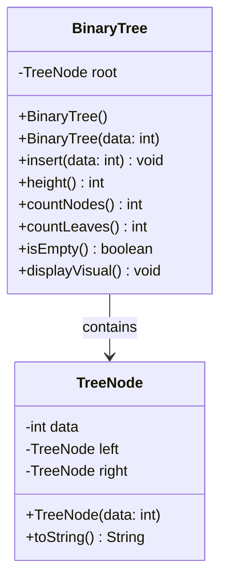

# Modul 10. Tree, Traversal, dan Binary Search Tree

## Daftar Isi
1. [Pengenalan Tree](#pengenalan-tree)
2. [Binary Tree](#binary-tree)
3. [Representasi Tree](#representasi-tree)
4. [Implementasi Binary Tree](#implementasi-binary-tree)
5. [Tree Traversal](#tree-traversal)
6. [Depth-First Search (DFS)](#depth-first-search-dfs)
7. [Breadth-First Search (BFS)](#breadth-first-search-bfs)
8. [Binary Search Tree (BST)](#binary-search-tree-bst)
9. [Latihan Praktikum](#9-latihan-praktikum)
10. [Referensi](#referensi)

### Apa itu Tree?

Tree adalah struktur data **non-linear** dan **hierarkis** yang terdiri dari **node** dan **edge**. Berbeda dengan linked list yang linear, tree memiliki hubungan **parent-child** antar node.

```
Linked List (Linear):           Tree (Non-linear):
[A] -> [B] -> [C] -> [D]                [A]
                                       / | \
                                     /   |   \
                                   [B]  [C]  [D]
                                  / \        / \
                                [E] [F]    [G] [H]
```

### Analogi Tree

Bayangkan sebuah **pohon keluarga (family tree)**:

```
                    [Kakek]           <- Root (Akar)
                   /       \
               [Ayah]     [Paman]     <- Children of Kakek
              /     \         |
           [Kamu] [Adik]  [Sepupu]    <- Leaves (Daun)
```

- **Kakek** adalah root (akar) - tidak memiliki parent
- **Ayah & Paman** adalah children dari Kakek
- **Kamu, Adik, Sepupu** adalah leaves - tidak memiliki children
- **Kamu & Adik** adalah siblings - memiliki parent yang sama

### Terminologi Tree

| Istilah | Definisi | Contoh |
|---------|----------|--------|
| **Root** | Node paling atas, tidak memiliki parent | A adalah root |
| **Parent** | Node yang memiliki child | A adalah parent dari B, C, D |
| **Child** | Node yang memiliki parent | B, C, D adalah children dari A |
| **Sibling** | Node dengan parent yang sama | B, C, D adalah siblings |
| **Leaf** | Node tanpa child (terminal node) | E, F, G, H adalah leaves |
| **Internal Node** | Node yang memiliki minimal satu child | A, B, D adalah internal nodes |
| **Edge** | Koneksi/penghubung antara dua node | Garis antara A dan B |
| **Path** | Urutan node dan edge dari satu node ke node lain | A → B → E |
| **Depth** | Jarak (jumlah edge) dari root ke node | Depth(E) = 2 |
| **Height** | Jarak dari node ke leaf terdalam | Height(A) = 2 |
| **Level** | Depth + 1 (atau depth, tergantung konvensi) | Level 0: A, Level 1: B,C,D |
| **Degree** | Jumlah child dari suatu node | Degree(A) = 3, Degree(E) = 0 |
| **Subtree** | Tree yang terbentuk dari node dan semua descendantnya | Subtree dari B: B, E, F |

### Visualisasi Terminologi

```
                    [A]         Root, Depth=0, Height=2
                   / | \
                  /  |  \
                [B] [C] [D]     Internal nodes, Depth=1
               / \       |
             [E] [F]    [G]     Leaves (E,F,G), Depth=2

         B dan C adalah siblings
         E dan F adalah children dari B
         B adalah parent dari E dan F
         Degree of A = 3
         Degree of B = 2
         Degree of E = 0 (leaf)
         Path A ke F: A → B → F
```

### Properti Penting Tree

```
┌──────────────────────────────────────────────────────────┐
│                    PROPERTI TREE                          │
├──────────────────────────────────────────────────────────┤
│                                                          │
│  1. Tree dengan N node memiliki N-1 edge                 │
│                                                          │
│  2. Hanya ada SATU path antara dua node manapun          │
│                                                          │
│  3. Tree TIDAK memiliki cycle (acyclic)                  │
│                                                          │
│  4. Menghapus satu edge memecah tree menjadi dua bagian  │
│                                                          │
└──────────────────────────────────────────────────────────┘
```


## Jenis-jenis Tree

| Jenis Tree | Karakteristik | Use Case |
|------------|---------------|----------|
| **General Tree** | Setiap node bisa punya berapapun child | File system, organization chart |
| **Binary Tree** | Setiap node maksimal 2 child (left & right) | Expression parsing, decision making |
| **Binary Search Tree** | Binary tree dengan properti ordering | Sorted data, searching |
| **Full Binary Tree** | Setiap node punya 0 atau 2 child | Expression tree |
| **Complete Binary Tree** | Semua level penuh kecuali terakhir, diisi dari kiri | Heap |
| **Perfect Binary Tree** | Semua level terisi penuh | Theoretical analysis |
| **Balanced Tree** | Height subtree kiri-kanan seimbang | AVL, Red-Black Tree |
| **AVL Tree** | Self-balancing BST | Database indexing |
| **Red-Black Tree** | Self-balancing BST dengan warna node | Java TreeMap/TreeSet |
| **Heap** | Complete binary tree dengan properti heap | Priority queue |
| **Trie** | Tree untuk menyimpan string (prefix tree) | Autocomplete, dictionary |
| **B-Tree** | Balanced tree untuk storage | Database, file systems |


## Binary Tree

### Konsep Binary Tree

Binary Tree adalah tree dimana setiap node memiliki **maksimal 2 child**, yang disebut **left child** dan **right child**.

```
         [1]              <- Root
        /   \
      [2]   [3]           <- Left child & Right child of 1
     /   \     \
   [4]   [5]   [6]        <- Leaves
```

### Jenis Binary Tree

#### 1. Full Binary Tree

Setiap node memiliki **0 atau 2** child (tidak ada yang punya 1 child).

```
         [1]
        /   \
      [2]   [3]        Full Binary Tree
     /   \             (setiap node: 0 atau 2 children)
   [4]   [5]
```

#### 2. Complete Binary Tree

Semua level terisi penuh **kecuali level terakhir** yang terisi **dari kiri ke kanan**.

```
         [1]
        /   \
      [2]   [3]        Complete Binary Tree
     /   \   /         (level terakhir diisi dari kiri)
   [4]  [5] [6]
```

**Bukan** Complete Binary Tree:
```
         [1]
        /   \
      [2]   [3]        ❌ Not Complete
     /   \     \       (level terakhir tidak dari kiri)
   [4]  [5]   [6]
```

#### 3. Perfect Binary Tree

Semua **internal node punya 2 child** dan semua **leaf berada di level yang sama**.

```
         [1]
        /   \
      [2]   [3]        Perfect Binary Tree
     /  \   /  \       (semua level penuh)
   [4] [5] [6] [7]

   Total nodes = 2^(h+1) - 1 = 2^3 - 1 = 7
```

#### 4. Balanced Binary Tree

Perbedaan height antara left dan right subtree **maksimal 1** untuk setiap node.

```
Balanced:               Unbalanced:
      [1]                    [1]
     /   \                  /
   [2]   [3]              [2]
   /                      /
 [4]                    [3]
                        /
                      [4]
Height diff = 1        Height diff = 3
```

#### 5. Degenerate (Skewed) Tree

Setiap node hanya punya **1 child** (menyerupai linked list).

```
     [1]                    [1]
       \                   /
       [2]               [2]
         \              /
         [3]          [3]
           \         /
           [4]     [4]

  Right Skewed     Left Skewed
  (worst case untuk operasi tree)
```

### Properti Binary Tree

| Properti | Formula |
|----------|---------|
| Max nodes di level L | 2^L |
| Max nodes dengan height H | 2^(H+1) - 1 |
| Min height dengan N nodes | ⌈log₂(N+1)⌉ - 1 |
| Jumlah leaf = internal nodes + 1 | L = I + 1 (untuk full binary tree) |

**Contoh:**
```
Height = 2

Level 0: 2^0 = 1 node   → [1]
Level 1: 2^1 = 2 nodes  → [2] [3]
Level 2: 2^2 = 4 nodes  → [4] [5] [6] [7]

Total max = 2^(2+1) - 1 = 7 nodes
```


## Representasi Tree

Tree bisa direpresentasikan dengan beberapa cara:

### Pointer / Linked Node

Setiap node menyimpan data dan **pointer ke children**.

```
┌─────────────────┐
│     TreeNode    │
├─────────────────┤
│  data: int      │
│  left: TreeNode │ ──> pointer ke left child
│  right: TreeNode│ ──> pointer ke right child
└─────────────────┘
```

```java
class TreeNode {
    int data;
    TreeNode left;
    TreeNode right;
}
```

**Visualisasi:**
```
        ┌───┐
        │ 1 │
        └───┘
       ↙     ↘
    ┌───┐   ┌───┐
    │ 2 │   │ 3 │
    └───┘   └───┘
   ↙    ↘
┌───┐  ┌───┐
│ 4 │  │ 5 │
└───┘  └───┘
```

### Array

Untuk **Complete Binary Tree**, bisa disimpan dalam array dengan aturan:
- Root di index 0
- Left child dari index i: `2*i + 1`
- Right child dari index i: `2*i + 2`
- Parent dari index i: `(i-1) / 2`

```
Tree:
         [1]
        /   \
      [2]   [3]
     /   \
   [4]   [5]

Array: [1, 2, 3, 4, 5]
Index:  0  1  2  3  4

Index 0 (value 1): left child = 2*0+1 = 1, right child = 2*0+2 = 2
Index 1 (value 2): left child = 2*1+1 = 3, right child = 2*1+2 = 4
Index 3 (value 4): parent = (3-1)/2 = 1
```

**Kapan menggunakan masing-masing representasi:**

| Representasi | Kelebihan | Kekurangan | Use Case |
|--------------|-----------|------------|----------|
| Pointer | Flexible, mudah insert/delete | Extra memory untuk pointer | BST, AVL, general tree |
| Array | Space efficient, cache friendly | Hanya untuk complete tree | Heap, complete binary tree |


## Implementasi Binary Tree

### Class Diagram



### TreeNode Class

```java
// File: TreeNode.java
class TreeNode {
    int data;
    TreeNode left;
    TreeNode right;

    public TreeNode(int data) {
        this.data = data;
        this.left = null;
        this.right = null;
    }

    @Override
    public String toString() {
        return String.valueOf(data);
    }

    public static void main(String[] args) {
        System.out.println("=== TREE NODE ===\n");

        // Membuat node manual
        TreeNode root = new TreeNode(1);
        root.left = new TreeNode(2);
        root.right = new TreeNode(3);
        root.left.left = new TreeNode(4);
        root.left.right = new TreeNode(5);

        System.out.println("Tree struktur:");
        System.out.println("       1");
        System.out.println("      / \\");
        System.out.println("     2   3");
        System.out.println("    / \\");
        System.out.println("   4   5");

        System.out.println("\nRoot: " + root);
        System.out.println("Left child of root: " + root.left);
        System.out.println("Right child of root: " + root.right);
        System.out.println("Left-left grandchild: " + root.left.left);
    }
}
```

**Output:**
```
=== TREE NODE ===

Tree struktur:
       1
      / \
     2   3
    / \
   4   5

Root: 1
Left child of root: 2
Right child of root: 3
Left-left grandchild: 4
```

### BinaryTree Class

```java
// File: BinaryTree.java
import java.util.LinkedList;
import java.util.Queue;

public class BinaryTree {
    private TreeNode root;

    public BinaryTree() {
        this.root = null;
    }

    public BinaryTree(int data) {
        this.root = new TreeNode(data);
    }

    public TreeNode getRoot() {
        return root;
    }

    public void setRoot(TreeNode root) {
        this.root = root;
    }

    public boolean isEmpty() {
        return root == null;
    }

    // Insert node secara level order (complete binary tree)
    public void insert(int data) {
        TreeNode newNode = new TreeNode(data);

        if (root == null) {
            root = newNode;
            return;
        }

        // Menggunakan BFS untuk mencari posisi kosong pertama
        Queue<TreeNode> queue = new LinkedList<>();
        queue.add(root);

        while (!queue.isEmpty()) {
            TreeNode current = queue.poll();

            // Cek left child
            if (current.left == null) {
                current.left = newNode;
                return;
            } else {
                queue.add(current.left);
            }

            // Cek right child
            if (current.right == null) {
                current.right = newNode;
                return;
            } else {
                queue.add(current.right);
            }
        }
    }

    // Menghitung tinggi tree
    public int height() {
        return heightRec(root);
    }

    private int heightRec(TreeNode node) {
        if (node == null) {
            return -1; // Convention: empty tree height = -1
        }
        int leftHeight = heightRec(node.left);
        int rightHeight = heightRec(node.right);
        return Math.max(leftHeight, rightHeight) + 1;
    }

    // Menghitung jumlah node
    public int countNodes() {
        return countNodesRec(root);
    }

    private int countNodesRec(TreeNode node) {
        if (node == null) {
            return 0;
        }
        return 1 + countNodesRec(node.left) + countNodesRec(node.right);
    }

    // Menghitung jumlah leaf nodes
    public int countLeaves() {
        return countLeavesRec(root);
    }

    private int countLeavesRec(TreeNode node) {
        if (node == null) {
            return 0;
        }
        if (node.left == null && node.right == null) {
            return 1;
        }
        return countLeavesRec(node.left) + countLeavesRec(node.right);
    }

    // Menghitung jumlah internal nodes
    public int countInternalNodes() {
        return countNodes() - countLeaves();
    }

    // Mencari nilai maksimum
    public int findMax() {
        if (root == null) {
            throw new IllegalStateException("Tree kosong!");
        }
        return findMaxRec(root);
    }

    private int findMaxRec(TreeNode node) {
        if (node == null) {
            return Integer.MIN_VALUE;
        }
        int maxVal = node.data;
        int leftMax = findMaxRec(node.left);
        int rightMax = findMaxRec(node.right);
        return Math.max(maxVal, Math.max(leftMax, rightMax));
    }

    // Mencari nilai minimum
    public int findMin() {
        if (root == null) {
            throw new IllegalStateException("Tree kosong!");
        }
        return findMinRec(root);
    }

    private int findMinRec(TreeNode node) {
        if (node == null) {
            return Integer.MAX_VALUE;
        }
        int minVal = node.data;
        int leftMin = findMinRec(node.left);
        int rightMin = findMinRec(node.right);
        return Math.min(minVal, Math.min(leftMin, rightMin));
    }

    // Menampilkan tree secara visual
    public void displayVisual() {
        System.out.println("\nVisual Tree:");
        if (root == null) {
            System.out.println("(empty)");
            return;
        }
        displayVisualRec(root, "", true);
    }

    private void displayVisualRec(TreeNode node, String prefix, boolean isLast) {
        if (node != null) {
            System.out.println(prefix + (isLast ? "└── " : "├── ") + node.data);
            displayVisualRec(node.left, prefix + (isLast ? "    " : "│   "), false);
            displayVisualRec(node.right, prefix + (isLast ? "    " : "│   "), true);
        }
    }

    public static void main(String[] args) {
        System.out.println("=== BINARY TREE ===\n");

        BinaryTree tree = new BinaryTree();

        // Insert nodes level by level
        int[] values = {1, 2, 3, 4, 5, 6, 7};
        System.out.print("Inserting: ");
        for (int val : values) {
            System.out.print(val + " ");
            tree.insert(val);
        }
        System.out.println();

        System.out.println("\nTree struktur (Complete Binary Tree):");
        System.out.println("         1");
        System.out.println("       /   \\");
        System.out.println("      2     3");
        System.out.println("     / \\   / \\");
        System.out.println("    4   5 6   7");

        tree.displayVisual();

        System.out.println("\n--- Properties ---");
        System.out.println("Is empty: " + tree.isEmpty());
        System.out.println("Height: " + tree.height());
        System.out.println("Total nodes: " + tree.countNodes());
        System.out.println("Leaf nodes: " + tree.countLeaves());
        System.out.println("Internal nodes: " + tree.countInternalNodes());
        System.out.println("Max value: " + tree.findMax());
        System.out.println("Min value: " + tree.findMin());
    }
}
```

**Output:**
```
=== BINARY TREE ===

Inserting: 1 2 3 4 5 6 7

Tree struktur (Complete Binary Tree):
         1
       /   \
      2     3
     / \   / \
    4   5 6   7

Visual Tree:
└── 1
    ├── 2
    │   ├── 4
    │   └── 5
    └── 3
        ├── 6
        └── 7

--- Properties ---
Is empty: false
Height: 2
Total nodes: 7
Leaf nodes: 4
Internal nodes: 3
Max value: 7
Min value: 1
```


## Operasi Dasar Tree

### Insert Node

Untuk binary tree biasa, insert dilakukan secara **level order** (menjaga complete binary tree property).

```
Insert 8 ke tree:

Before:                After:
       1                    1
      / \                  / \
     2   3                2   3
    / \ / \              / \ / \
   4  5 6  7            4  5 6  7
                       /
                      8
```

### Count Nodes

Menghitung total node menggunakan rekursi:

```
countNodes(node) = 1 + countNodes(left) + countNodes(right)

         1
        / \
       2   3     countNodes = 1 + countNodes(2) + countNodes(3)
      / \                   = 1 + (1 + 1 + 1) + (1 + 0 + 0)
     4   5                  = 1 + 3 + 1 = 5
```

### Count Leaves

Leaf adalah node tanpa children:

```
countLeaves(node):
  - Jika node == null, return 0
  - Jika node.left == null && node.right == null, return 1
  - Else, return countLeaves(left) + countLeaves(right)

         1
        / \
       2   3     Leaves: 4, 5, 3
      / \        countLeaves = 3
     4   5
```

### Find Height

Height adalah jarak maksimum dari root ke leaf:

```
height(node) = max(height(left), height(right)) + 1

         1           height(1) = max(height(2), height(3)) + 1
        / \                    = max(1, 0) + 1 = 2
       2   3
      / \
     4   5
```


## Tree Traversal


### Apa itu Traversal?

**Tree Traversal** adalah proses **mengunjungi setiap node** dalam tree **tepat satu kali** dengan urutan tertentu.

```
Mengapa perlu traversal?
┌────────────────────────────────────────────────────┐
│ • Print semua data dalam tree                      │
│ • Search node tertentu                             │
│ • Copy atau clone tree                             │
│ • Delete tree (deallocate memory)                  │
│ • Evaluate expression tree                         │
│ • Serialize tree untuk penyimpanan                 │
└────────────────────────────────────────────────────┘
```

### Jenis Traversal

Ada dua kategori utama traversal:

```
                    TREE TRAVERSAL
                         │
          ┌──────────────┴──────────────┐
          │                             │
    Depth-First Search            Breadth-First Search
         (DFS)                         (BFS)
          │                             │
    ┌─────┼─────┐                       │
    │     │     │                       │
Inorder Preorder Postorder        Level Order
```

| Traversal | Urutan Kunjungan | Metode |
|-----------|------------------|--------|
| Inorder | Left → Root → Right | DFS (rekursi/stack) |
| Preorder | Root → Left → Right | DFS (rekursi/stack) |
| Postorder | Left → Right → Root | DFS (rekursi/stack) |
| Level Order | Level by level (top to bottom) | BFS (queue) |


## Depth-First Search (DFS)

DFS mengeksplorasi tree dengan pergi **sedalam mungkin** sebelum backtrack.

### Contoh Tree untuk Semua Traversal

```
         [1]
        /   \
      [2]   [3]
     /   \
   [4]   [5]
```


### Inorder Traversal

**Urutan: Left → Root → Right**

```
Langkah:
1. Traverse left subtree (rekursif)
2. Visit root (proses node)
3. Traverse right subtree (rekursif)
```

**Visualisasi:**
```
         [1]
        /   \
      [2]   [3]
     /   \
   [4]   [5]

Inorder: 4 → 2 → 5 → 1 → 3

Step by step:
1. Go left from 1 → 2
2. Go left from 2 → 4
3. Visit 4 (no left/right)
4. Back to 2, visit 2
5. Go right from 2 → 5
6. Visit 5 (no left/right)
7. Back to 1, visit 1
8. Go right from 1 → 3
9. Visit 3 (no left/right)
```

**Implementasi:**
```java
public void inorder() {
    System.out.print("Inorder: ");
    inorderRec(root);
    System.out.println();
}

private void inorderRec(TreeNode node) {
    if (node != null) {
        inorderRec(node.left);           // 1. Left
        System.out.print(node.data + " "); // 2. Root
        inorderRec(node.right);          // 3. Right
    }
}
```

**Use Case:**
- Pada **BST**, inorder menghasilkan data **terurut ascending**
- Menghasilkan **infix expression** dari expression tree

```
BST:
        [50]
       /    \
     [30]   [70]
     /  \
   [20] [40]

Inorder: 20 → 30 → 40 → 50 → 70  (SORTED!)
```


### Preorder Traversal

**Urutan: Root → Left → Right**

```
Langkah:
1. Visit root (proses node)
2. Traverse left subtree (rekursif)
3. Traverse right subtree (rekursif)
```

**Visualisasi:**
```
         [1]
        /   \
      [2]   [3]
     /   \
   [4]   [5]

Preorder: 1 → 2 → 4 → 5 → 3

Step by step:
1. Visit 1
2. Go left → visit 2
3. Go left → visit 4
4. Back, go right → visit 5
5. Back to 1, go right → visit 3
```

**Implementasi:**
```java
public void preorder() {
    System.out.print("Preorder: ");
    preorderRec(root);
    System.out.println();
}

private void preorderRec(TreeNode node) {
    if (node != null) {
        System.out.print(node.data + " "); // 1. Root
        preorderRec(node.left);           // 2. Left
        preorderRec(node.right);          // 3. Right
    }
}
```

**Use Case:**
- **Copy/clone tree** (kunjungi parent dulu sebelum children)
- Menghasilkan **prefix expression** (Polish notation)
- **Serialize tree** untuk penyimpanan

```
Prefix notation untuk (3 + 5) * 2:
        [*]
       /   \
     [+]   [2]
    /   \
  [3]   [5]

Preorder: * + 3 5 2
```


### Postorder Traversal

**Urutan: Left → Right → Root**

```
Langkah:
1. Traverse left subtree (rekursif)
2. Traverse right subtree (rekursif)
3. Visit root (proses node)
```

**Visualisasi:**
```
         [1]
        /   \
      [2]   [3]
     /   \
   [4]   [5]

Postorder: 4 → 5 → 2 → 3 → 1

Step by step:
1. Go left to 2, then left to 4
2. Visit 4 (no children)
3. Back to 2, go right to 5
4. Visit 5 (no children)
5. Back to 2, visit 2
6. Back to 1, go right to 3
7. Visit 3 (no children)
8. Back to 1, visit 1
```

**Implementasi:**
```java
public void postorder() {
    System.out.print("Postorder: ");
    postorderRec(root);
    System.out.println();
}

private void postorderRec(TreeNode node) {
    if (node != null) {
        postorderRec(node.left);          // 1. Left
        postorderRec(node.right);         // 2. Right
        System.out.print(node.data + " "); // 3. Root
    }
}
```

**Use Case:**
- **Delete tree** (hapus children sebelum parent)
- Menghasilkan **postfix expression** (Reverse Polish notation)
- **Calculate directory size** (hitung subfolder dulu)
- **Dependency resolution** (process dependencies sebelum dependent)

```
Postfix notation untuk (3 + 5) * 2:
        [*]
       /   \
     [+]   [2]
    /   \
  [3]   [5]

Postorder: 3 5 + 2 *
```


## Breadth-First Search (BFS)

### Level Order Traversal

BFS mengunjungi node **level per level** dari atas ke bawah, kiri ke kanan.

**Urutan: Level 0 → Level 1 → Level 2 → ...**

```
         [1]         Level 0
        /   \
      [2]   [3]      Level 1
     /   \
   [4]   [5]         Level 2

Level Order: 1 → 2 → 3 → 4 → 5
```

**Algoritma menggunakan Queue:**
```
1. Masukkan root ke queue
2. Selama queue tidak kosong:
   a. Dequeue node dari depan
   b. Visit/proses node
   c. Enqueue left child (jika ada)
   d. Enqueue right child (jika ada)
```

**Visualisasi:**
```
Step 1: Queue = [1]
        Dequeue 1, visit 1
        Enqueue 2, 3
        Queue = [2, 3]

Step 2: Queue = [2, 3]
        Dequeue 2, visit 2
        Enqueue 4, 5
        Queue = [3, 4, 5]

Step 3: Queue = [3, 4, 5]
        Dequeue 3, visit 3
        No children
        Queue = [4, 5]

Step 4: Queue = [4, 5]
        Dequeue 4, visit 4
        No children
        Queue = [5]

Step 5: Queue = [5]
        Dequeue 5, visit 5
        No children
        Queue = []

Done! Order: 1, 2, 3, 4, 5
```

**Implementasi:**
```java
import java.util.LinkedList;
import java.util.Queue;

public void levelOrder() {
    System.out.print("Level Order: ");
    if (root == null) {
        System.out.println();
        return;
    }

    Queue<TreeNode> queue = new LinkedList<>();
    queue.add(root);

    while (!queue.isEmpty()) {
        TreeNode current = queue.poll();
        System.out.print(current.data + " ");

        if (current.left != null) {
            queue.add(current.left);
        }
        if (current.right != null) {
            queue.add(current.right);
        }
    }
    System.out.println();
}
```

**Use Case:**
- **Print tree level by level**
- **Find shortest path** (pada unweighted tree/graph)
- **Check if tree is complete**
- **Serialize tree** untuk networking


## Perbandingan Traversal

### Ringkasan Urutan

```
Tree:
         [1]
        /   \
      [2]   [3]
     /   \
   [4]   [5]

┌────────────┬─────────────────────┬──────────────────┐
│ Traversal  │ Urutan              │ Hasil            │
├────────────┼─────────────────────┼──────────────────┤
│ Inorder    │ Left → Root → Right │ 4, 2, 5, 1, 3    │
│ Preorder   │ Root → Left → Right │ 1, 2, 4, 5, 3    │
│ Postorder  │ Left → Right → Root │ 4, 5, 2, 3, 1    │
│ Level Order│ Level by level      │ 1, 2, 3, 4, 5    │
└────────────┴─────────────────────┴──────────────────┘
```

### Use Case Summary

| Traversal | Use Case |
|-----------|----------|
| **Inorder** | BST → sorted order, infix expression |
| **Preorder** | Copy tree, prefix expression, serialize |
| **Postorder** | Delete tree, postfix expression, calculate size |
| **Level Order** | Print by level, BFS, shortest path |

### Kompleksitas

| Traversal | Time | Space |
|-----------|------|-------|
| Inorder | O(n) | O(h) stack |
| Preorder | O(n) | O(h) stack |
| Postorder | O(n) | O(h) stack |
| Level Order | O(n) | O(w) queue |

- n = jumlah node
- h = height tree (worst case: O(n) untuk skewed tree)
- w = width (max nodes in a level, worst case: O(n) untuk complete tree)


## Implementasi Lengkap

```java
// File: TreeTraversal.java
import java.util.LinkedList;
import java.util.Queue;

class TreeNode {
    int data;
    TreeNode left;
    TreeNode right;

    public TreeNode(int data) {
        this.data = data;
        this.left = null;
        this.right = null;
    }
}

public class TreeTraversal {
    private TreeNode root;

    public TreeTraversal() {
        this.root = null;
    }

    public TreeNode getRoot() {
        return root;
    }

    // Insert untuk complete binary tree
    public void insert(int data) {
        TreeNode newNode = new TreeNode(data);
        if (root == null) {
            root = newNode;
            return;
        }

        Queue<TreeNode> queue = new LinkedList<>();
        queue.add(root);

        while (!queue.isEmpty()) {
            TreeNode current = queue.poll();

            if (current.left == null) {
                current.left = newNode;
                return;
            } else {
                queue.add(current.left);
            }

            if (current.right == null) {
                current.right = newNode;
                return;
            } else {
                queue.add(current.right);
            }
        }
    }

    // ============ DFS TRAVERSALS ============

    // Inorder: Left → Root → Right
    public void inorder() {
        System.out.print("Inorder:     ");
        inorderRec(root);
        System.out.println();
    }

    private void inorderRec(TreeNode node) {
        if (node != null) {
            inorderRec(node.left);
            System.out.print(node.data + " ");
            inorderRec(node.right);
        }
    }

    // Preorder: Root → Left → Right
    public void preorder() {
        System.out.print("Preorder:    ");
        preorderRec(root);
        System.out.println();
    }

    private void preorderRec(TreeNode node) {
        if (node != null) {
            System.out.print(node.data + " ");
            preorderRec(node.left);
            preorderRec(node.right);
        }
    }

    // Postorder: Left → Right → Root
    public void postorder() {
        System.out.print("Postorder:   ");
        postorderRec(root);
        System.out.println();
    }

    private void postorderRec(TreeNode node) {
        if (node != null) {
            postorderRec(node.left);
            postorderRec(node.right);
            System.out.print(node.data + " ");
        }
    }

    // ============ BFS TRAVERSAL ============

    // Level Order (BFS)
    public void levelOrder() {
        System.out.print("Level Order: ");
        if (root == null) {
            System.out.println();
            return;
        }

        Queue<TreeNode> queue = new LinkedList<>();
        queue.add(root);

        while (!queue.isEmpty()) {
            TreeNode current = queue.poll();
            System.out.print(current.data + " ");

            if (current.left != null) {
                queue.add(current.left);
            }
            if (current.right != null) {
                queue.add(current.right);
            }
        }
        System.out.println();
    }

    // Display visual
    public void displayVisual() {
        System.out.println("\nVisual Tree:");
        displayVisualRec(root, "", true);
    }

    private void displayVisualRec(TreeNode node, String prefix, boolean isLast) {
        if (node != null) {
            System.out.println(prefix + (isLast ? "└── " : "├── ") + node.data);
            displayVisualRec(node.left, prefix + (isLast ? "    " : "│   "), false);
            displayVisualRec(node.right, prefix + (isLast ? "    " : "│   "), true);
        }
    }

    public static void main(String[] args) {
        System.out.println("=== TREE TRAVERSAL ===\n");

        TreeTraversal tree = new TreeTraversal();

        // Insert nodes
        int[] values = {1, 2, 3, 4, 5, 6, 7};
        for (int val : values) {
            tree.insert(val);
        }

        System.out.println("Tree struktur:");
        System.out.println("         1");
        System.out.println("       /   \\");
        System.out.println("      2     3");
        System.out.println("     / \\   / \\");
        System.out.println("    4   5 6   7");

        tree.displayVisual();

        System.out.println("\n--- All Traversals ---");
        tree.inorder();      // 4 2 5 1 6 3 7
        tree.preorder();     // 1 2 4 5 3 6 7
        tree.postorder();    // 4 5 2 6 7 3 1
        tree.levelOrder();   // 1 2 3 4 5 6 7

        System.out.println("\n--- Traversal Comparison ---");
        System.out.println("┌────────────┬─────────────────────┬──────────────────┐");
        System.out.println("│ Traversal  │ Urutan              │ Hasil            │");
        System.out.println("├────────────┼─────────────────────┼──────────────────┤");
        System.out.println("│ Inorder    │ Left → Root → Right │ 4 2 5 1 6 3 7    │");
        System.out.println("│ Preorder   │ Root → Left → Right │ 1 2 4 5 3 6 7    │");
        System.out.println("│ Postorder  │ Left → Right → Root │ 4 5 2 6 7 3 1    │");
        System.out.println("│ Level Order│ Level by level      │ 1 2 3 4 5 6 7    │");
        System.out.println("└────────────┴─────────────────────┴──────────────────┘");
    }
}
```

**Output:**
```
=== TREE TRAVERSAL ===

Tree struktur:
         1
       /   \
      2     3
     / \   / \
    4   5 6   7

Visual Tree:
└── 1
    ├── 2
    │   ├── 4
    │   └── 5
    └── 3
        ├── 6
        └── 7

--- All Traversals ---
Inorder:     4 2 5 1 6 3 7
Preorder:    1 2 4 5 3 6 7
Postorder:   4 5 2 6 7 3 1
Level Order: 1 2 3 4 5 6 7

--- Traversal Comparison ---
┌────────────┬─────────────────────┬──────────────────┐
│ Traversal  │ Urutan              │ Hasil            │
├────────────┼─────────────────────┼──────────────────┤
│ Inorder    │ Left → Root → Right │ 4 2 5 1 6 3 7    │
│ Preorder   │ Root → Left → Right │ 1 2 4 5 3 6 7    │
│ Postorder  │ Left → Right → Root │ 4 5 2 6 7 3 1    │
│ Level Order│ Level by level      │ 1 2 3 4 5 6 7    │
└────────────┴─────────────────────┴──────────────────┘
```


## Traversal Iteratif dengan Stack

Selain rekursi, DFS traversal bisa diimplementasikan secara **iteratif menggunakan stack**.

### Preorder Iteratif

```java
import java.util.Stack;

public void preorderIterative() {
    System.out.print("Preorder (Iterative): ");
    if (root == null) {
        System.out.println();
        return;
    }

    Stack<TreeNode> stack = new Stack<>();
    stack.push(root);

    while (!stack.isEmpty()) {
        TreeNode current = stack.pop();
        System.out.print(current.data + " ");

        // Push right first (akan diproses setelah left)
        if (current.right != null) {
            stack.push(current.right);
        }
        if (current.left != null) {
            stack.push(current.left);
        }
    }
    System.out.println();
}
```

### Inorder Iteratif

```java
public void inorderIterative() {
    System.out.print("Inorder (Iterative): ");
    if (root == null) {
        System.out.println();
        return;
    }

    Stack<TreeNode> stack = new Stack<>();
    TreeNode current = root;

    while (current != null || !stack.isEmpty()) {
        // Go to the leftmost node
        while (current != null) {
            stack.push(current);
            current = current.left;
        }

        // Current is null, pop from stack
        current = stack.pop();
        System.out.print(current.data + " ");

        // Visit right subtree
        current = current.right;
    }
    System.out.println();
}
```

### Postorder Iteratif (Two Stacks)

```java
public void postorderIterative() {
    System.out.print("Postorder (Iterative): ");
    if (root == null) {
        System.out.println();
        return;
    }

    Stack<TreeNode> stack1 = new Stack<>();
    Stack<TreeNode> stack2 = new Stack<>();

    stack1.push(root);

    while (!stack1.isEmpty()) {
        TreeNode current = stack1.pop();
        stack2.push(current);

        if (current.left != null) {
            stack1.push(current.left);
        }
        if (current.right != null) {
            stack1.push(current.right);
        }
    }

    while (!stack2.isEmpty()) {
        System.out.print(stack2.pop().data + " ");
    }
    System.out.println();
}
```

### Perbandingan Rekursif vs Iteratif

| Aspek | Rekursif | Iteratif |
|-------|----------|----------|
| Readability | Lebih mudah dibaca | Lebih kompleks |
| Stack usage | Implicit (call stack) | Explicit (manual stack) |
| Stack overflow | Mungkin untuk tree sangat dalam | Bisa dikontrol |
| Performance | Overhead function call | Sedikit lebih cepat |


## Aplikasi Traversal

### Expression Tree

Expression tree merepresentasikan ekspresi matematika dimana:
- **Leaf nodes** = operand (angka/variabel)
- **Internal nodes** = operator (+, -, *, /)

```
Expression: (3 + 5) * 2

        [*]
       /   \
     [+]   [2]
    /   \
  [3]   [5]
```

**Traversal menghasilkan notasi berbeda:**

| Traversal | Notasi | Hasil |
|-----------|--------|-------|
| Inorder | Infix | 3 + 5 * 2 (perlu tanda kurung) |
| Preorder | Prefix (Polish) | * + 3 5 2 |
| Postorder | Postfix (Reverse Polish) | 3 5 + 2 * |

```java
// File: ExpressionTree.java
import java.util.Stack;

class ExprNode {
    String value;
    ExprNode left;
    ExprNode right;

    public ExprNode(String value) {
        this.value = value;
        this.left = null;
        this.right = null;
    }

    public boolean isOperator() {
        return value.equals("+") || value.equals("-") ||
               value.equals("*") || value.equals("/");
    }
}

public class ExpressionTree {
    private ExprNode root;

    // Build tree dari postfix expression
    public void buildFromPostfix(String postfix) {
        Stack<ExprNode> stack = new Stack<>();
        String[] tokens = postfix.split(" ");

        for (String token : tokens) {
            ExprNode node = new ExprNode(token);

            if (isOperator(token)) {
                node.right = stack.pop();
                node.left = stack.pop();
            }

            stack.push(node);
        }

        root = stack.pop();
    }

    private boolean isOperator(String token) {
        return token.equals("+") || token.equals("-") ||
               token.equals("*") || token.equals("/");
    }

    // Inorder → Infix notation
    public String infix() {
        return infixRec(root);
    }

    private String infixRec(ExprNode node) {
        if (node == null) return "";

        if (!node.isOperator()) {
            return node.value;
        }

        return "(" + infixRec(node.left) + " " + node.value + " " +
               infixRec(node.right) + ")";
    }

    // Preorder → Prefix notation
    public String prefix() {
        StringBuilder sb = new StringBuilder();
        prefixRec(root, sb);
        return sb.toString().trim();
    }

    private void prefixRec(ExprNode node, StringBuilder sb) {
        if (node != null) {
            sb.append(node.value).append(" ");
            prefixRec(node.left, sb);
            prefixRec(node.right, sb);
        }
    }

    // Postorder → Postfix notation
    public String postfix() {
        StringBuilder sb = new StringBuilder();
        postfixRec(root, sb);
        return sb.toString().trim();
    }

    private void postfixRec(ExprNode node, StringBuilder sb) {
        if (node != null) {
            postfixRec(node.left, sb);
            postfixRec(node.right, sb);
            sb.append(node.value).append(" ");
        }
    }

    // Evaluate expression
    public double evaluate() {
        return evaluateRec(root);
    }

    private double evaluateRec(ExprNode node) {
        if (node == null) return 0;

        if (!node.isOperator()) {
            return Double.parseDouble(node.value);
        }

        double left = evaluateRec(node.left);
        double right = evaluateRec(node.right);

        switch (node.value) {
            case "+": return left + right;
            case "-": return left - right;
            case "*": return left * right;
            case "/": return left / right;
            default: return 0;
        }
    }

    public static void main(String[] args) {
        System.out.println("=== EXPRESSION TREE ===\n");

        ExpressionTree tree = new ExpressionTree();

        // (3 + 5) * 2 dalam postfix: 3 5 + 2 *
        tree.buildFromPostfix("3 5 + 2 *");

        System.out.println("Expression: (3 + 5) * 2");
        System.out.println("\nTree structure:");
        System.out.println("        [*]");
        System.out.println("       /   \\");
        System.out.println("     [+]   [2]");
        System.out.println("    /   \\");
        System.out.println("  [3]   [5]");

        System.out.println("\n--- Notations from Traversal ---");
        System.out.println("Infix (Inorder):     " + tree.infix());
        System.out.println("Prefix (Preorder):   " + tree.prefix());
        System.out.println("Postfix (Postorder): " + tree.postfix());
        System.out.println("\nResult: " + tree.evaluate());
    }
}
```

**Output:**
```
=== EXPRESSION TREE ===

Expression: (3 + 5) * 2

Tree structure:
        [*]
       /   \
     [+]   [2]
    /   \
  [3]   [5]

--- Notations from Traversal ---
Infix (Inorder):     ((3 + 5) * 2)
Prefix (Preorder):   * + 3 5 2
Postfix (Postorder): 3 5 + 2 *

Result: 16.0
```

### Print Tree per Level

Level order traversal yang menampilkan node per level:

```java
import java.util.*;

public List<List<Integer>> levelOrderByLevel(TreeNode root) {
    List<List<Integer>> result = new ArrayList<>();

    if (root == null) return result;

    Queue<TreeNode> queue = new LinkedList<>();
    queue.add(root);

    while (!queue.isEmpty()) {
        int levelSize = queue.size();
        List<Integer> currentLevel = new ArrayList<>();

        for (int i = 0; i < levelSize; i++) {
            TreeNode node = queue.poll();
            currentLevel.add(node.data);

            if (node.left != null) queue.add(node.left);
            if (node.right != null) queue.add(node.right);
        }

        result.add(currentLevel);
    }

    return result;
}

// Usage
public static void main(String[] args) {
    // Tree: 1, 2, 3, 4, 5, 6, 7
    List<List<Integer>> levels = levelOrderByLevel(root);

    System.out.println("Level Order by Level:");
    for (int i = 0; i < levels.size(); i++) {
        System.out.println("Level " + i + ": " + levels.get(i));
    }
    // Level 0: [1]
    // Level 1: [2, 3]
    // Level 2: [4, 5, 6, 7]
}
```

### Serialize dan Deserialize

Serialize tree ke string menggunakan preorder traversal:

```java
// Serialize tree ke string (preorder dengan null marker)
public String serialize(TreeNode root) {
    StringBuilder sb = new StringBuilder();
    serializeRec(root, sb);
    return sb.toString();
}

private void serializeRec(TreeNode node, StringBuilder sb) {
    if (node == null) {
        sb.append("null,");
        return;
    }
    sb.append(node.data).append(",");
    serializeRec(node.left, sb);
    serializeRec(node.right, sb);
}

// Deserialize string kembali ke tree
public TreeNode deserialize(String data) {
    String[] nodes = data.split(",");
    int[] index = {0};
    return deserializeRec(nodes, index);
}

private TreeNode deserializeRec(String[] nodes, int[] index) {
    if (index[0] >= nodes.length || nodes[index[0]].equals("null")) {
        index[0]++;
        return null;
    }

    TreeNode node = new TreeNode(Integer.parseInt(nodes[index[0]++]));
    node.left = deserializeRec(nodes, index);
    node.right = deserializeRec(nodes, index);
    return node;
}

// Usage
public static void main(String[] args) {
    // Original tree
    TreeNode root = ...;

    // Serialize
    String serialized = serialize(root);
    System.out.println("Serialized: " + serialized);
    // Output: "1,2,4,null,null,5,null,null,3,null,null,"

    // Deserialize
    TreeNode restored = deserialize(serialized);
    // Tree is restored!
}
```


## Binary Search Tree (BST)

### Konsep BST

Binary Search Tree adalah tipe Binary Tree khusus yang memiliki properti berurutan (ordering property):
1. **Left Subtree** dari sebuah node hanya berisi node dengan nilai **lebih kecil** dari node tersebut.
2. **Right Subtree** dari sebuah node hanya berisi node dengan nilai **lebih besar** dari node tersebut.
3. Left dan Right subtree juga harus berupa Binary Search Tree.
4. Tidak boleh ada nilai duplikat (tergantung implementasi, namun umumnya demikian).

```
         [50]
        /    \
      [30]   [70]
      /  \   /  \
    [20][40][60][80]
```

### Operasi Dasar BST

#### 1. Search (Pencarian)
Pencarian sangat efisien karena kita membagi ruang pencarian menjadi dua di setiap langkah (mirip Binary Search).
* Jika nilai yang dicari < node saat ini, ke kiri.
* Jika nilai yang dicari > node saat ini, ke kanan.
* Jika sama, data ditemukan.

#### 2. Insert (Penambahan)
Sama seperti pencarian, kita mencari tempat yang tepat untuk node baru dengan membandingkan nilai, hingga menemukan posisi kosong (null).

#### 3. Delete (Penghapusan)
Ada 3 kasus dalam menghapus node di BST:
1. **Node adalah Leaf**: Langsung hapus node tersebut.
2. **Node memiliki 1 Child**: Gantikan posisi node tersebut dengan child-nya.
3. **Node memiliki 2 Child**: Temukan in-order successor (nilai terkecil di right subtree) atau in-order predecessor (nilai terbesar di left subtree), salin nilainya ke node yang akan dihapus, lalu hapus node successor/predecessor tersebut.

### Kompleksitas BST

| Operasi | Rata-rata | Terburuk (Skewed) |
|---------|-----------|-------------------|
| Search  | O(log n)  | O(n)              |
| Insert  | O(log n)  | O(n)              |
| Delete  | O(log n)  | O(n)              |

Untuk menghindari kasus terburuk (Skewed Tree), kita menggunakan Balanced BST seperti AVL Tree atau Red-Black Tree.


### Implementasi Lengkap BST (Java OOP)

```java
// File: BinarySearchTree.java
class BSTNode {
    int data;
    BSTNode left;
    BSTNode right;

    public BSTNode(int data) {
        this.data = data;
        this.left = null;
        this.right = null;
    }
}

public class BinarySearchTree {
    private BSTNode root;

    public BinarySearchTree() {
        this.root = null;
    }

    // Insert
    public void insert(int data) {
        root = insertRec(root, data);
    }

    private BSTNode insertRec(BSTNode root, int data) {
        if (root == null) {
            root = new BSTNode(data);
            return root;
        }
        if (data < root.data) {
            root.left = insertRec(root.left, data);
        } else if (data > root.data) {
            root.right = insertRec(root.right, data);
        }
        return root;
    }

    // Search
    public boolean search(int data) {
        return searchRec(root, data) != null;
    }

    private BSTNode searchRec(BSTNode root, int data) {
        if (root == null || root.data == data) return root;
        if (root.data > data) return searchRec(root.left, data);
        return searchRec(root.right, data);
    }

    // Delete
    public void delete(int data) {
        root = deleteRec(root, data);
    }

    private BSTNode deleteRec(BSTNode root, int data) {
        if (root == null) return root;

        if (data < root.data) {
            root.left = deleteRec(root.left, data);
        } else if (data > root.data) {
            root.right = deleteRec(root.right, data);
        } else {
            // Node with only one child or no child
            if (root.left == null) return root.right;
            else if (root.right == null) return root.left;

            // Node with two children
            root.data = minValue(root.right);
            root.right = deleteRec(root.right, root.data);
        }
        return root;
    }

    private int minValue(BSTNode root) {
        int minv = root.data;
        while (root.left != null) {
            minv = root.left.data;
            root = root.left;
        }
        return minv;
    }

    // Inorder traversal
    public void inorder() {
        inorderRec(root);
        System.out.println();
    }

    private void inorderRec(BSTNode root) {
        if (root != null) {
            inorderRec(root.left);
            System.out.print(root.data + " ");
            inorderRec(root.right);
        }
    }
}
```

## 9. Latihan Praktikum

### Latihan 1: Validasi BST
Buatlah fungsi `isBST(TreeNode root)` untuk memeriksa apakah sebuah Binary Tree adalah Binary Search Tree yang valid.

### Latihan 2: Kedalaman Tree
Buatlah method untuk mencari kedalaman maksimum (height) dari sebuah tree.

### Latihan 3: Lowest Common Ancestor (LCA)
Buatlah method `getLCA(TreeNode node1, TreeNode node2)` untuk menemukan node nenek moyang terdekat dari dua buah node di dalam BST.

## Referensi

1. Cormen, T. H., et al. (2009). *Introduction to Algorithms* (3rd ed.). MIT Press.
2. [GeeksforGeeks - Binary Search Tree](https://www.geeksforgeeks.org/binary-search-tree-data-structure/)
