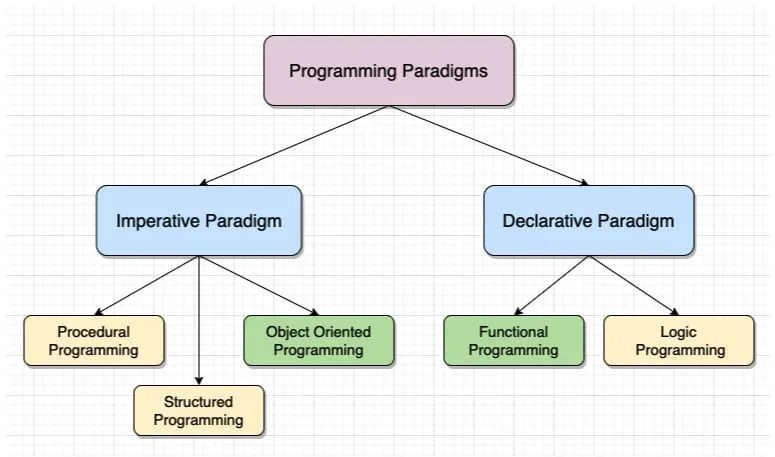
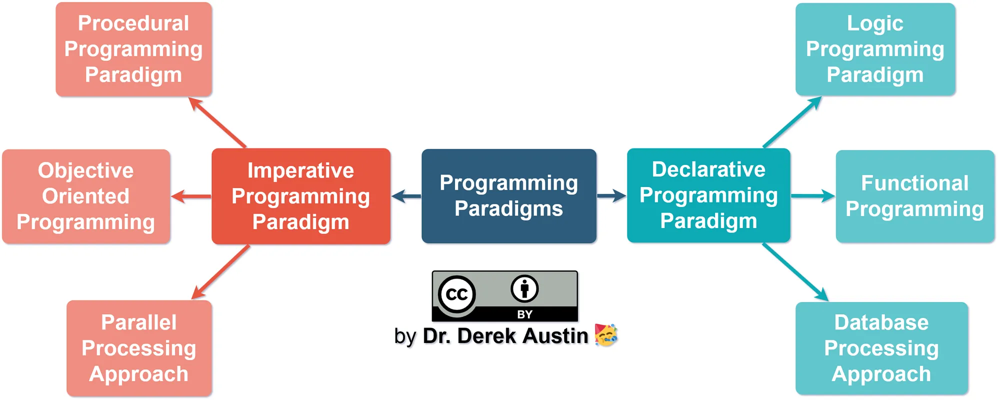

# Programming Paradigms

## List of Contents

- [What is a Programming Paradigm?](#what-is-a-programming-paradigm)
- [Declarative and Imperative Programming](#declarative-and-imperative-programming)
- [Case Study](#case-study)
  - [1. Procedural Programming](#1-procedural-programming)
  - [2. Object-Oriented Programming](#2-object-oriented-programming)
  - [3. Functional Programming](#3-functional-programming)
- [Other Programming Paradigms](#other-programming-paradigms)

## What is a Programming Paradigm?

Before going into the content, please read this article first: https://medium.com/@Ariobarxan/what-is-a-programming-paradigm-ec6c5879952b



Paradigma pemrograman adalah suatu pendekatan atau cara berpikir dalam menulis kode program komputer. Hal ini mencakup aturan, konsep, dan pola desain yang mengarahkan proses pengembangan perangkat lunak.

Setiap paradigma pemrograman memiliki **karakteristik uniknya sendiri**, dan mempengaruhi bagaimana suatu program dikonstruksi, diorganisir, dan berinteraksi dengan data. Beberapa paradigma pemrograman yang umum termasuk:

1. Imperatif
2. Deklaratif
3. Fungsional
4. Orientasi Objek (OOP)
5. Berbasis Logika
6. Pemrograman Logika
7. Pemrograman Berbasis Aturan (Rule-Based)
8. Berorientasi Pemrosesan Acara (Event-Driven)
9. Berbasis Agen (Agent-Based)
10. Berbasis Komponen
11. Berorientasi Layanan (Service-Oriented)
12. Berbasis Aturan (Rule-Based)
13. Berbasis Aliran Data (Dataflow)
14. Berbasis Masalah (Problem-Solving)

## Declarative and Imperative Programming


Pada dasarnya, paradigma pemrograman ada 2, yaitu:
1. **Paradigma Imperatif**
   * **Fokus pada Langkah-Langkah**: Menekankan pada "cara" melakukan sesuatu. Programmer memberikan instruksi langkah demi langkah kepada komputer untuk mengeksekusi tugas tertentu
   * **Perubahan Keadaan**: Seringkali terdapat perubahan keadaan variabel atau struktur data selama eksekusi program.
   * **Bahasa Imperatif**: C, C++, Java, Python (meskipun Python bersifat multi-paradigma, namun mendukung pendekatan imperatif).
   * **Contoh**: Dalam C++, Anda akan menulis loop untuk iterasi melalui sebuah array dan melakukan operasi pada setiap elemen.
      ```C++
      #include <iostream>
      #include <vector>
      using namespace std;

      int main() {
          vector<int> angka = {10, 20, 30, 40};
          int total = 0;

          for (int nilai : angka) {
              total += nilai;
          }

          cout << total << endl;

          return 0;
      }
      ```

2. **Paradigma Deklaratif**
    * **Fokus pada Hasil Akhir**: Lebih menekankan pada "apa" yang ingin dicapai atau dihitung, tanpa memikirkan langkah-langkah detail untuk mencapai itu.
    * **Tidak Ada Perubahan Keadaan**: Menghindari perubahan keadaan selama eksekusi. Fungsi atau aturan beroperasi pada data yang tidak berubah.
    * **Bahasa Deklaratif**: SQL (Structured Query Language) untuk manipulasi database, Prolog untuk pemrograman logika, Haskell dan Lisp untuk pemrograman fungsional.
    * **Contoh**: Dalam SQL, Anda hanya memberi tahu database apa yang Anda inginkan (misalnya, SELECT data dari tabel), dan database akan menentukan sendiri cara untuk mengambilnya.
      ```sql
      SELECT * FROM nama_tabel WHERE kondisi = 'nilai';
      ```

## Case Study 

Seorang dosen ingin mengembangkan **sistem manajemen tugas** untuk  memasukkan nilai tugas mahasiswa dan menghitung nilai akhir mahasiswa di setiap mata kuliah.

**Imperatif:**

```
1. Memasukkan jumlah mahasiswa
2. Memasukkan nama-nama mahasiswa
2. Untuk setiap nama mahasiswa, memasukkan nilai Tugas
3. Untuk setiap nama mahasiswa, memasukkan nilai Quiz 
4. Untuk setiap nama mahasiswa, memasukkan nilai UTS
5. Untuk setiap nama mahasiswa, memasukkan nilai UAS
6. Untuk setiap nama mahasiswa, memasukkan nilai Praktikum
7. Untuk setiap nama mahasiswa, menghitung nilai akhir dengan menambah semua nilai berdasarkan prosentasenya
8. Menampilkan nama mahasiswa dan nilai akhir
```

**Deklaratif**

```
Diberikan nilai Tugas, Quiz, UTS, UAS, dan Praktikum, hitunglah nilai akhir setiap mahasiswa.
```

Berikut adalah cara penyelesaian studi kasus ini menggunakan berbagai paradigma pemrograman:

### 1. Procedural Programming
Pemrograman prosedural berfokus pada penyelesaian masalah berbasis **prosedur**. Program terdiri dari serangkaian langkah demi langkah untuk menyelesaikan masalah. Selain itu, pendekatan ini juga menekankan penggunaan kembali kode melalui penggunaan fungsi. 

Contoh bahasa pemrograman: C dan Pascal

```c
// Bahasa C

#include <stdio.h>
#include <stdlib.h>

// Fungsi untuk mendapatkan score mhs
float *get_scores() {
    int jumlah_nilai = 10; 
    float *nilai = malloc(sizeof(float) * jumlah_nilai); // Mengalokasikan memori untuk array nilai

    for (int i = 0; i < jumlah_nilai; i++) {
        scanf("%f", &nilai[i]);
    }

    return nilai;
}

// Fungsi untuk menghitung score mhs
float calculate_score(float *nilai_mhs) { 
    return (nilai_mhs[0] * 0.10) + (nilai_mhs[1] * 0.10) + (nilai_mhs[2] * 0.20) + (nilai_mhs[3] * 0.20) + (nilai_mhs[4] * 0.30); 
}

int main() {
    int jumlah_mhs = 5;
    char nama_mhs[jumlah_mhs][20] = {"Rara", "Budi", "Eka", "Pratiwi", "Agung"};
    float *nilai_mhs[jumlah_mhs];
    float nilai_akhir_mhs[jumlah_mhs];

    // --------------------------------------
    // Hanya berfokus pada Prosedur
    // 1. Memasukkan nilai mahasiswa
    for (int i = 0; i < jumlah_mhs; i++) {
        nilai_mhs[i] = get_scores(); 
    }

    // 2. Menghitung score nilai mahasiswa
    for (int i = 0; i < jumlah_mhs; i++) {
        nilai_akhir_mhs[i] = calculate_score(nilai_mhs[i]);
    }

    // 3. Print nilai akhir mahasiswa
    for (int i = 0; i < jumlah_mhs; i++) {
        printf("%s => %.2f\n", nama_mhs[i], nilai_akhir_mhs[i]);
    }
    // --------------------------------------

    return 0;
}
```

### 2. Object-Oriented Programming
Pemrograman Berorientasi Objek (OOP) berfokus pada penyelesaian masalah menggunakan konsep **objek**, yang merupakan instansi dari kelas. Paradigma ini mangatur kode ke dalam objek-objek yang menggabungkan data dan perilaku. OOP memungkinkan penerapan konsep-konsep seperti pewarisan, polimorfisme, dan enkapsulasi. Bahasa pemrograman populer seperti Java, C++, dan Python adalah contoh dari bahasa yang mendukung paradigma OOP.

Contoh bahasa pemrograman: C++, Java, dan Python

```c
// Bahasa C

#include <stdio.h>
#include <stdlib.h>

// --------------------------------------
// Implementasi "Objek" dalam bahasa C menggunakan tipedata "Struct"
typedef struct {
    char nama[20];
    float *nilai;
    float nilai_akhir;
} Mahasiswa;
// --------------------------------------


// Fungsi untuk mendapatkan score mhs
float *get_scores() {
    int jumlah_nilai = 10;
    float *nilai = malloc(sizeof(float) * jumlah_nilai);

    for (int i = 0; i < jumlah_nilai; i++) {
        scanf("%f", &nilai[i]);
    }

    return nilai;
}

// Fungsi untuk menghitung score mhs
void calculate_score(Mahasiswa *mhs) {
    mhs->nilai_akhir = (mhs->nilai[0] * 0.10) + (mhs->nilai[1] * 0.10) + (mhs->nilai[2] * 0.20) + (mhs->nilai[3] * 0.20) + (mhs->nilai[4] * 0.30);
}

int main() {
    int jumlah_mhs = 5;

    // Array objek Mahasiswa
    Mahasiswa mahasiswas[jumlah_mhs] = {
        {"Rara", NULL, 0},
        {"Budi", NULL, 0},
        {"Eka", NULL, 0},
        {"Pratiwi", NULL, 0},
        {"Agung", NULL, 0}
    };

    // Memasukkan nilai mahasiswa
    for (int i = 0; i < jumlah_mhs; i++) {
        mahasiswas[i].nilai = get_scores();
        calculate_score(&mahasiswas[i]);
    }

    // Print nilai akhir mahasiswa
    for (int i = 0; i < jumlah_mhs; i++) {
        printf("%s => %.2f\n", mahasiswas[i].nama, mahasiswas[i].nilai_akhir);
    }

    return 0;
}
```

Perbedaannya ada disini, yakni menggunakan pendekatan berbasis objek "Mahasiswa".
```c
typedef struct {
    char nama[20];
    float *nilai;
    float nilai_akhir;
} Mahasiswa;
```
***
Namun, cara tersebut bukan OOP yang sebenarnya, karena bahasa pemrograman C tidak mendukung paradigma OOP. Berikut adalah implementasi OOP menggunakan C++. 

```c++
// Bahasa C++

#include <iostream>
using namespace std;

// --------------------------------------
// Implementasi "Objek" dalam bahasa C++ menggunakan "Class"
class Mahasiswa {
private:
    string nama;
    float *nilai;
    float nilai_akhir;

public:
    // Konstruktor
    Mahasiswa(string name) : nama(name), nilai(nullptr), nilai_akhir(0) {}

    // Destruktor
    ~Mahasiswa() {
        delete[] nilai;
    }

    // Fungsi untuk mendapatkan score mhs
    void get_scores() {
        int jumlah_nilai = 10;
        nilai = new float[jumlah_nilai];

        for (int i = 0; i < jumlah_nilai; i++) {
            cout << "Masukkan nilai ke-" << (i+1) << ": ";
            cin >> nilai[i];
        }
    }
    
    // Fungsi untuk menghitung score mhs
    void calculate_score() {
        nilai_akhir = (nilai[0] * 0.10) + (nilai[1] * 0.10) + (nilai[2] * 0.20) + (nilai[3] * 0.20) + (nilai[4] * 0.30);
    }

    // Fungsi untuk menampilkan score mhs
    void display_result() {
        cout << nama << " => " << nilai_akhir << endl;
    }
};
// --------------------------------------


int main() {
    int jumlah_mhs = 5;
    Mahasiswa mahasiswas[jumlah_mhs] = {"Rara", "Budi", "Eka", "Pratiwi", "Agung"};

    // Memasukkan nilai dan menghitung nilai akhir
    for (int i = 0; i < jumlah_mhs; i++) {
        mahasiswas[i].get_scores();
        mahasiswas[i].calculate_score();
    }

    // Menampilkan nilai akhir
    for (int i = 0; i < jumlah_mhs; i++) {
        mahasiswas[i].display_result();
    }

    return 0;
}
```
Ini adalah deklarasi "Class" dimana sebuah Class selalu memiliki property (data) dan methods (perilaku).
```c++
class Mahasiswa {
private:
    // Properties
    string nama;
    float *nilai;
    float nilai_akhir;

public:
    // Constructor
    Mahasiswa(string name) : nama(name), nilai(nullptr), nilai_akhir(0) {}

    // Destructor
    ~Mahasiswa() {
        delete[] nilai;
    }

    // Methods
    // Fungsi untuk mendapatkan score mhs
    void get_scores() {
        int jumlah_nilai = 10;
        nilai = new float[jumlah_nilai];

        for (int i = 0; i < jumlah_nilai; i++) {
            cout << "Masukkan nilai ke-" << (i+1) << ": ";
            cin >> nilai[i];
        }
    }

    // Fungsi untuk menghitung score mhs
    void calculate_score() {
        nilai_akhir = (nilai[0] * 0.10) + (nilai[1] * 0.10) + (nilai[2] * 0.20) + (nilai[3] * 0.20) + (nilai[4] * 0.30);
    }

    // Fungsi untuk menampilkan score mhs
    void display_result() {
        cout << nama << " => " << nilai_akhir << endl;
    }
};
```
### 3. Functional Programming
Pemrograman Fungsional berfokus pada **immutability** (tidak mengubah data yang sebelumnya), penggunaan fungsi murni, dan fungsi tingkat tinggi. 

Contoh bahasa pemrograman: Haskell, Lisp, dan Erlang

Berikut adalah contoh implementasi pemrograman fungsional menggunakan C++. 

```c++
// Bahasa C++ 

#include <iostream>
#include <string>
using namespace std;
 
// Fungsi untuk mendapatkan score mhs
void get_scores(float *nilai) {
    int jumlah_nilai = 10;

    for (int i = 0; i < jumlah_nilai; i++) {
        cout << "Masukkan nilai ke-" << (i+1) << ": ";
        cin >> nilai[i];
    }
}

// Fungsi untuk menghitung score mhs
float calculate_score(float *nilai) {
    float nilai_akhir = (nilai[0] * 0.10) + (nilai[1] * 0.10) + (nilai[2] * 0.20) + (nilai[3] * 0.20) + (nilai[4] * 0.30);
    return nilai_akhir;
}

// Fungsi untuk menampilkan score mhs
void display_result(string nama, float nilai_akhir) {
    cout << nama << " => " << nilai_akhir << endl;
}

int main() {
    int jumlah_mhs = 5;
    string nama_mhs[jumlah_mhs] = {"Rara", "Budi", "Eka", "Pratiwi", "Agung"};
    float nilai_mhs[jumlah_mhs][10]; // Array untuk menyimpan nilai mahasiswa

    // Memasukkan nilai dan menghitung nilai akhir
    for (int i = 0; i < jumlah_mhs; i++) {
        get_scores(nilai_mhs[i]);
        float nilai_akhir = calculate_score(nilai_mhs[i]);
        display_result(nama_mhs[i], nilai_akhir);
    }

    return 0;
}
```
## Other Programming Paradigms

Untuk ke depannya akan ada lebih banyak paradigma pemrograman lainnya, misalnya **Event-Driven Programming**, yang berfokus pada konsep "Event" dan "Event handlers". Biasanya banyak digunakan pada pemrograman asynchronous. JavaScript adalah bahasa yang mendukung Event-Driven Programming. 

Contoh simple: 
```html
<!DOCTYPE html>
<html>
<head>
    <title>Contoh Event-Driven Programming</title>
</head>
<body>

<button id="tombol">Tekan Saya</button>

<script>
    // Event listener ke tombol
    document.getElementById('tombol').addEventListener('click', function() {
        alert('Tombol telah ditekan!');
    });
</script>

</body>
</html>
```
Ketika tombol "Tekan Saya" ditekan, program akan merespons dengan menampilkan pesan "Tombol telah ditekan!" dalam sebuah jendela pop-up. Inilah yang disebut Event-Driven, dimana sebuah fungsi akan dijalankan jika ada "Event" yang sedang berlangsung.

Selain **Event-Driven Programming**, terdapat berbagai paradigma pemrograman yang dapat digunakan dalam pengembangan web, termasuk:

1. **Component-Based Programming**: Paradigma ini fokus pada pembangunan aplikasi web dengan menggunakan komponen-komponen yang dapat digunakan ulang. Beberapa kerangka kerja seperti React dan Vue.js mengadopsi pendekatan ini.
2. **Functional Programming**: Beberapa bahasa pemrograman fungsional seperti Haskell dapat digunakan dalam pengembangan web
3. **Object-Oriented Programming**: Beberapa bahasa seperti Java dan JavaScript (yang memiliki fitur OOP) digunakan dalam pengembangan web
4. **Declarative Programming**: Contohnya adalah SQL, yang digunakan untuk mengakses dan mengelola database dalam pengembangan web.

