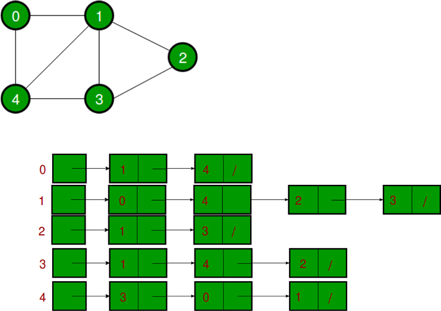
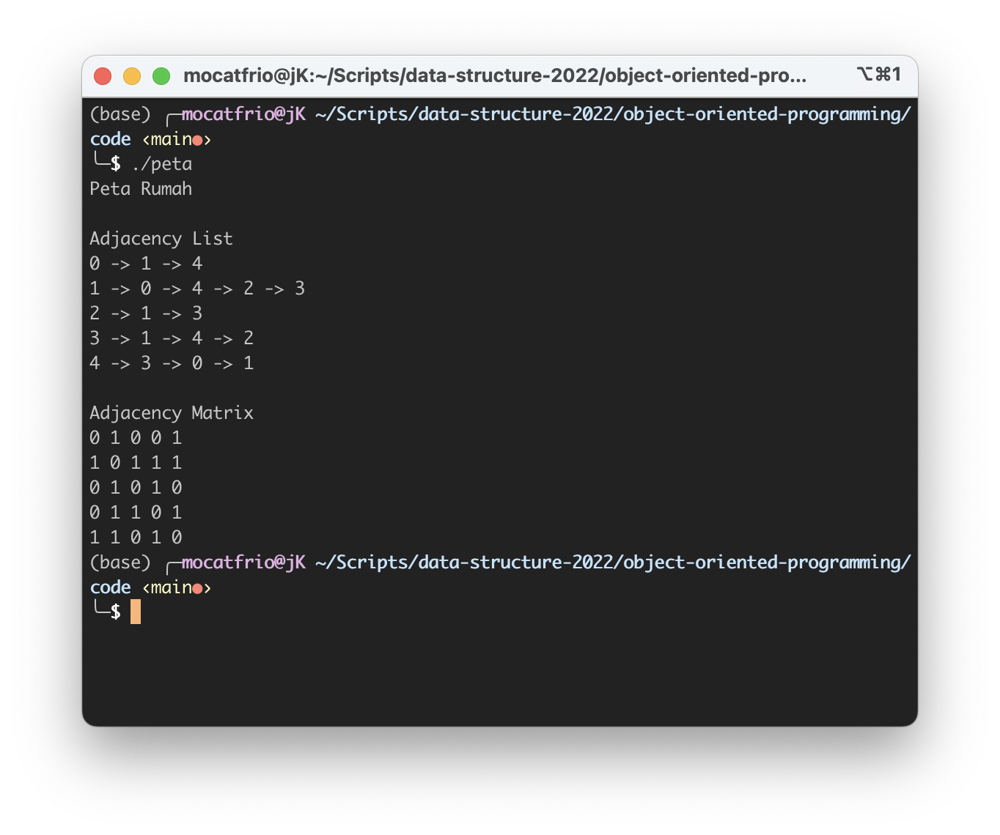

# Object-Oriented Programming #1

Modul ini menjelaskan materi berikut:
  * Class dan Object
  * Property dam Method
  * Constructor dan Destructor
  
sembari langsung mengimplementasikannya dengan studi kasus yang diberikan.

## Case Study

Seorang mahasiswa ingin membuat program yang dapat mengelola data **peta** disekitar rumahnya. Representasi graph yang dipakai adalah adjacency list. Rancanglah sebuah **class** yang dapat mengelola data tersebut. Apa saja properties dan methods yang dibutuhkan?

<p align="center">
  
</p>

### 1. Mendefinisikan Class Peta

Dalam pemrograman berbasis objek (OOP), **Class** adalah blueprint untuk menciptakan objek. Class mendefinisikan karakteristik dan perilaku dari objek yang akan diciptakan berdasarkan class tersebut.

* **Property (Atribut)**: Data atau informasi yang dimiliki oleh objek dari suatu class. Mereka merepresentasikan karakteristik atau keadaan dari objek tersebut. Misalnya, jika kita ingin membuat sebuah class "Peta", maka property nya adalah 
    * Jumlah titik / tempat pada peta
    * Representasi peta berupa adjacency list, adjacency matrix, atau incidence list

* **Method (Metode atau Fungsi)**: Fungsi atau tindakan yang dapat dilakukan oleh objek dari suatu class. Mereka merepresentasikan perilaku atau aksi yang dapat dilakukan oleh objek tersebut. Misalnya, jika kita memiliki class "Peta", method-nya bisa mencakup fungsi seperti "tambahkanLintasan", "tampilkanAdjList", dan sebagainya.


```C++
// Mendefinisikan "Class" Peta yang mengimplementasikan struktur data "Graph"

// Ini "Class Peta" 
class Peta {

 private:
    // Property
    int jumlah_titik;
    list<int>* adjacency_list; 

 public:
    // Constructor
    Peta(int jumlah_titik) {
        this->jumlah_titik = jumlah_titik; 
        adjacency_list = new list<int>[jumlah_titik];
    }

    // Destructor
    ~Peta() {
        delete[] adjacency_list;
    }

    // Fungsi untuk menambahkan koneksi dari titik awal ke tujuan
    void tambahLintasan(int asal, int tujuan) {
        adjacency_list[asal].push_back(tujuan); 
    }

    // Fungsi untuk menampilkan adjacency list
    void tampilkanAdjList()  { 
        list<int>::iterator i;

        for (int v = 0; v < jumlah_titik; v++)  {
            cout << v << " -> ";
            for (i = adjacency_list[v].begin(); i != adjacency_list[v].end(); ++i)  {
                cout << (*i);
                if (next(i, 1) != adjacency_list[v].end()) {
                    cout << " -> ";
                }
            }
            cout << endl;
        }
    }
};
```
### 2. Menginstansiasi Class Peta

**Menginstansiasi** adalah proses pembuatan objek dari suatu kelas atau blueprint. Dalam pemrograman berbasis objek, ketika kita membuat objek dari suatu kelas, kita sebenarnya menginstansiasi kelas tersebut.

```c++
int main() {
    cout << "Peta Rumah" << endl;
    int jumlah_titik = 5;

    // Ini "Object petaKu"
    // Object adalah instansiasi dari Class
    Peta petaKu(jumlah_titik);

    // Mendefinisikan data untuk graf Peta
   	petaKu.tambahLintasan(0,1); //dari titik 0 ke 1
   	petaKu.tambahLintasan(0,4); //dari titik 0 ke 4
   	petaKu.tambahLintasan(1,0);
   	petaKu.tambahLintasan(1,4); 
   	petaKu.tambahLintasan(1,2);  
   	petaKu.tambahLintasan(1,3);  
   	petaKu.tambahLintasan(2,1);  
   	petaKu.tambahLintasan(2,3);
   	petaKu.tambahLintasan(3,1);  
   	petaKu.tambahLintasan(3,4);
  	petaKu.tambahLintasan(3,2);
   	petaKu.tambahLintasan(4,3);  
   	petaKu.tambahLintasan(4,0);
  	petaKu.tambahLintasan(4,1);
   

    petaKu.tampilkanAdjList();
}
```
### 3. Compile

Output 
p.s. Modifikasi dengan menambahkan representasi graf **adjacency matrix** ([full code](code/peta.cpp))

<p align="center">
  
</p>


## Practice

**Tugas Individu**

1. Gambarkan peta sekitar rumah kalian dengan minimal 10 titik dalam bentuk graf berarah **(20 poin)**
2. Dengan menggunakan Class Peta yang telah saya contohkan, implementasikan peta yang telah kalian buat (nomor 1) ke dalam sebuah program dengan representasi graf adjacency list **(20 poin)**
3. Tampilkan hasil adjacency listnya **(5 poin)**
4. Buatkan Class baru bernama "Titik" untuk menyimpan ID titik, nama tempat (misal "Rumah", "Minimarket", "Apotek", dll), titik koordinat x, dan titik koordinat y. Instansiasi class "Titik" untuk menyimpan info titik pada peta. **(20 poin)**
5. Tampilkan hasil adjacency list berupa nama tempat **(15 poin)**
6. Tampilkan hasil graf menggunakan library graphics.h **(10 poin)**
7. Tambahkan modifikasi lain **(1-10 poin)**

Catatan: Penilaian berdasarkan poin-poin yang berhasil diselesaikan.

## Bahan Renungan

1. Jika diperhatikan, pada Class terdapat kata-kata "public" dan "private". Apa fungsi dari kedua kata kunci ini dan apa perbedaan keduanya?
2. Constructor dalam sebuah class berfungsi untuk melakukan inisialisasi awal terhadap objek yang dibuat dari class tersebut. Sementara itu, ada pula destructor. Apa fungsi dari destructor dan kapan destructor dipanggil?
3. Apakah Anda dapat membuat 10 objek menggunakan 1 kelas?